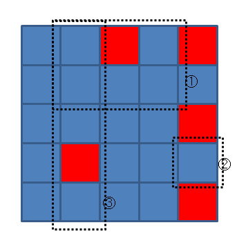
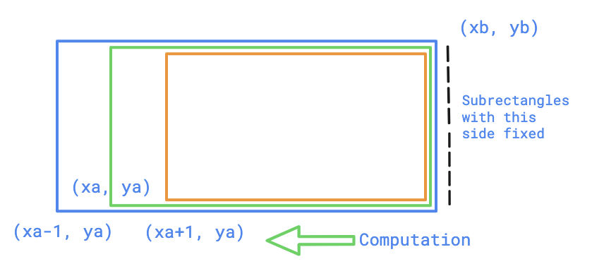
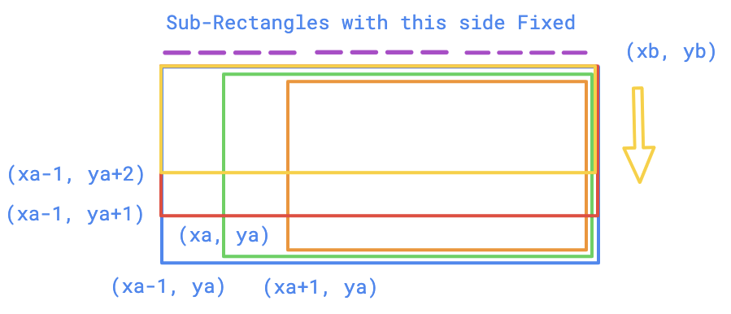
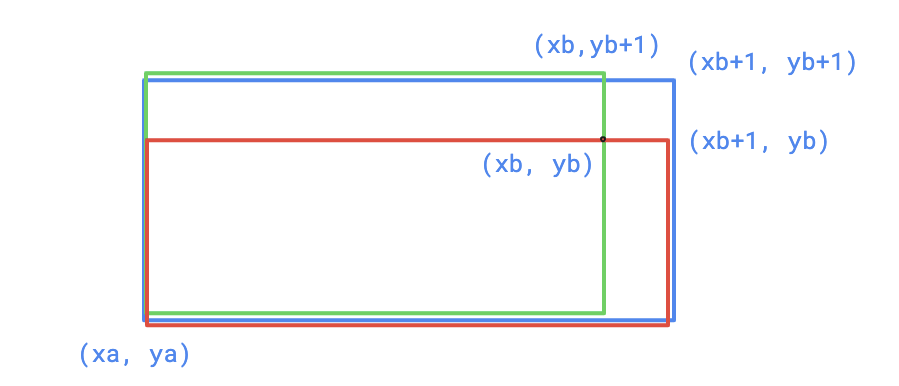

## Counting Rectangles

There is an n × m rectangular grid, each cell of the grid contains a single integer: zero or one. Let's call the cell on the i-th row and the j-th column as (i, j).

Let's define a "rectangle" as four integers a, b, c, d (1 ≤ a ≤ c ≤ n; 1 ≤ b ≤ d ≤ m). Rectangle denotes a set of cells of the grid {(x, y) :  a ≤ x ≤ c, b ≤ y ≤ d}. Let's define a "good rectangle" as a rectangle that includes only the cells with zeros.

You should answer the following q queries: calculate the number of good rectangles all of which cells are in the given rectangle.

**Input**:

There are three integers in the first line: n, m and q (1 ≤ n, m ≤ 40, 1 ≤ q ≤ 3·10^5). Each of the next n lines contains m characters — the grid. Consider grid rows are numbered from top to bottom, and grid columns are numbered from left to right. Both columns and rows are numbered starting from 1.

Each of the next q lines contains a query — four integers that describe the current rectangle, a, b, c, d (1 ≤ a ≤ c ≤ n; 1 ≤ b ≤ d ≤ m).

**Output**:

For each query output an answer — a single integer in a separate line.

Example:

Input
```
5 5 5
00101
00000
00001
01000
00001
1 2 2 4
4 5 4 5
1 2 5 2
2 2 4 5
4 2 5 3
```

Output
```
10
1
7
34
5
```



* For the first query, there are 10 good rectangles, five 1 × 1, two 2 × 1, two 1 × 2, and one 1 × 3.
* For the second query, there is only one 1 × 1 good rectangle.
* For the third query, there are 7 good rectangles, four 1 × 1, two 2 × 1, and one 3 × 1.

source: <https://codeforces.com/problemset/problem/372/B>

Solution

We can precalculate all rectangles, in O(N^2M^2) with using consecutive sums for 2D. And then we use 4D consecutive sums, we can answer the queries.

Part 1




Part 2



Part 3 & 4

Add the subrectangles with `(xa, ya); (xb+1, yb)` and `(xa, ya); (xb, yb+1)` to `(xa, ya); (xb+1, yb+1)`



```cpp
int cnt[44][44][44][44];
int a[44][44], f[44][44];
 
int main() {
  int n, m, q;
  scanf("%d %d %d", &n, &m, &q);
  for (int i = 1; i <= n; i++)
    for (int j = 1; j <= m; j++) {
      char ch = getchar();
      while (ch != '0' && ch != '1') ch = getchar();
      a[i][j] = (ch == '1');
    }
  
  // Compute 2D prefix sums
  for (int i = 0; i <= n; i++)
    for (int j = 0; j <= m; j++)
      if (i == 0 || j == 0) f[i][j] = 0;
      else f[i][j] = f[i - 1][j] + f[i][j - 1] - f[i - 1][j - 1] + a[i][j];
  
  // Check whether Rectange with diagonal (x1,y1) and (x2,y2) contains all 0's
  for (int xa = 1; xa <= n; xa++)
    for (int ya = 1; ya <= m; ya++)
      for (int xb = xa; xb <= n; xb++)
        for (int yb = ya; yb <= m; yb++) {
          int sum = f[xb][yb] - f[xa - 1][yb] - f[xb][ya - 1] + f[xa - 1][ya - 1];
          cnt[xa][ya][xb][yb] = (sum == 0);
        }
  
  // Part 1
  // Add subRectangles with side as (xb, ya) and (xb, yb) to rectangle with diagonal (xa-1,ya) and (xb,yb) and so on
  for (int xa = n; xa >= 2; xa--) // Compute backwards
    for (int ya = 1; ya <= m; ya++)
      for (int xb = xa; xb <= n; xb++)
        for (int yb = ya; yb <= m; yb++) cnt[xa - 1][ya][xb][yb] += cnt[xa][ya][xb][yb];
  
  // Part 2
  for (int xa = 1; xa <= n; xa++)
    for (int ya = m; ya >= 2; ya--)
      for (int xb = xa; xb <= n; xb++)
        for (int yb = ya; yb <= m; yb++) cnt[xa][ya - 1][xb][yb] += cnt[xa][ya][xb][yb];
        
  // Part 3
  // Add subrectanges of (xa, ya) (xb, yb) to (xa,ya) (xb+1, yb)
  for (int xa = 1; xa <= n; xa++)
    for (int ya = 1; ya <= m; ya++)
      for (int xb = xa; xb <= n; xb++)
        for (int yb = ya; yb <= m; yb++) cnt[xa][ya][xb + 1][yb] += cnt[xa][ya][xb][yb];
  
  // Part 4
  // Add subrectanges of (xa, ya) (xb, yb) to (xa,ya) (xb, yb+1)
  for (int xa = 1; xa <= n; xa++)
    for (int ya = 1; ya <= m; ya++)
      for (int xb = xa; xb <= n; xb++)
        for (int yb = ya; yb <= m; yb++) cnt[xa][ya][xb][yb + 1] += cnt[xa][ya][xb][yb];
  
  while (q--) {
    int xa, ya, xb, yb;
    scanf("%d %d %d %d", &xa, &ya, &xb, &yb);
    printf("%d\n", cnt[xa][ya][xb][yb]);
  }
  return 0;
}
```

source: tourist <https://codeforces.com/contest/372/submission/5421838>


Another way is to use inclusion exclusion priniciple to find the prefix sums

```cpp
#include<stdio.h>
int map[50][50];
int rui[51][51];
int dat[50][50][50][50];
int ans[51][51][51][51];
int main()
{
	int mx,my,query;
	scanf("%d%d%d",&mx,&my,&query);
	for(int i=0;i<mx;i++)
	{
		for(int j=0;j<my;j++)
		{
			char zan;
			scanf(" %c",&zan);
			map[i][j]=zan-'0';
		}
	}
	for(int i=0;i<mx;i++)
	{
		for(int j=0;j<my;j++)
		{
			rui[i+1][j+1]=rui[i+1][j]+rui[i][j+1]-rui[i][j]+map[i][j];
		}
	}
	for(int i=0;i<mx;i++)
	{
		for(int j=0;j<my;j++)
		{
			for(int k=i;k<mx;k++)
			{
				for(int l=j;l<my;l++)
				{
					if(rui[k+1][l+1]-rui[i][l+1]-rui[k+1][j]+rui[i][j]==0)
					{
						dat[i][j][k][l]=1;
					}
				}
			}
		}
	}
	for(int i=0;i<mx;i++)
	{
		for(int j=0;j<my;j++)
		{
			for(int k=0;k<mx;k++)
			{
				for(int l=0;l<my;l++)
				{
					ans[i+1][j+1][k+1][l+1]
					=ans[i][j+1][k+1][l+1]
					+ans[i+1][j][k+1][l+1]
					+ans[i+1][j+1][k][l+1]
					+ans[i+1][j+1][k+1][l]
					-ans[i][j][k+1][l+1]
					-ans[i][j+1][k][l+1]
					-ans[i][j+1][k+1][l]
					-ans[i+1][j][k][l+1]
					-ans[i+1][j][k+1][l]
					-ans[i+1][j+1][k][l]
					+ans[i+1][j][k][l]
					+ans[i][j+1][k][l]
					+ans[i][j][k+1][l]
					+ans[i][j][k][l+1]
					-ans[i][j][k][l]
					+dat[i][j][k][l];
				}
			}
		}
	}
	for(int p=0;p<query;p++)
	{
		int a,b,c,d;
		scanf("%d%d%d%d",&a,&b,&c,&d);
		a--;
		b--;
		c--;
		d--;
		printf("%d\n",
			ans[c+1][d+1][c+1][d+1]
			-ans[a][d+1][c+1][d+1]
			-ans[c+1][b][c+1][d+1]
			-ans[c+1][d+1][a][d+1]
			-ans[c+1][d+1][c+1][b]
			+ans[a][b][c+1][d+1]
			+ans[a][d+1][a][d+1]
			+ans[a][d+1][c+1][b]
			+ans[c+1][b][a][d+1]
			+ans[c+1][b][c+1][b]
			+ans[c+1][d+1][a][b]
			-ans[c+1][b][a][b]
			-ans[a][d+1][a][b]
			-ans[a][b][c+1][b]
			-ans[a][b][a][d+1]
			+ans[a][b][a][b]);
	}
}
```

## Max Sum of Rectangle No Larger Than K

https://leetcode.com/problems/max-sum-of-rectangle-no-larger-than-k

```cpp
class Solution {
public:
    int f(vector<int> &V, int k){ // 1-D case
        set<int> S = {0};
        int ans = INT_MIN, cur = 0;
        for(int i=0;i<V.size();i++){
            cur += V[i];
            auto it = S.lower_bound(cur-k);
            if(it != S.end()) ans = max(ans, cur-*it);
            S.insert(cur);
        }
        return ans;
    }
    int maxSumSubmatrix(vector<vector<int>>& matrix, int t) {
        int n = matrix.size(), m = matrix[0].size(), ans = INT_MIN;
        for(int j=0; j<m; j++){
            vector<int> a(n, 0);
            for(int k=j; k<m; k++){ // sum of matrix[i][j:m]
                for(int i=0; i<n; i++) a[i] += matrix[i][k];
                ans = max(ans, f(a, t));
            }
        }
        return ans;
    }
};
```

Simplified without using external function

```cpp
class Solution {
public:
    int maxSumSubmatrix(vector<vector<int>>& matrix, int k) {
        int rows = matrix.size(), cols = matrix[0].size();
        int ans = INT_MIN;
        for(int i=0;i<cols;i++){
            vector<int> sums(rows);
            for(int j=i;j<cols;j++){
                // sum of cols from i to j over all rows
                for(int k=0;k<rows;k++){
                    sums[k] += matrix[k][j];
                }
                // Over the rows from colums [i:j]
                // chose the min rectange
                set<int> S = {0};
                int pref_sum = 0;
                for(int s: sums){
                    pref_sum += s;
                    auto it = S.lower_bound(pref_sum - k);
                    if(it != S.end()){
                        ans = max(ans, pref_sum - *it);
                    }
                    S.insert(pref_sum);
                }
            }
        }
        return ans;
    }
};
```
