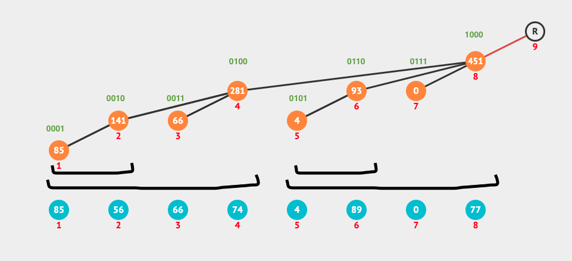
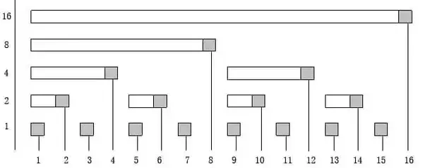

Suppose we have an array AA and we want to support the following two operations:

* Update: change the value of an element A_i	
* Query: find the value of a certain partial sum `A_1 + A_2 + ... + A_i` 

### Note
The Binary Indexed Tree, as presented by Peter Fenwick, cannot efficiently answer min/max kinds of queries, because, for determining the sum of 
`A[i ... j]`, it needs to compute the difference between the sum of the first `j` elements and the sum of the first
`i – 1` elements.
	
### Explanation 
A Fenwick tree or a binary indexed tree is a data structure that handles both of these efficiently. It should be noted that if we have such a data structure, we can also find the sum over an interval `[i, j]` by just calculating `sum(j) - sum(i-1)`.





To represent a negative value `−x`, we take the binary representation of `x`, complement it, and then add `1` (ignoring the final carry). Let's take an example where the numbers are represented on 8 bits for simplicity:

```python
 x = 01101100
~x = 10010011
-x = 10010100 
```

Notice the bits more significant than the lsb are different for `x` and `−x`, while the lsb and the following `0`'s are the same. Therefore, `x & -x` gives the wanted answer, in our case:

Now we have a method of finding the length of any interval in `O(1)`:

```cpp
int lsb(int pos) {
    return pos & -pos;
}
```

`#define LSOne(S) (S&(-S))` is used to get the last set bit of `S`

Update

```cpp
void update(int pos, int val) {
    while (pos <= N) {
        fenwick[pos] += val;
        pos += lsb(pos);
    }
}
```

Query

```cpp
int query(int pos) {
   int sum = 0;
   while (pos > 0) {
      sum += fenwick[pos];
      pos -= lsb(pos);
   }
   return sum;
}
```

source: https://csacademy.com/lesson/fenwick_trees/

#### Struct based implementation

```cpp
template < typename T >
struct binary_indexed_tree {
    int N;
    vector<T> BIT;
    binary_indexed_tree(int N): N(N), BIT(N + 1, 0) {}
    void add(int i, T x) {
        i++; // incremented internal index i
        while (i <= N) {
            BIT[i] += x;
            i += i & -i;
        }
    }
    T sum(int i) {
        T ans = 0;
        while (i > 0) {
            ans += BIT[i];
            i -= i & -i;
        }
        return ans;
    }
    // finds sum from [L, R)
    T sum(int L, int R) {
        return sum(R) - sum(L);
    }
};

// Usage: 
// struct binary_indexed_tree<int> bit(2* 1e4 + 10);
// bit.add(i, 1);


// Use zero based indexing while updating etc
// struct binary_indexed_tree<int> *bit;
// bit = new binary_indexed_tree<int>(3* 1e4 + 10);
// bit->add(i, nums[i]); // i is zero based index
// bit->sum(left, right+1); // sum from [left, right]
```

source: https://codeforces.com/contest/1535/submission/118419611

```cpp
// Binary indexed tree supporting binary search.
struct BIT {
    int n;
    vector<int> bit;
    // BIT can be thought of as having entries f[1], ..., f[n]
    // with f[1]=0,...,f[n]=0 initially
    BIT(int n):n(n), bit(n+1) {}
    // returns f[1] + ... + f[idx-1]
    // precondition idx <= n+1
    int read(int idx) {
        idx--;
        int res = 0;
        while (idx > 0) {
            res += bit[idx];
            idx -= idx & -idx;
        }
        return res;
    }
    // returns f[idx1] + ... + f[idx2-1]
    // precondition idx1 <= idx2 <= n+1
    int read2(int idx1, int idx2) {
        return read(idx2) - read(idx1);
    }
    // adds val to f[idx]
    // precondition 1 <= idx <= n (there is no element 0!)
    void update(int idx, int val) {
        while (idx <= n) {
            bit[idx] += val;
            idx += idx & -idx;
        }
    }
    // returns smallest positive idx such that read(idx) >= target
    int lower_bound(int target) {
        if (target <= 0) return 1;
        int pwr = 1; while (2*pwr <= n) pwr*=2;
        int idx = 0; int tot = 0;
        for (; pwr; pwr >>= 1) {
            if (idx+pwr > n) continue;
            if (tot + bit[idx+pwr] < target) {
                tot += bit[idx+=pwr];
            }
        }
        return idx+2;
    }
    // returns smallest positive idx such that read(idx) > target
    int upper_bound(int target) {
        if (target < 0) return 1;
        int pwr = 1; while (2*pwr <= n) pwr*=2;
        int idx = 0; int tot = 0;
        for (; pwr; pwr >>= 1) {
            if (idx+pwr > n) continue;
            if (tot + bit[idx+pwr] <= target) {
                tot += bit[idx+=pwr];
            }
        }
        return idx+2;
    }
};
```

Idea: Let `idx` be an index of BIT. Let `r` be the position in `idx` of its last non-zero digit in  binary notation, i.e., r is the position of the least significant non-zero bit of idx.  `bit[idx]` holds the sum of frequencies for indices `(idx - 2^r + 1)` through `idx`, inclusive

source: https://github.com/t3nsor/codebook/blob/master/BIT.cpp

```cpp
template<typename T>
struct fenwick_tree {
    int tree_n = 0;
    T tree_sum = 0;
    vector<T> tree;
 
    fenwick_tree(int n = -1) {
        if (n >= 0)
            init(n);
    }
 
    void init(int n) {
        tree_n = n;
        tree_sum = 0;
        tree.assign(tree_n + 1, 0);
    }
 
    // O(n) initialization of the Fenwick tree.
    template<typename T_array>
    void build(const T_array &initial) {
        assert(int(initial.size()) == tree_n);
        tree_sum = 0;
 
        for (int i = 1; i <= tree_n; i++) {
            tree[i] = initial[i - 1];
            tree_sum += initial[i - 1];
 
            for (int k = (i & -i) >> 1; k > 0; k >>= 1)
                tree[i] += tree[i - k];
        }
    }
 
    // index is in [0, tree_n).
    void update(int index, const T &change) {
        assert(0 <= index && index < tree_n);
        tree_sum += change;
 
        for (int i = index + 1; i <= tree_n; i += i & -i)
            tree[i] += change;
    }
 
    // Returns the sum of the range [0, count).
    T query(int count) const {
        assert(count <= tree_n);
        T sum = 0;
 
        for (int i = count; i > 0; i -= i & -i)
            sum += tree[i];
 
        return sum;
    }
 
    // Returns the sum of the range [start, tree_n).
    T query_suffix(int start) const {
        return tree_sum - query(start);
    }
 
    // Returns the sum of the range [a, b).
    T query(int a, int b) const {
        return query(b) - query(a);
    }
 
    // Returns the element at index a in O(1) amortized across every index. Equivalent to query(a, a + 1).
    T get(int a) const {
        assert(0 <= a && a < tree_n);
        int above = a + 1;
        T sum = tree[above];
        above -= above & -above;
 
        while (a != above) {
            sum -= tree[a];
            a -= a & -a;
        }
 
        return sum;
    }
 
    bool set(int index, T value) {
        assert(0 <= index && index < tree_n);
        T current = get(index);
 
        if (current == value)
            return false;
 
        update(index, value - current);
        return true;
    }
 
    // Returns the largest p in `[0, tree_n]` such that `query(p) <= sum`. Returns -1 if no such p exists (`sum < 0`).
    // Can be used as an ordered set/multiset on indices in `[0, tree_n)` by using the tree as a 0/1 or frequency array:
    // `set(index, 1)` is equivalent to insert(index). `update(index, +1)` is equivalent to multiset.insert(index).
    // `set(index, 0)` or `update(index, -1)` are equivalent to erase(index).
    // `get(index)` provides whether index is present or not, or the count of index (if multiset).
    // `query(index)` provides the count of elements < index.
    // `find_last_prefix(k)` finds the k-th smallest element (0-indexed). Returns `tree_n` for `sum >= set.size()`.
    int find_last_prefix(T sum) const {
        if (sum < 0)
            return -1;
 
        int prefix = 0;
 
        for (int k = 31 - __builtin_clz(tree_n); k >= 0; k--)
            if (prefix + (1 << k) <= tree_n && tree[prefix + (1 << k)] <= sum) {
                prefix += 1 << k;
                sum -= tree[prefix];
            }
 
        return prefix;
    }
};
```

source: neal https://codeforces.com/contest/1354/submission/80534648

The inversion number of a sequence `A = [ a0, a1, a2, … , aN − 1 ]` is the number of pairs of indices `(i ,j)` such that `i < j` and `ai > aj`.

The inversion number can be calculated in an `O(NlogN)` with a method like Fenwick Tree by adding `1` in place of `ai` and for `aj`, counting till `n-sum(aj)`

## Benq's implementation

### BIT

Generally BIT/Fenwick tree uses 1-based indexing. But here `data` is stored in `0..n-1` instead of the usual `1..n`, hence whenever we want to access `data[i]`, the code uses `data[i-1]`. `add(p, val)` is nothing but adding on 0-based indexing `a[p] += val`, the code first increments `p`(1-based indexing).

* `sum(r) = a[0] + a[1] + ... + a[r-1]`
* `sum(l, r) = a[l] + a[l+1] + ... + a[r]` - Becareful when you are querying for sum of `n` elements. It is `sum(0, n-1)`

In case you want to print data for debugging, use `debug() << imie(range(tree.data.begin(), tree.data.begin()+n));`

```cpp
template<class T> struct BIT {
    int n; vector<T> data;
    void init(int _n) { n = _n; data.resize(n); }
    void add(int p, T x) { for (++p;p<=n;p+=p&-p) data[p-1] += x; }
    T sum(int l, int r) { return sum(r+1)-sum(l); }
    T sum(int r) { T s = 0; for(;r;r-=r&-r) s+=data[r-1]; return s; }
    int lower_bound(T sum) {
        if (sum <= 0) return -1;
        int pos = 0;
        for (int pw = 1<<25; pw; pw >>= 1) {
            int npos = pos+pw;
            if (npos <= n && data[npos-1] < sum)
                pos = npos, sum -= data[pos-1];
        }
        return pos;
    }
};
```

source: https://github.com/kth-competitive-programming/kactl/blob/main/content/data-structures/FenwickTree.h and https://github.com/bqi343/USACO/blob/master/Implementations/content/data-structures/1D%20Range%20Queries%20(9.2)/BIT.h

### BIT Offline with Coordinate compression
```cpp
typedef vector<int> vi;

#define all(x) begin(x), end(x)
#define sz(x) (int)x.size()
#define rsz resize
#define ub upper_bound
#define pb push_back

/**
 * Description: Offline BIT with coordinate compression. First do all 
   * updates with $\texttt{mode=0}$ and then call $\texttt{init()}$.
 * Source: Own
 * Verification: https://codeforces.com/contest/1361/problem/F
 */

template<class T> struct BIToff {
	bool mode = 0; vi v; vector<T> d;
	int atMost(int x) { return ub(all(v),x)-begin(v); } // how many <= x
	void upd(int x, T y) {
		if (!mode) { v.pb(x); return; }
		int p = atMost(x); assert(p && v[p-1] == x);
		for (;p<=sz(v);p+=p&-p) d[p] += y;
	}	
	void init() { assert(!mode); mode = 1;
		sort(all(v)); v.erase(unique(all(v)),end(v)); d.rsz(sz(v)+1); }
	T sum(int x) { assert(mode);
		T ans = 0; for (int p=atMost(x);p;p-=p&-p) ans += d[p];
		return ans; }
	T query(int x, int y) { return sum(y)-sum(x-1);}
};
```

source: https://github.com/bqi343/USACO/blob/master/Implementations/content/data-structures/1D%20Range%20Queries%20(9.2)/BIToff.h and https://codeforces.com/contest/1361/submission/82571701

## BIT with range updates

Basically, for a BIT, there are two modes available:

1. **Range query and point update (a)**
2. **Range update and point querying (b)**

You are probably more familiar with BITs using (a).

For (b), it's just a very simple modification, so I'll try to explain it the best I can.

For (a), when you call `update(x, v)`, it will add the value of `v` to the position at `x`, and calling `query(x)` will add up all the elements `x' ≤ x` and return that.

Now, to extend it to (b), we see that when we call `update(x, v)`, it will affect all the queries `x' ≥ x`. 

Therefore, to update a range `[a, b]`, we can call `update(a, v)` and `update(b+1, -v)`. 

Then, to get a point, we call `query(p)`. Note that this will actually return the actual value at p, not the cumulative sum.

Now, to see why this works, see the following examples.

Suppose we just called `update(a,v)` and `update(b+1,-v)`.

Now, let's say we called query(p). We have three cases:
* p < a. p will not be affected by the updates, so query(p) will not be affected and still return the correct result
* p > b. p will be affected by the update(a,v) since p >= a, and update(b+1,-v) since p >= b+1, therefore, v-v=0 so everything cancels out and query(p) will not be affected and return the correct result
* a ≤ p ≤ b. p is only affected by update(a,v), but not update(b+1,-v), therefore, query(p)'s value is increased by v, and will return the correct result

<details>
	<summary> CSES Problem Range Update Queries </summary>

https://cses.fi/problemset/task/1651/
	
```cpp
const int nax = 2e5 + 10;

template<class T> struct BIT {
    int n; vector<T> data;
    void init(int _n) { n = _n; data.resize(n); }
    void add(int p, T x) { for (++p;p<=n;p+=p&-p) data[p-1] += x; }
    T sum(int l, int r) { return sum(r+1)-sum(l); }
    T sum(int r) { T s = 0; for(;r;r-=r&-r) s+=data[r-1]; return s; }
    int lower_bound(T sum) {
        if (sum <= 0) return -1;
        int pos = 0;
        for (int pw = 1<<25; pw; pw >>= 1) {
            int npos = pos+pw;
            if (npos <= n && data[npos-1] < sum)
                pos = npos, sum -= data[pos-1];
        }
        return pos;
    }
};

BIT<long long> tree;

int main() {
    tree.init(nax);
    int n, q; scanf("%d %d", &n, &q);
    vector<long long> V(n);
    for(int i=0;i<n;i++) scanf("%lld", &V[i]);
    while(q--){
        int type; scanf("%d", &type);
        if(type == 1){
            int a, b, u; scanf("%d %d %d", &a, &b, &u);
            tree.add(a-1, u);
            tree.add(b, -u);
        } else {
            int k; scanf("%d", &k);
            printf("%lld\n", V[k-1] + tree.sum(k));
        }
    }
    return 0;
}
```
</details>


3. **Range update and range querying (c)**

Similar to Range Update - Point query, we maintain a BIT (say B1)
- Add `v` to `[a..b]` --> `Update(a,v)` and `Update(b+1,-v)` on the BIT `B1`
- `Query(p)` on `B1` now gives the correct value of `A[p]`
 
The answer we want is `( Sum(0..b) - Sum(0..a-1) )`, so let's design `Sum(0..p)`. The thing with BIT is, if you design it to work for one update ( which is easy to imagine ) and all possible queries on that one update, mostly it should work for multiple updates ;)
 
Lets consider just one update : Add `v` to `[a..b]`, rest all are 0
 
Now, consider `Sum(0..p)` for all possible p
1. 0 ≤ p < a : `0`
2. a ≤ p ≤ b : `v * ( p - (a-1) )`
3. b < p < n : `v * ( b - (a-1) )`
 
This suggests that, for a index p, if we have `(v * p)` we can get the `Sum(0..p)` by subtracting X from it
1. 0 ≤ p < a : slope = `0` and intercept = `0`
2. a ≤ p ≤ b : slope = `v` and intercept = `-v*(a-1)`
3. b < p < n : slope = `0` and intercept = `v*b - v*(a-1)`
 
So, we need to maintain something else too, to get that extra intercept term and that should give `0` for `p < a`, `-v*(a-1)` for `p` in `[a..b]`, `v*b-v(a-1)` for `p > b`.

Does this ring something ;) ? hoho ! one more BIT for keeping this intercept.
 
We need to maintain another BIT (say `B2`)
- Add `v` to `[a..b] --> Update(a,-v*(a-1))` and `Update(b+1,v*b)` on the BIT `B2`
- `Query(p)` on `B2` now gives the extra sum that should be subtracted from `A[p]*p`

In other words, we implement a Fenwick tree with range updates via a normal (point-update) Fenwick tree that stores linear functions instead of just values.

source: https://petr-mitrichev.blogspot.com/2013/05/fenwick-tree-range-updates.html

```cpp
// BIT with range updates, inspired by Petr Mitrichev
struct BIT {
    int n;
    vector<int> slope;
    vector<int> intercept;
    // BIT can be thought of as having entries f[1], ..., f[n]
    // which are 0-initialized
    BIT(int n): n(n), slope(n+1), intercept(n+1) {}
    // returns f[1] + ... + f[idx-1]
    // precondition idx <= n+1
    int query(int idx) {
        int m = 0, b = 0;
        for (int i = idx-1; i > 0; i -= i&-i) {
            m += slope[i];
            b += intercept[i];
        }
        return m*idx + b;
    }
    // adds amt to f[i] for i in [idx1, idx2)
    // precondition 1 <= idx1 <= idx2 <= n+1 (you can't update element 0)
    void update(int idx1, int idx2, int amt) {
        for (int i = idx1; i <= n; i += i&-i) {
            slope[i] += amt;
            intercept[i] -= idx1*amt;
        }
        for (int i = idx2; i <= n; i += i&-i) {
            slope[i] -= amt;
            intercept[i] += idx2*amt;
        }
    }
};
```

source: https://github.com/t3nsor/codebook/blob/master/BIT-range.cpp

## Persistent BIT

```cpp
// BIT or Fenwick Tree
int n;
int tree[100005];
#define lowbit(x) x&(-x)

inline void modify(int x,int d){
	for(;x<=n;x+=lowbit(x))tree[x]+=d;
}

inline int query(int x){
	int ans=0;
	for(;x;x-=lowbit(x))ans+=tree[x];
	return ans;
}
```

Persistent Fenwick Tree using Fat Node persistence
```cpp
#include<vector>
#include<algorithm>
#define lowbit(x) x&(-x)

struct P{
	int data,id;
	P(int d=0,int i=0):data(d),id(i){}
	inline friend bool operator<(const P &a,const P &b){
		return a.id<b.id;
	}
};

int n,now;
std::vector<P >tree[100005];

inline void init(){
	now=0;
	for(int i=1;i<=n;++i)tree[i].clear(),tree[i].push_back(P());
}

inline void modify(int x,int d){
	for(;x<=n;x+=lowbit(x))tree[x].push_back(P(tree[x].back().data+d,now));
	++now;
}

// Query the interval sum of the id operation, id is calculated from 0
inline int query(int x,int id){
	int ans=0;
	std::vector<P >::iterator a;
	for(;x;x-=lowbit(x)){
		a=std::upper_bound(tree[x].begin(),tree[x].end(),P(0,id))-1;
		ans+=a->data;
	}
	return ans;
}
```

TODO: https://www.cnblogs.com/RabbitHu/p/BIT.html and https://robert1003.github.io/2020/01/27/fenwick-tree.html
