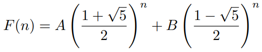
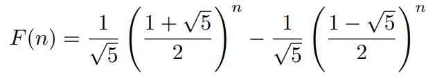

# Fibonacci

Leonardo Fibonacci’s numbers are defined as fib(0) = 0, fib(1) = 1, and for n ≥ 2, fib(n) =
fib(n − 1) + fib(n − 2).

Fibonacci numbers have many interesting properties. One of them is the **Zeckendorf ’s
theorem**: Every positive integer can be written in a unique way as a sum of one or more
distinct Fibonacci numbers such that the sum does not include any two consecutive Fibonacci
numbers. For any given positive integer, a representation that satisfies Zeckendorf’s theorem
can be found by using a Greedy algorithm: Choose the largest possible Fibonacci number at
each step. For example: 100 = 89 + 8 + 3; 77 = 55 + 21 + 1, 18 = 13 + 5, etc.

Another property is the **Pisano Period** where the last one/last two/last three/last four
digit(s) of a Fibonacci number repeats with a period of 60/300/1500/15000, respectively.

## Linear Homogeneous Recurrence Relations

Theorem: Let c1 and c2 be real numbers. Suppose that r2 − c1r − c2 = 0 has two distinct roots r1
and r2. Then the sequence {an} is a solution of the recurrence relation an = c1an-1 + c2an-2 if and only if an = α1r1
n + α2r2n
 for n = 0, 1, 2,..., where α1 and α2 are constants.

Proof:
Distinct roots are required because, say a0 = C0 and a1 = C1, then

a0 = C0 = α1 + α2 and a1 = C1 = α1r1 + α2r2 which implies that α1 = (C1 - C0r2)/(r1 - r2), this requires that r1 and r2 are different.

Above theorem does not apply when there is one characteristic root of multiplicity two. If this happens, then an = nr0n
 is another solution of the recurrence relation when r0 is a root of multiplicity two of the characteristic equation.

## Binet's formula

F(n+2) = F(n+1) + F(n)

If we try to find a geomtric sequences with F(n) = kn, then

kn+2 = kn+1 + kn

k2 = k + 1

which implies

If we plug in two different values of n = 0 and n =1, and solve for A and B, we get:

((1 + √5)/2) ≈ 1.618 Golden ratio

### Fibonacci number system

https://www.johndcook.com/blog/2015/05/17/fibonacci-number-system/
