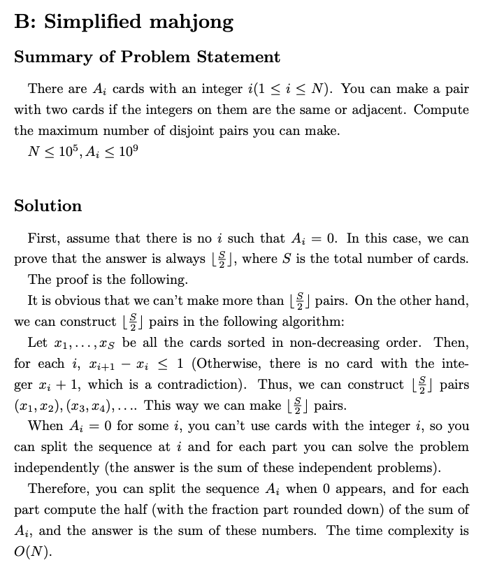

TODO: https://codeforces.com/contest/1533/problem/E and https://codeforces.com/contest/1533/problem/F

solutions: https://www.youtube.com/watch?v=ll-UwTagrU0

TODO: https://leetcode.com/problems/three-equal-parts/

#### Wrapping Chocolate 

source: https://atcoder.jp/contests/abc245/tasks/abc245_e

Takahashi has `N` pieces of chocolate. 
* The i-th piece has a rectangular shape with a width of `Ai` centimeters and a length of `Bi` centimeters. 

He also has `M` boxes. 
* The i-th box has a rectangular shape with a width of `Ci` centimeters and a length of `Di` centimeters. 

Determine whether it is possible to put the `N` pieces of chocolate in the boxes under the conditions below. A box can contain at most one piece of chocolate. `Ai ≤ Cj` and `Bi ≤ Dj` must hold when putting the i-th piece of chocolate in the j-th box (they cannot be rotated).

Solution: We cannot use `multiset<pair<int,int>>` directly because, Say we have `[4, 2]` and `[2, 3]` chocolates and `[5, 5]` and `[8, 2]` boxes.

```cpp
#include <bits/stdc++.h>
 
int main() {
    std::ios::sync_with_stdio(false);
    std::cin.tie(nullptr);
    
    int n, m;
    std::cin >> n >> m;
    
    std::vector<std::array<int, 2>> box(m), choco(n);
    for (int i = 0; i < n; i++) {
        std::cin >> choco[i][0];
    }
    for (int i = 0; i < n; i++) {
        std::cin >> choco[i][1];
    }
    for (int i = 0; i < m; i++) {
        std::cin >> box[i][0];
    }
    for (int i = 0; i < m; i++) {
        std::cin >> box[i][1];
    }
        
    std::sort(choco.begin(), choco.end(), std::greater());
    std::sort(box.begin(), box.end(), std::greater());
    
    std::multiset<int> s;
    for (int i = 0, j = 0; i < n; i++) {
        // among all boxes that can fix box[i]
        while (j < m && box[j][0] >= choco[i][0]) {
            s.insert(box[j][1]);
            j++;
        }
        // choose the smallest box
        auto it = s.lower_bound(choco[i][1]);
        if (it == s.end()) {
            std::cout << "No\n";
            return 0;
        }
        s.erase(it);
    }
    
    std::cout << "Yes\n";
    
    return 0;
}
```

Done https://atcoder.jp/contests/agc003/tasks/agc003_b Solution: https://img.atcoder.jp/data/agc/003/editorial.pdf



Divide and Conquer: https://leetcode.com/problems/beautiful-array/solution/

https://stackoverflow.com/questions/52244676/given-an-array-you-have-to-find-the-max-possible-two-equal-sum

DSU https://leetcode.com/problems/rank-transform-of-a-matrix/discuss/909212/C%2B%2B-with-picture

Strings https://codeforces.com/contest/1560/submission/126302860 Nice solution: Explanation: https://www.youtube.com/watch?v=kCMGWkJIILQ

TODO: Problems of this contest https://codeforces.com/contest/1549/submission/124567744 - D nice problem with gcd over array

Missing coin sum - https://cses.fi/problemset/task/2183, Extensions -> Math, Greedy - https://leetcode.com/problems/patching-array/discuss/280183/Detailed-Explanation-with-Example - Nice idea

```cpp
ll l = 0, r = 0;
ll ans = -1;
for(int v:V){
    if(v + l > r + 1){
        ans = r+1;
        break;
    }
    r += v;
}
```

Array filling - https://atcoder.jp/contests/abc214/editorial/2446

https://codeforces.com/contest/1593/problem/D2

Nested Range count - CSES - https://discuss.codechef.com/t/help-needed-with-nested-range-count-cses/84014

### Contribution to the sum

Facebook Hackercup 2021 Problem A2: Weak Typing - Chapter 2

Timmy the toddler is training to be a top typist. His teacher has assigned some homework in the form of a list of TT string exercises to be typed, consisting of only the uppercase letters "F", "O", and "X".

Timmy is eating a popsicle on a hot summer afternoon, but still hopes to complete his homework. He would like to hold the popsicle with one hand, and type with the other. Unfortunately, Timmy is still a growing boy, and each of his hands is a tad too small to reach all the way across the keyboard. He can only reach the letters "F" and "X" with his left hand, and the letters "F" and "O" with his right.

Consider a string W which Timmy must type. Timmy may start typing with any hand of his choice (with the other holding the popsicle). He must then switch hands as necessary to type out the ∣W∣ letters in order, ending on any hand of his choice. Let F(W) be the minimum number of times Timmy must switch hands to type such a string W.

Given an exercise string S of length N, let G(S) be the sum of F(W) over all substrings W of S. Note that there are N*(N+1)/2 such substrings. Please help Timmy compute the value of G(S) modulo 1,000,000,007.

**Solution:** Instead of calculating substring wise, we can calculate how much does each character contribute to the overall sum

```cpp
extern const int MOD = int(1e9) + 7;
using mod_int = _m_int<MOD>;


void run_case(int test_case) {
    int N;
    string W;
    cin >> N >> W;
    int previous = -1;
    mod_int total = 0;

    for (int i = 0; i < N; i++)
        if (W[i] == 'X' || W[i] == 'O') {
            if (previous >= 0 && W[i] != W[previous])
                total += mod_int(previous + 1) * (N - i);

            previous = i;
        }

    cout << "Case #" << test_case << ": " << total << '\n';
}

int main() {
    int tests; cin >> tests;
    for (int tc = 1; tc <= tests; tc++) {
        run_case(tc);
        cout << flush;
    }
}
```

source: Neal's submission 

<details>
    <summary> Full Code </summary>
    
```cpp
#include <algorithm>
#include <array>
#include <bitset>
#include <cassert>
#include <chrono>
#include <cmath>
#include <cstring>
#include <functional>
#include <iomanip>
#include <iostream>
#include <map>
#include <numeric>
#include <queue>
#include <random>
#include <set>
#include <vector>
using namespace std;

// http://www.open-std.org/jtc1/sc22/wg21/docs/papers/2016/p0200r0.html
template<class Fun> class y_combinator_result {
    Fun fun_;
public:
    template<class T> explicit y_combinator_result(T &&fun): fun_(std::forward<T>(fun)) {}
    template<class ...Args> decltype(auto) operator()(Args &&...args) { return fun_(std::ref(*this), std::forward<Args>(args)...); }
};
template<class Fun> decltype(auto) y_combinator(Fun &&fun) { return y_combinator_result<std::decay_t<Fun>>(std::forward<Fun>(fun)); }


template<typename A, typename B> ostream& operator<<(ostream &os, const pair<A, B> &p) { return os << '(' << p.first << ", " << p.second << ')'; }
template<typename T_container, typename T = typename enable_if<!is_same<T_container, string>::value, typename T_container::value_type>::type> ostream& operator<<(ostream &os, const T_container &v) { os << '{'; string sep; for (const T &x : v) os << sep << x, sep = ", "; return os << '}'; }

void dbg_out() { cerr << endl; }
template<typename Head, typename... Tail> void dbg_out(Head H, Tail... T) { cerr << ' ' << H; dbg_out(T...); }
#ifdef NEAL_DEBUG
#define dbg(...) cerr << "(" << #__VA_ARGS__ << "):", dbg_out(__VA_ARGS__)
#else
#define dbg(...)
#endif

template<const int &MOD>
struct _m_int {
    int val;

    _m_int(int64_t v = 0) {
        if (v < 0) v = v % MOD + MOD;
        if (v >= MOD) v %= MOD;
        val = int(v);
    }

    _m_int(uint64_t v) {
        if (v >= MOD) v %= MOD;
        val = int(v);
    }

    _m_int(int v) : _m_int(int64_t(v)) {}
    _m_int(unsigned v) : _m_int(uint64_t(v)) {}

    explicit operator int() const { return val; }
    explicit operator unsigned() const { return val; }
    explicit operator int64_t() const { return val; }
    explicit operator uint64_t() const { return val; }
    explicit operator double() const { return val; }
    explicit operator long double() const { return val; }

    _m_int& operator+=(const _m_int &other) {
        val -= MOD - other.val;
        if (val < 0) val += MOD;
        return *this;
    }

    _m_int& operator-=(const _m_int &other) {
        val -= other.val;
        if (val < 0) val += MOD;
        return *this;
    }

    static unsigned fast_mod(uint64_t x, unsigned m = MOD) {
#if !defined(_WIN32) || defined(_WIN64)
        return unsigned(x % m);
#endif
        // Optimized mod for Codeforces 32-bit machines.
        // x must be less than 2^32 * m for this to work, so that x / m fits in an unsigned 32-bit int.
        unsigned x_high = unsigned(x >> 32), x_low = unsigned(x);
        unsigned quot, rem;
        asm("divl %4\n"
            : "=a" (quot), "=d" (rem)
            : "d" (x_high), "a" (x_low), "r" (m));
        return rem;
    }

    _m_int& operator*=(const _m_int &other) {
        val = fast_mod(uint64_t(val) * other.val);
        return *this;
    }

    _m_int& operator/=(const _m_int &other) {
        return *this *= other.inv();
    }

    friend _m_int operator+(const _m_int &a, const _m_int &b) { return _m_int(a) += b; }
    friend _m_int operator-(const _m_int &a, const _m_int &b) { return _m_int(a) -= b; }
    friend _m_int operator*(const _m_int &a, const _m_int &b) { return _m_int(a) *= b; }
    friend _m_int operator/(const _m_int &a, const _m_int &b) { return _m_int(a) /= b; }

    _m_int& operator++() {
        val = val == MOD - 1 ? 0 : val + 1;
        return *this;
    }

    _m_int& operator--() {
        val = val == 0 ? MOD - 1 : val - 1;
        return *this;
    }

    _m_int operator++(int) { _m_int before = *this; ++*this; return before; }
    _m_int operator--(int) { _m_int before = *this; --*this; return before; }

    _m_int operator-() const {
        return val == 0 ? 0 : MOD - val;
    }

    friend bool operator==(const _m_int &a, const _m_int &b) { return a.val == b.val; }
    friend bool operator!=(const _m_int &a, const _m_int &b) { return a.val != b.val; }
    friend bool operator<(const _m_int &a, const _m_int &b) { return a.val < b.val; }
    friend bool operator>(const _m_int &a, const _m_int &b) { return a.val > b.val; }
    friend bool operator<=(const _m_int &a, const _m_int &b) { return a.val <= b.val; }
    friend bool operator>=(const _m_int &a, const _m_int &b) { return a.val >= b.val; }

    static const int SAVE_INV = int(1e6) + 5;
    static _m_int save_inv[SAVE_INV];

    static void prepare_inv() {
        // Ensures that MOD is prime, which is necessary for the inverse algorithm below.
        for (int64_t p = 2; p * p <= MOD; p += p % 2 + 1)
            assert(MOD % p != 0);

        save_inv[0] = 0;
        save_inv[1] = 1;

        for (int i = 2; i < SAVE_INV; i++)
            save_inv[i] = save_inv[MOD % i] * (MOD - MOD / i);
    }

    _m_int inv() const {
        if (save_inv[1] == 0)
            prepare_inv();

        if (val < SAVE_INV)
            return save_inv[val];

        _m_int product = 1;
        int v = val;

        while (v >= SAVE_INV) {
            product *= MOD - MOD / v;
            v = MOD % v;
        }

        return product * save_inv[v];
    }

    _m_int pow(int64_t p) const {
        if (p < 0)
            return inv().pow(-p);

        _m_int a = *this, result = 1;

        while (p > 0) {
            if (p & 1)
                result *= a;

            p >>= 1;

            if (p > 0)
                a *= a;
        }

        return result;
    }

    friend ostream& operator<<(ostream &os, const _m_int &m) {
        return os << m.val;
    }
};

template<const int &MOD> _m_int<MOD> _m_int<MOD>::save_inv[_m_int<MOD>::SAVE_INV];

extern const int MOD = int(1e9) + 7;
using mod_int = _m_int<MOD>;


void run_case(int test_case) {
    int N;
    string W;
    cin >> N >> W;
    int previous = -1;
    mod_int total = 0;

    for (int i = 0; i < N; i++)
        if (W[i] == 'X' || W[i] == 'O') {
            if (previous >= 0 && W[i] != W[previous])
                total += mod_int(previous + 1) * (N - i);

            previous = i;
        }

    cout << "Case #" << test_case << ": " << total << '\n';
}

int main() {
    int tests;
    cin >> tests;

    for (int tc = 1; tc <= tests; tc++) {
        run_case(tc);
        cout << flush;
    }
}
```
</details>
