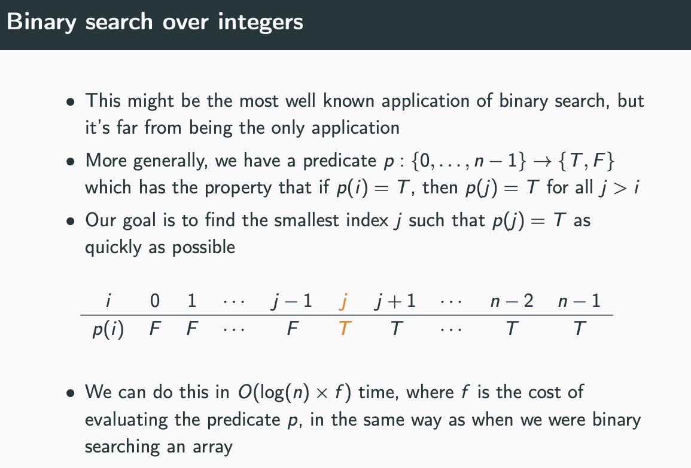
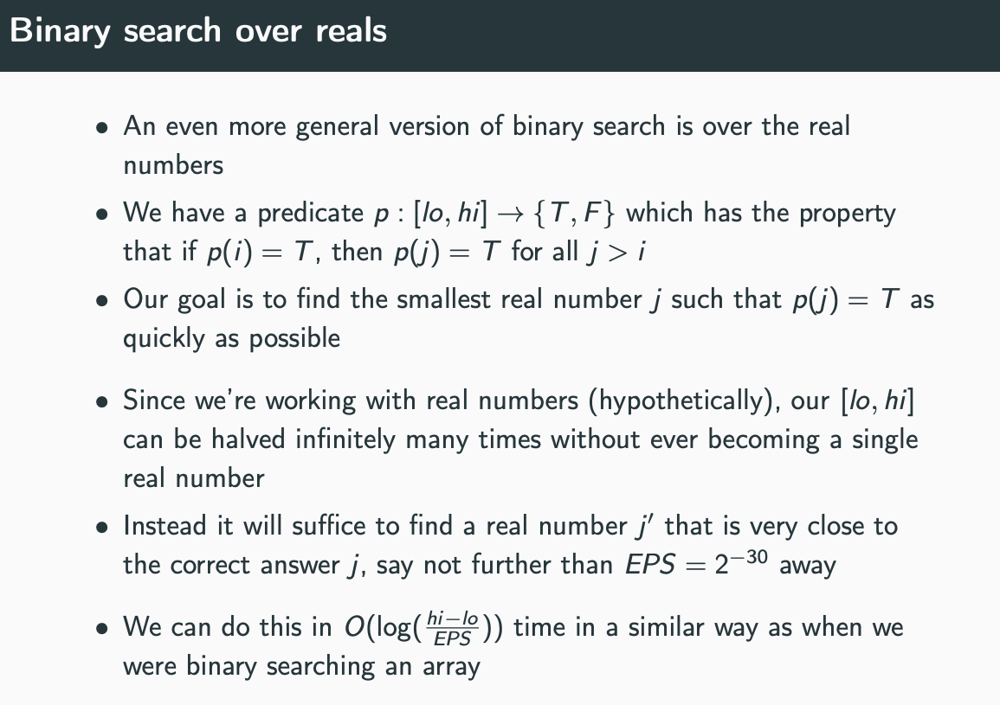
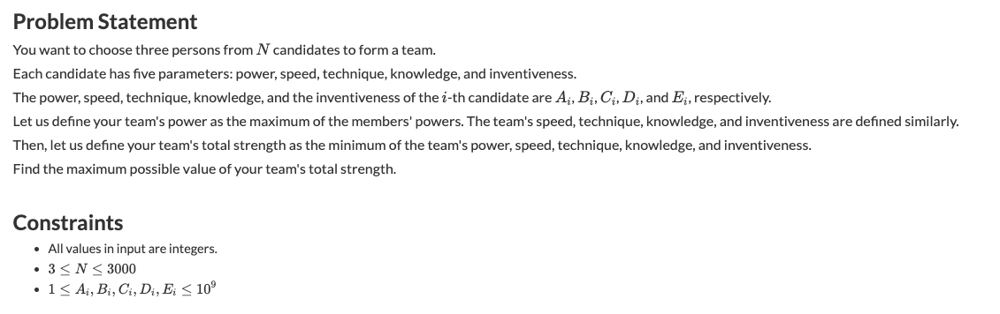
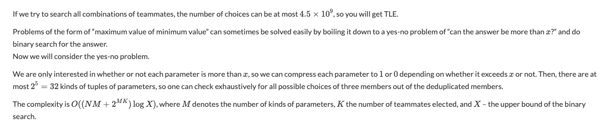

Think Binary search as prefix of False and suffix of True or the
other way around, then you are asked to find the boundary that is the 
first True or the first False

Look at the middle answer, if it is satisfied go to a possible better
answer, otherwise go to a half containing answer.

```cpp
void binary_search() {
    L = 0, R = N - 1;
    while L <= R:
        mid = L + (R - L) / 2
    if a[mid] == target:
        return mid
    if a[mid] < target:
        L = mid + 1
    else :
        R = mid - 1
    return -1
}

void lower_bound() {
    L = 0, R = N - 1;
    ans = -1;
    while L <= R:
        mid = L + (R - L) / 2
    if a[mid] >= target:
        // better values to the leftmost
        ans = mid // a[mid]
    R = mid - 1 // look for better values
    else :
        L = mid + 1
    return ans
}
```

Well, imagine you an array [0..n - 1] and let us have an invariant: some function F which returns True for every a[i] as an argument for any i from [0..k] and False for every a[j] for j from [k + 1..n - 1]. Then my binary search which actually finds the border between these two parts of the array looks the following way:

```python
l, r = -1, n
while r-l > 1:
    m = (l+r)//2
    if F(a[m]):
        l = m
    else:
        r = m
```

You can easily prove that l = k and r = k + 1 by the end of the while loop. In this case no worries about whether to increase m by 1 or not.

As an example this is the code which determines whether an element x exists in the sorted array [0..n-1]:

```python
def BinarySearch(x):
    l, r = -1, n
    while r-l > 1:
        m = (l+r)//2
        if a[m] < x:
            l = m
        else:
            r = m
    return r != n and a[r] == x
```

source: <https://codeforces.com/blog/entry/9901?#comment-153756>

## Codeforces

So far, every single time I used (integer) binary search, I could formulate the problem in one of two ways:

(1) Given a range of integers R = {l, l + 1, ..., r - 1, r} and a monotonically increasing predicate P, find the smallest x in R for which P(x) holds true. I then use the following code:

```cpp
// F F F F T T T T T
//         ^
while (l < r) {
  int mid = (l + r) / 2;
  if (P(mid)) r = mid;
  else l = mid + 1;
} // after the loop, l = r = x
```

This might not work if P(r) = 0 (in this case the algorithm will return x = r), but you can easily extend your search range to r + 1 and artificially set P(r + 1) = 1 or you can just precheck for that situation.

(2) Given a range of integers R = {l, l + 1, ..., r - 1, r} and a monotonically decreasing predicate P, find the largest x in R for which P(x) holds true. If we set Q(x) = !P(x), then Q is increasing and we can use (1) to find x + 1. We can also just use the following slightly modified variant:

```cpp
// T T T T T F F F F
//         ^
while (l < r) {
  int mid = (l + r + 1) / 2;
  if (P(mid)) l = mid;
  else r = mid - 1;
} // after the loop, l = r = x
```

I find this approach so intuitive that I haven't done a single mistake while implementing binary search since.

In the case of finding the occurence of an element k in a sorted array, I would use variant (1) to find the first element i >= k and then check whether i = k. Note that in the case where k > x[n - 1] the algorithm still works because of the equality check at the end.

```cpp
bool search(int x[], int n, int k) {
  int l = 0, r = n - 1;
  while (l < r) {
    int mid = (l + r) / 2;
    if (x[mid] >= k) r = mid; 
    else l = mid + 1;
  }
  return x[l] == k;
}
```

So, to summarize, you don't need to use this particular method, but you should have realized that there is really only one type of problem that can be solved with binary search and stick to only one particular implementation to solve this problem. You won't make a single mistake with binary search from there on.

source: <https://codeforces.com/blog/entry/9901?#comment-153761>

In the above code to figure out `mid = (l+r)/2` or `mid = (l+r+1)/2`, you can think what happens when `r = l+1` and adjust the values, so that you will eventually break out of the loop, that is `l==r`

## Algo.is



```cpp
int lo = 0,
    hi = n - 1;
while (lo < hi) {
    int m = (lo + hi) / 2;
    if (p(m)) {
        hi = m;
    } else {
        lo = m + 1;
    }
}

if (lo == hi && p(lo)) {
    printf("lowest index is %d\n", lo);
} else {
    printf("no such index\n");
}
```



```cpp
double EPS = 1e-10, lo = -1000.0, hi = 1000.0;

while (hi - lo > EPS) {
    double mid = (lo + hi) / 2.0;
    if (p(mid)) {
        hi = mid;
    } else {
        lo = mid;
    }
}
printf("%0.10lf\n", lo);
```
## t3nsor

```cpp
// Binary search. This is included because binary search can be tricky.
// n is size of array A, c is value we're searching for. Semantics follow those of std::lower_bound and std::upper_bound
int lower_bound(int A[], int n, int c) {
    int l = 0;
    int r = n;
    while (l < r) {
        int m = (r-l)/2+l; //prevents integer overflow
        if (A[m] < c) l = m+1; else r = m;
    }
    return l;

 
int upper_bound(int A[], int n, int c) {
    int l = 0;
    int r = n;
    while (l < r) {
        int m = (r-l)/2+l;
        if (A[m] <= c) l = m+1; else r = m;
    }
    return l;
}
```

## Benq's Template

```cpp
#define tcT template < class T
#define tcTU tcT, class U

tcTU > T fstTrue(T lo, T hi, U f) {
    hi++; assert(lo <= hi); // assuming f is increasing
    while (lo < hi) { // find first index such that f is true 
        T mid = lo + (hi - lo) / 2;
        f(mid) ? hi = mid : lo = mid + 1;
    }
    return lo;
}
tcTU > T lstTrue(T lo, T hi, U f) {
    lo--; assert(lo <= hi); // assuming f is decreasing
    while (lo < hi) { // find first index such that f is true 
        T mid = lo + (hi - lo + 1) / 2;
        f(mid) ? lo = mid : hi = mid - 1;
    }
    return lo;
}
```

## Topcoder

source: <https://apps.topcoder.com/forums/?module=Thread&threadID=670168&start=0>

Problem:
You want to find the smallest x in the given interval [a,b] such that some propety P(x) holds. 
You know that if P(x) and y>x, then also P(y). You also know that P(b) holds. 
This could be either an interval of integers, or of real numbers.

The most common application of binary search is the following. You have a non-decreasing function f, and a constant C. 
You have to find the smallest x for which f(x) = C (or, if there is none, the smallest x for which f(x) ≥ C). 
In this case, your property P(x) is "f(x) ≥ C".

Solution:

If [a,b] is an interval of integers:

```cpp
int l = a, r = b;
while (l < r) {
    int m = (l + r) >> 1; // take the center of the interval
    // replace the interval [a,b] with either [a,m] or [m+1,b],
    // depending on whether P(m) is already satisfied
    if (P(m)) r = m;
    else l = m + 1;
}
x = l;
```

If [a,b] is an interval of real numbers:

```cpp
double l = a, r = b;
for (int iterations = 0; iterations < 100; iterations++) {
    double m = (a + b) / 2;
    if (P(m)) r = m;
    else l = m;
}
x = l;
```

Discussion:

If you don't know that P(b) holds, use "b+1" for the upper bound. Note that P(x) is never checked for x which is 
the upper bound of the interval (since it is assumed to be true), thus, the binary search will either return the 
correct number, or "b+1", which means that there is no x in [a,b] for which P(x) is satisfied.

The most common and easiest use of this technique is looking for a certain value 'k' in a sorted array. 
In this case, if a[x] ≥ k and y>x, then also a[y] ≥ k, which means that we can use a[x] ≥ k as P(x). 
However, there are very many programming problems where such a P(x) property could be found.

Remember the code shown above well, especially the integer case. Make sure that your binary search works for 
intervals [a,a+1]—there are two possible answers for this problem, and after one step of binary search we should 
always have an interval [x,x] with a single possible answer. 
If you change one of the three places "m=(l+r)>>1", "r=m", "l=m+1", even by adding or subtracting one to the right 
side of one of the assignments, the result will probably fail (one of two subintervals is likely to be either 
nonsense [a,a-1], which means that there is an error, or [a,a+1] again, which means that the algorithm loops infinitely).


Problem: Unimodal functions
You have a function f in an interval [a,b] of real numbers, and you want to find the x for which 
f(x) is maximized. You know that the function f is unimodal: it is strictly increasing in the 
interval [a,x], and strictly decreasing in the interval [x,b].

Solution:
If we are working with an interval of integers, not an interval of reals, simply use binary search 
(see "binary search" recipe). (The property P(x) we are working with is the following one: f(x) > f(x+1).)

For reals, use the following algorithm, known as ternary search:

```cpp
double l = a, r = b;

for (int i = 0; i < 200; i++) {
    double l1 = (l * 2 + r) / 3;
    double l2 = (l + 2 * r) / 3;
    if (f(l1) > f(l2)) r = l2;
    else l = l1;
}

x = l;
```

Discussion:
This works because after each step the interval [a,b] is reduced to 2/3 of its previous size. 
After 200 steps, we will know the answer up to an error of at most (2/3)^200 of the original interval

source: <https://apps.topcoder.com/forums/?module=Thread&threadID=670169&start=0>

Also go thru <https://www.topcoder.com/community/competitive-programming/tutorials/binary-search/>

## Iterative

I'm sure there have been tutorials etc about this trick but since people are talking about binary search, I want to add this. I like to use iterative binary search that looks like this:

```cpp
int ans = 0;
for (int k = 1 << MAX_LG; k != 0; k /= 2) {
    if (!has_some_property(ans + k)) {
        ans += k;
    }
}
```

This assumes 0 doesn't have "some property". In the end, ans will be the largest integer that doesn't have "some property".

Using this, I have been able to avoid guessing about one-off errors for 6 years already. It is short to write, intuitive and generalizes well to floats and bigints. I'm not sure exactly what your "trick 8" accomplishes, but I suspect iterative binary search also makes that unnecessary.

In case of float: `for (double k = MAX_N; k > EPS; k /= 2)`

source: <https://codeforces.com/blog/entry/84150?#comment-716582>

```python
Function binarySearch
    pos ← 0
    max ← upper bound of search space
    for (a = max; a ≥ 1; a /= 2) do
        while check(pos + a) do
            pos ← pos + a
    return pos
```

### Motivation

Binary search is a very familiar algorithm to most people here. A typical implementation looks like this:

```cpp
// x = sorted array of numbers
// n = length of the array
// k = search key
// returns "true" if the key is found, "false" otherwise
bool search(int x[], int n, int k) {
    int l = 0, r = n-1;
    while (l <= r) {
        int m = (l+r)/2;
        if (x[m] == k) return true;
        if (x[m] < k) l = m+1; else r = m-1;
    }
    return false;
}
```

However, even if the idea is straightforward, there are often bugs in binary search implementations. How exactly to update the search bounds and what is the condition when the search should stop?

Here is an alternative binary search implementation that is shorter and should be easier to get correct:

```cpp
bool search(int x[], int n, int k) {
    int p = 0;
    for (int a = n; a >= 1; a /= 2) {
        while (p+a < n && x[p+a] <= k) p += a;  // while is needed, because the steps are not always powers of 2.
    }
    return x[p] == k;
}
```

The idea is to implement binary search like linear search but with larger steps. Variable p contains the current array index, and variable a contains the step length. During the search, the step length is n, n/2, n/4, ..., 1. Finally, p contains the largest index whose value is not larger than the search key.

A similar idea can be applied to binary search variations. For example, the following code counts how many times the key appears in the array. After the search, [p+1..q] is the range with value k.

```cpp
int count(int x[], int n, int k) {
    int p = -1, q = -1;
    for (int a = n; a >= 1; a /= 2) {
        while (p+a < n && x[p+a] < k) p += a;
        while (q+a < n && x[q+a] <= k) q += a;
    }
    return q-p;
}
```

source: <https://codeforces.com/blog/entry/9901>

## Problems

* Problems of the form of “maximum value of minimum value” can sometimes be solved easily by boiling it down to a yes-no problem of “can the answer be more than x ?” and do binary search for the answer.

You want to choose three persons from N candidates to form a team. Each candidate has five parameters: power, speed, technique, knowledge, and inventiveness. The power, speed, technique, knowledge, and the inventiveness of the i -th candidate are Ai , Bi , Ci , Di , and Ei , respectively. Let us define your team's power as the maximum of the members' powers. The team's speed, technique, knowledge, and inventiveness are defined similarly. Then, let us define your team's total strength as the minimum of the team's power, speed, technique, knowledge, and inventiveness. Find the maximum possible value of your team's total strength.

3 ≤ N ≤ 3000





<details>
	
<summary>CPP solution</summary>

```cpp
#include <iostream>
#include <vector>
#include <array>
#include <set>
using namespace std;

int main(){
    int N;
    cin >> N;
    vector A(N, array<int, 5>{});
    for(auto& a : A) for(int& i : a) cin >> i;
    int ok = 0, ng = 1000000001;
    auto check = [&](int x) -> bool {
        set<int> s;
        for(auto& a : A){
            int bit = 0;
            for(int& i : a){
                bit <<= 1;
                bit |= i >= x;
            }
            s.insert(bit);
        }
        for(int x : s) for(int y : s) for(int z : s){
            if((x | y | z) == 31) return 1;
        }
        return 0;
    };
    while(abs(ok - ng) > 1){
        int cen = (ok + ng) / 2;
        (check(cen) ? ok : ng) = cen;
    }
    cout << ok << endl;
}
```
</details>

## Search in a Rotated Sorted Array
	
```cpp
int search(vector < int > & V, int target) {
    int n = V.size();
    if (n == 0) return -1;
    int l = 0, r = n - 1;
    while (l < r) {
        int mid = (l + r) / 2;
        if (V[mid] > V[r]) { // not sorted
            if (V[l] <= target && target <= V[mid]) r = mid;
            else l = mid + 1;
        } else {
            if (V[mid] < target && target <= V[r]) l = mid + 1;
            else r = mid;
        }
    }
    if (V[l] == target) return l;
    return -1;
}
```

## Median of two Sorted arrays

Let's call the arrays `A` and `B`. If we combine these 2 arrays, then median divide the array into 2 parts: left and right whose length are the "same". The left part consists of `(part of  A) + (part of B)`, so we can divide both A and B to 2 smaller parts, Let's break the array A at index `i` and array B at index `j`.

```
      left_part          |        right_part
A[0], A[1], ..., A[i-1]  |  A[i], A[i+1], ..., A[m-1]
B[0], B[1], ..., B[j-1]  |  B[j], B[j+1], ..., B[n-1]
```
	
The main idea is to **binary search** on the value of `i`.

If we can ensure that `len(left_part) == len(right_part)` and `max(left_part) ≤ min(right_part)` then median will be `median = (max(left_part) + min(right_part))/2 (when m + n is even)` or `max(A[i-1], B[j-1]) (when m + n is odd)`

We will need,

* If m+n is even, `i + j = (m - i) + (n - j) ⇒ j = (m + n)/2 - i`

* If m+n is odd, let's assume median in left part, then `i + j = (m - i) + (n - j) + 1 ⇒ j = (m + n + 1)/2 - i`

Under Integer division, these two cases can be clubbed into `j = (m + n + 1)/2 - i`

Hence we will need to have 
```
(1) i + j == m - i + n - j (or: m - i + n - j + 1)
    if n ≥ m, we just need to set: i = 0 ~ m, j = (m + n + 1)/2 - i

(2) B[j-1] ≤ A[i] and A[i-1] ≤ B[j]
```

We have `j = (m + n + 1)/2 - i`, since `0 ≤ i ≤ m`, `(m + n + 1)/2 - m ≤ j ≤ (m + n + 1)/2` which can be simplified to `(n - m + 1)/2 ≤ j ≤ (m + n + 1)/2`. 
	
For the left side: `(n - m + 1)/2 ≤ j` => `n - m ≥ 0`. Therefore We need `n ≥ m` otherwise `j` might be negative, hence if `A.size() > B.size()` we will swap them.

```python
 def median(A, B):
    m, n = len(A), len(B)
    if m > n:
        A, B, m, n = B, A, n, m
    if n == 0:
        raise ValueError

    imin, imax, half_len = 0, m, (m + n + 1) / 2
    while imin <= imax:
        i = (imin + imax) / 2
        j = half_len - i
        if i < m and B[j-1] > A[i]:
            # i is too small, must increase it
            imin = i + 1
        elif i > 0 and A[i-1] > B[j]:
            # i is too big, must decrease it
            imax = i - 1
        else:
            # i is perfect
            if i == 0: max_of_left = B[j-1]
            elif j == 0: max_of_left = A[i-1]
            else: max_of_left = max(A[i-1], B[j-1])

            if (m + n) % 2 == 1:
                return max_of_left

            if i == m: min_of_right = B[j]
            elif j == n: min_of_right = A[i]
            else: min_of_right = min(A[i], B[j])

            return (max_of_left + min_of_right) / 2.0
```

source: https://leetcode.com/problems/median-of-two-sorted-arrays/discuss/2755/9-lines-O(log(min(mn)))-Python	

```python
def findMedianSortedArrays(self, nums1, nums2):
    a, b = sorted((nums1, nums2), key=len)
    m, n = len(a), len(b)
    after = (m + n - 1) / 2
    lo, hi = 0, m
    while lo < hi:
        i = (lo + hi) / 2
        if after-i-1 < 0 or a[i] >= b[after-i-1]:
            hi = i
        else:
            lo = i + 1
    i = lo
    nextfew = sorted(a[i:i+2] + b[after-i:after-i+2])
    return (nextfew[0] + nextfew[1 - (m+n)%2]) / 2.0
```
