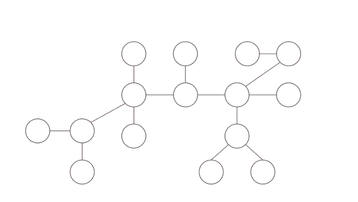

# Centroid Decomposition

## Problem & Motivation

Given a tree, we are asked to find all the number of pairs `(u, v)` such that `dist(u, v) ≤ D`.

**Solution**

Note: This problem can also be solved by Small-To-Large Merging https://usaco.guide/plat/merging?lang=cpp

Let us fix one node of Tree by picking a vertex of the tree and call it `c`. Now let us split all the possible paths into classes: 
1) Some of the paths may not include this vertex `c`, then it will be completely inside one of the subtrees formed after removing `c`.
2) If the path includes node `c`, then we can break into two segments `u to c` and `c to v`.


So what will do is that: We will pick a vertex `c`, remove that vertex from the tree and recursively find the number of pairs `(u, v)` in the subtree. In the end we will calculate the number of pairs which include the vertex `c`.


We will need to calculate `d[v]` which is distance from `(c, v)`, this can be precalculated in linear time. If we fix vertex `u`, then we will need to find all the vertices such that `d[v] ≤ D - d[u]`. Say we have an array of distances `d[i]` and maintain sorted order of this array and find the number of nodes `v` using binary search.

In this problem we will need to find the vertices which belong to different subtrees. We can do it in the following ways:

1. Add elements of first subtree into binary search tree form left to right and then iterate for elements `v` of second subtree and query the number of elements `u` satisfying `dist(u, v) ≤ D`.
\
Then add the elements of second subtree to binary search tree and continue. Each time we consider a subtree, all the elements of previous subtrees are in our binary search tree.

2. Another way to calculate is to subtract the values we don't want to include. For a node `u` calculate all the nodes `v` of tree such that `d[v] ≤ D - d[u]` and then subtract the number of nodes which are in the same subtree as `u`.


Important thing is how to choose node `c`. Time complexity depends on how good is the node `c`, when we use divide and conquer technique we want to divide our problem into subproblems of equal size. We choose our vertex to be centroid of the tree.

A centroid is defined as a vertex such that when removed, all of the resulting subtrees have a size of at most half that of the original tree (that is, `⌊n/2⌋`).



Centroid of the tree is different than centre of tree(centre of a tree is simply the middle vertex/vertices of the diameter of the tree). Centre of the tree is the node such that if rooted minimizes the height of the rooted tree. The centre of the tree in the middle of the largest path in the tree. In the following image `blue` node is the centre of the tree whereas the `red` node is the centroid of the tree.


**Existence: Is there always a centroid?** Yes. Every tree has at least one centroid.

**Theorem (Jordan, 1869):** Given a tree with `N` nodes, there exists a vertex whose removal partitions the tree into components, each with at most `N/2` nodes. (i.e. For any given tree, the centroid always exists)

**Proof:** Let us chose any arbitrary vertex `a` in the tree, if `a` satisfies the property of the centroid, then we are done, else there exists one (and only one - if two such nodes exists then size of tree is `> N`) component with more than `N/2` vertices. We now consider the vertex `b` adjacent to `a` in that component and apply the same argument for `b` . We continue the same procedure unless we find the required vertex. Also, we never go back to any old vertices because the component containing them must have less than `N/2` vertices(because the subtree of `b` contains size `> N/2`). Since the no of vertices are finite, and we visit each vertex at most once, the procedure must end and hence the centroid must exist.


**Finding the centroid of a tree:** One way to find the centroid is to pick an arbitrary root, then run a depth-first search computing the size of each subtree, and then move starting from root to the largest subtree until we reach a vertex where no subtree has size greater than N/2. This vertex would be the centroid of the tree.

Pavel marvin

```python
def dfs_size(x, p):
    s = 1
    for y in Adj[x]:
        if y != p:
	    s += dfs_size(y, p)
    return s
    
def dfs_centroid(x, p):
    s = 1
    ok = True
    for y in Adj[x]:
    	if y == p:
	    continue
	sz_y = dfs_centroid(y, x)
	if sz_y > n/2:
	    ok = False
	s += sz_y
    if s < n/2: # checking for n - s ≤ n/2
        ok = False
    if ok:
        centroid = x
    return s
    
# To compute centroid
n = dfs_size(v, -1)
dfs_centroid(v, -1)
```

```cpp
vector<int> Adj[maxn];
int sub[maxn]; // subtree size

int dfs_sz(int u, int p) {
    for (int v : Adj[u])
        if (v != p) sub[u] += dfs_sz(v, u);
	
    return sub[u] + 1;
}

int centroid(int u, int p) {
    for (int v : Adj[u])
        if (v != p and sub[v] > n/2) return centroid(v, u);

    return u;
}
```

**Centroid Decomposition**

On removing the centroid, the given tree decomposes into a number of different trees, each having no of nodes < N/2 . We make this centroid the root of our centroid tree and then recursively decompose each of the new trees formed and attach their centroids as children to our root. Thus , a new centroid tree is formed from the original tree. 


Centroid Decomposition works by repeated splitting the tree and each of the resulting subgraphs at the centroid, producing `O(log N)` layers of subgraphs. Since at each step, the new trees formed by removing the centroid have size at-most `N/2`, the maximum no of levels would be `O(log N)`. Hence, the height of the centroid tree would be at most `O(log N)`.

**Observation 1:** Time Complexity of Centroid decomposition: `O(NlogN)`


**Observation 2:** A vertex belongs to the component(in the original tree) of all its ancestors in the centroid tree. For example: The node 14 belongs to the component of 14, 15, 11 and 3.


* It's simple if we think in terms of descendants instead of ancestors. The node `a` is a descendant of node `b` if `a` belong to the subtree resulting after removal of `b`. Note that the removal of `b` will only affect its own component/subtree, because we already disconnected `b` from its `parent` in the centroid decomposition. This means that all the descendants of `b` belong to its component.

**Observation 3:** Consider any two arbitrary vertices `a` and `b` and the path between them (in the original tree) can be broken down into path from `a` to `lca(a,b)` and the path from `lca(a,b)` to `b`, where `lca(a,b)` is the lowest common ancestor of `a` and `b` in the centroid tree. For example: The path from 9 to 10 in the original tree can be decomposed into the path from 9 to 3 and the path from 3 to 10.


* It is not hard to see that given any arbitray vertices `a` and `b` and their `lca(a, b)` in the centroid tree, both `a` and `b` lie inside the part which the vertex `lca(a, b)` was centroid of, and they were first separated into different parts when the vertex `lca(a, b)` was removed.
* Both `a` and `b` belong to the component(subtree) where the node `lca(a,b)` is the centroid. Suppose, by contradiction, that `lca(a,b)` doesn’t divide the path from `a` to `b` into two disjoint parts. It means that both `a` and `b` will be in the same component(subtree) after the removal of `lca(a,b)` in the original tree. Consequently, the centroid of that component would be a common ancestor of `a` and `b` lower than `lca(a,b)` which is contradiction.

**Observation 4:** We decompose the given tree into `O(NlogN)` different paths (from each centroid to all the vertices in the corresponding part) such that any path in the original tree is a concatenation of two different paths from this set. (This is the most important/new/extra part in this Data Structure(DS) that should be focused on).

* Using some DS, we maintain the required information (based on the problem) about these `O(NlogN)` different paths chosen such that any other path can be decomposed into 2 different paths from this set and these two paths can be found in `O(logN)` time, by finding the LCA in the centroid tree (since height of centroid tree is at most `O(logN)`, we can find the LCA by just moving up from the deeper node).
* Each path from `a` to `b` in the original tree can be represented path from `a -> lca(a, b)` and `lca(a, b) -> b`. For each node we have `O(logN)` ancestors becuase the height of tree is `O(logN)`. There are `N` nodes in total and hence number of paths in `O(NlogN)`, that is there are only `O(NlogN)` paths from every node to its ancestors.

## Problems & Analysis

### CF 199 Div 2 E. Xenia and Tree 

https://codeforces.com/contest/342/problem/E

Given a tree of `n` nodes indexed from `1` to `n`. The first node is initially painted red, and the other nodes are blue. 

We should execute two types of queries:
* paint a specified blue node to red
* calculate which red node is the closest to the given one and print the shortest distance to the closest red node.

**Solution**

# TODO


**Difference between HLD and CD**
* If we want to compute something on paths then we use HLD
* If we want to compute something on an area, we use CD. For example: Say we are given node `u` and distance `D` and we want to compute something on nodes `v` such that `dist(u, v) ≤ D`, something around node `u`.


TODO - https://codeforces.com/blog/entry/52492?locale=en

Implementation: https://codeforces.com/contest/321/submission/3973635, https://codeforces.com/contest/321/submission/45791725, https://usaco.guide/plat/centroid?lang=cpp, https://codeforces.com/contest/1303/submission/76216413, neal https://codeforces.com/contest/1303/submission/70880989


Solve this problem https://codeforces.com/contest/1174/problem/F

REF: 
* https://medium.com/carpanese/an-illustrated-introduction-to-centroid-decomposition-8c1989d53308
* https://robert1003.github.io/2020/01/16/centroid-decomposition.html 

