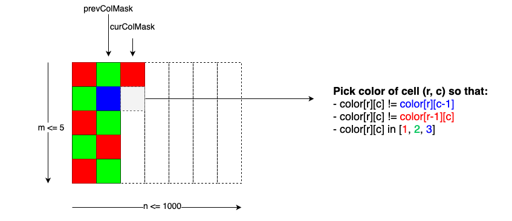

TODO: https://codeforces.com/contest/1536/problem/F

## Enumerative combinatorics

### Catalan numbers
The Catalan numbers are a remarkable sequence of numbers that “solve” a number of seemingly unrelated counting problems. 

* **Triangulation of polygon:** A convex `(n+2)`-gon can be split into `n` triangles by `n-1` non-intersecting diagonals. The number of different ways of splitting is given by catalan number Cn. \
 \
 Proof: Given `(n+2)-gon`, say we consider the base of the polygon and number vertices from `1` to `n`. Suppose that the third vertex of the base triangle is `k`, the green polygon is `k+1`-gon and the red polygon is `n+k-2`-gon, then we get the following recurrence relation.\
 
 
* **Casheir Problem:** Cn is the number of ways to form a "mountain range" with n upstrokes and n downstrokes that all stay above a horizontal line. The mountain range interpretation is that the mountains will never go below the horizon. For `n = 3`  `Cn = 5`.\
  
  Say in a country we only have 2 coin denominations `5` and `10`. Now suppose that we have `2n` people in a line waiting to buy a movie ticket, `n` of them are having `5` rupees and the other `n` are having `10` rupees and the cashier has no change. How many different ways are possible such that ticket seller is always able to satisfy all the people. If we consider `5` as `+1` and `10` as `-1` then for the people in the line, the prefix sum should always be `>= 0`. If we consider `5` as moving 1 unit in x direction and `10` and moving 1 unit in y direction. We should never touch the line `y = x + 1`.
  
  

  The number of invalid paths can be calculated Andre's reflection principle. Andre's Reflection Principle: A path is invalid if it touches or crosses the line `y = x + 1`. In any case it touches the line the first time at let's say 𝑃. Now, we reflect the first part of the path from 𝐴=(0,0) to 𝑃 at the line `y = x + 1` getting a path from `A′=(−1,1)`. So the total valid paths = `[All paths from (0, 0) to (n, n)]` - `[All paths from (-1, 1) to (n, n)]`. `[All paths from (0, 0) to (n, n)]` = `[number of ways of arranging n A's and n B's = (2n choose n)]`\
  
  
  
  Similarly if cashier initally has `k` 5 rupee denominations then the diagonal moves up `k` units and we can use reflection priniciple.
  
  **Bertrand's ballot problem** is the question: "In an election where candidate A receives p votes and candidate B receives q votes with p > q, what is the probability that A will be strictly ahead of B throughout the count?" The answer is  (p - q)/(p + q). The number of favourable ways `(p+q-1 choose p-1)` - `(p+q-1 choose p)`. Proof: First vote should always go to candidate A, now we are left with `(p-1)` A's votes and `q` B's votes and now ties are allowed, so by reflection trick we get `(p+q-1 choose p-1)` - `(p+q-1 choose p)`. If ties are allowed in the original problem then the answer would be `(p+q choose q) - (p+q choose q-1)`.
  
  Application: CHNBGMT https://discuss.codechef.com/t/chnbgmt-editorial/12438, https://www.spoj.com/problems/FUNPROB/, Lots of Combinations Problem B Petr Mitrichev Contest 10 https://codeforces.com/gym/100110

https://atcoder.jp/contests/abc167/tasks/abc167_e

#### ABC 209 Problem C - Not Equal
You are given a sequence C of N integers. Find the number of sequences A of N integers satisfying all of the following conditions. `1 ≤ Aᵢ ≤ Cᵢ ( 1 ≤ i ≤ N )` Aᵢ ≠ Aⱼ ( 1 ≤ i < j ≤ N ) Since the count may be enormous, print it modulo (10⁹ + 7).

Solution: Sort `Cᵢ` in increasing order and Now for each of the index `i` we have `max(0, Cᵢ - (i-1))` choices to choose the element. We can prove this because, after determining the first i − 1 elements `A₁ , A₂ , … ,` the candidates for `Aᵢ` are `1 , 2 , … Cᵢ` , except for `A₁ , A₂ , … Aᵢ − 1` (which are all pairwise distinct and between `1` and `Cᵢ` , inclusive); namely there are `(Cᵢ − i + 1)` candidates. If however any i satisfies `Cᵢ − i + 1 < 0`, then the answer is 0 .

https://atcoder.jp/contests/abc209/tasks/abc209_c


#### Leetcode Paiting a grid with 3 different colors

Painting a `m * n` grid with three different colors such that no two adjacent cells have same color, Here `1 <= m <= 5 & 1 <= n <= 1000` since `m` is very small we can create a graph where each node denotes a column `(c1, c2, c3, c4, c5)` and count the number of columns compatible with this using dynamic programming.

https://leetcode.com/problems/painting-a-grid-with-three-different-colors/



```cpp
class Solution {
public:
    int memo[1000][1024] = {};
    int m, n, MOD = 1e9 + 7;
    int colorTheGrid(int m, int n) {
        this->m = m; this->n = n;
        return dp(0, 0, 0, 0);
    }
    int dp(int c, int prevColMask, int r, int curColMask) {
        if (c == n) return 1; // Found a valid way
        if (r == 0 && memo[c][prevColMask]) return memo[c][prevColMask];
        if (r == m) return dp(c + 1, curColMask, 0, 0);
        int ans = 0;
        for (int i = 1; i <= 3; ++i) // Try colors i in [1=RED, 2=GREEN, 3=BLUE]
            if (getColor(prevColMask, r) != i && (r == 0 || getColor(curColMask, r-1) != i))
                ans = (ans + dp(c, prevColMask, r + 1, setColor(curColMask, r, i))) % MOD;
        if (r == 0) memo[c][prevColMask] = ans;
        return ans;
    }
    int getColor(int mask, int pos) { // Get color of the `mask` at `pos`, use 2 bits to store a color
        return (mask >> (2 * pos)) & 3;
    }
    int setColor(int mask, int pos, int color) { // Set `color` to the `mask` at `pos`, use 2 bits to store a color
        return mask | (color << (2 * pos));
    }
};
```
