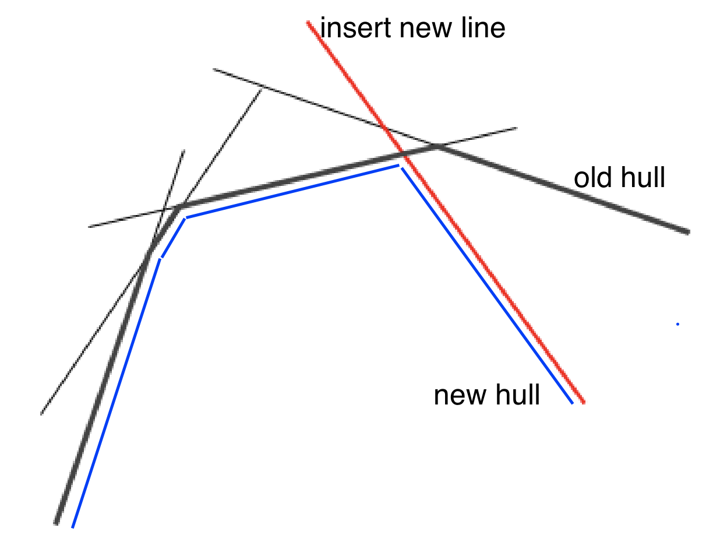
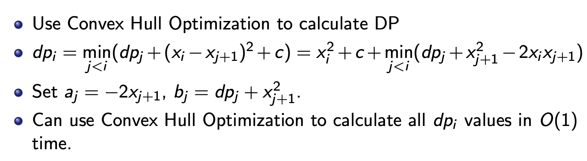
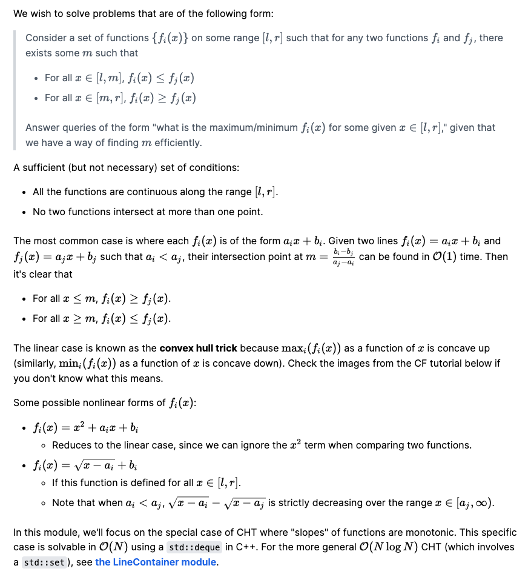
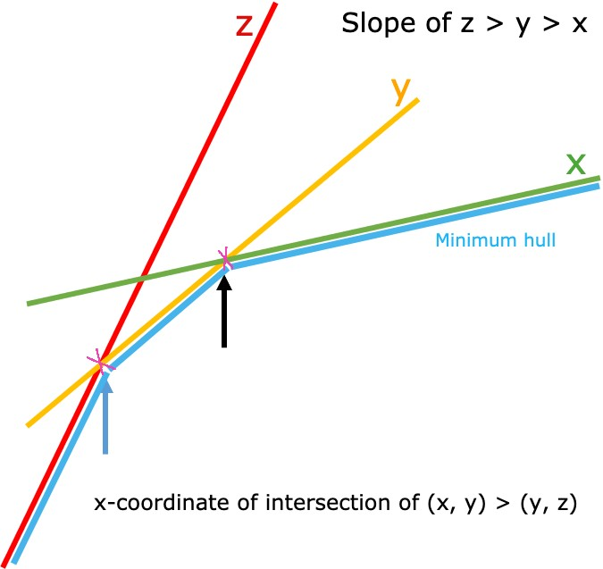
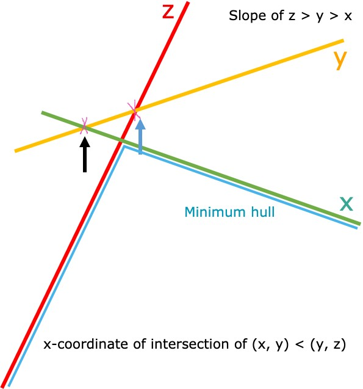

The convex hull trick is a technique (perhaps best classified as a data structure) used to determine efficiently, after preprocessing, which member of a set of linear functions in one variable attains an extremal value for a given value of the independent variable. It has little to do with convex hull algorithms.

### Motivation

**Problem :** [Covered Walkway](https://open.kattis.com/problems/coveredwalkway) We need to cover a walkway consisting of `n(1 ≤ n ≤ 10^6`) points. To cover the walkway from a point at `x` to a point at `y`, they will charge `c + (x − y)²`, where `c` is a constant. Note that it is possible for `x = y`. If so, then the contractor would simply charge `c`.

**Solution :**

* Cover `n` points on the plane with some number of segments.
* The cost of segment `(l,r)` is  `c + (r − l)²`.
* Straightforward DP is `O(N²)` and is too slow.

#### Convex Hull Optimization
* Consider a data structure that hold linear functions `yi(x) = ai x + bi`
* Need to implement function `add(ai, bi)` and `get(x) = mini yi(x)`.
* Assume that lines are added in the order of decreasing `ai`.
* Keep the hull of all the lines in a stack (just like in the convex hull algorithm).
  
* When adding a line, remove lines from the top of the stack until it’s convex.
* Add a line `y = ai + b`. `getX(a, b)` returns `x` coordinate of intersection of lines `a` and `b`.
  ```cpp
  while( getX(prevLast, newLine) < getX(prevLast, last))
      remove ( last )
  ```
* Get value for `x`: find an optimal line such that `x` lies between intersection with neighboring lines
* Binary search for lines in stack in `O(log n)`.
* If, in addition, queries `x` are always increasing, you can keep a pointer to the current best line.
* It only moves to the right, except when the best line was deleted, so it’s `O(1)` amortized.

 
 
 <details>
   <summary> Using Dynamic CHT, O(N logN) </summary>
 
 ```cpp
 #define LL long long
const LL is_query = -(1LL << 62);
struct Line {
  LL m, b;
  mutable function<const Line*()> succ;
  bool operator<(const Line& rhs) const {
    if (rhs.b != is_query) return m > rhs.m;
    const Line* s = succ();
    if (!s) return 0;
    return s->b - b < (m - s->m) * rhs.m;
  }
};
struct HullDynamic : public multiset<Line> {
  bool bad(iterator y) {  // maintains lower hull for min
    auto z = next(y);
    if (y == begin()) {
      if (z == end()) return 0;
      return y->m == z->m && y->b >= z->b;
    }
    auto x = prev(y);
    if (z == end()) return y->m == x->m && y->b >= x->b;
    return (x->b - y->b) * (z->m - y->m) >= (y->b - z->b) * (y->m - x->m);
  }
  void insert_line(LL m, LL b) {
    auto y = insert({m, b});
    y->succ = [=] { return next(y) == end() ? 0 : &*next(y); };
    if (bad(y)) {
      erase(y);
      return;
    }
    while (next(y) != end() && bad(next(y))) erase(next(y));
    while (y != begin() && bad(prev(y))) erase(prev(y));
  }
  LL eval(LL x) {
    auto l = *lower_bound((Line){x, is_query});
    return l.m * x + l.b;
  }
};

int main() {
    int N;
    long long C;
    scanf("%d %lld", &N, &C);
    HullDynamic CHT;
    vector<long long> dp(N+1);
    // dp[j] = C + xj^2 + min(-2 * xi *xj + xi^2 + dp[i-1])
    for(int i=1;i<=N;i++){
        int x;
        scanf("%d", &x);
        if(i == 1){
            dp[i] = C;
        }else{
            dp[i] = min(C + 1ll*x*x + CHT.eval(x), C + dp[i-1]);
        }
        CHT.insert_line(-2ll*x, 1ll*x*x + dp[i-1]); // insert values
    }
    printf("%lld\n", dp[N]);
    return 0;
}
 ```
 </details>
 
 <details>
   <summary> Using CHT, Faster solution since slopes are sorted </summary>
 
 Since we go from left to right, `x` is increasing, we can store them in stack.
 
 ```cpp
 struct convex_hull_trick {
  vector<pair<long double,long double> > h;
  double intersect(int i) {
    return (h[i+1].second-h[i].second) / (h[i].first-h[i+1].first); }
  void add(long double m, long double b) {
    h.push_back(make_pair(m,b));
    while (size(h) >= 3) {
      int n = size(h);
      if (intersect(n-3) < intersect(n-2)) break;
      swap(h[n-2], h[n-1]);
      h.pop_back(); } }
  long double get_min(long double x) {
    int lo = 0, hi = (int)size(h) - 2, res = -1;
    while (lo <= hi) {
      int mid = lo + (hi - lo) / 2;
      if (intersect(mid) <= x) res = mid, lo = mid + 1;
      else hi = mid - 1; }
    return h[res+1].first * x + h[res+1].second; } };

int main() {
    int N;
    long long C;
    scanf("%d %lld", &N, &C);
    convex_hull_trick CHT;
    vector<long long> dp(N+1);
    // dp[j] = C + xj^2 + min(-2 * xi *xj + xi^2 + dp[i-1])
    for(int i=1;i<=N;i++){
        int x;
        scanf("%d", &x);
        if(i == 1){
            dp[i] = C;
        }else{
            dp[i] = min(C + 1ll*x*x + (ll)CHT.get_min(x), C + dp[i-1]);
        }
        CHT.add(-2ll*x, 1ll*x*x + dp[i-1]); // insert values
    }
    printf("%lld\n", dp[N]);
    return 0;
}
 ```
</details>
 
<details>
 <summary>Author's solution with comments</summary>
 
```cpp
#include <iostream>

#include <vector>

using namespace std;

#define MAXN 1000100

long long X[MAXN];
long long Y[MAXN];

typedef pair < long long, long long > pll;

void conv_insert(int ii, vector < pll > & C, pll x) {
    /* Erase everything from the set that is dominated by this line.  If this line
     * overtakes you before you overtake your predecessor you'll never be at the
     * top so you get dropped. */
    while (C.size() - ii > 1) {
        int i = C.size() - 2;
        int j = C.size() - 1;
        if ((C[j].second - C[i].second) / (C[i].first - C[j].first) <
            (C[j].second - x.second) / (x.first - C[j].first)) {
            C.resize(C.size() - 1);
        } else break;
    }
    C.push_back(x);
}

long long eval(pll v, int x) {
    return v.second + x * v.first;
}

int main() {
    int N, K;
    cin >> N >> K;

    for (int i = 0; i < N; i++) cin >> X[i];

    /* The basic idea is we can use dynamic programming to solve this problem to
     * get cost(i) = min((X[i] - X[j-1])^2 + cost(j)) for j > i and cost(N) = 0.
     * We split this up into:
     * cost(i) = X[i]^2 + min(-2X[i]X[j] + (X[j-1]^2 + cost(j)))
     * where the first term is the only thing that will vary with X[i], i.e., we
     * have lines.  So I just sweep from right to left and keep track of which 
     * line is cheapest by ordering lines by when they become the best option.
     */
    int ii = 0;
    vector < pll > C;

    /* Connect to end. */
    C.push_back(make_pair(-2 * X[N - 1], X[N - 1] * X[N - 1]));

    for (int i = N - 1;; i--) {
        /* Remove lines that are no longer of interest.  To be efficient we erase
         * from the front by just incrementing the head 'ii' index. */
        while (C.size() - ii > 1 && eval(C[ii], X[i]) > eval(C[ii + 1], X[i])) {
            ii++;
        }
        /* Compute v = cost(i) */
        long long v = K + X[i] * X[i] + eval(C[ii], X[i]);
        if (i == 0) {
            cout << v << endl;
            break;
        }
        /* Add this new entry to our line set. Since it has the largest slope so
         * far it always belongs on the set somewhere. */
        conv_insert(ii, C, make_pair(-2 * X[i - 1], v + X[i - 1] * X[i - 1]));
    }
    return 0;
}
```
</details> 

<details>
 <summary>CHT using deque `O(N)` as slopes and `x` are monotonic</summary> 
 
```cpp
#define fi first
#define se second
#define sz(x) (int)(x).size()

// Convex Hull Trick
typedef ll LT;
typedef pair<LT,LT> LP;
struct convex_hull_trick {
  deque<LP> d;
  LT get(LT x) {
    while (sz(d) >= 2) {
      LT a = d[0].fi*x + d[0].se;
      LT b = d[1].fi*x + d[1].se;
      if (a <= b) break; // get min
      d.pop_front();
    }
    return d[0].fi*x + d[0].se;
  }
  void add(LP x) { // decreasing order of x.fi
    while (sz(d) >= 2) {
      LP y = d[sz(d) - 1];
      LP z = d[sz(d) - 2];
      if ((x.se-y.se)*(z.fi-y.fi) >= (y.fi-x.fi)*(y.se-z.se)) break; // both
      d.pop_back();
    }
    d.push_back(x);
  }
};

int main() {
    int N;
    long long C;
    scanf("%d %lld", &N, &C);
    convex_hull_trick CHT;
    vector<long long> dp(N+1);
    // dp[j] = C + xj^2 + min(-2 * xi *xj + xi^2 + dp[i-1])
    for(int i=1;i<=N;i++){
        int x;
        scanf("%d", &x);
        if(i == 1){
            dp[i] = C;
        }else{
            dp[i] = min(C + 1ll*x*x + (ll)CHT.get(x), C + dp[i-1]);
        }
        CHT.add({-2ll*x, 1ll*x*x + dp[i-1]}); // insert values
    }
    printf("%lld\n", dp[N]);
    return 0;
}
```
</details>



source: https://usaco.guide/plat/cht?lang=cpp

There are mainly three cases:
* Slopes are monotonic, query values are monotonic - CHT with deque, amortized O(1), We can query from left of deque and remove slopes to the left of our query value
* Slopes are monotonic but query values are not - CHT with stack and binary search for queries
* Slopes are not monotonic - Dynamic CHT - use multiset to store lines

In the case where the slopes aren't necessarily sorted, so we have 5 options:

* Maintaining a balanced BST of lines
* Li Chao Segment Tree
* Divide and Conquer
* Keeping logN sets of convex hulls and merging them like a Binomial Heap
* Keeping the last √N lines and rebuilding the convex hull when the buffer gets full

The last 2 have worse complexity compared to the first 3 and may get TLE depending on the implementation. [REF](https://csacademy.com/contest/archive/task/squared-ends/solution/)

We call a line `y` irrelevant/bad with line `x` & `z` if it is not part of minimum hull for any segment `[l, r]`.



Here we no need to consider line y.




## Convex Hull Trick

```cpp
struct convex_hull_trick {
  vector<pair<double,double> > h;
  double intersect(int i) {
    return (h[i+1].second-h[i].second) /
      (h[i].first-h[i+1].first); }
  void add(double m, double b) {
    h.push_back(make_pair(m,b));
    while (size(h) >= 3) {
      int n = size(h);
      if (intersect(n-3) < intersect(n-2)) break;
      swap(h[n-2], h[n-1]);
      h.pop_back(); } }
  double get_min(double x) {
    int lo = 0, hi = (int)size(h) - 2, res = -1;
    while (lo <= hi) {
      int mid = lo + (hi - lo) / 2;
      if (intersect(mid) <= x) res = mid, lo = mid + 1;
      else hi = mid - 1; }
    return h[res+1].first * x + h[res+1].second; } };
```

## Dynamic Convex Hull Trick

A data structure which maintain a some lines in `(m, b)` format where `y = m*x + b` and we can query for the minimum value for a given `x`. The following are mostly inspired from `simonlindholm` KTH notebook and [nikalsb](https://codeforces.com/blog/entry/11155?#comment-162462), [code](https://github.com/niklasb/contest-algos/blob/master/convex_hull/dynamic.cpp)

`multiset<Line>` maintains the set of lines, ordered by slope. Now the problem is to search the matching line for a given X coordinate in `eval`, we need to binary search on the intersection points of adjacent lines. Unfortunately multiset has no option to customize the binary search, so every line is given a `std::function<const Line*()>`, so that it can look up it's successor while comparing. Then we use `lower_bound` to do the binary search, using a special query line. `Line::operator<` contains a hack so that it behaves differently when comparing against such a special query line.

`bad` function: Given line `y(m, b)` it intersects it's next line `z(m, c)` their intesection has x-coordinate  `x * z->m + z->b = x * y->m + y->b` which leads to `(y->b - z>b)/(z->m - y->m)`. Similarly the intersection of `y(m, c)` and it's prev `x(m, c)` has x-coordinate `(x->b - y->b)/(y->m - x->m)`. If we cross-multiply to eliminate division we will end up with `(x->b - y->b) * (z->m - y->m) >= (y->b - z->b) * (y->m - x->m);`. `bad` returns true if either line `prev(y)` or line `next(y)` is always better than line `y`.

Maintains lower hull for min

```cpp
#define LL long long
const LL is_query = -(1LL << 62);
struct Line {
  LL m, b;
  mutable function<const Line*()> succ;
  bool operator<(const Line& rhs) const {
    if (rhs.b != is_query) return m > rhs.m;
    const Line* s = succ();
    if (!s) return 0;
    return s->b - b < (m - s->m) * rhs.m;
  }
};
struct HullDynamic : public multiset<Line> {
  bool bad(iterator y) {  // maintains lower hull for min
    auto z = next(y);
    if (y == begin()) {
      if (z == end()) return 0;
      return y->m == z->m && y->b >= z->b;
    }
    auto x = prev(y);
    if (z == end()) return y->m == x->m && y->b >= x->b;
    return (x->b - y->b) * (z->m - y->m) >= (y->b - z->b) * (y->m - x->m);
  }
  void insert_line(LL m, LL b) {
    auto y = insert({m, b});
    y->succ = [=] { return next(y) == end() ? 0 : &*next(y); };
    if (bad(y)) { erase(y); return; }
    while (next(y) != end() && bad(next(y))) erase(next(y));
    while (y != begin() && bad(prev(y))) erase(prev(y));
  }
  LL eval(LL x) {
    auto l = *lower_bound((Line){x, is_query});
    return l.m * x + l.b;
  }
};

// Usage
HullDynamic cht;
cht.insert(slope, constant);
min_val = cht.eval(x_val); // min value at point x_val
```
source: Tanuj Khattar https://pastebin.com/XF5WQ2YR

Maintains Upper hull for maximum

```cpp
typedef long long int64;
typedef long double float128;

const int64 is_query = -(1LL<<62), inf = 1e18;

struct Line {
    int64 m, b;
    mutable function<const Line*()> succ;
    bool operator<(const Line& rhs) const {
        if (rhs.b != is_query) return m < rhs.m;
        const Line* s = succ();
        if (!s) return 0;
        int64 x = rhs.m;
        return b - s->b < (s->m - m) * x;
    }
};

struct HullDynamic : public multiset<Line> { // will maintain upper hull for maximum
    bool bad(iterator y) {
        auto z = next(y);
        if (y == begin()) {
            if (z == end()) return 0;
            return y->m == z->m && y->b <= z->b;
        }
        auto x = prev(y);
        if (z == end()) return y->m == x->m && y->b <= x->b;
        return (float128)(x->b - y->b)*(z->m - y->m) >= (float128)(y->b - z->b)*(y->m - x->m);
    }
    void insert_line(int64 m, int64 b) {
        auto y = insert({ m, b });
        y->succ = [=] { return next(y) == end() ? 0 : &*next(y); };
        if (bad(y)) { erase(y); return; }
        while (next(y) != end() && bad(next(y))) erase(next(y));
        while (y != begin() && bad(prev(y))) erase(prev(y));
    }

    int64 eval(int64 x) {
        auto l = *lower_bound((Line) { x, is_query });
        return l.m * x + l.b;
    }
};
```

https://github.com/SuprDewd/CompetitiveProgramming/blob/master/code/data-structures/convex_hull_trick_dynamic.cpp, https://csacademy.com/submission/1357076/

## Li-Chao Tree

Li-Chao Segment Trees can be used to solve problems of the format:

You're given a set S containing function of the same "type" (ex. lines, y = ax + b). The type of function need to have the transcending property. You need to handle two type of queries:

* Add a function to S
* Answer the maximum/minimum value at x = t considering all functions in S
 
A type of function has **transcending property** if:

Given two functions f(x), g(x) of that type, if f(t) is greater than/smaller than g(t) for some x = t, then f(x) will be greater than/smaller than g(x) for x > t. In other words, once f(x) "win/lose" g(x), f(x) will continue to "win/lose" g(x).

Since it's basically a segment tree, it has a big advantage over convex hull: supporting segments. It's also easier to code, and the order of slope doesn't matter.

Its advantage is also its disadvantage, thought. Since it's a segment tree, you have to compress x-coordinates (offline approach) or use dynamic segment tree (online approach) to support large x-coordinates. This is not a problem with convex hull.

TODO: https://csacademy.com/contest/archive/task/squared-ends/statistics/

```cpp
#include <bits/stdc++.h>

using namespace std;


template< typename T, bool ismax >
struct LiChaoTree {
  struct Line {
    T a, b;

    Line(T a, T b) : a(a), b(b) {}

    inline T get(T x) const { return a * x + b; }

    inline bool over(const Line &b, const T &x) const {
      return (get(x) < b.get(x)) ^ ismax;
    }
  };

  vector< T > xs;
  vector< Line > seg;
  int sz;

  LiChaoTree(const vector< T > &x, T INF) : xs(x) {
    sz = 1;
    while(sz < xs.size()) sz <<= 1;
    while(xs.size() < sz) xs.push_back(xs.back() + 1);
    seg.assign(2 * sz - 1, Line(0, INF));
  }

  void update(Line &x, int k, int l, int r) {
    auto latte = x.over(seg[k], xs[l]), malta = x.over(seg[k], xs[r - 1]);
    if(latte & malta) {
      seg[k] = x;
    } else if(latte ^ malta) {
      int mid = (l + r) >> 1;
      auto beet = x.over(seg[k], xs[mid]);
      if(beet) swap(seg[k], x);
      if(latte != beet) update(x, 2 * k + 1, l, mid);
      else update(x, 2 * k + 2, mid, r);
    }
  }

  void update(T a, T b) { // ax+b
    Line l(a, b);
    update(l, 0, 0, sz);
  }

  T query(int k) { // xs[k]
    const T x = xs[k];
    k += sz - 1;
    T ret = seg[k].get(x);
    while(k > 0) {
      k = (k - 1) >> 1;
      if(ismax) ret = max(ret, seg[k].get(x));
      else ret = min(ret, seg[k].get(x));
    }
    return ret;
  }
};

using int64 = long long;
const int64 INF = 1LL << 40;


int main() {
  int N, K;
  cin >> N >> K;
  vector< int64 > A(N);
  for(int i = 0; i < N; i++) cin >> A[i];
  auto B(A);
  sort(begin(B), end(B));
  B.erase(unique(begin(B), end(B)), end(B));
  vector< int > C(N);
  for(int i = 0; i < N; i++) {
    C[i] = lower_bound(begin(B), end(B), A[i]) - begin(B);
  }
  vector< int64 > dp(N + 1, INF);
  dp[0] = 0;
  for(int i = 0; i < K; i++) {
    vector< int64 > dp2(N + 1, INF);
    for(int j = 0; j < N; j++) dp[j] += A[j] * A[j];
    LiChaoTree< int64, false > chd(B, INF);
    if(dp[0] < INF) chd.update(-2 * A[0], dp[0]);
    for(int j = 1; j <= N; j++) {
      dp2[j] = chd.query(C[j - 1]) + A[j - 1] * A[j - 1];
      if(dp[j] < INF) chd.update(-2 * A[j], dp[j]);
    }
    dp.swap(dp2);
  }

  cout << dp[N] << endl;
}
```

source: https://csacademy.com/submission/1754478/
