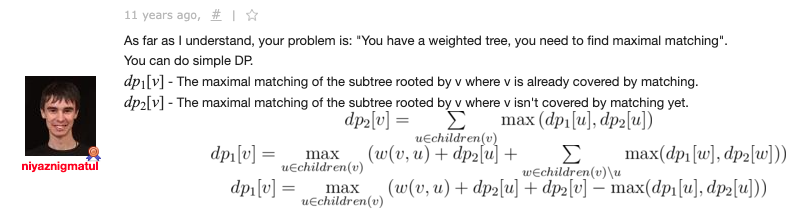

### Matching on Trees:



The problem is to find matching in tree, so we can use dynamic programming. Hopcroft-Karp algorithm is for cyclic bipartite graphs, although it can't find weighted matching. To find maximal matching in tree is quite easier than in cyclic graph.

Ref: https://codeforces.com/blog/entry/2059

### Independent Set
Ref: https://codeforces.com/blog/entry/100584 Problem D https://codeforces.com/contest/1646/problem/D

**Problem:** You are given a tree of `n` vertices numbered from `1` to `n`. A tree is a connected undirected graph without cycles.

For each `i = 1, 2, ... , n` , let `w_i` be the weight of the i-th vertex. A vertex is called good if its weight is equal to the sum of the weights of all its neighbors.

Initially, the weights of all nodes are unassigned. Assign positive integer weights to each vertex of the tree, such that the number of good vertices in the tree is maximized. If there are multiple ways to do it, you have to find one that minimizes the sum of weights of all vertices in the tree.

**Solution:**

If `n = 2`, we can assign `w1=1` and `w2=1` and there is no way to get a better answer because all vertices are good and the sum of weights cannot be smaller because the weights have to be positive.

If `n > 2`, two vertices sharing an edge cannot be both good. To prove this, we are going to analyze two cases. If the two vertices have distinct weights, then the one with a smaller weight cannot be good, because the one with a larger weight is its neighbor. Otherwise, if both vertices have the same weight, then none of them can have another neighbor, as that would increase the sum of their neighbors by at least 1. So, the only way this could happen is if `n=2`, but we are assuming that `n>2`.

Thus, the set of good vertices must be an independent set. We will see that for each independent set of vertices in the tree, there is an assignment of weights where all the vertices from this set are good. We can assign a weight of 1 to each vertex that is not in the set, and assign its degree to each vertex in the set. Because all neighbors of a vertex in the set are not in the set, then all of them have a weight of 1 and this vertex is good.

Therefore, the maximum number of good vertices is the same as the maximum size of an independent set in this tree. For a fixed independent set of the maximum size, the construction above leads to a configuration with the minimum sum of weights. This is because all vertices must have a weight of at least 1, and the vertices in the set must have a weight of at least its degree.

So, to solve the problem it is enough to root the tree in an arbitrary vertex and solve a tree dp. Let's call `f(x, b)` to get the pair `(g, s)`, where `g` is the maximum number of good vertices in the subtree of vertex `x` assuming that `x` is good (if `b=1`) or that it is not good (if `b=0`), and `s` is the minimum sum of weights for that value `g`.

The values of `f(x, b)` can be computed with a dp, using the values of `f` in the children of node `x`. If `b=1`, then for each child `c` you must sum `f(c, 0)`. If `b=0`, for each child `c` you can choose the best answer between `f(c,0)` and `f(c,1)`. The answer to the problem will be the best between `f(root,0)` and `f(root,1)`

To construct the assignment of weights, you can do it recursively considering for each vertex if it has to be good or not, in order to keep the current value of the answer. In case both options (making it good or not) work, you have to choose to not make it good, as you do not know if its father was good or not.

Intended complexity: `O(n)`

**Trick:** Using negative value for cost so that we can use `max` instead of using `if{} else{}`

```cpp
#include <bits/stdc++.h>
using namespace std;

const int MAXN = 400005;

vector<int> g[MAXN];

bool vis[MAXN];
int pa[MAXN];

//DFS to compute the parent of each node
//parent of node i is stored at pa[i]
void dfs(int v){
	vis[v] = 1;
	for(auto i : g[v]){
		if(!vis[i]){
			pa[i] = v;
			dfs(i);
		}
	}
}

pair<int, int> dp[MAXN][2];

//Computes the value of function f, using dp
//the second coordinate of the pair is negated (to take maximums)
pair<int, int> f(int x, int y){
	pair<int, int> & res = dp[x][y];
	if(res.first >= 0) return res;
	res = {y, y ? -((int) g[x].size()) : -1};
	for(auto i : g[x]){
		if(i != pa[x]){
			pair<int, int> maxi = f(i, 0);
			if(y == 0) maxi = max(maxi, f(i, 1));
			res.first += maxi.first;
			res.second += maxi.second;
		}
	}
	return res;
}

vector<int> is_good;

//Recursive construction of the answer
//is_good[i] tells whether vertex i is good or not.
void build(pair<int, int> value, int v){
	if(value == f(v, 0)){
		is_good[v] = 0;
		for(auto i : g[v]){
			if(i != pa[v]){
				build(max(f(i, 0), f(i, 1)), i);
			}
		}
	}else{
		is_good[v] = 1;
		for(auto i : g[v]){
			if(i != pa[v]){
				build(f(i, 0), i);
			}
		}
	}
}

int main(){
	ios::sync_with_stdio(0);cin.tie(0);cout.tie(0);
	int n; cin >> n;
	for(int i = 0; i < n - 1; i++){
		int u, v; 
		cin >> u >> v; u--; v--;
		g[u].push_back(v);
		g[v].push_back(u);
	}
	if(n == 2){
		cout<<"2 2\n1 1\n";
		return 0;
	}
	pa[0] = -1;
	dfs(0);
	for(int i = 0; i < n; i++) dp[i][0] = {-1, -1}, dp[i][1] = {-1, -1};
	pair<int, int> res = max(f(0, 0), f(0, 1));
	cout << res.first << " " << -res.second << "\n";
	is_good.resize(n);
	build(res, 0);
	for(int i = 0; i < n; i++){
		if(is_good[i]) cout << g[i].size() << " ";
		else cout << "1 ";
	}
	cout << "\n";
	return 0;
}
```
