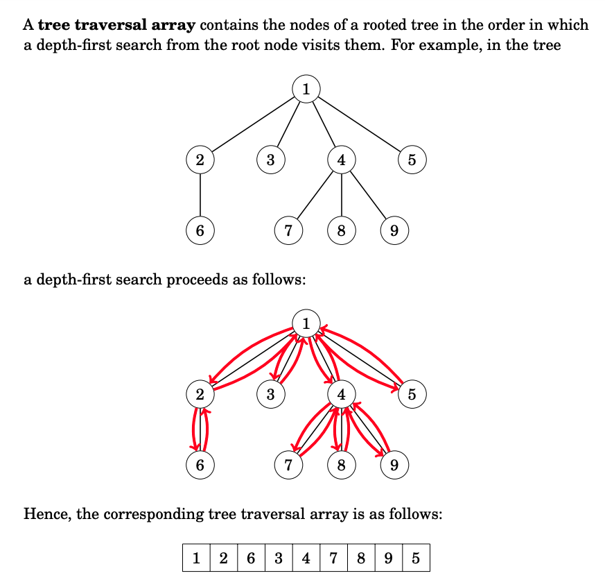
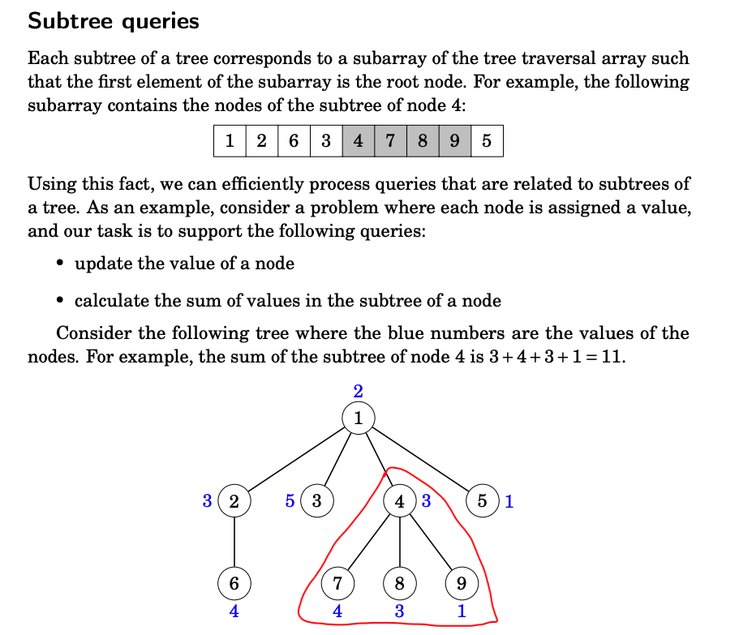
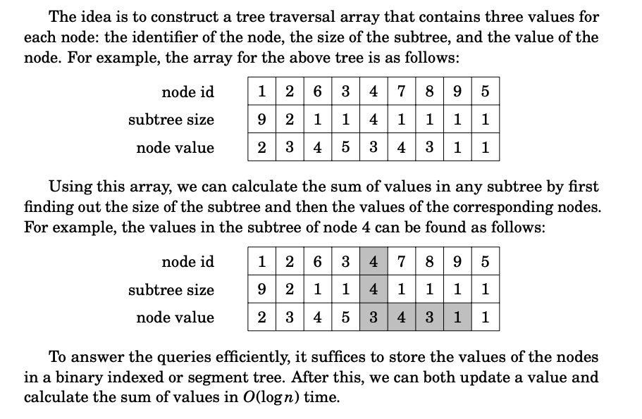
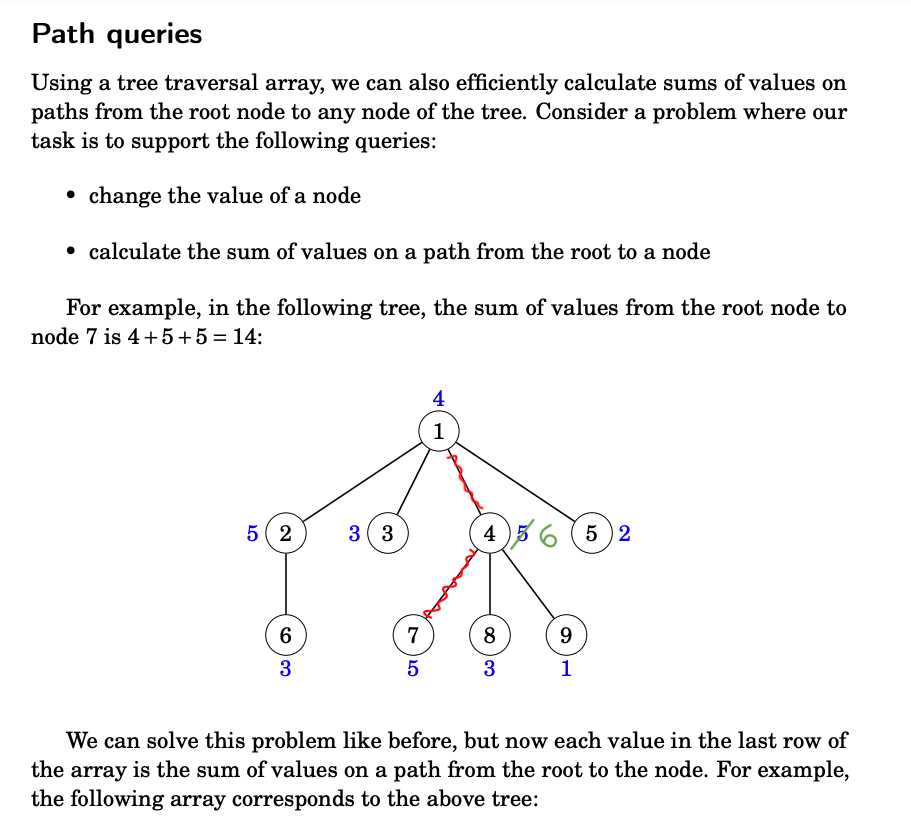
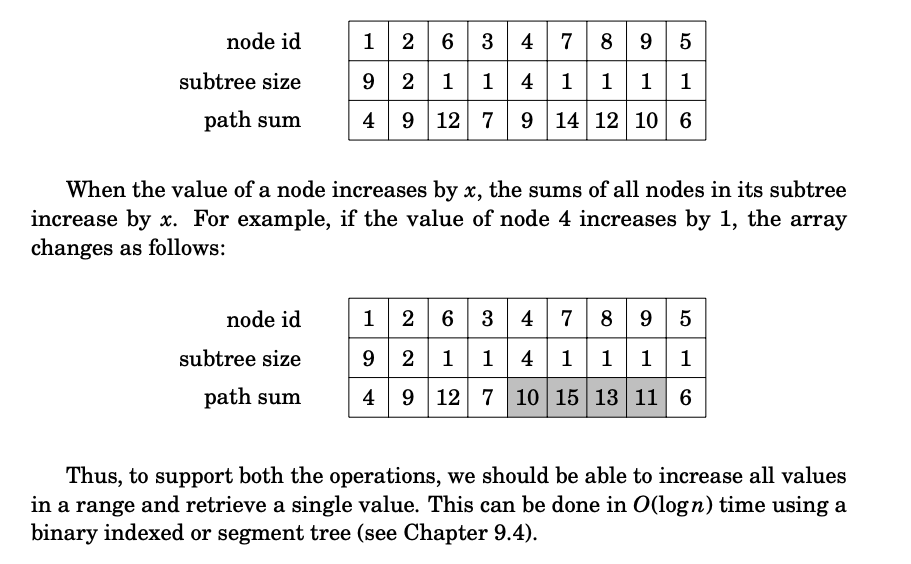
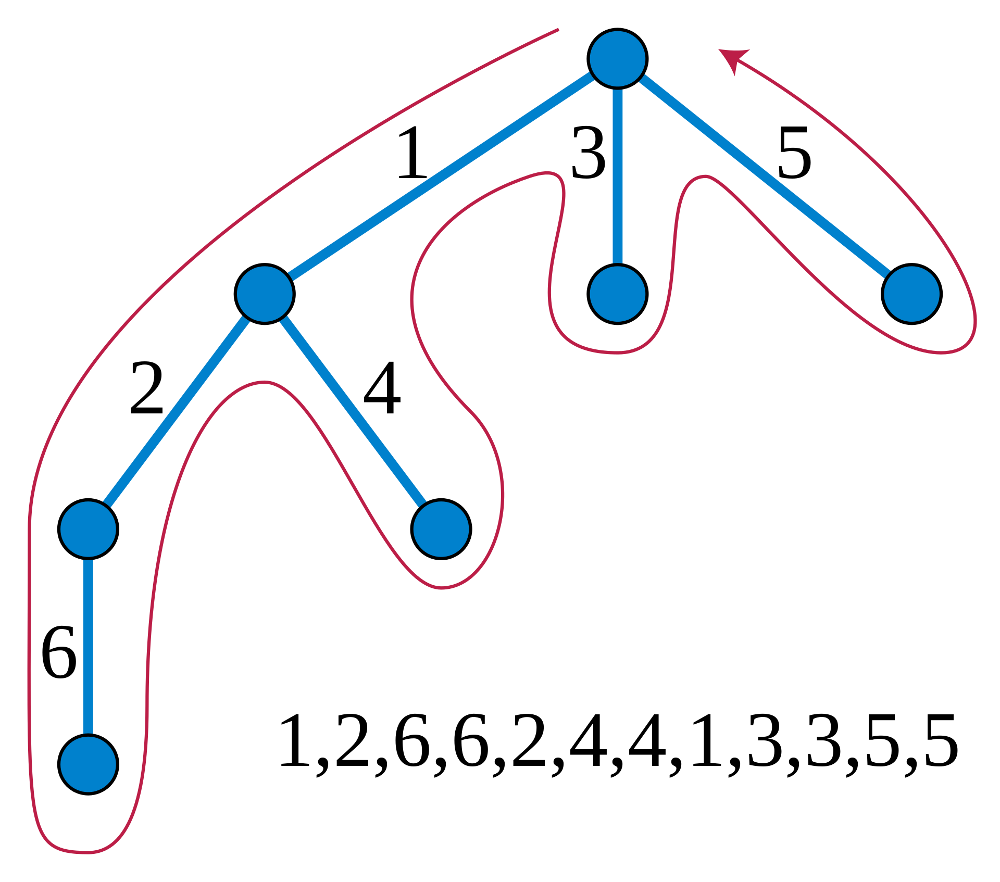

source: Competitive Programmer's Handbook - CSES

## Queries on Trees:

### Path Query and Update Problems
* **Path Query:** Given two nodes x, y - compute some function f(x, y) that depends on the path between nodes x & y.
  * Eg: sum, min, max, number of distinct elements etc.
* **Point Update:** Change the value for any one edge/node in the tree.
* **Path Range Update:** Change the value of all nodes/edges on a path.
  * Eg: Add x to all nodes in a path, take mod x for all nodes in a path etc.  

### Subtree Query and Update Problems
* **Subtree Query:** Given a node x - compute some function f(x) that depends on values of nodes/edges in the subtree of x
  * Eg: sum, min, max, number of distinct elements etc.
* **Point Update:** Change the value of any one edge / node in the tree
* **Subtree Range Update:** Change the value of all nodes/edges in the subtree of a node x.
  * Eg: Add "val" to all all nodes in the subtree of node x etc. 

### How to support Updates & Queries on a Tree?

* **Step-1:** Find a way to "Linaerize" the tree into an array.
  * **Heavy Light Decomposition:** Any path between (x, y) can be represented as concatenation of at-most logN different [L,R] ranges in the linearised array.
  * **Euler Tour Traversal:** Any subtree of a node x corresponds to a single range [L, R] in the linearised array.
* **Step-2:** Use one of the "standard" techniques to solve the update/query problem on the linearised tree.
  * Eg: Segment Trees, Square Root Decomposition etc. 

### Euler Tour Technique(ETT)

#### Way-1: Insert every node twice
* Insert every node/edge in the euler tour array whenever you enter/exit the node.
* Thereforce, everynode/edge of the tree will occur twice in the euler tour array - at indices `start[x]/in[x]` and `end[x]/out[x]` for a given node/edge x.

* A subtree of node x is represented by the continous range `[start[x], end[x]]`
* A path between the two nodes A & B contain nodes which occur exactly once in the continous range `[end[A], start[B]]` -- Useful for applying MO's on Trees where we can ignore an element y if it occurs twice in the range `[L, R]`. For example in case of Addition of path, When we see the node for the first time, we can add the element to sum and, when we see it the second time we can subtract thus nullifying the element which occurs twice in the range `[L, R]`.
