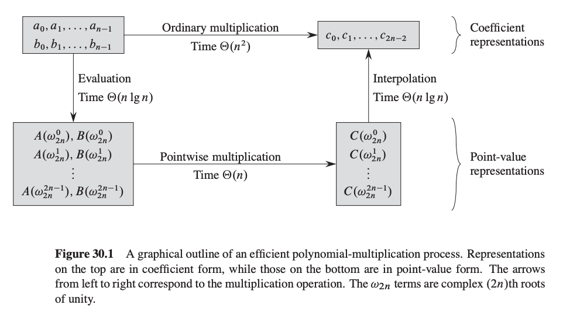
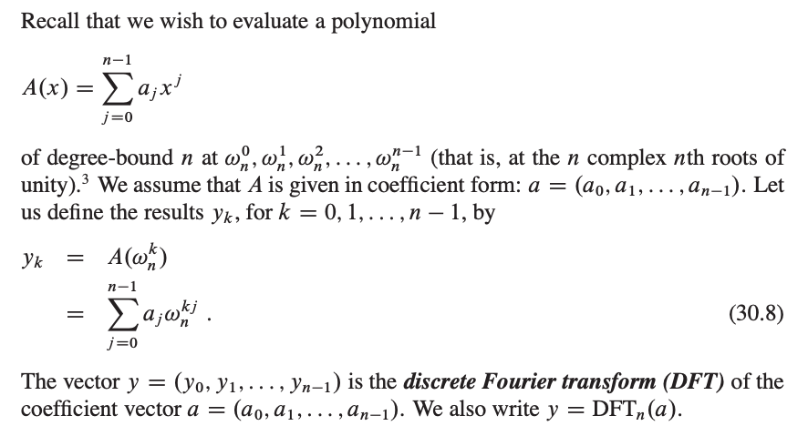
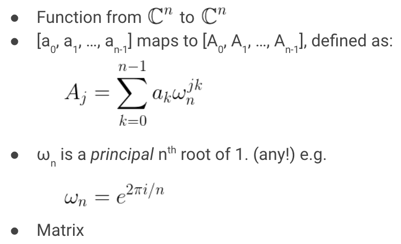
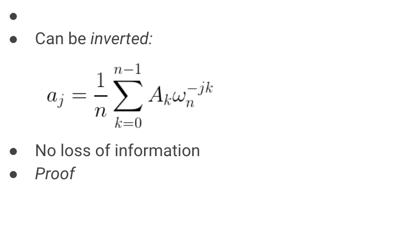
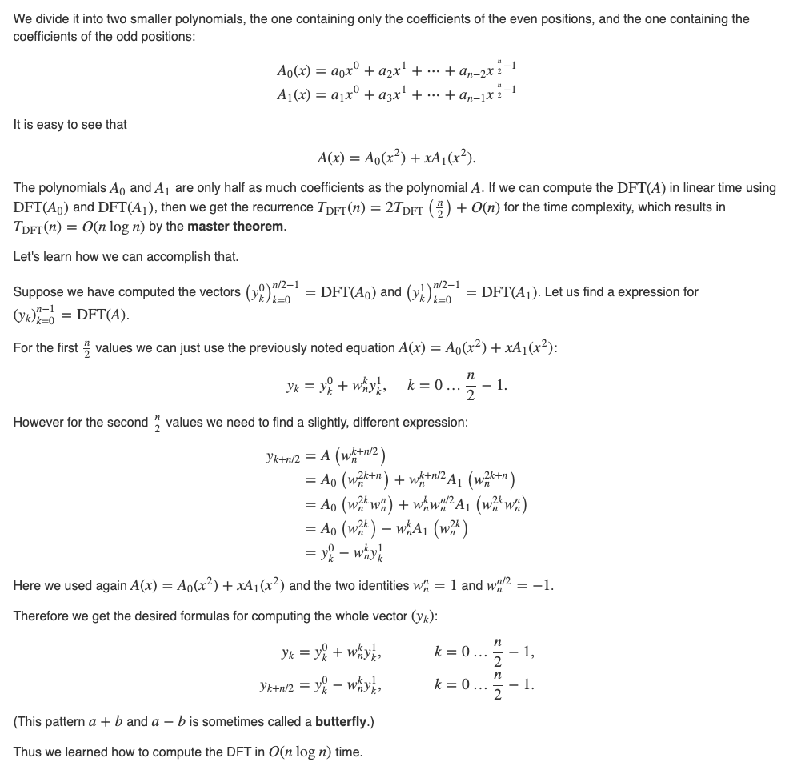
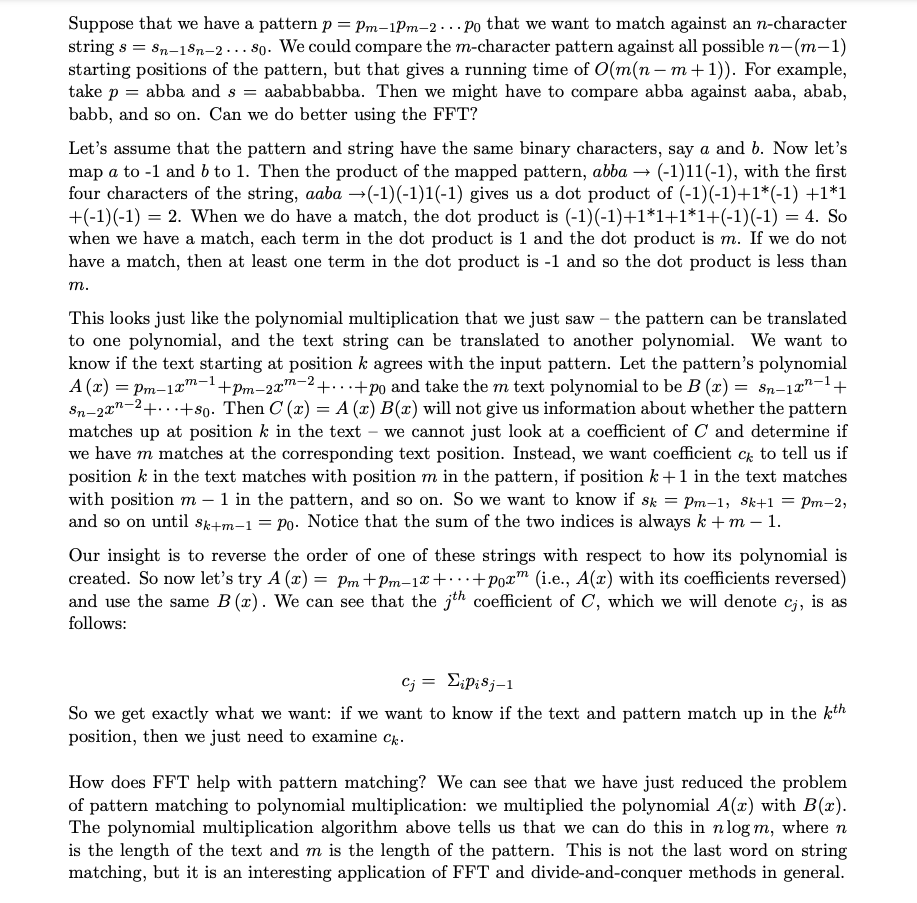
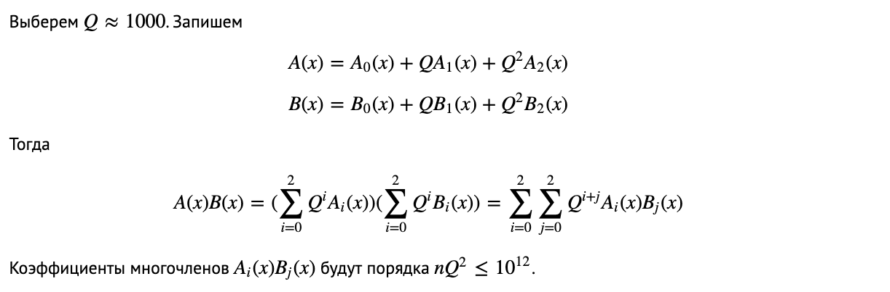

# Polynomials and the Fast Fourier Transform (FFT)

## MULTIPLYING POLYNOMIALS

E.g., multiply (x^2 + 2x + 3)(2x^2 + 5) = 

                    2x^2 + 0x + 5
                    1x^2 + 2x + 3
                    -------------
                    6      0   15  -> 3(2x^2 + 0x + 5)
             4      0      10
      2      0      5
     ----------------------------
      2x^4 + 4x^3 + 11x^2 +10x+15

MODEL: view each individual small multiplication as a unit cost operation.

Karatsuba method: We do three multiplication operations instead of four

    A.B = a_0b_0 + (a_0b_1+a_1b_0)x + a_1b_1x^2
        = a_0b_0 + [(a_0+b_0)(a_1+b_1) - a_0b_0 - a_1b_1]x + a_1b+1x^2

Straightforward computation is O(n^2) time.  Karatuba is n^{1.58..}

More generally, given

    A(x) = a_0 + a_1 x + ... + a_{n-1}x^{n-1},  
    B(x) = b_0 + b_1 x + ... + b_{n-1}x^{n-1}

Our goal is to compute the polynomial C(x) = A(x)*B(x).  

    c_i = a_0*b_i + a_1*b_{i-1} + ... + a_i*b_0.

If we think of A and B as vectors, then the C-vector is called the **convolution** of A and B.

## High Level Idea of Algorithm

Let m = 2n-1. [so degree of C is less than m]

1. Pick m points x_0, x_1, ..., x_{m-1} according to a secret formula.
2. Evaluate A at each of the points: A(x_0),..., A(x_{m-1}).
3. Same for B.
4. Now compute C(x_0),..., C(x_{m-1}), where C is A(x)*B(x)
5. Interpolate to get the coefficients of C.

This approach is based on the fact that a polynomial of degree < m is uniquely specified by its value on m points. It seems patently crazy since it looks like steps 2 and 3 should take O(n^2) time just in
themselves.  However, the FFT will allow us to quickly move from "coefficient representation" of polynomial to the "value on m points" representation, and back, for our special set of m points.  (Doesn't work for *arbitrary* m points.  The special points will turn out to be roots of unity).

The reason we like this is that multiplying is easy in the "value on m points" representation.  We just do: C(x_i) = A(x_i)*B(x_i).  So, only O(m) time for step 4.



GOAL: Given a polynomial A of degree < m, evaluate A at m points of our choosing in total time O(m log m).  Assume m is a power of 2.

## The FFT

Let's first develop it through an example.  Say m=8 so we have a polynomial 

    A(x) = a_0 + a_1 x + a_2 x^2 + a_3 x^3 + a_4 x^4 + a_5 x^5 + a_6x^6 + a_7x^7.
    (as a vector, A = [a_0, a_1, ..., a_7])

And we want to evaluate at eight points of our choosing.  Here is an idea.  

Split A into two pieces, but instead of left and right, have them be even and odd.  So, as vectors,
  A_even = [a_0, a_2, a_4, a_6]
  A_odd = [a_1, a_3, a_5, a_7]

or, as polynomials:

    A_even(x) = a_0 + a_2 x + a_4 x^2 + a_6 x^3
    A_odd(x)  = a_1 + a_3 x + a_5 x^2 + a_7 x^3.

Each has degree < m/2.  How can we write A(x) in terms of A_even and A_odd?

          A(x) = A_even(x^2) + x A_odd(x^2).

What's nice is that the effort spent computing A(x) will give us A(-x) almost for free.   So, let's say our special set of m points will have the property:

The 2nd half of points are the negative of the 1st half   (*)

E.g., {1,2,3,4,-1,-2,-3,-4}.

Now, things look good: Let T(m) = time to evaluate a degree-m polynomial at our special set of m points.  We're doing this by evaluating two degree-m/2 polynomials at m/2 points each (the
squares), and then doing O(m) work to combine the results. This is great because the recurrence T(m) = 2T(m/2) + O(m) solves to O(m log m).

But, we're deluding ourselves by saying "just do it recursively".

Why is that?  The problem is that recursively, our special points (now {1, 4, 9, 16}) have to satisfy property (*).  E.g., they should really look like {1, 4, -1, -4}.  BUT THESE ARE SQUARES!! How to fix?  Just use complex numbers!  E.g., if these are the squares, what do the
original points look like?

    {1, 2, i, 2i, -1, -2, -i, -2i}

so then their squares are: 1, 4, -1, -4
and their squares are: 1, 16

But, at the next level we again need property (*).  So, we want to have {1, -1} there.  This means we want the level before that to be {1, i, -1, -i}, which is the same as {1, i, i^2, i^3}.  So, for the original level, let w = sqrt(i) = 0.707 + 0.707i, and then  our original set of points will be:

    1, w, w^2, w^3, w^4 (= -1), 
    w^5 (= -w), w^6 (= -w^2), w^7 (= -w^3)

so that the squares are: 1, i, i^2 (= -1), i^3 (= -i)
and *their* squares are: 1, -1
and *their* squares are: 1

The "w" we are using is called the "primitive eighth root of unity"
(since w^8 = 1 and w^k != 1 for 0 < k < 8).

An nth root of unity is said to be primitive if it is not a mth root of unity for some smaller m, that is if

    z^n = 1 and z^m != 1 for m = 1, 2, 3, ..., n-1

In general, the mth primitive root of unity is the vector
w = cos(2*pi/m) + i*sin(2*pi/m)

### Alternatively, we can use MODULAR ARITHMETIC

E.g., 2 is a primitive 8th root of unity mod 17.
{2^0,2^1,2^2,...,2^7} = {1,2,4,8 16,15,13, 9}
                      = {1,2,4,8,-1,-2,-4,-8}.

Then when you square them, you get {1,4,-1,-4}, etc.
This is nice because we don't need to deal with messy floating-points.

## THE FFT ALGORITHM

Here is the general algorithm in pseudo-C:

Let A be array of length m, w be primitive mth root of unity.
Goal: produce DFT F(A): evaluation of A at 1, w, w^2,...,w^{m-1}.

```cpp
FFT(A, m, w)
{
  if (m==1) return vector (a_0)
  else {
    A_even = (a_0, a_2, ..., a_{m-2})
    A_odd  = (a_1, a_3, ..., a_{m-1})
    F_even = FFT(A_even, m/2, w^2)    //w^2 is a primitive m/2-th root of unity
    F_odd = FFT(A_odd, m/2, w^2)
    F = new vector of length m
    x = 1
    for (j=0; j < m/2; ++j) {
      F[j] = F_even[j] + x*F_odd[j]
      F[j+m/2] = F_even[j] - x*F_odd[j]
      x = x * w
  }
  return F
}
```

## The inverse of the FFT

Remember, we started all this by saying that we were going to multiply
two polynomials A and B by evaluating each at a special set of m points (which we can now do in time O(m log m)), then multiply the values point-wise to get C evalauated at all these points (in O(m)
time) but then we need to interpolate back to get the coefficients.
In other words, we're doing F^{-1}(F(A) \cdot F(B)).

So, we need to compute F^{-1}.  Here's how.

First, we can look at the forward computation (computing A(x) at 1, w, w^2, ..., w^{m-1}) as an implicit matrix-vector product:

```math
       +---------------------------------------+  +-----+    +-------+
       |  1   1    1     1   ...    1	       |  | a_0 |    | A(1)  |
       |  1   w    w^2   w^3 ... w^{m-1}       |  | a_1 |    | A(w)  |
       |  1   w^2  w^4   w^6 ... w^{2(m-1)}    |  | a_2 | == | A(w^2)|
       |  1   w^3  w^6   w^9 ... w^{3(m-1)}    |  | a_3 |    | A(w^3)|
       |          .....        .....           |  | ... |    | ...   |
       |  1 w^{-1} w^{-2} w^{-3} ... w         |  |a_m-1|    | ...   |
       +---------------------------------------+  +-----+    +-------+
```

(Note w^{m-1} = w^{-1} since w^m = 1)

(We're doing this "implicitly" in the sense that we don't even have
time to write down the matrix.)

To do the inverse transform, what we want is to multiply by the
inverse of the F matrix.  As it turns out, this inverse looks very
much like F itself.  In particular, notice that w^{-1} is also a
principal mth root of unity. Let's define \bar{F} to be the fourier
transform matrix using w^{-1} instead of w.  Then,

Claim:  F^{-1} = (1/m) * \bar{F}.  I.e., 1/m * \bar{F} * F = identity.

Proof:  What is the i,j entry of \bar{F} * F?  It is:

    1 + w^{j-i} + w^{2j-2i} + w^{3j-3i} + ... + w^{(m-1)j - (m-1)i}

   If i=j, then these are all = 1, so the sum is m.  Then when we
   divide by m we get 1.

   If i!=j, then the claim is these all cancel out and we get zero.
   Maybe easier to see if we let z = w^{j-i}, so then the sum is:

    1 + z + z^2 + z^3 + z^4 + ... + z^{m-1}.

   Then can see these cancel by picture.  For instance, try z = w, z = w^2.

   Or can use the formula for summations: (1 - z^m)/(1-z) = 0/(1-z) = 0.


So, the final algorithm is:

```cpp
    Let F_A = FFT(A, m, w)                        // time O(n log n)
    Let F_B = FFT(B, m, w)                        // time O(n log n)
    For i=1 to m, let F_C[i] = F_A[i]*F_B[i]      // time O(n)
    Output C = 1/m * FFT(F_C, m, w^{-1}).         // time O(n log n)
```

## Applications

FFT allows us to do a convolution of two vectors of length n in time O(n log n).

Def of convolution of A and B is vector C such that 

    C[i] = A[0]*B[i] + A[1]*B[i-1] + ... + A[i]*B[0].

E.g., if A and B are the vectors of coefficients of polynomials A(x) and B(x), then C gives the coefficients for the polynomial A(x)*B(x).

Uses: Consider the following problem.  You are given a string P of 1's and *'s (the 'pattern'), and a string T of 0's and 1's (the 'text').

You want to find all places where the pattern P appears in text T, where a star can match either a 0 or a 1.  For instance, if P = 11*1 and T = 10111101, then P appears twice in T: once starting at the 3rd position in T and once starting at the 5th position in T.

Say P has length n and T has length m, where m>n. There is a simple O(mn)-time algorithm to solve this problem: try all O(m) possible starting positions, and for each one, check in time O(n) to see if $P$ matches there.  

We can use the FFT to do this faster.  All we need to do is reverse P, change the *'s to zeroes (so in the above example, this would give us 1011), and then do a convolution with T.  We can then scan the result to see the positions where the value of C[i] equals the number of 1s in P.

## DFT



The discrete Fourier transform a sequence of N complex numbers into another sequence of complex numbers.




The Fast Fourier Transform is an efficient algorithm for computing the Discrete Fourier Transform. More specifically, FFT is the name for any efficient algorithm that can compute the DFT in about Θ(𝑛log𝑛) time, instead of Θ(𝑛2) time. There are several FFT algorithms.

    DFT(a_0, a_1, ..., a_{n-1}) = (y_0, y_1, ..., y_{n-1})


    InverseDFT(y_0, y_1, ..., y_{n-1}) = (a_0, a_1, ..., a_{n-1})

    (A.B)(x) = A(x).B(x)

This means that if we multiply the vectors DFT(A) and DFT(B) - by multiplying each element of one vector by the corresponding element of the other vector - then we get nothing other than the DFT of the polynomial DFT(A⋅B):

    DFT(A.B) = DFT(A).DFT(B)

    A.B = InverseDFT(DFT(A).DFT(B))

On the right the product of the two DFTs we mean the pairwise product of the vector elements. This can be computed in O(n) time. If we can compute the DFT and the inverse DFT in O(nlogn), then we can compute the product of the two polynomials (and consequently also two long numbers) with the same time complexity.

## FFT



## Recursive Implementation

```cpp
poly FFT(poly P){
    if (degree(P) == 1)
        return P[0]; // a0 * (cos(0) + i * sin(0)) = a0
    P0 = split_even(P); // a0, a2, a4, ...
    P1 = split_odd(P); // a1, a3, a5, ...
    S0 = FFT(P0);
    S1 = FFT(P1);
    
    step = cos(2*PI/degree(P)) + i * sin(2*PI/degree(P));
    w = 1;
    
    for (k = 0; k < degree(P) / 2; k++) {
        answer[k] = S0[k] + w * S1[k];
        answer[k + degree(P) / 2] = S0[k] - w * S1[k];
        w = w*step; 
    }
    return answer;
}
```

## Iterative Implementation

To increase the efficiency we will switch from the recursive implementation to an iterative one. In the above recursive implementation we explicitly separated the vector a into two vectors - the element on the even positions got assigned to one temporary vector, and the elements on odd positions to another. However if we reorder the elements in a certain way, we don't need to create these temporary vectors (i.e. all the calculations can be done "in-place", right in the vector A itself).

For example the recursion for n=8 has the form:

    a = {[a_0, a_2, a_4, a_6], [a_1, a_3, a_5, a_7]}
    a = {[(a_0, a_4), (a_2, a_6)], [(a_1, a_5), (a_3, a_7)]}

In which order elements are are used?

    000, 100, 010, 110, 001, 101, 011, 111 - Binary representation

As we see, in the **bit-reversal permutation** this corresponds to simply dividing the vector into two halves: the first n/2 elements and the last n/2 elements.

The order of recursion is the following

    0, 1, ..., 2^{k-1}, 2^{k-1}+1,..., 2^k -1
    [0, 2, ..., 2^k -2], [1, 3, ..., 2^k -1]
    [(0, 4, ..., 2^k-4), (2, 6, ..., 2^k-2)], [(), ()]
    ...
    [(0, 2^k - 2^{k-1})], ...

After k level recursion we'll have (2^k - 2^{k-1}) = 2^{k-1}

    id                  binary              reversed binary
    0               <‐‐ 00000000000     <‐‐ 00000000000
    2^{k‐1}         <‐‐ 10000000000     <‐‐ 00000000001
    2^{k‐2}         <‐‐ 01000000000     <‐‐ 00000000010
    2^{k‐1}+2^{k‐2} <‐‐ 11000000000     <‐‐ 00000000011

Thus, after applying the bit-reversal permutation, we can compute the DFT in-place, without any additional memory.

```cpp
poly Permute(poly P){
    for (i = 0; i < degree(P); i++)
        anwer[ reverse_bits(i) ] = P[i];
    return answer;
}

poly FFT(poly P){
    P = Permute(P);
    for (len = 1; 2 * len <= degree(P); len <<= 1) {
        step = cos(PI/len) + i * sin(PI/len);
        
        for (i = 0; i < degree(P); i += 2 * len) {
            w = 1;
            
            for (j = 0; j < len; j++) {
                u = P[i + j];
                v = P[i + len + j];
                P[i + j] = u + w * v;
                P[i + len + j] = u - w * v;
                w = w * step;
            }
        }
    }
    
    return P;
}
```

### Reverse bits quickly

```python
rev[0] = 0
for i in 1 .. N‐1:
    rev[i] = (rev[i >> 1] >> 1) + ((i & 1) << (logN ‐ 1))
```

## Non-recursive realization

Now, let's write code that will run all calculations of fft ‐tree from bottom to top

```python
fft(a, f): # calculate results of A and store in F
    # reversed order
    for i in 0 .. N‐1:
        f[i] = a[rev[i]]

    for (k = 1; k < N; k = k * 2):
        for (i = 0; i < N; i = i + 2 * k):
            for j in 0 .. k‐1:
                z = root(2*PI*j/(2*k)) * f[i + j + k]
                f[i + j + k] = f[i + j] ‐ z
                f[i + j] = f[i + j] + z
```

fft became much shorter

## Number Theoretic Transform

The number theoretic transform is based on generalizing the Nth primitive root of unity to a 'quotient ring' instead of the usual field of complex numbers.

In a number theoretic transform, w is a integer which satisfies `w^n = 1 (mod p)` where p is a prime integer.

From number theory, for each prime number p there exists atleast one primitive root r such that r^n (mod p) visits all of the numbers 1 through p-1 in some order, as n goes from 1 to p-1. It is known that in each such field there is generating element g such that set of its powers equals set of field elements except zero.

Since m^{p-1} = 1 (mod p) for all integers m (Fermat's little theorem), r is also a Nth root of unity, where N = p-1 is the transform size. (More generally, N can be any integer divisor L of p-1, in which case we use w = r^L as the generator of the numbers participating in the transform.)

The objective of NTT is to multiply 2 polynomials such that the coefficient of the resultant polynomials are calculated under a particular modulo. The benefit of NTT is that there are no precision errors as all the calculations are done in integers.
A major drawback of NTT is that generally we are only able to do NTT with a prime modulo of the form `2^k.c + 1`, where k and c are arbitrary constants. So for doing it for a random mod we need to use CRT(Chinese Remainder Theorem).

### Algorithm

Firstly, nth roots of unity under a primitive field, i.e mod P are defined as z^n = 1 mod P, where P is only considered as prime for simplicity.

Assume that P = 2^k.c + 1, where c, k are positive integers and P is prime.

So we first find a r such that r^x (mod P) goes through all the numbers from 1 to P - 1 when x goes from 1 to P - 1.

r^{P-1} = 1 mod P implies that the (2^k)th root of unity under modulo field of P will be r^c, because `(r^c)^{2^k} = r^{2^k.c} = r^{P-1} = 1`

The powers will be as (r^c)^0 = 1 mod P, (r^c)^1 mod P, (r^c)^2 mod P, ..., (r^c)^{2^k-1} mod P

Lemma 1 => (r^c)^x != 1 mod P when 1 <= x <= 2^k because r is primitive root of unity.

Lemma 2 => Let `(r^c)^x = (r^c)^y mod P` where x!=y and both both lie between [0, 2^k) then r^{c.x} = r^{c.y} mod P, then
(r^c)^{x}.r^c = (r^c)^{y}.r^c, similarly (r^c)^{x+q} = (r^c)^{y+q} where q is an integer. We know (r^c)^(2^k) = 1 mod P, so if we use q = 2^k - x, we get (r^c)^{x+q} = (r^c)^{2^k} = 1 = (r^c)^{y+q} mod P, where y+q != 2^k because x != y, this is a contradiction. So, r^c is now primitive root under mod P.

Now the only difference between NTT and FFT will be that the nth root of unity changes from w to r^c, where r is found by hit and trial method.

## String matching using FFT




## Umnik's blog

Normal FFT would use complex numbers, if all the coefficients of the given polynomial are real, could we do something better?
The point is that we need `n` different roots of `1` which real numbers cannot provide. If only there was a way with such properties...

As we know from Number theory, nonzero remainders module a prime numner P form a cyclic group of order P-1 by multiplication.
Let P-1 is divisible by a sufficiently large power of two, then this group also has n different roots of `1`, and they also have all the properties we need.

Thus we can perform all operations modulo P, and complex roots from one needs to be replaced with roots of one modulo P.

```cpp
typedef long long ll;
const ll MOD = 998244353; // most popular "good" prime number
ll add(ll x, ll y)
{
	x += y;
	if (x >= MOD) return x - MOD;
	return x;
}
ll sub(ll x, ll y)
{
	x -= y;
	if (x < 0) return x + MOD;
	return x;
}
ll mult(ll x, ll y)
{
	return (x * y) % MOD;
}
ll binPow(ll x, ll p)
{
	if (p == 0) return 1;
	if (p == 2 || (p & 1)) return mult(x, binPow(x, p - 1));
	return binPow(binPow(x, p / 2), 2);
}
ll modRev(ll x)
{
	return binPow(x, MOD - 2);
}

const int LOG = 18;
const int N = 1 << LOG;
ll w[N + 5];
int rev[N + 5];

void initFFT()
{
	// finding root
	ll W = -1;
	for (ll x = 2;; x++)
	{
		ll y = x;
		for (int i = 1; i < LOG; i++)
			y = mult(y, y);
		// y = x ** (n / 2)
		// so, y != 1
		// but y ** 2 == 1
		if (y == MOD - 1)
		{
			W = x;
			break;
		}
	}
	if (W == -1) throw;
	w[0] = 1;
	for (int i = 1; i < N; i++)
		w[i] = mult(w[i - 1], W); // no precision errors now

	int k = 0;
	rev[0] = 0;
	for (int mask = 1; mask < N; mask++)
	{
		if (mask >> (k + 1)) k++; // k - the most significant bit of mask
		rev[mask] = rev[mask ^ (1 << k)] ^ (1 << (LOG - 1 - k));
	}
}

ll F[2][N]; // maintain two layers
void FFT(ll *A, int k) // n = (1 << k)
{
	int L = 1 << k;
	// rearrange coefficients
	for (int mask = 0; mask < L; mask++)
		F[0][rev[mask] >> (LOG - k)] = A[mask];
	int t = 0, nt = 1; // t - current, nt - new
	for (int lvl = 0; lvl < k; lvl++)
	{
		int len = 1 << lvl;
		for (int st = 0; st < L; st += (len << 1))
			for (int i = 0; i < len; i++)
			{
				ll summand = mult(F[t][st + len + i], w[i << (LOG - 1 - lvl)]);
				F[nt][st + i] = add(F[t][st + i], summand);
				F[nt][st + len + i] = sub(F[t][st + i], summand);
			}
		swap(t, nt); // change layers
	}
	for (int i = 0; i < L; i++)
		A[i] = F[t][i];
}

vector<ll> multiply(vector<ll> A, vector<ll> B)
{
	int sz1 = (int)A.size(), sz2 = (int)B.size();
	int k = 0;
	// deg(A) = sz1 - 1, deg(B) = sz2 - 1, deg(AB) = sz1 + sz2 - 2
	while((1 << k) < (sz1 + sz2 - 1)) k++;
	int L = 1 << k;
	ll C[L], D[L];
	for (int i = 0; i < L; i++)
		C[i] = D[i] = 0;
	for (int i = 0; i < sz1; i++)
		C[i] = A[i];
	for (int i = 0; i < sz2; i++)
		D[i] = B[i];
	FFT(C, k);
	FFT(D, k);
	for (int i = 0; i < L; i++)
		C[i] = mult(C[i], D[i]);
	FFT(C, k);
	reverse(C + 1, C + L);
	vector<cd> res;
	res.resize(sz1 + sz2 - 1);
	// important change here
	// we should divide by L modulo MOD
	ll rL = modRev(L);
	for (int i = 0; i < sz1 + sz2 - 1; i++)
		res.push_back(mult(C[i], rL));
	return res;
}
```

source: <https://um-nik.github.io/fft>

In programming competitions, if you see an "unusual modulo" in a problem, it can be a strong hint that the problem requires and FFT. Here is a short list of common "unusual modulos" suitable for FFT

* 7340033 = 7⋅2^20 + 1,
* 998244353 = 119⋅2^23 + 1.

If we are given any modulo, there there are two different approaches to sovle this:

* Some good modulo + Chinese Remainder Theorem
  We can perform 3 different good modulo, and then find out the required coefficents using the CRT.
* Split into polynomials wiht lower coefficients.
  Let's choose Q ≈ 1000.



TODO: https://csacademy.com/blog/fast-fourier-transform-and-variations-of-it/
TODO: https://alan20210202.github.io/2020/08/07/FWHT/
