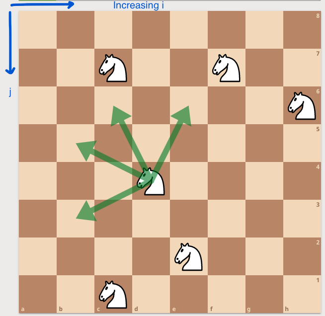
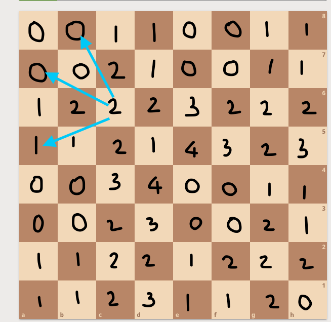

## Game Theory

Formal study of mathematical games. The ultimate goal of game theory is usually to solve a game; that is, to determine the nature of an optimal strategy for each player, and the outcome of such a strategy.

### State
* The state, position, or configuration of a game, loosely put, consists of exactly that information which determines the valid moves that can be made in the future and is itself modified when moves take place.

### Determinism
* A deterministic game is one in which the decisions of the players, reflected in the moves they make, are sufficient to determine the game's outcome. The opposite is an indeterministic game. More simply, "games of chance" are nondeterministic, whereas pure strategy games with no element of chance are deterministic. Chess, for example, is a deterministic game, whereas backgammon(involves roll of two dice) is not. 
* In a deterministic game, the state, taken together with the players' strategies, is sufficient and necessary to determine the game's outcome. In a nondeterministic game, the same combination is sufficient and necessary to determine the probabilities of the possible outcomes of the game.

### Availability of information
* When all players know the entire state of a game at any given time, the game is said to be perfect information. Perfect information games include chess, Go, and tic-tac-toe. In particular, games which have winning strategies for one of the players tend to be perfect-information. Imperfect information games include most card games, as each player usually hides cards from opponents.

### Partiality

* An impartial(or nonpartisan) game is one which satisfies two conditions:
  * The valid moves from a given position depend only upon the position itself and not upon which player is to move next.
  * The outcome of the game is symmetric with respect to the players.
* Most games fail the first condition. Chess(each player has a different set of possible moves from a given position), for example, fails the first, since we must know if the player moving next is player 1 or player 2 to determine whether that player is to move a white piece or a black piece.
* An impartial game is one in which the only difference between the two players is that one goes first (in particular, there can be no pieces “belonging” to one player). Set of moves available from any given position is the same for both players.
* Nim is a archetype for the impartial game; pieces are shared between the two players and each has the same goal.
* Impartial games can be studied by classifying all possible positions into winning and losing positions

### Play convention

* An important class of games consists of those between two players in which there are only two possible outcomes: victory and loss. If the winner is the last player who is able to make a legal move, the game is said to follow the normal play convention. Otherwise, it is said to follow the misère play convention.

If, in addition to being deterministic, impartial, and guaranteed to end in a finite number of moves, a game is also normal play, it can be analyzed using the **Sprague-Grundy theorem**. We shall denote such games as Nim-like.

source: http://wcipeg.com/wiki/Game_theory

## N-positions and P-positions

In a two-player, deterministic(no chance moves), impartial game which is guaranteed to end(win-or-lose outcome) in a finite number of moves, an N-position is a configuration such that the **n**ext player(and so it is a win for the Next player—hence the “N”) to make a move can force victory, and a P-position is a configuration such that the **p**revious player who moved can force victory.

In a normal-play game, a configuration in which no further moves are possible is a P-position, since the player who is supposed to move next cannot do so and loses; in a misère-play game, it is an N-position, since the player who moved last made the last move and hence lost.

Consider a configuration C of such a game and the configurations C_1, C_2, C_3, ... reachable from it. 
* If at least one of C_1, C_2, C_3, ... is a P-position, then the player presented with configuration C wants to make the move that results in that configuration, so that he or she becomes the previous player when the next player is to move --- guaranteeing victory. This makes C a N-position. 
* If all of C_1, C_2, C_3, ... are N-positions, then no matter what move the current player makes, the next player can force victory, making C a P-position. 

In summary,
* If all positions reachable in one move from position C are N-positions, then C is a P-position, and the current player does not have a winning strategy.
* Otherwise (at least one P-position is reachable from C) C is an N-position, and a winning strategy necessarily entails leaving behind one of these P-positions for the next player.

The problem [Nukit](https://wcipeg.com/problem/ccc08j5) from the 2008 Canadian Computing Competition describes a game which is clearly two-player, deterministic, impartial, and guaranteed to end in a finite number of moves. Because of these properties we may analyze it with N-positions and P-positions.

### Basic problem 
A simple example is the following game, played by two players who take turns moving. At the beginning there are `n` coins. When it is a player’s turn he can take away `1`, `3` or `4` coins. The player who takes the last one away is declared the winner (in other words, the player who can not make a move is the loser). The question is: For what `n` will the first player win if they both play optimally?

Positions have the following properties:
* All terminal positions are losing.
* If a player is able to move to a losing position then he is in a winning position.
* If a player is able to move only to the winning positions then he is in a losing position.

These properties could be used to create a simple recursive algorithm WL-Algorithm:

```cpp
boolean isWinning(position pos) {
    moves[] = possible positions to which I can move from the position pos;
    for (all x in moves)
        if (!isWinning(x)) return true;
    return false;
}
```

No cycles in the state transitions – Can solve the problem bottom-up (DP)

It can be seen that whether a position is winning or losing depends only on the last `k` positions, where `k` is the maximum number of coins we can take away. While there are only `2^k` possible values for the sequences of the length `k`, our sequence will become periodic. 

You can use this observation to solve [SRM 330: LongLongNim](https://community.topcoder.com/stat?c=problem_statement&pm=6856)

The way to solve the game is pretty easy. Since there are no ties and the game is always finite, we know that for each n either there is a winning strategy for the first player or there is a winning strategy for the second player. We'll call n a winning (W) state if the player in turn wins when n coins are left and losing (L) otherwise. Of course all n that are less than the minimum element in moves are L. Then, each n is W if and only if there exists an element m in moves that is less than or equal to n and such that n-m is L (this means, there is a valid play that leaves a losing state to your rival). This leads to a straightforward implementation which gets the fact calculated for every n in `O(maxN*k)` where k is the number of elements on moves (the k factor could even be eliminated by doing bit tricks). Since maxN is insanely big, we need something even better.

The first thing to notice in the constraints is the 22 as the maximum move. This was a big clue to the solution. As you can see from the previous paragraph, each n only depends on the previous states n-m with m in moves. Since the maximum m is 22, we can say n depends in the state of n-1, ...,n-22. This can be represented as a 22 character long string of W's and L's (or as a binary number). Not only n depend only on that 22 character long string, the entire behavior from that moment on depends only on those 22 characters, because the string in which n+1 depends is simply appending the state of n at the end and removing the first character (that becomes unnecessary, because is more than 22 away from n>+1). Altogether, this means that after at most 2^22 numbers there's an indentifiable cycle, which can be used to calculate the rest of the moves without doing all the process. See Petr's code for a clear implementation.

```java
public class LongLongNim {
    public int numberOfWins(int maxN, int[] moves) {
        int mask = (1 << 22) - 1;
        int res = -1;
        Dictionary < int, int > last = new Dictionary < int, int > ();
        List < int > r = new List < int > ();
        for (int i = 0; i <= maxN; ++i) {
            mask <<= 1; // mask = mask * 2, left shift
            ++res;
            foreach(int j in moves)
            if ((mask & (1 << j)) == 0) // atleast one losing position
            {
                ++mask; // set 0-th bit to 1
                --res;
                break;
            }
            mask &= (1 << 22) - 1; // only consider the last 22 bits
            if (last.ContainsKey(mask)) {
                int pLength = i - last[mask]; // cycle length
                int cnt = (maxN - i) / pLength;
                i += cnt * pLength;
                res += cnt * (res - r[last[mask]]);
            }
            last[mask] = i;
            r.Add(res);
        }
        return res;
    }
}
```

### THE GAME OF NIM

The rules of the game are as follows:

* The game board consists of one or more piles of coins or sticks.
* On a player's turn, he or she chooses one non-empty pile and removes one or more sticks from it.
* The first player who cannot make a move loses. (That is, the player who takes the last stick wins.)

Suppose that there are two players `A`, `B` and three heaps with `3`, `4` and `5` coins respectively. Here is how game could develop if `A` moves first:


#### Analysis

* **Single Pile:** If we have onle one pile, we can just remove all the chips from that pile and win. A sigle pile is thus an N-position.
* **Two Piles:** If we have two piles, with an equal number of `x` coins in the two piles. Let's denote this by `(x, x)`. Then whatever the first player plays, say removing some chips from the first pile to make it `(y, x)`, the second player can mirror the strategy to make it `(y, y)` again. So first player loses, and hence `(x, x)` is a P-position. And since any position `(x, y)` with `x > y` can move to `(y, y)`, this is a N-position. So in two-pile nim, we have a P-position if and only if both piles are equal.
* **Three Piles:** We now consider positions `(x, y, z)`. If any of these were zero, we would have two piles, so consider `x, y, z > 0`. If two piles are equal - say `(x, x, z)` - we would empty out the third to get `(x, x, 0)`, which is a P-position. So `(x, x, z)` is an N-position. What if `x ≠ y ≠ z`, it will bit difficult to analyze this. Bouton’s Theorem: The position (x, y, z) is a P-position if and only if `x ⊕ y ⊕ z = 0`

Let n1, n2, n3, ... nk be the size of the piles. It is a losing position for the player whose turn it is if and only if `n1 xor n2 xor ... xor nk = 0`.

#### Why does it work?

* From the losing positions we can move only to the winning ones:
  * if xor of the sizes of the piles is 0 then it will be changed after our move (at least one 1 will be changed to 0, so in that column will be odd number of 1s). Say we have `x1 ^ x2 ^ ... ^ xk = 0` and a player takes coins such that the coins in pile 1 become y1 then `y1 ^ x2 ^ ... ^ xk ≠ 0` as `y1 < x1`.
  * If the Nim-sum is 0 after a player’s turn, then the next move must change it.

* From the winning positions it is possible to move to at least one losing:
  * if xor of the sizes of the piles is not 0 we can change it to 0 by finding the left most column where the number of 1s is odd, changing one of them to 0 and then by changing 0s or 1s on the right side of it to gain even number of 1s in every column. Say we have `w = x1 ^ x2 ^ ... ^ xk ≠ 0`. Let i-th bit be the highest bit set in `w`. There is atleast one `xj` which have i-th bit set. Now choose `y = xj xor w`, `y < xj` as the highest bit will now be unset in `yj`. And the xor value will now be zero.
  * Thus it is always possible to make the nim-sum 0 on your turn if it wasn’t already 0 at the beginning of your turn.

#### Dynamic pile problem
The game of 'static' one-pile nim is well understood. These are called subtraction games. A pile of n counters and a constant k are given. Two players alternately take from 1 up to k counters from the pile. The winner is the last player to remove a counter.

Dynaic one-pile nim, A move in a game is an ordered pair of positions `(N,x) —> (N — k, f(k))`, where `1 < k < min{N, x}`. problem where `f(k) = k` https://csacademy.com/contest/round-64/task/limited-moves/statement/. 

An infinite increasing sequence `B = (b0 = 1, b1, b2, ...)` of positive integers is called an infinite g-base if for each k > 0, `b_{k+1} ≤ bk`.

**Th:** Suppose the dynamic one-pile nim game with initial position `(N,x)` and move function/satisfying `f(n+1) - f(n) ≥ 1` is given, and the g-base Bf is infinite. Also, let `N = b1 + b2 + ... + bk` be the stable representation of N in Bf, where `b1 < b2 < ... < bk`. Then the first player can win if `x > b1` and the second player can win if `x < b1`. 

Proof in Research Paper: Holshouser [DYNAMIC ONE-PILE NIM](https://www.mathstat.dal.ca/FQ/Scanned/41-3/holshouser.pdf)

Solution:

In order to find the winning strategy we can run a dynamic programming for smaller values of NN and check which are the winning states; it turns out the first player can win for all `N` that are not a power of `2`. However, we still need to:

* prove this is true
* find an optimal playing strategy

It helps to consider the binary representation of `N`. The strategy for the first player is to choose a power of `2` that removes the first significant bit in `N`'s representation. In the next turn, whatever he does, the second player will increase the number of bits of `1` in the representation.

If n is odd then we win by removing 1. So no one will move to odd n and the game will be always on even numbers. But now we can divide all numbers by 2 and repeat our argument. It is easy to see that this strategy is exactly 'remove last 1-bit'. https://codeforces.com/blog/entry/57075?#comment-407190

## Grundy numbers

Let G be an impartial game. The Grundy number of a position P in G is
* If P is a final position (from which no further move is possible), it has Grundy number 0
* Otherwise the Grundy number is the minimum nonnegative integer that is not a Grundy number of any position that can be attained by making one move from P.

Ever finite 2-person impartial games with perfect information can be converted into an equivalent Nim game using the Grundy Numbers. 

For one pile games: Let G be an impartial game, and let g be its Grundy function. Then P is a winning position for player I whenever g(P) > 0, and P
is a winning position for player II whenever g(P) = 0.

* Let g be the Grundy function of an impartial game G. Let P, P' be positions in G such that you can get from P to P' in one move. Then g(P) ≠ g(P'). This follow because g is mex(minimum exclusion number).

Here are Grundy numbers for (1, 3, 4)-NUM for upto 21 stones.

```
0 1 2 3 4 5 6 7 8 9 10 11 12 13 14 15 16 17 18 19 20 21
0 1 0 1 2 3 2 0 1 0  1  2  3  2  0  1  0  1  2  3  2  0
```

The sequence is periodic with repeating pattern 0, 1, 0, 1, 2, 3, 2.

Here are the Grundy numbers for (2, 4, 7)-NIM (where each player can remove 2, 4, or
7 stones) up to 21 stones. 

```
0 1 2 3 4 5 6 7 8 9 10 11 12 13 14 15 16 17 18 19 20 21
L L W W W W L W W L  W  W  L  W  W  L  W  W  L  W  W  L
0 0 1 1 2 2 0 3 1 0  2  1  0  2  1  0  2  1  0  2  1  0
```

The sequence is eventually periodic with repeating pattern 1, 0, 2. Notice that it has an initial segment of length 8, as compared to length 4 when we
looked only at win/loss information (W, W, L) pattern.

### Composite games - Grundy numbers

Example game: Consider N x N chessboard with K knights on it. Unlike a knight in a traditional game of chess, these can move only as shown in the picture below (so the sum of coordinates is decreased in every move). There can be more than one knight on the same square at the same time. Two players take turns moving and, when it is a player’s, turn he chooses one of the knights and moves it. A player who is not able to make a move is declared the loser.



This is the same as if we had K chessboards with exactly one knight on every chessboard. This is the ordinary sum of K games and it can be solved by using the grundy numbers. We assign grundy number to every subgame according to which size of the pile in the Game of Nim it is equivalent to. When we know how to play Nim we will be able to play this game as well.

```cpp
int grundyNumber(position pos) {
    moves[] = possible positions to which we can move from pos
    set s;
    for(all x in moves) insert into s grundyNumber(x);
    //return the smallest non-negative integer not in the set s;    
    int ret = 0;
    while(s.contains(ret)) ret++;
    return ret;
}
```

The following table shows grundy numbers for an 8 x 8 board:



TODO: https://atcoder.jp/contests/abc206/tasks/abc206_f

#### Problem: https://atcoder.jp/contests/abc195/tasks/abc195_e

**Solution:** 

Let us consider if Takahashi is possible to win after the N − 1 rounds. Let us regard `T` as a decimal number and `r` be the remainder by 7 . 

Also, we identify S<sub>N</sub> with the corresponding digit. 

If X<sub>N</sub> is `T`, then Takahashi will win if either 10r or 10r + S<sub>N</sub> is a multiple of 7 . 

If X<sub>N</sub> is `A`, then Takahashi will win if both 10r and 10r + S<sub>N</sub> are multiples of 7 . 

As you can see, we can define the following DP, in the reversed order. 

dp[i]=The set of integers r that satisfies the following condition, where Condition: if the remainder of T divided by 7 is r after the i<sup>th</sup> round end, 
Takahashi will win 

The initial state is dp[N] = { 0 }. 

The transitions are

dp[i−1] = { r | ( 10r mod 7 ) ∈ dp[i]  or ( 10r + S<sub>i</sub> mod 7 ) ∈ dp[i]}  if X<sub>i</sub> is `T`, 

dp[i−1] = { r | ( 10r mod 7 ) ∈ dp[i] and ( 10r + S<sub>i</sub> mod 7 ) ∈ dp[i]}  if X<sub>i</sub> is `A`,


If 0 ∈ dp[0] at last, Takahashi wins; otherwise, Aoki wins. The time complexity is O(N) .

## TODO: 

Dynamic subtraction: https://www.cs.cmu.edu/afs/cs/academic/class/15859-f01/www/notes/comb.pdf 

Check: https://web.mit.edu/sp.268/www/nim.pdf

## REF:
* http://www.cs.umd.edu/~gasarch/COURSES/250/S15/nimnotes.pdf
