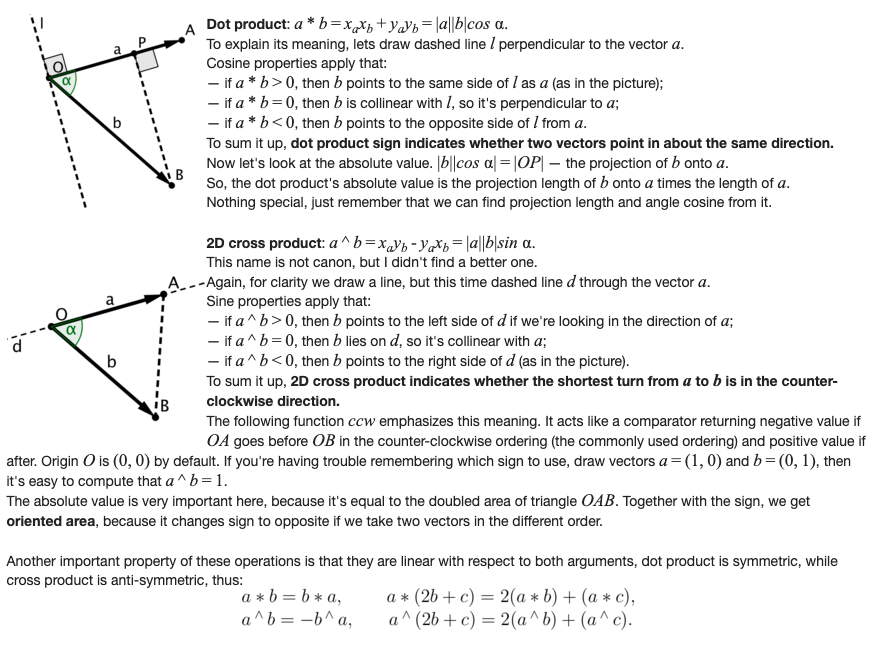
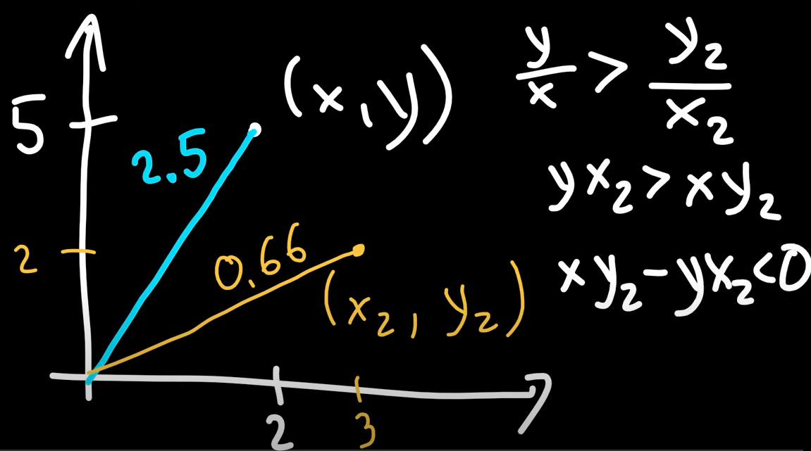
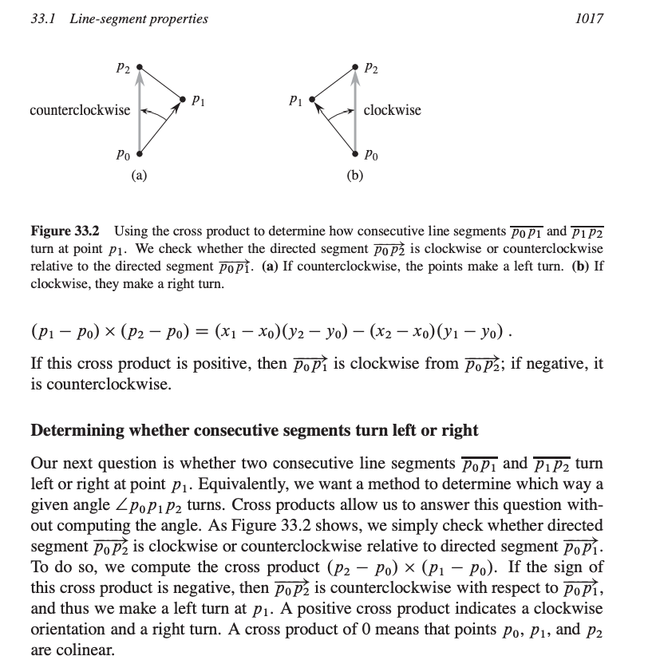

# Computational Geometry

## Dot product and Cross product

Dot product and Cross product are the main building blocks for all computational geometry algorithms.

## Intuition

Consider points (x,y) and (x_2, y_2) if (x,y) is towards left of (x_2, y_2) the slope of the line (x,y) is greater than slope of line (x_2, y_2) which leads to the formula (x.y_2 - y.x_2) < 0 which means cross product of two points is less than zero. This holds true because arctan is monotone function.

Cross product of p1 = (x_1, y_1) and p2 = (x_2, y_2) can be thought of signed area of the parellelogram formed by the points (0, 0), p1, p2 and p1+p2 = (x_1 + x_2, y_1 + y_2). An equivalent, but more useful, defintion gives the cross prouct as the determinent of matrix

    p1 x p2 = det | x_1  x_2 |  = x_1.y_2 - x_2.y_1 = - p2 x p1
                  | y_1  y_2 |

If p1 x p2 is positive, then p1 is clockwise from p2 with respect to the origin (0, 0); if the cross product is negative, the p1 is counterclockwise from p2.

Given three points p_0, p_1, p_2, to find whether directed segment p_0 p_1 is clockwise or counterclockwise to p_0 p_2, we simply translate to use p_0 as the origin.

Technically, the cross product is actually a vector, and has the magnitude given above, and is directed in the +z direction. Since we’re only working with 2-D geometry for now, we’ll ignore this fact, and use it like a scalar.

## Rotation of Points

Let's say we have a point (x1, y1), this point also defines the vector (x1, y1), say that we rotate this vector anticlockwise around origin by 𝛽 degrees, let's call the rotated vector (x2, y2). The rotated vector must also have lenght L.

    𝑥2 = cos𝛽 𝑥1 − sin𝛽 𝑦1
    𝑦2 = sin𝛽 𝑥1 + cos𝛽 𝑦1

Proof:

    𝑥1 = 𝐿 cos(𝛼),  𝑦1 = 𝐿 sin(𝛼)
    𝑥2 = 𝐿 cos(𝛼+𝛽) 𝑦2 = 𝐿 sin(𝛼+𝛽)
    cos(𝛼+𝛽) = cos𝛼 cos𝛽 − sin𝛼 sin𝛽
    sin(𝛼+𝛽) = sin𝛼 cos𝛽 + cos𝛼 sin𝛽
    𝐿cos(𝛼+𝛽) = 𝐿 cos𝛼 cos𝛽 −𝐿 sin𝛼 sin𝛽
    => 𝑥2 = 𝑥1 cos𝛽 − 𝑦1 sin𝛽

Alternatively from the picture we can see that `x2 = r - u` and `y2 = t + s` and then use trigonometry to get x2 and y2.
