## DFS Tree


source: https://codeforces.com/blog/entry/68138


* In a depth-first search of an undirected graph G, every edge of G is either a **tree edge** or a **back edge**. Cross edges, Forward edges doesn't exist in un-directed graphs. Ref: CLRS
* Graph G has a cycle ⇔ DFS has a back edge


## Finding cycle in (directed) graph

Use colors, for example, white, grey and black.
You can even find the edges in the cycle. All the grey edges correspond to the cycle.

```cpp
vector<vector<int>> Adj;
vector<int> V;  // To store color of vertices (visited)
bool flag=true;
void dfs(int u){
    V[u]=1; // GREY
    for(int v:Adj[u]){
        if(V[v]==1){ flag=false;  // Cycle detected
            // you found a cycle, it's easy to recover it now.
        }
        else if(V[v]==0) dfs(v);
    }
    V[u]=2; // BLACK
}

for(int i = 0; i < n; i++)
    if(color[i] == 0) dfs(i, -1); // IF NODE IS WHITE, START NEW DFS
```

### Implementation trick
* If you want to store vector of edges then you can store them as vector<pair<int,int>> V, {u,v}, then it is better to store them in {min(u,v), max(u,v)}.

### Minimum number of nodes to reach all nodes

Given a Graph G(V, E). Find the smallest set of vertices from which all nodes in the graph are reachable.

* **Undirected graph:** From each connected connected we can consider one vertex. The minimum number of vertices will be equal to number of connected components in the graph.

* **Directed Acyclic graph:** All vertices with `in_degree = 0` constitute the set. All nodes with no in-degree must in the final result, because they can not be reached from any other vertex. All the other nodes can be reached from some other nodes. All nodes which have an in-degree greater than 0 are reachable from a node that has an in-degree of 0.\
 Proof: Take any node 𝑋 that does not have an in-degree of 0. Take a node 𝑌 that has an edge connecting it to 𝑋. This node must exist as 𝑋 has a positive in-degree. Now all nodes that can reach 𝑌 can also reach 𝑋. Thus, we just need to prove that 𝑌 is reachable from a node with in-degree 0 to prove that 𝑋 is reachable from a node with in-degree 0. Repeat this process on the node 𝑌, taking it as the new 𝑋. Continue to do this until 𝑋 has an in-degree of 0. This process must end and find such an 𝑋 because there are only a finite number of nodes in the graph, and any repeated node within this process would indicate that there is a cycle in the graph. However as the graph is acyclic, this can not happen. Once we have found this 𝑋, we can say that 𝑋 is reachable from a node with an in-degree of 0 as it itself is a node within in-degree 0. We can then follow the graph to prove that the first 𝑋 is reachable from a node with in-degree 0.   

* **Directed graph:** Considering vertices with indegree 0 may not be possible because of strongly connected components. For example in the following graph, no vertex has indegree zero. But if we start with any green vertex we can reach all the vertices.

  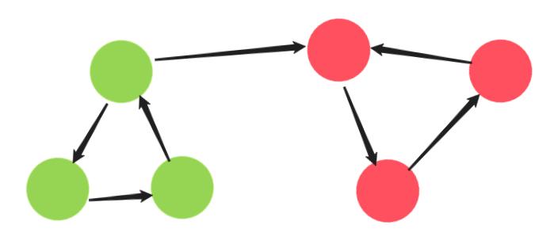
  
  To solve this, we can compress all strongly connected components in the graph (using Tarjan's Algorithm or Kosaraju's Algorithm), leaving us with a directed acyclic graph. From this graph, it is enough if we consider vertices with `in_degree = 0`.

 <details>
    <summary>DFS solution of DAG</summary>
    
```python
class Solution:
    def findSmallestSetOfVertices(self, n: int, edges: List[List[int]]) -> List[int]:

        def dfs(g, c, vis, res):
            vis[c] = True
            for adj in g[c]:
                if not vis[adj]:
                    dfs(g,adj,vis,res)
                # adj can be visited by current vertex so we dont have to add adj in res
                # only works in case of DAG
                elif adj in res:res.remove(adj)

        # Make a adjecency list from edge list
        g = collections.defaultdict(list)
        for e in edges:
            u,v = e
            g[u].append(v)

        res = set() # smallest set of vertices
        vis = [False]*n
        for i in range(n):
            if not vis[i]:
                dfs(g, i, vis, res)
                # add vertex from which we start traversing
                res.add(i)
        return list(res)
 ```
 
 Anyways, This approach doesn't work for directed graphs because of SCC and cycles.
 </details>

## Def
Let G = (V; E) be a connected, undirected graph. An articulation point of G is
a vertex whose removal disconnects G. A bridge of G is an edge whose removal
disconnects G. A biconnected component of G is a maximal set of edges such
that any two edges in the set lie on a common simple cycle, We can determine articulation points, bridges, and biconnected
components using DFS.

    
## Articulation Points/Cut Vertices and Bridges

An ‘Articulation Point’ is defined as a vertex in a graph G whose removal (all edges
incident to this vertex are also removed) disconnects G. A graph without any articulation
point is called ‘Biconnected’. Similarly, a ‘Bridge’ is defined as an edge in a graph G whose
removal disconnects G. These two problems are usually defined for **undirected graphs**.

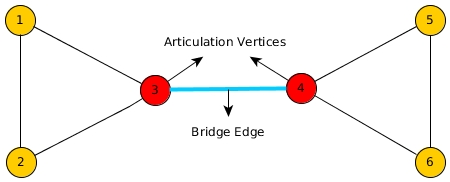

A simple approach to find bridges/articulation points would be to remove each point and check whether the graph is disconnected but it would take `O(E(V+E))` time.

**Observations:**

A back-edge is never a bridge because a back-edge in an undirected graph is part of a cycle.

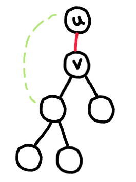

For edge `(u, v)` to be a bridge edge, there shouldn't be any back edge from subtree of `v` to `u` or above.

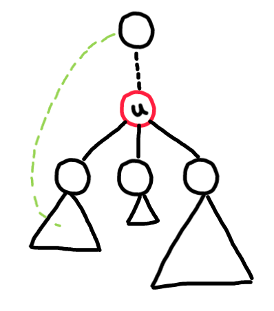

For vertex `u` to be an articulation vertex, there shouldn't be any backedge edge from subtree of some child of `u` to ancestors of `u`.

**Implementation details:**

We maintain two numbers `dfs_num(u)` and `dfs_low(u)`. Here, `dfs_num(u)` stores the iteration counter when the vertex u is 
visited *for the first time*, `dfs_low(u)` stores the lowest `dfs_num` rechable from the current DFS spanning subtree of u.
At the beginning, `dfs_low(u) = dfs_num(u)` when vertex `u` is visited for the first time. Then, `dfs_low(u)` can only be made 
smaller if there is cycle(a back edge exists). Note that we do not update `dfs_low(u)` with a back edge `(u, v)` if `v` is a direct parent of `u`.

* When we are in a vertex u with v as its neighbor and `dfs_low(v) ≥ dfs_num(u)`, then `u` is an articulation vertex. This is because the fact that `dfs_low(v)` is *not smaller* than `dfs_num(u)` implies that there is no back edge from vertex `v` that can reach another vertex `w` with a lower `dfs_num(w)` than `dfs_num(u)`.

* A vertex w with lower `dfs_num(w)` than vertex u with `dfs_num(u)` implies that `w` is the ancestor of u in the DFS spanning tree. This means that to reach the ancestor(s) of `u` from `v`, one must pass through vertex `u`. Therefore, removing vertex `u` will disconnect the graph.

However, there is one special case: The root of the DFS spanning tree (the vertex chosen as the start of DFS call) is an articulation point only if it has more than one children in the DFS spanning tree (a trivial case that is not detected by this algorithm).

```cpp
vi dfs_num, dfs_low; // additional information for articulation points/bridges/SCCs
vi articulation_vertex;
int dfsNumberCounter, dfsRoot, rootChildren;

void articulationPointAndBridge(int u) {
    dfs_low[u] = dfs_num[u] = dfsNumberCounter++; // dfs_low[u] <= dfs_num[u]
    for (int j = 0; j < (int) AdjList[u].size(); j++) {
        ii v = AdjList[u][j];
        if (dfs_num[v.first] == DFS_WHITE) { // a tree edge
            dfs_parent[v.first] = u;
            if (u == dfsRoot) rootChildren++; // special case, count children of root

            articulationPointAndBridge(v.first);

            if (dfs_low[v.first] >= dfs_num[u]) // for articulation point
                articulation_vertex[u] = true; // store this information first

            if (dfs_low[v.first] > dfs_num[u]) // for bridge
                printf(" Edge (%d, %d) is a bridge\n", u, v.first);

            dfs_low[u] = min(dfs_low[u], dfs_low[v.first]); // update dfs_low[u]
        } else if (v.first != dfs_parent[u]) // a back edge and not direct cycle
            dfs_low[u] = min(dfs_low[u], dfs_num[v.first]); // update dfs_low[u]
    }
}

// inside main
dfsNumberCounter = 0;
dfs_num.assign(V, DFS_WHITE);
dfs_low.assign(V, 0);
dfs_parent.assign(V, -1);
articulation_vertex.assign(V, 0);
printf("Bridges:\n");
for (int i = 0; i < V; i++)
    if (dfs_num[i] == DFS_WHITE) {
        dfsRoot = i;
        rootChildren = 0;
        articulationPointAndBridge(i);
        articulation_vertex[dfsRoot] = (rootChildren > 1);
    } // special case
printf("Articulation Points:\n");
for (int i = 0; i < V; i++)
    if (articulation_vertex[i])
        printf(" Vertex %d\n", i);
```

The process to find bridges is similar. When `dfs_low(v) > dfs_num(u)`, then edge u-v is
a bridge (notice that we remove the equality test ‘=’ for finding bridges). 

source: <https://github.com/remidinishanth/cp3files/blob/master/ch4/ch4/ch4_01_dfs.cpp>

<details>
    <summary> CP algorithms finding bridges </summary>

The implementation needs to distinguish three cases: when we go down the edge in DFS tree, when we find a back edge to an ancestor of the vertex and when we return to a parent of the vertex. These are the cases:

* `visited[to] = false` - the edge is part of DFS tree;
* `visited[to] = true && to ≠ parent` - the edge is back edge to one of the ancestors;
* `to = parent` - the edge leads back to parent in DFS tree.

To implement this, we need a depth first search function which accepts the parent vertex of the current node.

```cpp
int n; // number of nodes
vector<vector<int>> adj; // adjacency list of graph

vector<bool> visited;
vector<int> tin, low;
int timer;

void dfs(int v, int p = -1) {
    visited[v] = true;
    tin[v] = low[v] = timer++;
    for (int to : adj[v]) {
        if (to == p) continue;
        if (visited[to]) {
            low[v] = min(low[v], tin[to]);
        } else {
            dfs(to, v);
            low[v] = min(low[v], low[to]);
            if (low[to] > tin[v])
                IS_BRIDGE(v, to);
        }
    }
}

void find_bridges() {
    timer = 0;
    visited.assign(n, false);
    tin.assign(n, -1);
    low.assign(n, -1);
    for (int i = 0; i < n; ++i) {
        if (!visited[i])
            dfs(i);
    }
}
```

Main function is `find_bridges`; it performs necessary initialization and starts depth first search in each connected component of the graph.

Function `IS_BRIDGE(a, b)` is some function that will process the fact that edge `(a,b)` is a bridge, for example, print it.

Note that this implementation malfunctions if the graph has multiple edges, since it ignores them. Of course, multiple edges will never be a part of the answer, so `IS_BRIDGE` can check additionally that the reported bridge is not a multiple edge. Alternatively it's possible to pass to dfs the index of the edge used to enter the vertex instead of the parent vertex (and store the indices of all vertices).
</details> 

<details>
    <summary> CP algorithms finding articulation points </summary>

The implementation needs to distinguish three cases: when we go down the edge in DFS tree, when we find a back edge to an ancestor of the vertex and when we return to a parent of the vertex. These are the cases:

* `visited[to] = false` - the edge is part of DFS tree;
* `visited[to] = true && to ≠ parent` - the edge is back edge to one of the ancestors;
* `to = parent` - the edge leads back to parent in DFS tree.
 
To implement this, we need a depth first search function which accepts the parent vertex of the current node.

```cpp
int n; // number of nodes
vector<vector<int>> adj; // adjacency list of graph

vector<bool> visited;
vector<int> tin, low;
int timer;

void dfs(int v, int p = -1) {
    visited[v] = true;
    tin[v] = low[v] = timer++;
    int children=0;
    for (int to : adj[v]) {
        if (to == p) continue;
        if (visited[to]) {
            low[v] = min(low[v], tin[to]);
        } else {
            dfs(to, v);
            low[v] = min(low[v], low[to]);
            if (low[to] >= tin[v] && p!=-1)
                IS_CUTPOINT(v);
            ++children;
        }
    }
    if(p == -1 && children > 1)
        IS_CUTPOINT(v);
}

void find_cutpoints() {
    timer = 0;
    visited.assign(n, false);
    tin.assign(n, -1);
    low.assign(n, -1);
    for (int i = 0; i < n; ++i) {
        if (!visited[i])
            dfs (i);
    }
}
```

Main function is find_cutpoints; it performs necessary initialization and starts depth first search in each connected component of the graph.

Function IS_CUTPOINT(a) is some function that will process the fact that vertex a is an articulation point, for example, print it (Caution that this can be called multiple times for a vertex).
</details>


A demo of Tarjan's algorithm to find cut vertices. D denotes depth and L denotes lowpoint. [Wiki](https://en.wikipedia.org/wiki/Biconnected_component#Block-cut_tree)

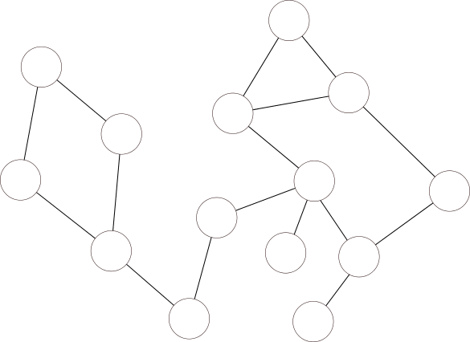

**Applications**

You are given an undirected connected graph 𝐺. Direct all of its edges so that the resulting digraph is strongly connected, or declare that this is impossible.
source: https://codeforces.com/contest/118/problem/E

<details>
    <summary> Solution </summary>

* If we have a bridge in the graph, then we can't orient the edges because say (u, v) is a bridge if we direct from u → v then there is no path from v to u.
* If there is no bridge in the graph, then the we can orient the edges. Let's form DFS tree starting from arbitrary vertex, we can direct all the tree edges downwards and back-edges upwards. This works because
  * There is path from root to each vertex. By moving from root via tree edges
  * There is a path from every vertex to the root, because there are no bridges there must be back edge going from vertex to its decendant, and from descendant we will have another backedge going up. We can just follow these backedges and get to the root.

source: https://codeforces.com/blog/entry/68138
</details>
    
<details>
    <summary> Application: Cactus Not Enough </summary>
    
source: 2020-2021 ICPC, NERC, Northern Eurasia Onsite https://codeforces.com/contest/1510/problem/C

We are given a cactus(un-directed connected graph in which any two simple cycles have at most one vertex in common). Let's call a cactus strong if it is impossible to add an edge to it in such a way that it still remains a cactus. We want to find minimal number of edges that we can add to the given cactus to make it strong  i. e. to create a new cactus with the same vertices, so that the original cactus is a subgraph of the new one, and it is impossible to add another edge to it so that the graph remains a cactus.

**Solution:** Let's look at some examples, Red edges indicate minimal edges that can be added.


Key observations:
* A strong cactus will only have cycles and paths of length 1. Consider all 2-vertex-connected components of the graph. If a graph is a cactus, each of them is either a cycle or a single edge. If there are two single-edge components that share a vertex, the graph isn’t a strong cactus, because an edge between these vertices can be added. On the other hand, if there are no such components, no edge could be added, because a path between the ends would cover at least one edge, which already lies on cycle, and this edge would lie on two cycles if we add the first edge. A more convenient form of the same statement is “a cactus is strong, iff after removing all edges lying on cycles, each connected component has at most one edge.”
* We can solve the problem for the tree formed by Biconnected components - split by cycles into tree subcomponents.
* We can ignore length 1 endpoints connecting to odd degree vertices. If the parent of a odd degree vertex is also odd, then other edges can be present in a cycle and hence this edge can be ignored.

We can find the cycles on the fly by storing `low_value` lowest depth vertex that can be reached while doing DFS similar to articulation points.

```cpp
vector<vector<int>> Adj;
vector<int> depth, deg;
vector<pair<int,int>> paths;

pair<int,int> dfs(int u, int par){
    if(par == -1) depth[u] = 0;
    int cur_path = -1;
    int low_val = depth[u];

    for(int v:Adj[u]){
        if(v == par) continue;
        if(depth[v] == -1){
            depth[v] = depth[u] + 1;
            auto [ch_low_val, ch_path] = dfs(v, u);
            low_val = min(low_val, ch_low_val);

            if(ch_path != -1){
                if(cur_path != -1){
                    paths.push_back({ch_path, cur_path});
                    cur_path = -1;
                }else{
                    cur_path = ch_path;
                }
            }
        }else if(depth[v] < depth[u]){ // update low_val
            low_val = min(low_val, depth[v]);
        }
    }

    if(low_val == depth[u] && par != -1){
        if(deg[u] && deg[par]){
            // both are odd degree, edge (par, u) can be ignored
            deg[u]--; deg[par]--;
        }else if(cur_path == -1){
            cur_path = u;
        }
    }else{
        if(cur_path != -1){
            paths.push_back({cur_path, u});
            cur_path = -1;
        }
    }
    return {low_val, cur_path};
}

int main() {
    while(true){
        int n, m;
        scanf("%d %d", &n, &m);
        Adj = vector<vector<int>>(n+1, vector<int>());
        depth = vector<int>(n+1, -1);
        deg = vector<int>(n+1);
        paths.clear();
        if(n==0) break;
        for(int i=0;i<m;i++){
            int len, prev=-1;
            scanf("%d", &len);
            while(len--){
                int x;
                scanf("%d", &x);
                if(prev!=-1){
                    Adj[x].push_back(prev);
                    Adj[prev].push_back(x);
                }
                prev = x;
            }
        }
        for(int i=1;i<=n;i++) deg[i] = Adj[i].size() & 1;

        dfs(1, -1);
        printf("%d\n", (int)paths.size());
        for(pair<int,int> x:paths){
            printf("%d %d\n", x.first, x.second);
        }
    }
}
```
</details>   

## Bi-connectivity

**Edge Biconnectivity:** If any for pair of vertices `(u, v)` there exists two edge disjoint paths between `u` and `v` then graph is called edge biconnected. They can have common vertices in between but there should be atleast two edge disjoint paths between every `(u, v)`.
* Given a un-weighted graph(directed or undirected), To find whether two vertices are edge biconnected, we can consider `u` to be a source vertex `v` to be sink vertex and find max-flow between `u` and `v`, if the maximum flow is `k` then there are exactly `k` edge disjoint paths between `u` and `v`.

**Vertex Biconnectivity:** For vertex biconnected graphs, there exists atleast two vertex disjoint paths between `u` and `v`.
* Given a un-weighted graph(directed or undirected), To find whether `u` and `v` are vetex biconnected, we can break every vertex `a` into `a` and `a'` and connect them with an edge. All the incoming edges of `a` go to `a` and all outgoing edges will go out from `a'`. Now we can max-flow between `u'` and `v`. Edge biconnectivity in modified graph leads to vertex biconnectivity in original graph.

**Bi-connected graph:** Equivalent definitions of a biconnected graph G
* Graph G has no separation edges(bridges) and no separation vertices(articulation points)
* For any two vertices u and v of G, there are two disjoint simple paths between u and v (i.e., two simple paths between u and v that share no other vertices or edges)
* For any two vertices u and v of G, there is a simple cycle containing u and v 

### Bi-connected components/ 2-connected components

A biconnected component of a given graph is the maximal(as big as possible - not possible to make it larger) connected subgraph which doesn't contain any aritculation vertices, meaning that if any one vertex were to be removed, the graph will remain connected. 

In the following diagram, different colours represent different biconnected components of the graph.

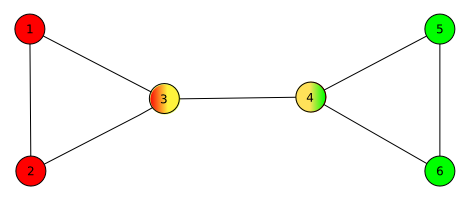

Any connected graph decomposes into a tree of biconnected components called the block-cut tree of the graph. The blocks are attached to each other at shared vertices called cut vertices or articulation points.

**Block Cut Tree:** If each biconnected component of a given graph is shrinked into / represented as a single node called a block, and these blocks are attached to each other at shared vertices (articulation points), then the resulting tree formed is called a Block-Cut tree. 

The following would be the block-cut tree of the above graph, where A,B,C are blocks attached to the articulation vertices 3 and 4.

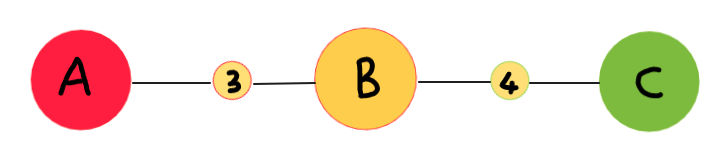

A = represents vertices 1,2,3
B = represents vertices 3,4
C = represents vertices 4,5,6

Interaction of biconnected components:
* An edge belongs to exactly one biconnected component
* A nonseparation vertex belongs to exactly one biconnected component
* A separation vertex belongs to two or more biconnected components 

REF: https://www.ics.uci.edu/~goodrich/teach/cs260P/notes/Biconnectivity.pdf

### Bridge components

A bridge component of a given graph is the maximal connected subgraph which does not contain any bridge edges.

In the following graph, different coloured vertices lie in different bridge components. The black edges are the normal edges and blue edge represents the bridge edge separating different components.

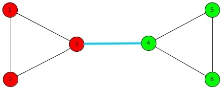

**Bridge Tree:** If each bridge component of a given graph is shrinked into/represented as a single node, and these nodes are connected to each other by the bridge edges which separated these components, then the resulting tree formed is called a Bridge Tree. 

The following would be the bridge tree formed by shrinking the bridge components of the above given graph.

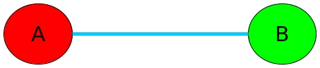

<details>
    <summary>Can a bridge component have an articulation point? </summary>

Yes\
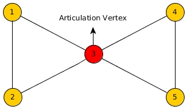
</details>

Properties of the Bridge Tree
* Each edge in the bridge tree is the one of the bridge edges in the original graph. Each edge in the normal graph G, is either a bridge tree edge or part of one of the bridge components.
* Since each node in the bridge tree is formed by shrinking the bridge components of original graph, therefore the bridge tree of a graph with N vertices can have at most N nodes (and N-1 edges).
* Bridge tree by construction is a tree, it cannot have cycles(No edge in a cylce cannot be a bridge).
* From the above point, it directly follows that a graph with N vertices can have at most N-1 bridges(because tree can have atmost N-1 edges).
* Within a bridge component, there is at least one way to orient all the edges such that there is a simple path from any node to any node within the component. (Non-trivial). Consider an arbitrary node and run a DFS, orient edges as you discover vertices. Because we don't have bridges within a bridge component , We have backedge from node to root of this DFS tree, We just orient tree edges going downward and backedges going upward and hence we can find the directed path.

How to build bridge tree efficiently?
* Run bridge finding algorithm to find all the bridges. O(V + E)
* Remove all the bridges from G
* In the resulting graph, the nodes in two different bridge components now look disjoint. So just label all the nodes with their component id.
* Let the total number of these components be K
* Now add back the bridges into a new graph with these K nodes and you get B = (K, bridges) as your bridge tree

Runtime: O(V + E) or O((V + E)logE) if you use sets for Adjacency lists.

REF: https://tanujkhattar.wordpress.com/2016/01/10/the-bridge-tree-of-a-graph/, http://compalg.inf.elte.hu/~tony/Oktatas/TDK/FINAL/Chap%205.PDF

## Tarjan's strongly connected components algorithm

Strong Connectivity applies only to **directed graphs**. A directed graph is strongly connected if there is a directed path from any vertex to every other vertex. There are at least two known algorithms to find SCCs: Kosaraju’s algorithm and Tarjan’s algorithm.  In this section, we adopt Tarjan’s version, as it extends naturally from our previous discussion of finding Articulation Points and Bridges.

Consider the following graph, say we start DFS from the top-left vertex.

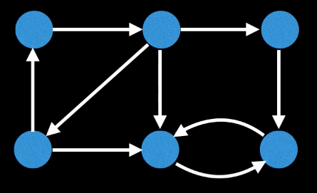

Assume that the vertices are visited in the following order.


Let's find the low_link value(the smallest node_id reachable from that node) for each node.


If we observe at the low_link value of the nodes, all the nodes in same SCC are having same low_link values.


Can we use low_link values to find SCCs? There is a problem, low_link values depends on which vertex we start DFS, for example if the start with the bottom-middle node, then low_link values for all the nodes is same.

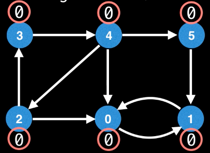

How to fix this? The Stack Invariant.
* To cope with the random traversal order of the DFS, Tarjan's algorithm maintains a set(often as a stack) of valid nodes from which to update low-link values from.
* Nodes are added to the set(stack) of valid nodes as they're explored for the first time.
* Nodes are removed from the set(stack) each time a complete SCC is found.

New low-link update condition
* To update node u's low_link value to node v's value there has to be a path of edges from u to v and node v must be on the stack.

The crucial invariant property is that a node remains on the stack after it has been visited if and only if there exists a path in the input graph from it to some node earlier on the stack. In other words, it means that in the DFS a node would be only removed from the stack after all its connected paths have been traversed. When the DFS will backtrack it would remove the nodes on a single path and return to the root in order to start a new path.

At the end of the call that visits v and its descendants, we know whether v itself has a path to any node earlier on the stack. If so, the call returns, leaving v on the stack to preserve the invariant. If not, then v must be the root of its strongly connected component, which consists of v together with any nodes later on the stack than v (such nodes all have paths back to v but not to any earlier node, because if they had paths to earlier nodes then v would also have paths to earlier nodes which is false). The connected component rooted at v is then popped from the stack and returned, again preserving the invariant.

```cpp
vi S, visited;                                    // additional global variables
int numSCC;

void tarjanSCC(int u) {
  dfs_low[u] = dfs_num[u] = dfsNumberCounter++;      // dfs_low[u] <= dfs_num[u]
  S.push_back(u);           // stores u in a vector based on order of visitation
  visited[u] = 1;
  for (int j = 0; j < (int)AdjList[u].size(); j++) {
    ii v = AdjList[u][j];
    if (dfs_num[v.first] == DFS_WHITE)
      tarjanSCC(v.first);
    if (visited[v.first])                                // condition for update
      dfs_low[u] = min(dfs_low[u], dfs_low[v.first]);
  }

  if (dfs_low[u] == dfs_num[u]) {         // if this is a root (start) of an SCC
    printf("SCC %d:", ++numSCC);            // this part is done after recursion
    while (1) {
      int v = S.back(); S.pop_back(); visited[v] = 0;
      printf(" %d", v);
      if (u == v) break;
    }
    printf("\n");
} }
```


source: [Wiki](https://en.wikipedia.org/wiki/Tarjan%27s_strongly_connected_components_algorithm)

#### Problems

https://codeforces.com/contest/1534/problem/F1

<details>
    <summary> My solution using map<int,int> for storing index</summary>
        
```cpp
int n, m;

map<int,vector<int>> Adj;

map<int,int> dfs_low, dfs_in;
int timer;

map<int, vector<int>> scc_comp;

const int nax = 5e5 + 10;
int comp_no[nax];

bool on_stack[nax];
vector<int> st; // stack

void dfs(int u){
    dfs_low[u] = dfs_in[u] = timer++;
    st.push_back(u);
    on_stack[u] = true;

    for(int v:Adj[u]){
        if(dfs_in.find(v) == dfs_in.end()){
            dfs(v);
            dfs_low[u] = min(dfs_low[u], dfs_low[v]);
        }
        else if(on_stack[v]){
            dfs_low[u] = min(dfs_low[u], dfs_low[v]);
        }
    }

    if(dfs_low[u] == dfs_in[u]){ // SCC
        while(true){
            int x = st.back(); st.pop_back();
            on_stack[x] = false;
            scc_comp[u].push_back(x);
            comp_no[x] = u;
            if(x == u) break;
        }
    }
}

int f(int i, int j){
    return m*i + j;
}

void add(int i1, int j1, int i2, int j2){
    Adj[f(i1, j1)].push_back(f(i2, j2));
}

int main() {
    sd2(n,m);
    vector<string> V(n);
    REP(i,n) cin >> V[i];

    // ignore input
    vi temp(m);
    REP(i,m) sd(temp[i]);

    for(int i=0;i<n;i++){
        for(int j=0;j<m;j++){
            if(V[i][j] != '#') continue;

            Adj[f(i,j)];

            // up edge
            if(i-1>=0 && V[i-1][j]=='#')
                add(i, j, i-1, j);

            // side edges
            if(j-1 >= 0 && V[i][j-1]=='#') add(i, j, i, j-1);
            if(j+1 < m  && V[i][j+1]=='#') add(i, j, i, j+1);

            // down edge
            for(int k=1;i+k<n;k++){
                if(j-1 >=0 && V[i+k][j-1]=='#') add(i, j, i+k, j-1);
                if(j+1 < m && V[i+k][j+1]=='#') add(i, j, i+k, j+1);
                if(V[i+k][j] == '#'){
                    add(i, j, i+k, j);
                    break;
                }
            }
        }
    }

    memset(comp_no,-1,sizeof(comp_no));
    for(auto [u, G]: Adj){
        if(comp_no[u] == -1) dfs(u);
    }

    map<int, int> in_degree;
    for(auto [u, G]: Adj){
        in_degree[comp_no[u]];
        for(int v:G){
            if(comp_no[u] != comp_no[v])
                in_degree[comp_no[v]]++;
        }
    }

    int ans = 0;
    for(auto [x, deg]: in_degree) if(deg == 0) ans++;
    printf("%d\n", ans);
    return 0;
}
```
</details>    

<details>
    <summary> Authors faster solution using arrays</summary>
    
Just store `in[i][j] = index++;` instead of `i*m + j`;  This way indices will start from `0` and are continuous, can store them in an array. zjust like normal graph.

```cpp
#include "bits/stdc++.h"
using namespace std;
using ll = long long;
using pii = pair<int,int>;
using pll = pair<ll,ll>;
template<typename T>
int sz(const T &a){return int(a.size());}
const int MN=4e5+1;
vector<vector<char>> arr;
vector<vector<int>> ind;
int am[MN];
vector<int> adj[MN];
int nodecnt=0;
int id[MN],low[MN];
bool inst[MN];
vector<int> st;
int et;
int in[MN];
vector<vector<int>> comps;
int indeg[MN];
void dfs(int loc){
    id[loc]=low[loc]=et++;
    inst[loc]=true,st.push_back(loc);
    for(auto x:adj[loc]){
        if(!id[x])dfs(x),low[loc]=min(low[loc],low[x]);
        else if(inst[x])low[loc]=min(low[loc],id[x]);
    }
    if(id[loc]==low[loc]){
        comps.push_back({});
        while(1){
            int cur=st.back();
            st.pop_back();
            in[cur]=sz(comps)-1;
            inst[cur]=false;
            comps.back().push_back(cur);
            if(cur==loc)break;
        }
    }
}
int main(){
    cin.tie(NULL);
    ios_base::sync_with_stdio(false);
    int n,m;
    cin>>n>>m;
    arr.resize(n+1,vector<char>(m+1));
    ind.resize(n+1,vector<int>(m+1));
    for(int i=1;i<=n;i++)for(int j=1;j<=m;j++)cin>>arr[i][j];
    for(int i=1;i<=m;i++)cin>>am[i];
    for(int i=1;i<=n;i++){
        for(int j=1;j<=m;j++){
            if(arr[i][j]=='#'){
                ind[i][j]=++nodecnt;
            }
        }
    }
    for(int i=1;i<=n;i++){
        for(int j=1;j<=m;j++){
            if(arr[i][j]=='#'){
                if(i-1>=1&&arr[i-1][j]=='#')adj[ind[i][j]].push_back(ind[i-1][j]);
                for(int k=i+1;k<=n;k++){
                    if(arr[k][j]=='#'){
                        adj[ind[i][j]].push_back(ind[k][j]);
                        break;
                    }
                }
                bool leftdone=false,rightdone=false;
                for(int k=i;k<=n&&(!leftdone||!rightdone)&&(arr[k][j]!='#'||k==i);k++){
                    if(j-1>=1&&!leftdone&&arr[k][j-1]=='#'){
                        adj[ind[i][j]].push_back(ind[k][j-1]),leftdone=true;
                    }
                    if(j+1<=m&&!rightdone&&arr[k][j+1]=='#'){
                        adj[ind[i][j]].push_back(ind[k][j+1]),rightdone=true;
                    }
                }
            }
        }
    }
    et=1;
    comps.push_back({});
    for(int i=1;i<=nodecnt;i++)if(!id[i])dfs(i);
    for(int i=1;i<sz(comps);i++){
        for(auto x:comps[i])for(auto y:adj[x])if(in[y]!=i)indeg[in[y]]++;
    }
    int ans=0;
    for(int i=1;i<sz(comps);i++){
        if(indeg[i]==0)ans++;
    }
    printf("%d\n",ans);
    return 0;
}
```
</details>    

## Kosaraju's Algorithm for SCC

Say we are given the following directed graph

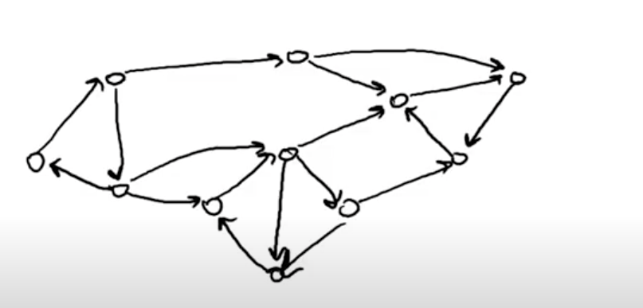

Say we start DFS from the red node, we visit all the nodes present in strongly connected component of this node.

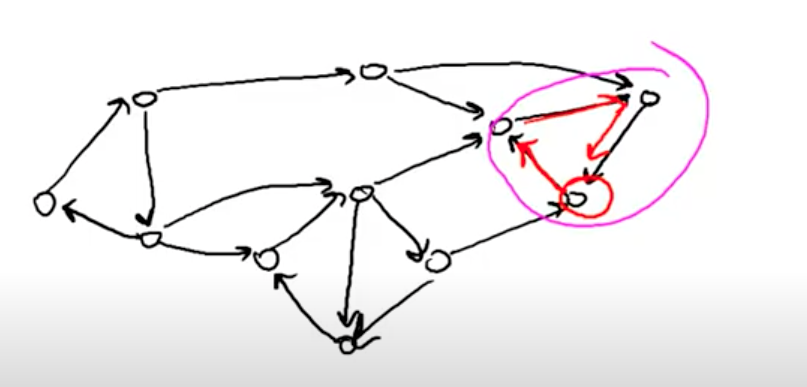

Say we start another DFS from the green node, we visit all the nodes present in the strongly connected of this node.

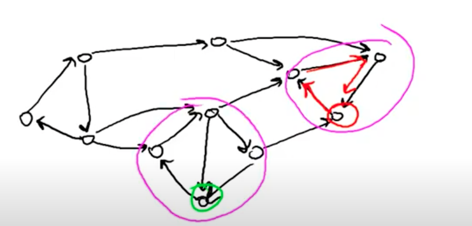

But we also have the blue edges, so we visit not only this strongly connected component but more than this. We might visit more than one strongly connected component.

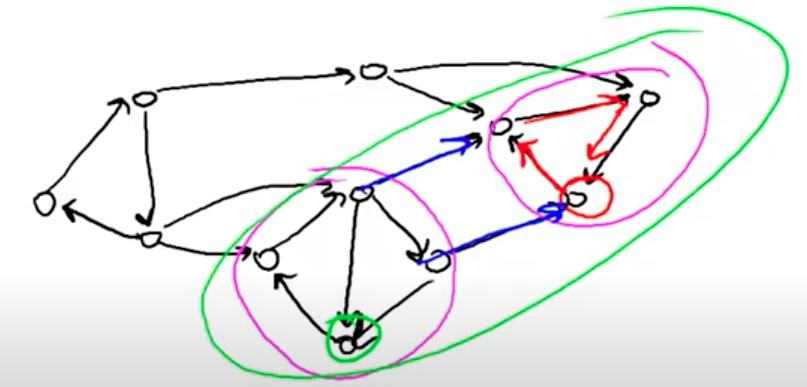

So we need a way to fix this, we want to start the DFS at vertices such that we only visit vertices of this strongly connected component but not others. The idea is to use two DFS on the graph. First one is to find the order of the vertices.

The first DFS is done on the original directed graph and record the ‘post-order’ traversal of the vertices as in finding topological sort. The second DFS is done on the transpose of the original directed graph using the ‘post-order’ ordering found by the first DFS. This two passes of DFS is enough to find the SCCs of the directed graph.

1. Perform a DFS of G and number the vertices in order of completion of the recursive calls
2. Construct a new directed graph rG by reversing the direction of every edge in G
3. Perform a DFS on rG starting the search from the highest numbered vertex according to the decreasing order of finish time
4. return DFS trees;


First DFS -> `[c, g, f, h, d, b, e, a]`

Nodes are traversed in `[c, g, f, f', g, h, h', g', c, d, d', c', b, e, a, a', e', b']`, where x denotes when `x` is visited and `x'` denotes end of vertex `x`. Finished order of vertices are `[f', h', g', d', c', a', e', b']`.

So we start second DFS in the order of `[b, e, a, c, d, g, h, f]`. Second DFS on transposed graph -> `[b, a, e, c, d, g, f, h]`

```cpp
void Kosaraju(int u, int pass) {      // pass = 1 (original), 2 (transpose)
  dfs_num[u] = 1;
  vii neighbor;
  if (pass == 1) neighbor = AdjList[u]; else neighbor = AdjListT[u];
  for (int j = 0; j < (int)neighbor.size(); j++) {
    ii v = neighbor[j];
    if (dfs_num[v.first] == DFS_WHITE)
      Kosaraju(v.first, pass);
  }
  S.push_back(u);       // as in finding topological order in Section 4.2.5
}

// inside main
AdjList.assign(N, vii());
AdjListT.assign(N, vii()); // the transposed graph
    
AdjList[V].push_back(ii(W, 1)); // always
AdjListT[W].push_back(ii(V, 1));
    
// run Kosaraju's SCC code here
S.clear();  // first pass is to record the `post-order' of original graph
dfs_num.assign(N, DFS_WHITE);
for (i = 0; i < N; i++)
  if (dfs_num[i] == DFS_WHITE)
    Kosaraju(i, 1);

numSCC = 0;   // second pass: explore the SCCs based on first pass result
dfs_num.assign(N, DFS_WHITE);
for (i = N-1; i >= 0; i--)
  if (dfs_num[S[i]] == DFS_WHITE) {
    numSCC++;
    Kosaraju(S[i], 2);
  }

```
<details>
    <summary> Brian bi t3nsor implementation </summary>
    
```cpp
struct SCC {
    int V, group_cnt;
    vector<vector<int> > adj, radj;
    vector<int> group_num, vis;
    stack<int> stk;

    // V = number of vertices
    SCC(int V): V(V), group_cnt(0), group_num(V), vis(V), adj(V), radj(V) {}

    // Call this to add an edge (0-based)
    void add_edge(int v1, int v2) {
        adj[v1].push_back(v2);
        radj[v2].push_back(v1);
    }

    void fill_forward(int x) {
        vis[x] = true;
        for (int i = 0; i < adj[x].size(); i++) {
            if (!vis[adj[x][i]]) {
                fill_forward(adj[x][i]);
            }
        }
        stk.push(x);
    }

    void fill_backward(int x) {
        vis[x] = false;
        group_num[x] = group_cnt;
        for (int i = 0; i < radj[x].size(); i++) {
            if (vis[radj[x][i]]) {
                fill_backward(radj[x][i]);
            }
        }
    }

    // Returns number of strongly connected components.
    // After this is called, group_num contains component assignments (0-based)
    int get_scc() {
        for (int i = 0; i < V; i++) {
            if (!vis[i]) fill_forward(i);
        }
        group_cnt = 0;
        while (!stk.empty()) {
            if (vis[stk.top()]) {
                fill_backward(stk.top());
                group_cnt++;
            }
            stk.pop();
        }
        return group_cnt;
    }
};
```

source: https://github.com/t3nsor/codebook/blob/master/scc.cpp
</details>
    
## Longest path in Graphs

### Acyclic graphs

A longest path between two given vertices s and t in a weighted graph G is the same thing as a shortest path in a graph −G derived from G by changing every weight to its negation. Therefore, if shortest paths can be found in −G, then longest paths can also be found in G.

### DAG

For each vertex v in a given DAG, the length of the longest path ending at v may be obtained by the following steps:

* Find a topological ordering of the given DAG.
* For each vertex v of the DAG, in the topological ordering, compute the length of the longest path ending at v by looking at its incoming neighbors and adding one to the maximum length recorded for those neighbors. If v has no incoming neighbors, set the length of the longest path ending at v to zero. In either case, record this number so that later steps of the algorithm can access it.

Once this has been done, the longest path in the whole DAG may be obtained by starting at the vertex v with the largest recorded value, then repeatedly stepping backwards to its incoming neighbor with the largest recorded value, and reversing the sequence of vertices found in this way.

**Trick**
You do not need to do the DFS (topological sort) and DP separately. Just do the DP in recursive
manner. The situation where the recursive DP is good is exactly when the order of the DP is hidden.

DFS in case of longest path for a DAG: What you can do is use `in_degree[x] == 0` before you call `dfs(x)`, that is 
```cpp
for(int v:Adj[u]){
    in_degree[v]--;
    if(in_degree[v]==0){
        dfs(v);
    }
}
```

```cpp
// DAG - directed acyclic graph
 
const int nax = 1e5 + 5;
vector<int> edges[nax];
int in_degree[nax]; // the number of edges going to 'b'
int dist[nax];
bool visited[nax];
 
void dfs(int a) {
    assert(!visited[a]);
    visited[a] = true;
    for(int b : edges[a]) {
        dist[b] = max(dist[b], dist[a] + 1);
        --in_degree[b];
        if(in_degree[b] == 0) {
            dfs(b);
        }
    }
}
 
int main() {
    int n, m;
    scanf("%d%d", &n, &m);
    while(m--) {
        int a, b;
        scanf("%d%d", &a, &b);
        edges[a].push_back(b);
        ++in_degree[b];
    }
    for(int i = 1; i <= n; ++i) {
        if(!visited[i] && in_degree[i] == 0) {
            dfs(i);
        }
    }
    int answer = 0;
    for(int i = 1; i <= n; ++i) {
        answer = max(answer, dist[i]);
    }
    printf("%d\n", answer);
}
```

## Diameter of Weighted Tree

For general graph, we need O(V^3) Floyd Warshall's algorithm plus O(V^2) all-pairs check to compute the diameter. However,
if the given graph is a weighted tree, the problem becomes simpler. We only need two O(V) traversals: 
* Do DFS/BFS from any vertex s to find the furthest vertex x,
* Do DFS/BFS one more time from vertex x to get the true furthest vertex y from x.

The length of the unique path along x to y is the diameter of that tree.

source: CP3 Chapter 4. Graph

Proof: <https://cs.stackexchange.com/questions/22855/algorithm-to-find-diameter-of-a-tree-using-bfs-dfs-why-does-it-work>

Since it is a tree, DFS/BFS doesn't matter

For un-weighted graphs, we can use n BFS and thus reduce the complexity to O(VE)

<details>
    <summary>Breaking tree recursively based on diameters</summary>
    
```cpp
vector<set<int>> Adj;

int n;
vi D, P; // Depth, Parent

vvi dd; // vector of diameter chains

vii Ans1, Ans2; // cuts and links

void dfs(int x, int p, int &far, int &last){
    P[x] = p;
    for(int y:Adj[x]){
        if(y!=p){
            D[y] = D[x] + 1;
            if(D[y]>far){
                far = D[y];
                last = y;
            }
            dfs(y,x, far, last);
        }
    }
}

void solve(int start=0){
    if(Adj[start].size()==0){
        dd.PB({start});
        return;
    }

    int far = 0; int t = 0;
    D[start] = 0;
    dfs(start, -1, far, t);

    far = 0; int last=t;
    D[t] = 0;
    dfs(t, -1, far, last);

    set<int> Diamater;
    vi dia;

    while(P[last]!=-1){
        dia.push_back(last);
        Diamater.insert(last);
        Diamater.insert(P[last]);
        last = P[last];
    }
    dia.push_back(last);

    dd.PB(dia);

    for(int x:dia){
        for(int y:Adj[x]){
            if(Diamater.find(y)==Diamater.end()){
                Ans1.PB({x,y});
                Adj[y].erase(x);
                solve(y);
            }
        }
    }
}

int main(){
    dsd(TC);
    while(TC--){
        Ans1.clear();
        Ans2.clear();
        dd.clear();
        Adj.clear();
        sd(n); D = vi(n); P = vi(n);
        Adj = vector<si>(n, set<int>());
        REP(i,n-1){
            dsd2(x,y);
            x--;
            y--;
            Adj[x].insert(y);
            Adj[y].insert(x);
        }
        solve();
        int first_end = dd[0].back();
        for(int i=1;i<dd.size();i++){
            Ans2.PB({first_end, dd[i][0]});
            first_end = dd[i].back();
        }
        pd(SZ(Ans1));
        REP(i,SZ(Ans1)){
            printf("%d %d ", Ans1[i].F + 1, Ans1[i].S + 1);
            printf("%d %d\n", Ans2[i].F + 1, Ans2[i].S + 1);
        }
    }
    return 0;
}
```
</details>

## Single Source Shortest Paths on Weighted Tree

Generally we use Dijkstra's O((V+E)logV) and Bellman-Ford's O(VE) algorithms for solving SSP problem on weighted graph. But if the 
given graph is a weighted tree, the SSSP problem becomes simpler: Any O(V) graph traversal algorithm, i.e BFS or DFS can be used to solve
this problem. There is only one unique path between any two vertices in a tree, so we simply traverse the tree to find the unique path connecting 
the two vertices. The shortest path weight between these two vertices is basically the sum of edge weights of this unique path.


## SSSP on Weighted Graph

If the given graph is weighted, BFS does not work. This is because there can be ‘longer’
path(s) (in terms of number of vertices and edges involved in the path) but has smaller total
weight than the ‘shorter’ path found by BFS. To solve the SSSP problem on weighted graph, we use a greedy Edsger Wybe Dijkstra’s
algorithm. 

When this algorithm process u, it tries to relax all neighbors v of u. Every time it
relaxes an edge u → v, it will enqueue a pair (newer/shorter distance to v from source, v)
into pq and leave the inferior pair (older/longer distance to v from source, v) inside pq. This
is called ‘Lazy Deletion’ and it causes more than one copy of the same vertex in pq with
different distances from source. That is why we have the check earlier to process only the
first dequeued vertex information pair which has the correct/shorter distance (other copies
will have the outdated/longer distance). The code is shown below and it looks very similar
to BFS and Prim’s code 

```cpp
 AdjList.assign(V, vii()); // assign blank vectors of pair<int, int>s to AdjList
  for (int i = 0; i < E; i++) {
    scanf("%d %d %d", &u, &v, &w);
    AdjList[u].push_back(ii(v, w));                              // directed graph
  }

// Dijkstra routine
  vi dist(V, INF); dist[s] = 0;                    // INF = 1B to avoid overflow
  priority_queue< ii, vector<ii>, greater<ii> > pq; pq.push(ii(0, s));
                             // ^to sort the pairs by increasing distance from s
  while (!pq.empty()) {                                             // main loop
    ii front = pq.top(); pq.pop();     // greedy: pick shortest unvisited vertex
    int d = front.first, u = front.second;
    if (d > dist[u]) continue;   // this check is important, see the explanation
    for (int j = 0; j < (int)AdjList[u].size(); j++) {
      ii v = AdjList[u][j];                       // all outgoing edges from u
      if (dist[u] + v.second < dist[v.first]) {
        dist[v.first] = dist[u] + v.second;                 // relax operation
        pq.push(ii(dist[v.first], v.first));
  } } }  // note: this variant can cause duplicate items in the priority queue
```

## SSSP on Graph with Negative Weight Cycle

If the input graph has negative edge weight, typical Dijkstra’s implementation can produces wrong answer.

To solve the SSSP problem in the potential presence of negative weight cycle(s), the more
generic (but slower) Bellman Ford’s algorithm must be used. This algorithm was invented
by Richard Ernest Bellman (the pioneer of DP techniques) and Lester Randolph Ford, Jr
(the same person who invented Ford Fulkerson’s method). The main idea
of this algorithm is simple: Relax all E edges (in arbitrary order) V -1 times!

Initially dist[s] = 0, the base case. If we relax an edge s → u, then dist[u] will have
the correct value. If we then relax an edge u → v, then dist[v] will also have the correct
value. If we have relaxed all E edges V -1 times, then the shortest path from the source
vertex to the furthest vertex from the source (which will be a simple path with V -1 edges)
should have been correctly computed. The main part of Bellman Ford’s code is simpler than
BFS and Dijsktra’s code:

```cpp
  AdjList.assign(V, vii()); // assign blank vectors of pair<int, int>s to AdjList
  for (int i = 0; i < E; i++) {
    scanf("%d %d %d", &a, &b, &w);
    AdjList[a].push_back(ii(b, w));
  }

  // Bellman Ford routine
  vi dist(V, INF); dist[s] = 0;
  for (int i = 0; i < V - 1; i++)  // relax all E edges V-1 times, overall O(VE)
    for (int u = 0; u < V; u++)                        // these two loops = O(E)
      for (int j = 0; j < (int)AdjList[u].size(); j++) {
        ii v = AdjList[u][j];        // we can record SP spanning here if needed
        dist[v.first] = min(dist[v.first], dist[u] + v.second);         // relax
      }

  bool hasNegativeCycle = false;
  for (int u = 0; u < V; u++)                          // one more pass to check
    for (int j = 0; j < (int)AdjList[u].size(); j++) {
      ii v = AdjList[u][j];
      if (dist[v.first] > dist[u] + v.second)                 // should be false
        hasNegativeCycle = true;     // but if true, then negative cycle exists!
    }
  printf("Negative Cycle Exist? %s\n", hasNegativeCycle ? "Yes" : "No");

  if (!hasNegativeCycle)
    for (int i = 0; i < V; i++)
      printf("SSSP(%d, %d) = %d\n", s, i, dist[i]);
```

### Why does Bellman Ford Work?
* A shortest path can have at most n − 1 edges
* At the kth iteration, all shortest paths using k or less edges
are computed
* After n − 1 iterations, all distances must be final; for every
edge u → v of cost c, dv ≤ du + c holds
    * Unless there is a negative-weight cycle
    * This is how the negative-weight cycle detection works

## Floyd Warshall All pairs shortest Path

### Dynamic Programming I


### DP II


The basic idea behind Floyd Warshall’s is to gradually allow the usage of *intermediate vertices* (vertex [0..k]) to form the shortest paths.


This DP formulation must be filled layer by layer (by increasing k). To fill out an entry in
the table k, we make use of the entries in the table k-1. 

The naive implementation is to use a 3-dimensional matrix
D[k][i][j] of size O(V^3). 

However, since to compute layer k we only need to know the
values from layer k-1, we can drop dimension k and compute D[i][j] ‘on-the-fly’ (the space
saving trick). Thus, Floyd Warshall’s algorithm just need O(V^2)
space although it still runs in O(V^3).

```cpp
// inside int main()
// precondition: AdjMat[i][j] contains the weight of edge (i, j)
// or INF (1B) if there is no such edge
// AdjMat is a 32-bit signed integer array
for (int k = 0; k < V; k++) // remember that loop order is k->i->j
    for (int i = 0; i < V; i++)
        for (int j = 0; j < V; j++)
            AdjMat[i][j] = min(AdjMat[i][j], AdjMat[i][k] + AdjMat[k][j]);
```

If `dij + dji < 0` for some i and j, then the graph has a negative weight cycle

## Printing Shortest Paths

A common issue encountered by programmers who use the four-liner Floyd Warshall’s without understanding how it works is when they are asked to print the shortest paths too. In BFS/Dijkstra’s/Bellman Ford’s algorithms, we just need to remember the shortest paths
spanning tree by using a 1D `vector<int> p` to store the parent information for each vertex. In Floyd
Warshall’s, we need to store a 2D parent matrix. The modified code is shown below.

```cpp
// inside int main()
// let p be a 2D parent matrix, where p[i][j] is the last vertex before j
// on a shortest path from i to j, i.e. i -> ... -> p[i][j] -> j
for (int i = 0; i < V; i++)
    for (int j = 0; j < V; j++)
        p[i][j] = i; // initialize the parent matrix

for (int k = 0; k < V; k++)
    for (int i = 0; i < V; i++)
        for (int j = 0; j < V; j++) // this time, we need to use if statement
            if (AdjMat[i][k] + AdjMat[k][j] < AdjMat[i][j]) {
                AdjMat[i][j] = AdjMat[i][k] + AdjMat[k][j];
                p[i][j] = p[k][j]; // update the parent matrix
            }
//-------------------------------------------------------------------------
// when we need to print the shortest paths, we can call the method below:
void printPath(int i, int j) {
    if (i != j) printPath(i, p[i][j]);
    printf(" %d", j);
}
```

Source: Wiki

```
let dist be a VxV array of minimum distances initialized to infinity.
let next be a VxV array of vertex indices initialized to null

procedure FloydWarshallWithPathReconstruction() is
    for each edge (u, v) do
        dist[u][v] ← w(u, v)  // The weight of the edge (u, v)
        next[u][v] ← v
    for each vertex v do
        dist[v][v] ← 0
        next[v][v] ← v
    for k from 1 to |V| do // standard Floyd-Warshall implementation
        for i from 1 to |V|
            for j from 1 to |V|
                if dist[i][j] > dist[i][k] + dist[k][j] then
                    dist[i][j] ← dist[i][k] + dist[k][j]
                    next[i][j] ← next[i][k]
procedure Path(u, v)
    if next[u][v] = null then
        return []
    path = [u]
    while u ≠ v
        u ← next[u][v]
        path.append(u)
    return path
```

## System of Difference Constraints

* Given m inequalities of the form xi − xj ≤ c
* Want to find real numbers x1, . . . , xn that satisfy all the given inequalities
* Seemingly this has nothing to do with shortest paths
    – But it can be solved using Bellman-Ford
    


It turns out that our solution minimizes the span of the variables: max xi − min xi

source: Stanford CS 97SI: Introduction to Programming Contests


## Minimum Spanning Tree

We have an undirected weighted graph. 

The vertices along with a subset of the edges in the graph is called a
spanning tree if
* it forms a tree (i.e. does not contain a cycle) and
* the tree spans all vertices (all vertices can reach all other vertices)

The weight of a spanning tree is the sum of the weights of the edges
in the subset, We want to find a minimum spanning tree

### Algorithm

Several greedy algorithms work
* Go through the edges in the graph in increasing order of weight
* Greedily pick an edge if it doesn't form a cycle (Union-Find can be used to keep track of when we would get a cycle)
* When we've gone through all edges, we have a minimum spanning tree
    * This is Kruskal's algorithm
    * Time complexity is E.log(E)

```cpp
struct edge {
    int u, v;
    int weight;

    edge(int _u, int _v, int _w) {
        u = _u;
        v = _v;
        weight = _w;
    }
};

vector<edge> adj[N];

struct union_find {
    vector<int> parent;
    union_find(int n) {
        parent = vector<int>(n);
        for (int i = 0; i < n; i++) {
            parent[i] = i;
        }
    }

    int find(int x) {
        if (parent[x] == x) {
            return x;
        } else {
            parent[x] = find(parent[x]);
            return parent[x];
        }
    }

    void unite(int x, int y) {
        parent[find(x)] = find(y);
    }
};

bool edge_cmp(const edge &a, const edge &b) {
    return a.weight < b.weight;
}

vector<edge> mst(int n, vector<edge> edges) {
    union_find uf(n);
    sort(edges.begin(), edges.end(), edge_cmp);

    vector<edge> res;
    for (int i = 0; i < edges.size(); i++) {
        int u = edges[i].u,
            v = edges[i].v;

        if (uf.find(u) != uf.find(v)) {
            uf.unite(u, v);
            res.push_back(edges[i]);
        }
    }

    return res;
}
```
