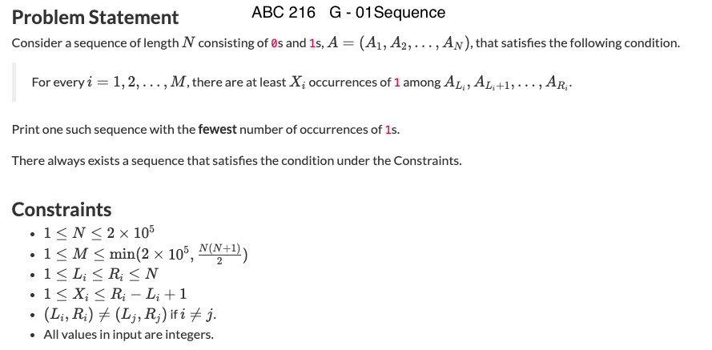
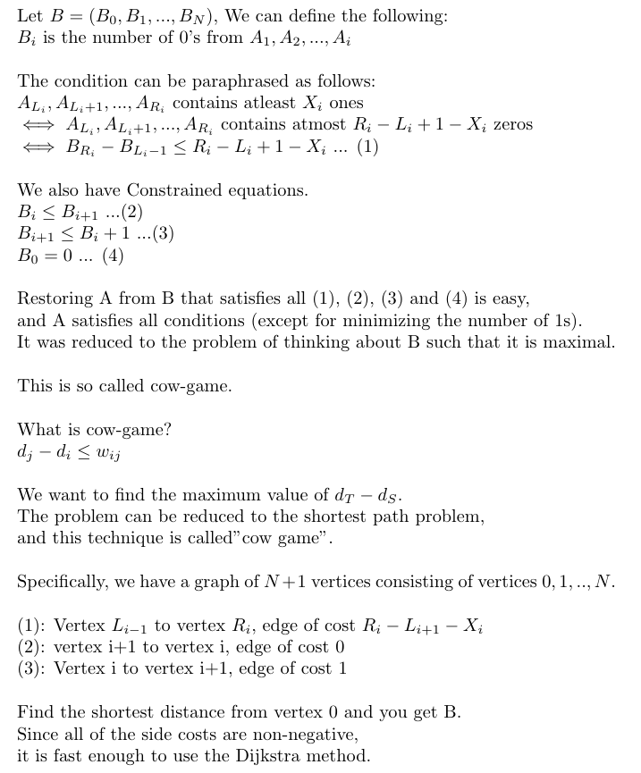
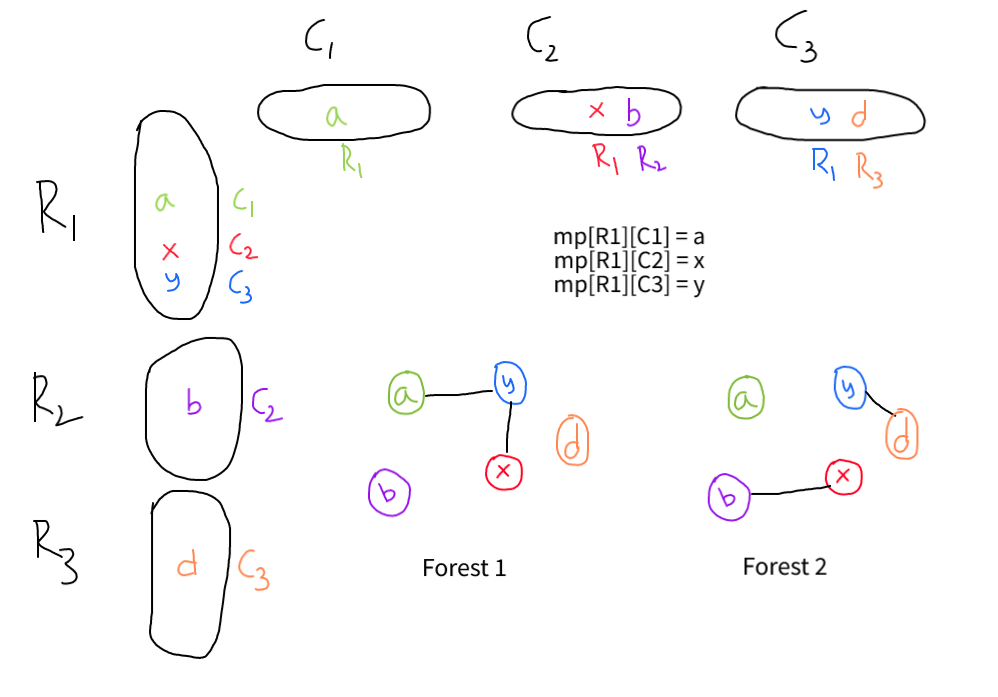
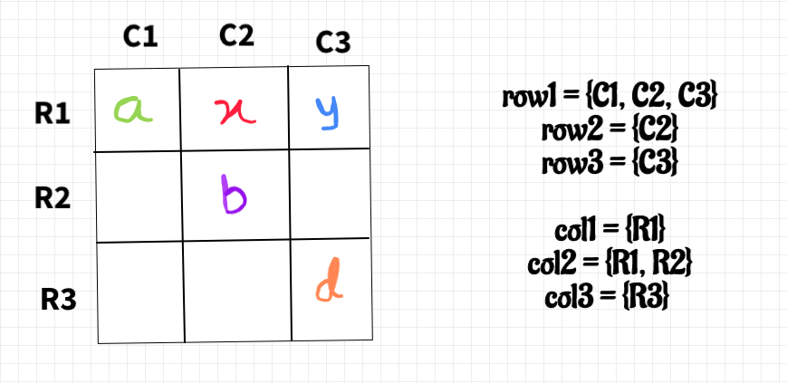

## BFS on Grid

Monsters https://cses.fi/problemset/task/1194

We want to find if A can reach the edge of the maze without being touched by monsters by BFS. If possible, retrace and print its path.

<details>
    <summary>USACO guide solution</summary>

Because the monsters move optimally, if a monster can reach a location in the
maze before A, then A may never move to that spot. Thus, for A to enter a spot,
the distance from that location to A must be less than the distance from that
location to the nearest monster. Knowing this, we may BFS to find all locations
that are visitable by A. This will run in N^2 time because each location will
be visited a constant amount of times.

While conducting the bfs, store the previous location of every location ("from"
array in code below). This way, once A reaches the edge, we can retrace A's
path, following the path of previous locations and storing the direction
traveled.
	
`int paths[mn][mn];` → time till which this node is reachable by A
	
```cpp
#include <iostream>
#include <vector>
#include <queue>
#include <climits>
#include <cstring>
#include <algorithm>
#define pii pair<int, int>
#define mn 1005
using namespace std;

int N, M;
queue<pii> q;
// Using 1-based indexing for storing the given matrix
int paths[mn][mn]; // time till which this node is reachable by A
pii from[mn][mn];
int oo = INT_MAX;
pii A;
string ans;
bool possible = false;

void retrace(pii node){  // retrace from final node, adding direction from previous node to a string. This string will be backwards but will be reversed before output.
    pii origin = from[node.first][node.second];
    if(origin ==  pii(0,0)) return;
    if(origin.first == node.first+1) ans.push_back('U');
    if(origin.first == node.first-1) ans.push_back('D');
    if(origin.second == node.second+1) ans.push_back('L');
    if(origin.second==node.second-1) ans.push_back('R');
    retrace(origin);

}
void check(pii origin, pii dest){ // check if the considered destination may be traveled to
    int pl = paths[origin.first][origin.second];
    if(pl+1<paths[dest.first][dest.second]){
        paths[dest.first][dest.second]  = pl+1;
        q.push(dest);
        from[dest.first][dest.second] = origin;
    }
}
bool mora = false; // false if bfs for monsters, true if bfs for A
void bfs(){
    while(!q.empty()){
        pii loc = q.front(), next; q.pop();
        next = loc; next.first++; check(loc, next); // go through adjacent locations
        next = loc; next.first--; check(loc, next);
        next = loc; next.second++; check(loc, next);
        next = loc; next.second--; check(loc, next);
        if(mora && (loc.first == 1 || loc.second == 1 || loc.first == N || loc.second == M)){
            cout << "YES" << endl;
            cout << paths[loc.first][loc.second] << endl;
            retrace(loc);
            possible = true;
            return;
        }
    }
}
int main() {
    cin >> N >> M;
    for(int i = 1; i <= N; i++){
        string s;
        cin >> s;
        for(int j = 1; j <= M; j++){
            paths[i][j] = oo;
            if(s[j-1] == '#') paths[i][j] = 0;
            if(s[j-1] == 'M') {q.push(pii(i,j)); paths[i][j]  = 0;}
            if(s[j-1] == 'A') {A.first = i; A.second = j;}
        }
    }
    bfs(); // monster bfs
    mora = true; // change next bfs to A bfs
    from[A.first][A.second] = pii(0,0); // give the retrace a terminating location
    paths[A.first][A.second] = 0; q.push(A); // get ready for next bfs
    bfs(); // bfs with A
    if(possible){
        reverse(ans.begin(), ans.end());
        cout << ans << endl;
    }
    else cout << "NO" << endl;
}
```
				 
source: https://usaco.guide/problems/cses-1194-monsters/solution
				 
</details>	

## Longest path in Graphs

### Acyclic graphs

A longest path between two given vertices s and t in a weighted graph G is the same thing as a shortest path in a graph −G derived from G by changing every weight to its negation. Therefore, if shortest paths can be found in −G, then longest paths can also be found in G.

### DAG

For each vertex v in a given DAG, the length of the longest path ending at v may be obtained by the following steps:

* Find a topological ordering of the given DAG.
* For each vertex v of the DAG, in the topological ordering, compute the length of the longest path ending at v by looking at its incoming neighbors and adding one to the maximum length recorded for those neighbors. If v has no incoming neighbors, set the length of the longest path ending at v to zero. In either case, record this number so that later steps of the algorithm can access it.

Once this has been done, the longest path in the whole DAG may be obtained by starting at the vertex v with the largest recorded value, then repeatedly stepping backwards to its incoming neighbor with the largest recorded value, and reversing the sequence of vertices found in this way.

**Trick**
You do not need to do the DFS (topological sort) and DP separately. Just do the DP in recursive
manner. The situation where the recursive DP is good is exactly when the order of the DP is hidden.

DFS in case of longest path for a DAG: What you can do is use `in_degree[x] == 0` before you call `dfs(x)`, that is 
```cpp
for(int v:Adj[u]){
    in_degree[v]--;
    if(in_degree[v]==0){
        dfs(v);
    }
}
```

```cpp
// DAG - directed acyclic graph
 
const int nax = 1e5 + 5;
vector<int> edges[nax];
int in_degree[nax]; // the number of edges going to 'b'
int dist[nax];
bool visited[nax];
 
void dfs(int a) {
    assert(!visited[a]);
    visited[a] = true;
    for(int b : edges[a]) {
        dist[b] = max(dist[b], dist[a] + 1);
        --in_degree[b];
        if(in_degree[b] == 0) {
            dfs(b);
        }
    }
}
 
int main() {
    int n, m;
    scanf("%d%d", &n, &m);
    while(m--) {
        int a, b;
        scanf("%d%d", &a, &b);
        edges[a].push_back(b);
        ++in_degree[b];
    }
    for(int i = 1; i <= n; ++i) {
        if(!visited[i] && in_degree[i] == 0) {
            dfs(i);
        }
    }
    int answer = 0;
    for(int i = 1; i <= n; ++i) {
        answer = max(answer, dist[i]);
    }
    printf("%d\n", answer);
}
```

## Diameter of Weighted Tree

Diameter of a graph - maximum of the shortest paths in a graph, longest of the shortest paths in a graph.

For general graph, we need O(V³) Floyd Warshall's algorithm plus O(V²) all-pairs check to compute the diameter. However, if the given graph is a weighted tree, the problem becomes simpler. It is just the longest path in tree. We can just run a BFS from every point and compute the longest path because in a tree there exist only a unique path between any pair of vertices. So we can do in O(V²) time. We can even solve this problem in O(V) time.

### Algorithm 1

A general way to approach many tree problems is to first root the tree arbitrarily. After this, we can try to solve the problem separately for each subtree. Our first algorithm for calculating the diameter is based on this idea.

Say we root the tree at arbitary vertex, then we can use dynamic programming and find the answer using the depth of nodes from DFS. If the longest path involves root, then it is sum of maximum depth between two different subtrees, if not, children of root will calculate the answer(Prove by contradiction by rooting tree at this centre).

An important observation is that every path in a rooted tree has a *highest point*: the highest node that belongs to the path. Thus, we can calculate for each node the length of the longest path whose highest point is the node. One of those paths corresponds to the diameter of the tree.

We calculate for each node x two values:
* toLeaf(x): the maximum length of a path from x to any leaf
* maxLength(x): the maximum length of a path whose highest point is x

Dynamic programming can be used to calculate the above values for all nodes in O(n) time. First, to calculate `toLeaf(x)`, we go through the children of x,
choose a child c with maximum `toLeaf(c)` and add one to this value. Then, to calculate `maxLength(x)`, we choose two distinct children a and b such that the sum
`toLeaf(a) + toLeaf(b)` is maximum and add two to this sum

source: Competitive Programmer's Handbook

### Algorithm 2

We only need two O(V) traversals: 
* Do DFS/BFS from any vertex s to find the furthest vertex x,
* Do DFS/BFS one more time from vertex x to get the true furthest vertex y from x.

The length of the unique path along x to y is the diameter of that tree.

This is an elegant method, but why does it work? It helps if we visualize the diameter is horizontal, and all other nodes hang form it.

source: CP3 Chapter 4. Graph

Proof: <https://cs.stackexchange.com/questions/22855/algorithm-to-find-diameter-of-a-tree-using-bfs-dfs-why-does-it-work>

Since it is a tree, DFS/BFS doesn't matter

For un-weighted graphs, we can use n BFS and thus reduce the complexity to O(VE)

<details>
    <summary>Breaking tree recursively based on diameters</summary>

This was implemented when I understood https://codeforces.com/contest/1521/problem/D CF Div 2 problem wrongly. The follows inputs a Graph and then divides the edges recursively by choosing the largest diameter from the components.
    
```cpp
typedef vector<int> vi;
typedef vector< vector<int> > vvi;

#define SZ(a) int((a).size())
#define REP(i, n) for (int i = 0; i < int(n); i++)

vector<set<int>> Adj;

int n;
vi D, P; // Depth, Parent

vvi dd; // vector of diameter chains

vector<pair<int,int>> Ans1, Ans2; // cuts and links

void dfs(int x, int p, int &far, int &last){
    P[x] = p;
    for(int y:Adj[x]){
        if(y!=p){
            D[y] = D[x] + 1;
            if(D[y]>far){
                far = D[y];
                last = y;
            }
            dfs(y,x, far, last);
        }
    }
}

void solve(int start=0){
    // if there is only one vertex left - select it and return
    if(Adj[start].size()==0){
        dd.PB({start});
        return;
    }

    // find the ends of the diameter
    
    // find the farthest node
    int far = 0; int t = 0;
    D[start] = 0;
    dfs(start, -1, far, t);

    // from the farthest node, find the diameter
    far = 0; int last=t;
    D[t] = 0;
    dfs(t, -1, far, last);

    set<int> Diamater; // find the vertices in the diamter
    vi dia;

    while(P[last]!=-1){
        dia.push_back(last);
        Diamater.insert(last);
        Diamater.insert(P[last]);
        last = P[last];
    }
    dia.push_back(last);

    dd.PB(dia);

    for(int x:dia){
        for(int y:Adj[x]){
            // if the other vertex is not present in diamter - disconnect
            if(Diamater.find(y)==Diamater.end()){
                Ans1.PB({x,y});
                Adj[y].erase(x); // remove the connection with diameter nodes
                solve(y);
            }
        }
    }
}

int main(){
    int TC;
    scanf("%d", &TC);
    while(TC--){
        Ans1.clear(); Ans2.clear();
        dd.clear();
        Adj.clear();
        scanf("%d", &n); D = vi(n); P = vi(n);
        Adj = vector<si>(n, set<int>());
        REP(i,n-1){
            dsd2(x,y);
            x--; y--;
            Adj[x].insert(y);
            Adj[y].insert(x);
        }
        solve();
        int first_end = dd[0].back();
        for(int i=1;i<dd.size();i++){
            Ans2.PB({first_end, dd[i][0]});
            first_end = dd[i].back();
        }
        printf("%d\n", SZ(Ans1));
        REP(i,SZ(Ans1)){
            printf("%d %d ", Ans1[i].F + 1, Ans1[i].S + 1);
            printf("%d %d\n", Ans2[i].F + 1, Ans2[i].S + 1);
        }
    }
    return 0;
}
```
</details>

### Centre of tree

The center(or Jordan center) of a graph is the set of all vertices of minimum eccentricity(maximal shortest distance from that node to any other node in graph), that is, the set of all vertices u where the greatest distance d to other vertices v is minimal.

For a general graph, we can solve it using Floyd Warshall algorithm and then finding eccentricity of each vertex. Suppose that the given graph is a tree, one interesting fact is that number of centre node is 1 or 2. All diameters in tree must go through centre.

Theorem: Let L be the set of leaves of Graph G. If |V| ≤ 2 then L is center of G, otherwise center of graph remains the same after removing of L: `C(G) = C(G \ L)`

This theorem brings us to the following algorithm: remove leaves, level by level, until there are  ≤ 2 nodes. These nodes will be center of graph. Implementation of this algorithm is similar to BFS.

<details>
    <summary> CPP Implementation </summary>
    
```cpp
queue <int> Q;

// Start from leaves
for (int i = 0; i < N; i++)
    if (degree[i] == 1) Q.push(i);
    
while(!Q.empty()){
    int u = Q.front(); Q.pop();
    for(int v:Adj[u]){
        deg[v]--;
        if(deg[i] == 1){
            Q.push(i);
            level[v] = level[u] + 1;
        }
    }
}

// max level nodes are centre nodes
// diam(G) = 2*maxlevel + |C| - 1
```
</details>    

source: https://codeforces.com/blog/entry/17974
    
### All longest paths in a tree

This is generalization of diameter of tree problem. This can also be solved in O(n) time.
    
Let `maxLength(x)` denote the maximum length of a path that begins at node `x`. Let's root the tree arbitrarily. The first part of the problem is to calculate for every node `x` the maximum length of path that goes through child of `x`. This part can be solved in O(n) using dynamic programming.

The second part of the problem is to calculate for every node `x` the maximum length of a path through it's parent p. At first glance, it seems that we should choose the longest path from p. However, this doesn't always work, because the longest path from p may go through x.
    
Still, we can solve the second part in O(n) time by storing two maximum lengths for each node:
* `maxLength1(x)`: the maximum length of a path from x
* `maxLength2(x)`: the maximum length of a path from x in another direction than the first path

Finally, if the path that corresponds to `maxLength1(p)` goes through `x`, we conclude that the maximum length is `maxLength2(p) + 1`, otherwise the maximum length is `maxLength1(p) + 1`.
    
<details>
    <summary> CPP implementation </summary>
    
```cpp
// source -> https://cses.fi/problemset/task/1132/

#include<bits/stdc++.h>
using namespace std;

#define FIO ios::sync_with_stdio(0); cin.tie(0);


vector<int> adj[200001];
int d1[200001];  // to store first-max length.
int d2[200001]; // to store second-max length.
int c[200001]; // to store child for path of max length.

void dfs(int v, int p) {
	d1[v] = 0;
	d2[v] = 0;
	for (auto x : adj[v]) {
		if (x == p)continue;
		dfs(x, v);
		if (d1[x] + 1 > d1[v]) {
			d2[v] = d1[v];
			d1[v] = d1[x] + 1;
			c[v] = x;
		}
		else if (d1[x] + 1 > d2[v]) {
			d2[v] = d1[x] + 1;
		}
	}
}

void dfs2(int v, int p) {
	for (auto x : adj[v]) {
		if (x == p) continue;
		if (c[v] == x) {
			if (d1[x] < d2[v] + 1) {
				d2[x] = d1[x];
				d1[x] = d2[v] + 1;
				c[x] = v;
			}
			else {
				d2[x] = max(d2[x], d2[v] + 1);
			}
		}
		else {
			d2[x] = d1[x];
			d1[x] =  d1[v] + 1;
			c[x] = v;
		}
		dfs2(x, v);
	}
}

int main() {
	FIO;
	int n, u, v;
	cin >> n;
	for (int i = 0; i < n - 1; i++) {
		cin >> u >> v;
		adj[u].push_back(v);
		adj[v].push_back(u);
	}
	// METHOD-I- All longest paths-given in CPH ~~~ (O(n))- 2-DFS
	dfs(1, -1);
	dfs2(1, -1);

	for (int i = 1; i <= n; i++) {
		cout << d1[i] << " ";
	}
	return 0;
}
```
</details>                              
	
Compute a diameter of the tree as described by algorithm 2 above. Once we have a diameter (a,b), output `max(dist(a,i),dist(b,i))` for each node `i`.

<details>
    <summary> CPP implementation </summary>    
	
```cpp
#include <bits/stdc++.h>

using namespace std;

// dist[0][i] = distance from node a to node i
// dist[1][i] = distance from node b to node i
int dist[2][200000];
vector<int> adj[200000];

int dfs(int u, int p, int d, int i) {
	dist[i][u] = d;
	int opt = -1;
	for (int v : adj[u]) {
		if (v != p) {
			int x = dfs(v, u, d+1, i);
			if (opt == -1 || dist[i][x] > dist[i][opt]) opt = x;
		}
	}
	return opt == -1 ? u : opt;
}

int main() {
	int n; cin >> n;
	for (int i = 0; i < n-1; i++) {
		int a, b; cin >> a >> b; --a; --b;
		adj[a].push_back(b); adj[b].push_back(a);
	}
	// first, find node a by finding the farthest node from an arbitrary node x
	int mxNode = dfs(0, 0, 0, 0);
	// then, find node b (this step also computes distance from a to every other node)
	int mxNode2 = dfs(mxNode, mxNode, 0, 0);
	// finally, compute the distance from b to every other node
	dfs(mxNode2, mxNode2, 0, 1);

	for (int i = 0; i < n; i++) {
		cout << max(dist[0][i], dist[1][i]) << " \n"[i == n-1];
	}
	return 0;
}
```
</details>  
    
REF: [USACO Guide](https://usaco.guide/problems/cses-1132-tree-distances-i/solution) and [Competitive Programmers Handbook 14.3](https://usaco.guide/CPH.pdf#page=147)
	
### CSES Tree Distances II

You are given a tree consisting of n nodes.

Your task is to determine for each node the sum of the distances from the node to all other nodes.

Two approaches
* First calculate the distances for each subtree bottom up, Then add the distances from other children of the parent to each node top down.
* Rerooting the tree, If we reroot the tree at node 1's neighbour (let's say node 2). [USACO guide](https://usaco.guide/problems/cses-1133-tree-distances-ii/solution)
    * The depths of all nodes in node 2's subtree decrease by 1.
    * The depths of all nodes outside of its subtree increase by 1.
    
<details>	
    <summary>Approach 1 CPP implementation</summary>
    
```cpp
const int nax = 3e5 + 10;
int n;

vector<int> adj[nax];

int sub_sz[nax]; // subtree sizes
ll sum_dist[nax]; // distances from nodes in the subtree
ll ans_dist[nax]; // ans for each node

// calculate sum_dist from children
int dfs(int u, int p) {
    sub_sz[u] = 1;
    for (int v : adj[u]) {
        if (v != p) {
            sub_sz[u] += dfs(v, u);
            sum_dist[u] += sub_sz[v] + sum_dist[v];
        }
    }
    ans_dist[u] = sum_dist[u];
    return sub_sz[u];
}

// add distance from parent's other children
void dfs2(int u, int p){
    for(int v: adj[u]){
        if(v==p) continue;
        // sub_sz[v] + sum_dist[v] is the contribution from v to u
        ans_dist[v] += (n - sub_sz[v]) + (ans_dist[u] - sub_sz[v] - sum_dist[v]);
        dfs2(v, u);
    }
}

int main() {
    cin >> n;
    vector<int> V;
    for (int i = 0; i < n-1; i++) {
        int a, b; cin >> a >> b; --a; --b;
        adj[a].push_back(b); adj[b].push_back(a);
    }
    dfs(0, -1);
    dfs2(0, -1);
    for(int i=0; i<n; i++) printf("%lld ", ans_dist[i]);
    return 0;
}
```
</details>
    
<details>	
    <summary>Approach 2 CPP implementation</summary>
    
```cpp
#include <bits/stdc++.h>
typedef long long ll;
using namespace std;

int n;
vector<int> graph[200001];
ll dp[200001], ans[200001];

void dfs1(int node = 1, int parent = 0, ll depth = 0) {
	ans[1] += depth;
	dp[node] = 1;
	for (int i : graph[node]) if (i != parent) {
		dfs1(i, node, depth + 1);
		dp[node] += dp[i];
	}
}

void dfs2(int node = 1, int parent = 0) {
	for (int i : graph[node]) if (i != parent) {
		ans[i] = ans[node] + n - 2 * dp[i];
		dfs2(i, node);
	}
}

int main() {
	ios_base::sync_with_stdio(0);
	cin.tie(0);
	cin >> n;
	for (int i = 1; i < n; i++) {
		int a, b;
		cin >> a >> b;
		graph[a].push_back(b);
		graph[b].push_back(a);
	}
	dfs1();
	dfs2();
	for (int i = 1; i <= n; i++) cout << ans[i] << ' ';
	return 0;
}
```
</details>    
	
## Single Source Shortest Paths on Weighted Tree

Generally we use Dijkstra's O((V+E)logV) and Bellman-Ford's O(VE) algorithms for solving SSP problem on weighted graph. But if the 
given graph is a weighted tree, the SSSP problem becomes simpler: Any O(V) graph traversal algorithm, i.e BFS or DFS can be used to solve
this problem. There is only one unique path between any two vertices in a tree, so we simply traverse the tree to find the unique path connecting 
the two vertices. The shortest path weight between these two vertices is basically the sum of edge weights of this unique path.


## SSSP on Weighted Graph

If the given graph is weighted, BFS does not work. This is because there can be ‘longer’
path(s) (in terms of number of vertices and edges involved in the path) but has smaller total
weight than the ‘shorter’ path found by BFS. To solve the SSSP problem on weighted graph, we use a greedy Edsger Wybe Dijkstra’s
algorithm. 

When this algorithm process u, it tries to relax all neighbors v of u. Every time it
relaxes an edge u → v, it will enqueue a pair (newer/shorter distance to v from source, v)
into pq and leave the inferior pair (older/longer distance to v from source, v) inside pq. This
is called ‘Lazy Deletion’ and it causes more than one copy of the same vertex in pq with
different distances from source. That is why we have the check earlier to process only the
first dequeued vertex information pair which has the correct/shorter distance (other copies
will have the outdated/longer distance). The code is shown below and it looks very similar
to BFS and Prim’s code 

```cpp
 AdjList.assign(V, vii()); // assign blank vectors of pair<int, int>s to AdjList
  for (int i = 0; i < E; i++) {
    scanf("%d %d %d", &u, &v, &w);
    AdjList[u].push_back(ii(v, w));                              // directed graph
  }

// Dijkstra routine
  vi dist(V, INF); dist[s] = 0;                    // INF = 1B to avoid overflow
  priority_queue< ii, vector<ii>, greater<ii> > pq; pq.push(ii(0, s));
                             // ^to sort the pairs by increasing distance from s
  while (!pq.empty()) {                                             // main loop
    ii front = pq.top(); pq.pop();     // greedy: pick shortest unvisited vertex
    int d = front.first, u = front.second;
    if (d > dist[u]) continue;   // this check is important, see the explanation
    for (int j = 0; j < (int)AdjList[u].size(); j++) {
      ii v = AdjList[u][j];                       // all outgoing edges from u
      if (dist[u] + v.second < dist[v.first]) {
        dist[v.first] = dist[u] + v.second;                 // relax operation
        pq.push(ii(dist[v.first], v.first));
  } } }  // note: this variant can cause duplicate items in the priority queue
```
	
Flight discount https://cses.fi/problemset/task/1195/

<details>
    <summary> CPP solution </summary>

Say we use the discount coupon on the edge between cities A and B.

There are two cases: we can go from $1\rightarrow A\rightarrow B\rightarrow N$,
or 1 → B → A → N. We need to know the distance between 1 and A, and N and B.

We can use Dijkstra's to compute the distance from `1` and `N` to every vertex.
Then our answer is `min{A → B} = dist1[A] + c(A,B) + distN[B]`, where `c(A,B)` is the cost to travel from city `A` to city `B` after applying the
coupon to that flight, `dist1[A]` is the cost to travel from city `1`
to city `A` and `distN[B]` is the cost to travel from city `B` to city `N`.
	
```cpp
const int nax = 1e5 + 10;

vector<ii> adj[nax], radj[nax];
vector<vector<int>> E;
ll dist[2][nax];

priority_queue<pll, vector<pll>, greater<pll>> Q;

void bfs(int k){
    auto Adj = adj;
    if(k==1) Adj = radj;
    while(!Q.empty()){
        auto [x, u] = Q.top(); Q.pop();
        if(dist[k][u] < x) continue;
        for(auto [v, c]:Adj[u]){
            if(dist[k][v] > dist[k][u] + c){
                dist[k][v] = dist[k][u] + c;
                Q.push({dist[k][v], v});
            }
        }
    }
}

int main() {
    int n, m; scanf("%d %d", &n, &m);
    for(int i=0;i<m;i++){
        int a, b, c; scanf("%d %d %d", &a, &b, &c);
        adj[a].push_back({b, c});
        radj[b].push_back({a, c});
        E.push_back({a, b, c});
    }
    for(int i=1;i<=n;i++) dist[0][i] = dist[1][i] = 1LL << 60;
    dist[0][1] = 0; Q.push({0, 1}); bfs(0);
    dist[1][n] = 0; Q.push({0, n}); bfs(1);
    ll ans = min(dist[0][n], dist[1][1]);
    for(auto V: E){
        int u = V[0], v = V[1], c = V[2];
        ans = min(ans, dist[0][u] + c/2 + dist[1][v]);
    }
    printf("%lld\n", ans);
    return 0;
}
```
</details>
	
#### Dijkstra's Application on Directed Graphs

<details>
        <summary> Leetcode problem </summary>
	
You are given an integer `n` denoting the number of nodes of a weighted directed graph. The nodes are numbered from `0` to `n - 1`.

You are also given a 2D integer array edges where `edges[i] = [fromi, toi, weighti]` denotes that there exists a directed edge from `fromi` to `toi` with weight `weighti`.

Lastly, you are given three distinct integers `src1`, `src2`, and `dest` denoting three distinct nodes of the graph.

Return the minimum weight of a subgraph of the graph such that it is possible to reach dest from both `src1` and `src2` via a set of edges of this subgraph. In case such a subgraph does not exist, return `-1`.

A subgraph is a graph whose vertices and edges are subsets of the original graph. The weight of a subgraph is the sum of weights of its constituent edges.
	

	
src1 = 0, src2 = 1, dest = 5, answer = 9
	
The blue edges represent one of the subgraphs that yield the optimal answer.

Note that the subgraph [[1,0,3],[0,5,6]] also yields the optimal answer.
	
```cpp
#define ll long long
#define pii pair<ll, ll>
#define mp make_pair
#define f first
#define s second
const ll INF = 1000000000000000000;

vector<pii> adj[100005], adj2[100005];
int N;

vector<ll> dijkstra(int start, bool orig) {
    vector<ll> dist(N, INF);
    priority_queue<pii, vector<pii>, greater<pii>> pq;
    pq.push({0, start});
    dist[start] = 0;
    while (!pq.empty()) {
        pii cur = pq.top();
        pq.pop();
        if (cur.f > dist[cur.s]) continue;
        if (orig) {
            for (pii i : adj[cur.s]) {
                if (dist[i.f] > cur.f+i.s) {
                    dist[i.f] = cur.f+i.s;
                    pq.push({dist[i.f], i.f});
                }
            }
        } else {
            for (pii i : adj2[cur.s]) {
                if (dist[i.f] > cur.f+i.s) {
                    dist[i.f] = cur.f+i.s;
                    pq.push({dist[i.f], i.f});
                }
            }
        }
    }
    return dist;
}

class Solution {
public:
    long long minimumWeight(int n, vector<vector<int>>& edges, int src1, int src2, int dest) {
        N = n;
        for (int i=0; i<n; i++) {
            adj[i].clear();
            adj2[i].clear();
        }
        for (auto& e : edges) {
            adj[e[0]].push_back(mp(e[1], e[2]));
            adj2[e[1]].push_back(mp(e[0], e[2]));
        }
        vector<ll> a = dijkstra(src1, 1), b = dijkstra(src2, 1), c = dijkstra(dest, 0);
        ll res = INF;
        for (int i=0; i<n; i++) {
            ll cur = a[i]+b[i]+c[i];
            //printf("%d %lld %lld %lld\n", i, a[i], b[i], c[i]);
            res = min(res, cur);
        }
        return (res == INF) ? -1 : res;
    }
};
```

</details>
	
#### Dijkstra's with Multiple sources and Other city constraint - First and Second minimum costs
	
Given person and friendships(edges between person) and cities, each person belong to some in city. There are some popular persons in each city, For each person we want to find minimum distance to some popular person in different city.

https://atcoder.jp/contests/abc245/tasks/abc245_g
	
<details>
	<summary>Foreign Friends Solution</summary>	

The basic idea of the solution is Dijkstra’s algorithm, which varies in two steps. 
	
* Step 1: Dijkstra’s algorithm with multiple sources.
  - First, let’s ignore the condition of “belonging to a different country” and consider how to find the minimum cost required for each people to be an indirect friend of a popular person. 
  - A simple solution is to find, for each fixed popular person, the minimum cost required to become an indirect person for every other people, and find the minimum value. 
  - However it costs about `Θ(LNlogM)` time, which does not finish in time. 
  - Here, by adding additional virtual vertex `S` and edges from `S` to the vertices corresponding to `L` popular people, the desired values can be found as the minimum distances from Vertex `S` to each vertex. 
	
* Step 2: Dijkstra’s algorithm in which each vertex is inspected multiple times. 
  - Now, let’s consider the problem in which the condition of “belonging to a different country” is added. 
  - Normal Dijkstra’s method determines the “distance from the starting vertex” in the “vertex set” in the increasing order of the distances; by determining “the minimum cost required for each popular person belonging in `Country i` to become an indirect friend of `Person j`” in the “set of pairs of `(Country i, Person j)`”, this problem can be solved in a similar way. 
  - However, directly implementing this requires a total complexity of `Θ(KNlogKM)` or `Θ(K(M+NlogKN))`. Here, for each person `j`, among the elements of “the set of pairs of `(Country i, Person j)`”, it is sufficient to find “the minimum, and the second minimum, cost required for each popular person belonging in Country i to become an indirect friend of `Person j`.” 
  - This is because, for these two countries `i1` and `i2` `(i1 !=i 2)`, `Person j` does not belong to at least one of `i1` or `i2`, and any path from `S` to a vertex that contains a sub-path with the third-minimum cost does never contribute to another path from `S` to another vertex with the minimum or the second-minimum cost. In this algorithm, each vertex is inspected at most twice, so the time complexity is `O(NlogM)` using a priority queue using binary tree.	
	
```cpp
int main() {
    int N, M, K, L;
    scanf("%d %d %d %d", &N, &M, &K, &L);
    vector<int> city(N);
    for(int i=0;i<N;i++) scanf("%d", &city[i]);
    // vector of {distance, city, person}
    priority_queue<vector<long long>, vector<vector<long long>>, greater<>> Q;
    for(int i=0;i<L;i++){
        int popular_person;
        scanf("%d", &popular_person);
        popular_person--;
        Q.push({0LL, city[popular_person], popular_person});
    }
    vector<vector<pair<int, int>>> adj(N, vector<pair<int, int>>());
    for(int i=0;i<M;i++){
        int U, V, C;
        scanf("%d %d %d", &U, &V, &C);
        U--; V--;
        adj[U].push_back({V, C});
        adj[V].push_back({U, C});
    }
    // first minimum and second minimum {distance, city} to become indirect friend
    vector<pair<long long, int>> dist1(N, {LLONG_MAX, -1}), dist2(N, {LLONG_MAX, -1});
    while(!Q.empty()){
        auto v = Q.top(); Q.pop();
        int person = v[2], city = v[1];
        long long dist = v[0];
        if(dist1[person].second == -1){
            dist1[person] = {dist, city};
        } else if(dist2[person].second == -1 && dist1[person].second != city){
            dist2[person] = {dist, city};
        } else {
            continue;
        }

        for(auto [next_person, cost]: adj[person]){
            Q.push({dist + cost, city, next_person});
        }
    }
    for(int person=0;person<N;person++){
        long long ans;
        if(dist1[person].second != city[person]){
            ans = dist1[person].first;
        } else {
            ans = dist2[person].first;
        }
        printf("%lld ", ans != LLONG_MAX ? ans : -1);
    }
    return 0;
}
```
					 
</details>	

## SSSP on Graph with Negative Weight Cycle

If the input graph has negative edge weight, typical Dijkstra’s implementation can produces wrong answer.

To solve the SSSP problem in the potential presence of negative weight cycle(s), the more
generic (but slower) Bellman Ford’s algorithm must be used. This algorithm was invented
by Richard Ernest Bellman (the pioneer of DP techniques) and Lester Randolph Ford, Jr
(the same person who invented Ford Fulkerson’s method). The main idea
of this algorithm is simple: Relax all E edges (in arbitrary order) V -1 times!

Initially dist[s] = 0, the base case. If we relax an edge s → u, then dist[u] will have
the correct value. If we then relax an edge u → v, then dist[v] will also have the correct
value. If we have relaxed all E edges V -1 times, then the shortest path from the source
vertex to the furthest vertex from the source (which will be a simple path with V -1 edges)
should have been correctly computed. The main part of Bellman Ford’s code is simpler than
BFS and Dijkstra’s code:

```cpp
  AdjList.assign(V, vii()); // assign blank vectors of pair<int, int>s to AdjList
  for (int i = 0; i < E; i++) {
    scanf("%d %d %d", &a, &b, &w);
    AdjList[a].push_back(ii(b, w));
  }

  // Bellman Ford routine
  vi dist(V, INF); dist[s] = 0;
  for (int i = 0; i < V - 1; i++)  // relax all E edges V-1 times, overall O(VE)
    for (int u = 0; u < V; u++)                        // these two loops = O(E)
      for (int j = 0; j < (int)AdjList[u].size(); j++) {
        ii v = AdjList[u][j];        // we can record SP spanning here if needed
        dist[v.first] = min(dist[v.first], dist[u] + v.second);         // relax
      }

  bool hasNegativeCycle = false;
  for (int u = 0; u < V; u++)                          // one more pass to check
    for (int j = 0; j < (int)AdjList[u].size(); j++) {
      ii v = AdjList[u][j];
      if (dist[v.first] > dist[u] + v.second)                 // should be false
        hasNegativeCycle = true;     // but if true, then negative cycle exists!
    }
  printf("Negative Cycle Exist? %s\n", hasNegativeCycle ? "Yes" : "No");

  if (!hasNegativeCycle)
    for (int i = 0; i < V; i++)
      printf("SSSP(%d, %d) = %d\n", s, i, dist[i]);
```

### Why does Bellman Ford Work?
* A shortest path can have at most n − 1 edges
* At the kth iteration, all shortest paths using k or less edges
are computed
* After n − 1 iterations, all distances must be final; for every
edge u → v of cost c, dv ≤ du + c holds
    * Unless there is a negative-weight cycle
    * This is how the negative-weight cycle detection works
			  
<details>
	<summary>Checking if some vertex can be reached via a negative cycle</summary>
	
CSES High Score https://cses.fi/problemset/task/1673/
	
Mark the nodes that are part of the cycle and then check reachability from these marked nodes to node `n`
	
```cpp
const int nax = 2510;

vector<ii> adj[nax], radj[nax];
ll dist[nax];
bool mark[nax], vis[nax];

int main() {
    int n, m; scanf("%d %d", &n, &m);
    for(int i=0;i<m;i++){
        int a, b, c; scanf("%d %d %d", &a, &b, &c);
        c = -c;
        adj[a].push_back({b, c});
        radj[b].push_back({a, c});
    }
    for(int i=1;i<=n;i++) dist[i] = 1ll << 60;
    dist[1] = 0;
    for(int i=1;i<n;i++){ // n - 1 times
        for(int u=1; u<=n; u++){
            if(dist[u] == 1ll << 60) continue;
            for(auto [v, c]:adj[u]){
                dist[v] = min(dist[v], dist[u] + c);
            }
        }
    }
    // one more pass to check
    bool hasNegativeCycle = false;
    for(int u=1; u<=n; u++){
        if(dist[u] == 1ll << 60) continue;
        for(auto [v, c]: adj[u]){
            if(dist[v] > dist[u] + c){
                dist[v] = dist[u] + c;
                mark[v] = 1; // nodes which can be relaxed further
            }
        }
    }
    // is there a path from negative cycle to node 'n'
    queue<int> Q;
    Q.push(n);
    vis[n] = 1;
    while(!Q.empty()){
        int u = Q.front(); Q.pop();
        for(auto [v, c]: radj[u])
            if(!vis[v]){
                if(mark[v]) hasNegativeCycle = true;
                vis[v] = 1;
                Q.push(v);
            }
    }
    if(hasNegativeCycle) printf("-1\n");
    else printf("%lld\n", -dist[n]);
    return 0;
}
```
	
</details>
	
<details>
	<summary>Printing a negative cycle</summary>
	
CSES Cycle Finding https://cses.fi/problemset/task/1197/
	
```cpp
struct Edge {
    int a, b, cost;
};

int n, m;
vector<Edge> edges;

const int nax = 2510;

ll dist[nax];
int par[nax];

int main() {
    scanf("%d %d", &n, &m);
    for(int i=0;i<m;i++){
        int a, b, c;
        scanf("%d %d %d", &a, &b, &c);
        edges.push_back({a, b, c});
    }
    dist[1] = 0;
    int x;
    for(int i=0;i<n;i++){ // n times
        x = -1; // check if there is some change in the last iteration
        for(Edge e:edges){
            if(dist[e.b] > dist[e.a] + e.cost){
                dist[e.b] = dist[e.a] + e.cost;
                par[e.b] = e.a;
                x = e.b;
            }
        }
    }
    // no change in the n-th iteration
    if(x == -1) return !printf("NO");

    // reach negative cycle from x
    for (int i = 0; i < n; ++i) x = par[x];

    vector<int> cycle;
    for(int v = x; ; v = par[v]){
        cycle.push_back(v);
        if(v == x && cycle.size() > 1) break;
    }
    reverse(cycle.begin(), cycle.end());
    printf("YES\n");
    for(int u:cycle) printf("%d ", u);
    printf("\n");
    return 0;
}
```
	
source: https://cp-algorithms.com/graph/finding-negative-cycle-in-graph.html
</details>

## Floyd Warshall All pairs shortest Path

### Dynamic Programming I


### DP II


The basic idea behind Floyd Warshall’s is to gradually allow the usage of *intermediate vertices* (vertex [0..k]) to form the shortest paths.


This DP formulation must be filled layer by layer (by increasing k). To fill out an entry in
the table k, we make use of the entries in the table k-1. 

The naive implementation is to use a 3-dimensional matrix
D[k][i][j] of size O(V^3). 

However, since to compute layer k we only need to know the
values from layer k-1, we can drop dimension k and compute D[i][j] ‘on-the-fly’ (the space
saving trick). Thus, Floyd Warshall’s algorithm just need O(V^2)
space although it still runs in O(V^3).

```cpp
// inside int main()
// precondition: AdjMat[i][j] contains the weight of edge (i, j)
// or INF (1B) if there is no such edge
// AdjMat is a 32-bit signed integer array
for (int k = 0; k < V; k++) // remember that loop order is k->i->j
    for (int i = 0; i < V; i++)
        for (int j = 0; j < V; j++)
            AdjMat[i][j] = min(AdjMat[i][j], AdjMat[i][k] + AdjMat[k][j]);
```

If `dij + dji < 0` for some i and j, then the graph has a negative weight cycle

## Printing Shortest Paths

A common issue encountered by programmers who use the four-liner Floyd Warshall’s without understanding how it works is when they are asked to print the shortest paths too. In BFS/Dijkstra’s/Bellman Ford’s algorithms, we just need to remember the shortest paths
spanning tree by using a 1D `vector<int> p` to store the parent information for each vertex. In Floyd
Warshall’s, we need to store a 2D parent matrix. The modified code is shown below.

```cpp
// inside int main()
// let p be a 2D parent matrix, where p[i][j] is the last vertex before j
// on a shortest path from i to j, i.e. i -> ... -> p[i][j] -> j
for (int i = 0; i < V; i++)
    for (int j = 0; j < V; j++)
        p[i][j] = i; // initialize the parent matrix

for (int k = 0; k < V; k++)
    for (int i = 0; i < V; i++)
        for (int j = 0; j < V; j++) // this time, we need to use if statement
            if (AdjMat[i][k] + AdjMat[k][j] < AdjMat[i][j]) {
                AdjMat[i][j] = AdjMat[i][k] + AdjMat[k][j];
                p[i][j] = p[k][j]; // update the parent matrix
            }
//-------------------------------------------------------------------------
// when we need to print the shortest paths, we can call the method below:
void printPath(int i, int j) {
    if (i != j) printPath(i, p[i][j]);
    printf(" %d", j);
}
```

Source: Wiki

```
let dist be a VxV array of minimum distances initialized to infinity.
let next be a VxV array of vertex indices initialized to null

procedure FloydWarshallWithPathReconstruction() is
    for each edge (u, v) do
        dist[u][v] ← w(u, v)  // The weight of the edge (u, v)
        next[u][v] ← v
    for each vertex v do
        dist[v][v] ← 0
        next[v][v] ← v
    for k from 1 to |V| do // standard Floyd-Warshall implementation
        for i from 1 to |V|
            for j from 1 to |V|
                if dist[i][j] > dist[i][k] + dist[k][j] then
                    dist[i][j] ← dist[i][k] + dist[k][j]
                    next[i][j] ← next[i][k]
procedure Path(u, v)
    if next[u][v] = null then
        return []
    path = [u]
    while u ≠ v
        u ← next[u][v]
        path.append(u)
    return path
```

## System of Difference Constraints

* Given m inequalities of the form xi − xj ≤ c
* Want to find real numbers x1, . . . , xn that satisfy all the given inequalities
* Seemingly this has nothing to do with shortest paths
    – But it can be solved using Bellman-Ford
    


It turns out that our solution minimizes the span of the variables: max xi − min xi

source: Stanford CS 97SI: Introduction to Programming Contests
	
TODO: https://www.codechef.com/COOK105A/problems/GUESSAGE
	
<details>
	<summary>Applications ABC 216 G - 01 Sequence</summary>
	


source: https://atcoder.jp/contests/abc216/tasks/abc216_g
	
Solving using Constrained equations



```cpp
#include<bits/stdc++.h>
 
using namespace std;

#define pb push_back
 
template<class T,class S>
inline bool chmin(T &a, S b) {
    if(a > b) {
        a = (T)b;
        return true;
    }
    return false;
}

template <class T> using pqg = priority_queue<T, vector<T>, greater<T>>;
 
typedef long long ll;
typedef pair<ll,ll> l_l;
typedef vector<ll> vl;

ll inf=(ll)1E18;
const int nax = 2e5 + 10;

vector<l_l> adj[nax];

int main(){
    ll n,m; cin >> n >> m;
    vl L(m),R(m),X(m);
    for(int z=0;z<m;z++){
        cin >> L[z] >> R[z] >> X[z];
        // B_R - B_{L-1} <= R - L + 1 - X
        // add edge from L-1 to R with weight R - L + 1 - X
        adj[L[z]-1].pb({R[z], R[z]-L[z]+1-X[z]});
    }
    for(int i=0;i<n;i++){
    	// B_{i+1} <= B_i + 1
        adj[i].pb({i+1,1});
        // B_i <= B_{i+1}
        adj[i+1].pb({i,0});
    }
    vl d(n+1,inf); d[0]=0; // B_0 = 0
    pqg<l_l> Q; Q.push({d[0],0});
    while(!Q.empty()){
        auto [weight, u] = Q.top(); Q.pop();
        if(d[u] != weight) continue;
        for(auto [v, cost]:adj[u]){
            if(chmin(d[v], cost + d[u])){
                Q.push({d[v], v});
            }
        }
    }
    vl ans(n+1);
    for(int i=1;i<=n;i++) ans[i] = 1-(d[i]-d[i-1]);
    for(int i=1;i<=n;i++) cout << ans[i] << " ";
    return 0;
}
```
</details>


## Minimum Spanning Tree

We have an undirected weighted graph. 

The vertices along with a subset of the edges in the graph is called a
spanning tree if
* it forms a tree (i.e. does not contain a cycle) and
* the tree spans all vertices (all vertices can reach all other vertices)

The weight of a spanning tree is the sum of the weights of the edges
in the subset, We want to find a minimum spanning tree

### Algorithm

Several greedy algorithms work
* Go through the edges in the graph in increasing order of weight
* Greedily pick an edge if it doesn't form a cycle (Union-Find can be used to keep track of when we would get a cycle)
* When we've gone through all edges, we have a minimum spanning tree
    * This is Kruskal's algorithm
    * Time complexity is E.log(E)

```cpp
struct edge {
    int u, v;
    int weight;

    edge(int _u, int _v, int _w) {
        u = _u;
        v = _v;
        weight = _w;
    }
};

vector<edge> adj[N];

struct union_find {
    vector<int> parent;
    union_find(int n) {
        parent = vector<int>(n);
        for (int i = 0; i < n; i++) {
            parent[i] = i;
        }
    }

    int find(int x) {
        if (parent[x] == x) {
            return x;
        } else {
            parent[x] = find(parent[x]);
            return parent[x];
        }
    }

    void unite(int x, int y) {
        parent[find(x)] = find(y);
    }
};

bool edge_cmp(const edge &a, const edge &b) {
    return a.weight < b.weight;
}

vector<edge> mst(int n, vector<edge> edges) {
    union_find uf(n);
    sort(edges.begin(), edges.end(), edge_cmp);

    vector<edge> res;
    for (int i = 0; i < edges.size(); i++) {
        int u = edges[i].u,
            v = edges[i].v;

        if (uf.find(u) != uf.find(v)) {
            uf.unite(u, v);
            res.push_back(edges[i]);
        }
    }

    return res;
}
```
				     
## Forest of Two trees
				     
A forest is an undirected graph without cycles (not necessarily connected).

Mocha and Diana are friends in Zhijiang, both of them have a forest with nodes numbered from 1 to 𝑛, and they would like to add edges to their forests such that:

* After adding edges, both of their graphs are still forests.
* They add the same edges. That is, if an edge `(u, v)` is added to Mocha's forest, then an edge `(u, v)` is added to Diana's forest, and vice versa.
				     
Mocha and Diana want to know the maximum number of edges they can add, and which edges to add.
				     
**Solution:**
				     
In the final situation, if one forest has more than one tree, we choose two trees from it, such as tree `A` and tree `B`. Then we consider node `a` in `A` and node `b` in `B`, they must be connected in another forest. We can easily find node `b` is connected with all the nodes in `A` and node `a` is connected with all the nodes in `B`. So nodes in `A` and `B` are in the same tree in another forest. If we consider other trees, we can get the same conclusion. _Hence nodes in another forest form only one tree._
				     
To have a clearer understanding, let's visualize the problem with a grid where each row is a component in the left forest and each column is a component in the right forest. For example, the cell `(i,j)` contains vertexes which belongs to i-th component in the left forest and j-th component in the right tree. (Some cells may be empty.) An operation corresponds to _finding two filled cells in different rows and different columns_, merging the two rows, and merging the two columns.

Now we need to make operation rapidly. For each row, we maintain a set of the different columns with filled cells in this row. Symmetrically, for each column we maintain a set of the different rows with filled cells in this column.

To merge two rows, we insert the elements of the smaller set into the larger set. The smaller set is now useless, and we delete it from every column in the set and insert the larger one. Since the data structure is symmetric, merging two columns is similar.

Without loss of generality, assume there are fewer rows than columns. If there is a row whose set has more than 1 element, we can pick it and any other row, and find an operation we can make. Otherwise if all rows are singletons, then we know the sets are all disjoint because there are more columns than rows. So we can pick any two sets and make an operation, and then there's a set with more than 1 element. Maintaining which rows have sets with size more than 1 is not hard.

For each operation, we need to output the corresponding vertex in the original two forest. Firstly, choose a vertex as the representative of each cell, because all vertexes in a cell can be seen as equivalent. Then, when merging two rows or columns, we just insert the representative vertexes at the same time.

There can be at most 2𝑛 merge operations and the total complexity of them will be `O(nlog^2n)`. This is because an element moves to a new row/column `O(log n)` times and each move is `O(log n)` time (using STL set in cpp).
				     

				     
				     
```cpp
const int nax = 1e5 + 10;

int fa1[nax], fa2[nax];
set<int> row[nax], col[nax];
map<int,int> mp[nax];

int root(int *par, int v){
    return par[v] < 0 ? v : (par[v] = root(par, par[v]));
}

void merge(int *par, int x, int y){
    if((x = root(par, x)) == (y = root(par, y))) return;
    if(par[y] < par[x]) swap(x, y);
    par[x] += par[y];
    par[y] = x;
}

void merge_row(int x, int y){
    // Small to large merging
    if(row[x].size() < row[y].size()) swap(x, y);
    // merge y into x
    for(int i:row[y]){
        mp[x][i] = mp[y][i];
        row[x].insert(i);
        col[i].erase(y);
        col[i].insert(x);
    }
}

void merge_col(int x, int y){
    if(col[x].size() < col[y].size()) swap(x, y);
    for(int i:col[y]){
        mp[i][x] = mp[i][y];
        col[x].insert(i);
        row[i].erase(y);
        row[i].insert(x);
    }
}

int main() {
    int n, m1, m2;
    scanf("%d %d %d", &n, &m1, &m2);
    for(int i=1; i<=n; i++){
        fa1[i] = fa2[i] = -1;
    }
    for(int i=1; i<=m1; i++){
        int u, v; scanf("%d %d", &u, &v);
        merge(fa1, u, v);
    }
    for(int i=1; i<=m2; i++){
        int u, v; scanf("%d %d", &u, &v);
        merge(fa2, u, v);
    }
    // make sure that number of components in forest 1 >= forest 2
    if(m1 < m2) swap(fa1, fa2);
    for(int i=1; i<=n; i++){
        int p1 = root(fa1, i), p2 = root(fa2, i);
        mp[p1][p2] = i; // to connect p1 and p2 components, store this info for answer
        row[p1].insert(p2);
        col[p2].insert(p1);
    }
    set<pair<int, int>> rows;
    for(int i=1; i<=n; i++)
        if(root(fa1, i) == i) // only consider roots in each components
            rows.insert({-row[i].size(), i});

    vector<pair<int, int>> ans;
    while(rows.size() > 1){
        // find two different components in 1st tree
        int x = rows.begin()->second;
        rows.erase(rows.begin());
        int y = rows.begin()->second;
        rows.erase(rows.begin());

        if(row[x].size() < row[y].size()) swap(x, y);
        int a = *row[x].begin(), b = *row[y].begin();
        auto it = row[x].begin();
        // connect different components of 2nd tree
        if(a == b) a = *++it;

        ans.push_back({mp[x][a], mp[y][b]});
        merge_row(x, y);
        merge_col(a, b);
        rows.insert({-row[x].size(), x});
    }
    printf("%d\n", (int)ans.size());
    for(int i=0; i<ans.size(); i++){
        printf("%d %d\n", ans[i].first, ans[i].second);
    }
    return 0;
}				     
```
    
source: https://codeforces.com/contest/1559/problem/D2

## TODO: Fracturing Search


### Greedy matching : https://codeforces.com/contest/1530/submission/123124282
