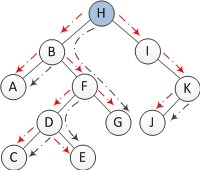

### Morris Traversal - InOrder Traversal without stack

Morris Traversal method traverses the binary tree (non-recursive, no stack, O(1) space)

* To use O(1) space for traversal, the biggest difficulty lies in how to return to the parent node when traversing to the child node (assuming there is no p pointer to the parent node in the node), because the stack cannot be used as an auxiliary space.

* To solve this problem, Morris method uses a threaded binary concept (threaded binary tree) of.
* In the Morris method, there is no need to allocate additional pointers to each node to point to its predecessor and successor, just use the left and right null pointers in the leaf node to point to the predecessor or successor node under a certain order of traversal.


#### Algorithm

1. If the left child of the current node is empty, output the current node and use its right child as the current node.

2. If the left child of the current node is not empty, find the predecessor node of the current node under the in-order traversal in the left subtree of the current node.

   a) If the right child of the predecessor node is empty, set its right child as the current node. The current node is updated as the left child of the current node.

   b) If the right child of the predecessor node is the current node, reset its right child to empty (restore the shape of the tree). Output the current node. The current node is updated as the right child of the current node.

3. Repeat above 1 and 2 until the current node is empty.


Execution order left to right


```cpp
void inorderMorrisTraversal(TreeNode * root) {
    TreeNode * cur = root, * prev = NULL;
    while (cur != NULL) {
        if (cur -> left == NULL) // 1.
        {
            printf(" %d ", cur -> val);
            cur = cur -> right;
        } else {
            // find predecessor
            prev = cur -> left;
            while (prev -> right != NULL && prev -> right != cur)
                prev = prev -> right;

            if (prev -> right == NULL) // 2. a)
            {
                prev -> right = cur;
                cur = cur -> left;
            } else // 2.b)
            {
                prev -> right = NULL;
                printf(" %d ", cur -> val);
                cur = cur -> right;
            }
        }
    }
}
```

#### Complexity Analysis

Complexity analysis:

Space complexity: O(1), because only two auxiliary pointers are used.

Time complexity: O(n). Prove that the time complexity is O(n). The biggest doubt is the time complexity of finding the predecessor node of all nodes in the binary tree under the middle order traversal, that is, the following two lines of code:

```cpp
while (prev->right != NULL && prev->right != cur)
    prev = prev->right;
```

Intuitively, I think its complexity is O(nlgn), because finding the predecessor node of a single node is related to the height of the tree. 

But in fact, it only takes O(n) time to find the predecessor nodes of all nodes. There are a total of n-1 edges in a binary tree of n nodes. 

In the whole process, each edge can only go up to 2 times, once to locate a certain node, and the other time to find the predecessor node of a certain node above, as shown in the figure below. As shown, the red line is to locate a certain node, and the black line is to find the predecessor node. So the complexity is O(n).



source: https://www.cnblogs.com/AnnieKim/archive/2013/06/15/morristraversal.html
