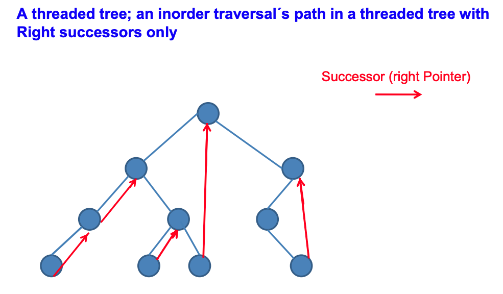

### Morris Traversal - InOrder Traversal without stack

Morris Traversal method traverses the binary tree (non-recursive, no stack, O(1) space)

* To use O(1) space for traversal, the biggest difficulty lies in how to return to the parent node when traversing to the child node (assuming there is no p pointer to the parent node in the node), because the stack cannot be used as an auxiliary space.

* To solve this problem, Morris method uses a threaded binary concept (threaded binary tree) of.

