## Dynamic Connectivity Problem

* Graph connectivity problem: Given an undirected graph G, preprocess the graph so that queries of the form "are nodes u and v connected?" can be answered efficiently.
* Dynamic connectivity problem: Maintain an undirected graph G so that edges may be inserted or deleted and connectivity queries can be answered effciently.

Dynamic connectivity in forests can be solved by Euler tour trees.

Goal: Support these three operations:
* link(u, v): Add in edge {u, v}. The assumption is that u and v are in separate trees.
* cut(u, v): Cut the edge {u, v}. The assumption is that the edge exists in the tree.
* are-connected(u, v): Return whether u and v are connected.
* compute(u, root): compute some function on path from u to root


## Link/cut tree

A link/cut tree is a data structure for representing a forest, a set of rooted trees, and offers the following operations:

* Add a tree consisting of a single node to the forest.
* Link: Attach a node to another node as its child.
* Cut: Given a node in one of the trees, disconnect it (and its subtree) from the tree of which it is part.
* Given a node, find the root of the tree to which it belongs. By doing this operation on two distinct nodes, one can check whether they belong to the same tree.

All of these operations are supported by link/cut trees in O(log n) amortized time where n is the size of the tree.


**Structure:** We take a tree where each node has an arbitrary degree of unordered nodes and split it into paths. We call this the represented tree. These paths are represented internally by auxiliary trees (here we will use splay trees, nodes are stored by depth), where the nodes from left to right represent the path from root to the last node on the path. Nodes that are connected in the represented tree that are not on the same preferred path (and therefore not in the same auxiliary tree) are connected via a path-parent pointer. This pointer is stored in the root of the auxiliary tree representing the path.

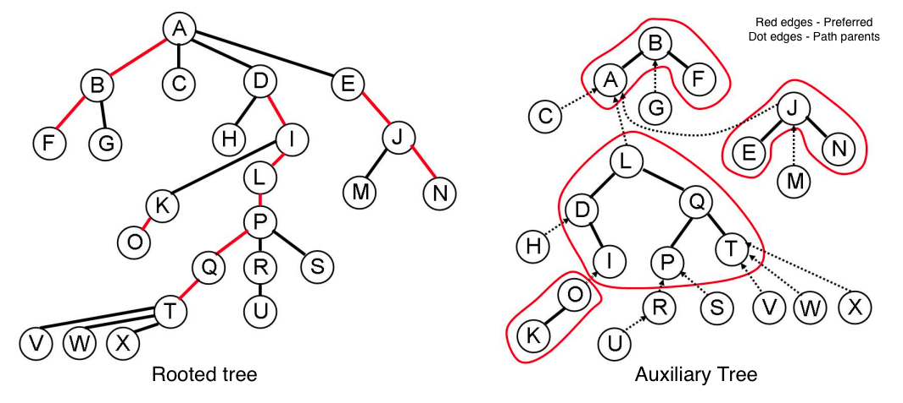

### Preferred path decomposition

Preferred child of node v:
* None if last access in v's subtree was v
* w if last access was in child w's subtree

Preferred path = chain of preferred edges, preferred paths partitions represented tree into paths.


### Auxiliary trees

Represent each preferred path by a splay tee keyed on **depth**
* root of aux. tree stores path parent - path's top node's parent in represented tree
* aux trees + path parent pointers = tree of auxiliary trees


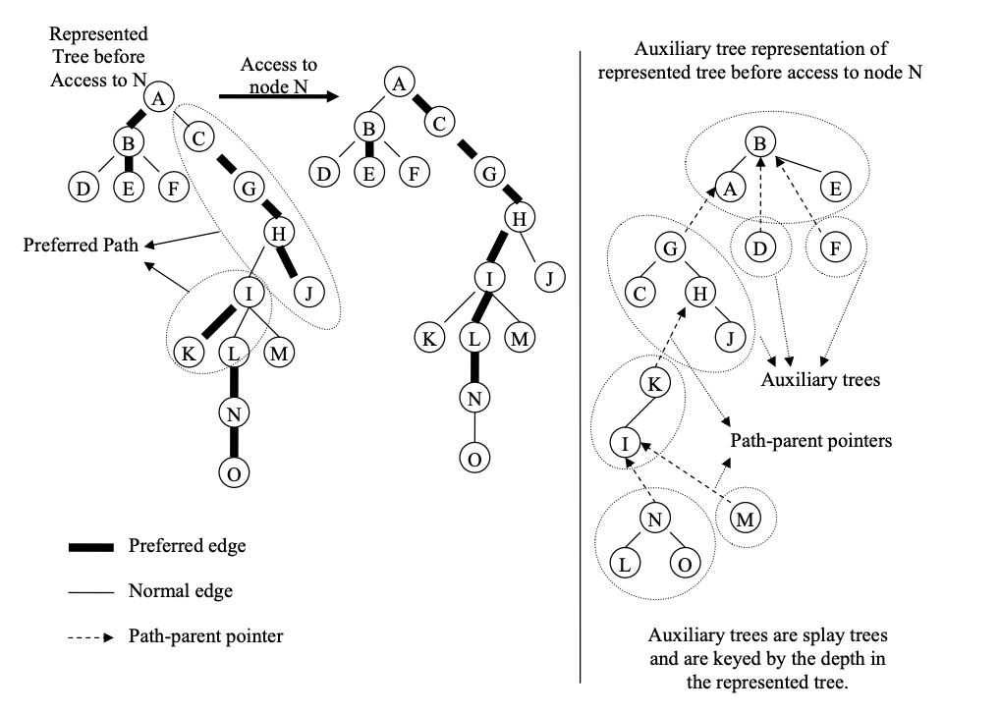

### Access/Expose

The Expose(v)/Access(v) operation is an extended splay operation that brings v to the root of the auxiliary/virtual tree without changing the structure of the rooted tree. The important parts of this operation are to make sure that the path from v to the root is preferred(solid) and that the splay tree representing the path to which v belongs is rooted at v.


After performing an access to node v, it will no longer have any preferred children, and will be at the end of the path. Since nodes in the auxiliary tree are keyed by depth, this means that any nodes to the right of v in the auxiliary tree must be disconnected. In a splay tree this is a relatively simple procedure; we splay at v, which brings v to the root of the auxiliary tree. We then disconnect the right subtree of v, which is every node that came below it on the previous preferred path. The root of the disconnected tree will have a path-parent pointer, which we point to v.

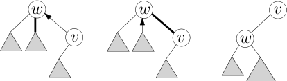

We now walk up the represented tree to the root R, breaking and resetting the preferred path where necessary. To do this we follow the path-parent pointer from v (since v is now the root, we have direct access to the path-parent pointer). If the path that v is on already contains the root R (since the nodes are keyed by depth, it would be the left most node in the auxiliary tree), the path-parent pointer will be null, and we are done the access. Otherwise we follow the pointer to some node on another path w. We want to break the old preferred path of w and reconnect it to the path v is on. To do this we splay at w, and disconnect its right subtree, setting its path-parent pointer to w. Since all nodes are keyed by depth, and every node in the path of v is deeper than every node in the path of w (since they are children of w in the represented tree), we simply connect the tree of v as the right child of w. We splay at v again, which, since v is a child of the root w, simply rotates v to root. We repeat this entire process until the path-parent pointer of v is null, at which point it is on the same preferred path as the root of the represented tree R.


### Find Root

FindRoot refers to finding the root of the represented tree that contains the node v. Since the access subroutine puts v on the preferred path, we first execute an access. Now the node v is on the same preferred path, and thus the same auxiliary tree as the root R. Since the auxiliary trees are keyed by depth, the root R will be the leftmost node of the auxiliary tree. So we simply choose the left child of v recursively until we can go no further, and this node is the root R. The root may be linearly deep (which is worst case for a splay tree), we therefore splay it so that the next access will be quick.

### Path
For this operation we wish to do some aggregate function over all the nodes (or edges) on the path from root R to node v (such as "sum" or "min" or "max" or "increase", etc.). To do this we access v, which gives us an auxiliary tree with all the nodes on the path from root R to node v. The data structure can be augmented with data we wish to retrieve, such as min or max values, or the sum of the costs in the subtree, which can then be returned from a given path in constant time.


### Cut
Here we would like to cut the represented tree at node v. First we access v. This puts all the elements lower than v in the represented tree as the right child of v in the auxiliary tree. All the elements now in the left subtree of v are the nodes higher than v in the represented tree. We therefore disconnect the left child of v (which still maintains an attachment to the original represented tree through its path-parent pointer). Now v is the root of a represented tree. Accessing v breaks the preferred path below v as well, but that subtree maintains its connection to v through its path-parent pointer.

### Link
If v is a tree root and w is a vertex in another tree, link the trees containing v and w by adding the edge(v, w), making w the parent of v. To do this we access both v and w in their respective trees, and make w the left child of v. Since v is the root, and nodes are keyed by depth in the auxiliary tree, accessing v means that v will have no left child in the auxiliary tree (since as root it is the minimum depth). Adding w as a left child effectively makes it the parent of v in the represented tree.


```python
Switch-Preferred-Child(x, y):
  path-parent(right(x)) = x
  right(x, y)


Access(v):
  Switch-Path-Parent(v, null)
  while (v is not root)
    w = path-parent(v)
    splay(w)
    Switch-Path-Parent(w, v)
    path-parent(v) = null
    v = w
  splay(v)


Link(v, w):
  Access(v)
  Access(w)
  left(v) = w
  
  
Cut(v):
  Access(v)
  left(v) = null
```  

### Demonstration of Expose/Access

Assume that splay trees are built on values of nodes.

1. Step 1 consists of walking from from v to the root of the auxiliary trees, Whenever the walk enters a splay tree(preferred path/solid edges) at some node w, a SPLAY(w) operation is performed, bringing w to the root of that tree. Note that at the end of step 1 of an Expose(v) operation, v will be
connected to the root of the auxiliary/virtual tree only by dashed edges.
2. Splicing(Changing preferred child): Step 2 consists of walking from v to the root of the virtual tree exchanging along the way each middle edge with the left subtree of the parent. A middle child of a node w and its left child can be exchanged (without changing the rooted tree) only if w is the root of its splay tree. This justifies our execution of step 1 first since at the end of step 1 all edges from v to the root are middle edges. Note that after performing this operation on every edge to the root of the virtual tree, there will be a solid path from the root of the rooted tree to the node being exposed.
3. Step 3 consists of walking from v to the root in the virtual tree, splaying v to the root.


Say we do `expose(15)` in the following rooted tree.


## Explanation with Images

Let's consider the following tree rooted at vertex 1.

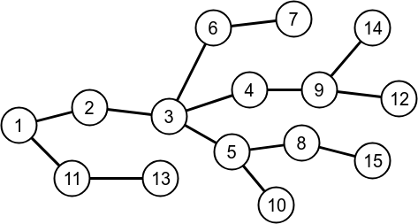

Let the following paths be preferred(these based on heavy child).

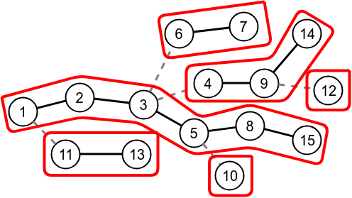

Use splay tree to store each preferred path.

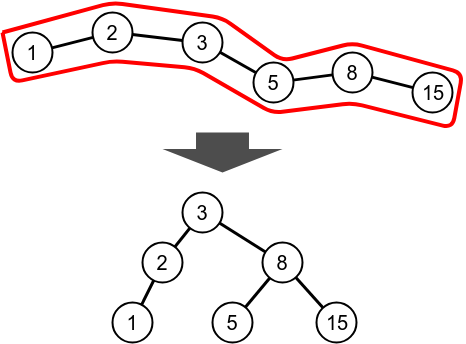

The rooted tree as auxiliary trees. Dotted edges denote path parents.

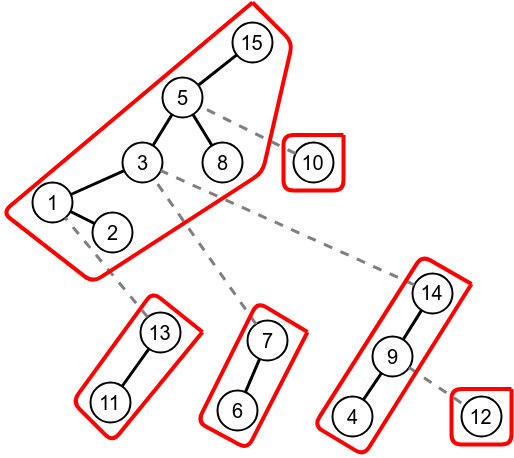

Splay operation on node 9.


Expose operation on node 9.

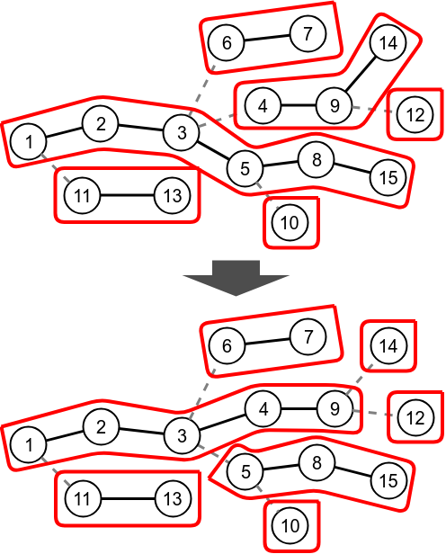

### Expose on node 12.


Splay on the path parent of node 12, here it is 8.

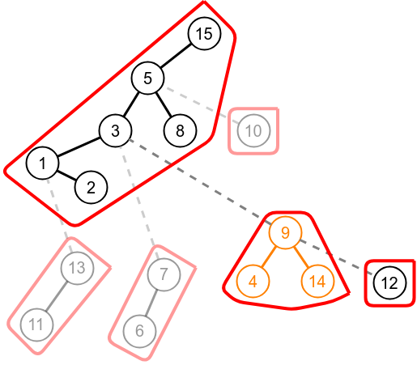

Change the preferred child(splicing) of node 9 from 14 to 12.

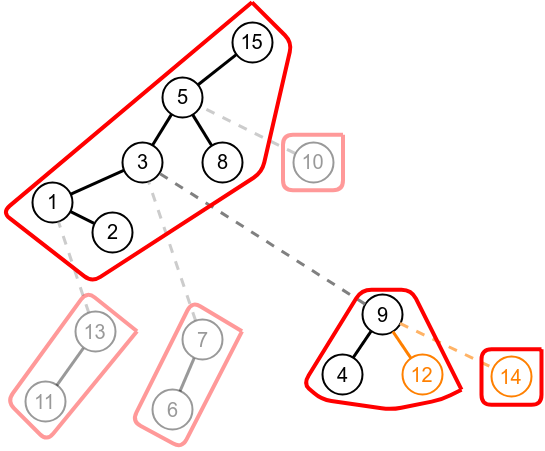

Perform a splay operation on node 3, path parent of 9.

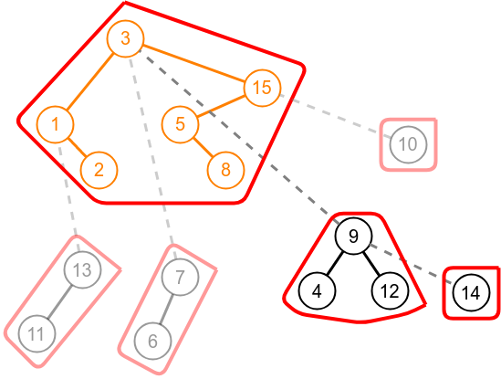

Change the preferred child of node 3 from 15 to 9. 

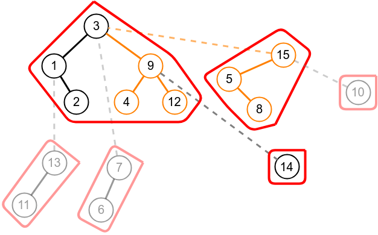

Splay on node 12.

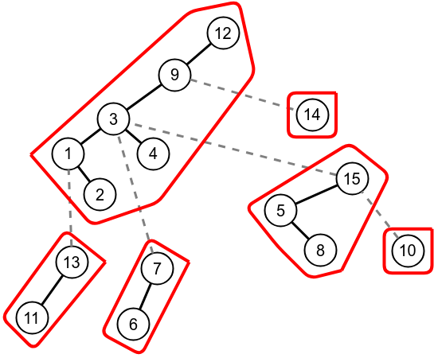

### Link operation

Connecting paths 16-17-18 under vertex 12. First we expose(12) and expose(17) then make 17 right child of 12.

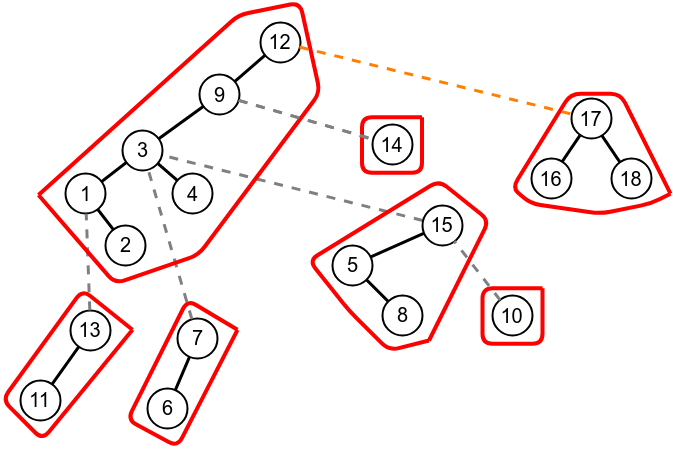

### Cut operation

Cut the pathh between vertex 3 and 4.

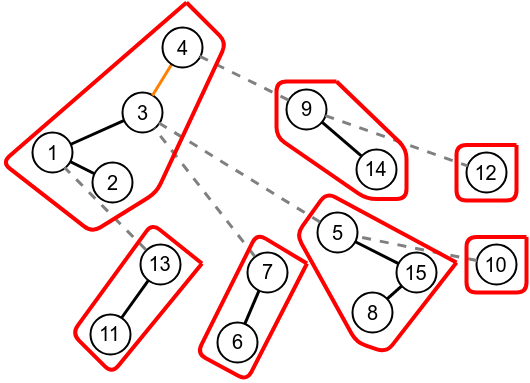

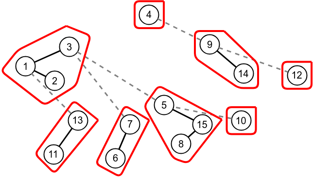

### Evert operation

The evert operation makes a node v the root of its rooted tree by reversing the path from v to the original root. Example of performing evert of vertex 5 is shown below.

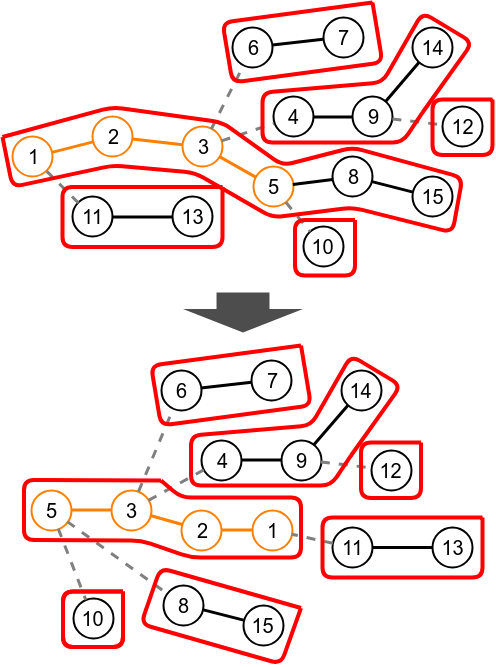

In auxiliary trees, we can expose(i) and then swap the children of node i, we will need to propogate the swap.

Expose on node 3.

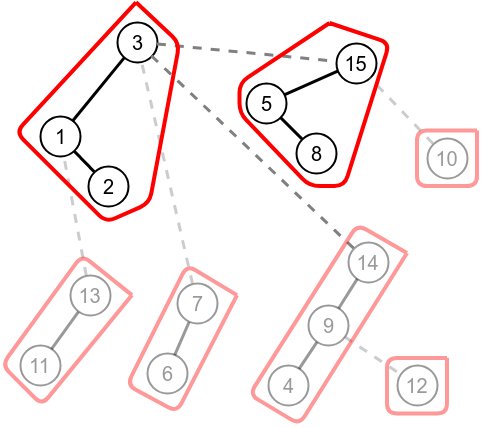

Swap the children of node 3.

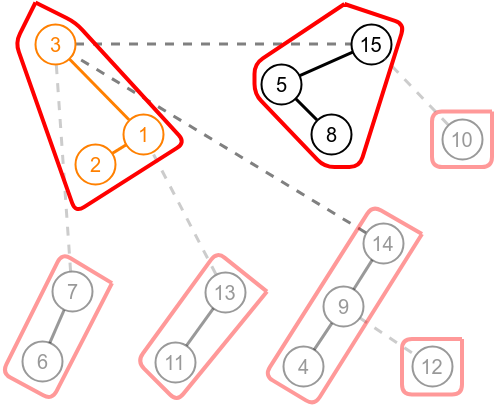

## Applications

* Link/cut trees can be used to solve the dynamic connectivity problem for acyclic graphs. Given two nodes x and y, they are connected if and only if `FindRoot(x) = FindRoot(y)`. Another data structure that can be used for the same purpose is Euler tour tree.
* In solving the maximum flow problem, link/cut trees can be used to improve the running time of Dinic's algorithm from `O(V^2E)` to `O(VE log V)`.

## Implementation

<details>
  <summary> Tjkendev Link-Cut Tree implementation </summary>

Dynamic tree data structure: A dynamic image of Heavy-Light Decomposition. The decomposed path is managed on Splay Tree.

You can perform the following operations:
* expose (i): Connect only the paths from the root vertex to the vertex i (cut the other paths)
* cut (i): Cuts the edge between the vertex i and the parent vertex p of the vertex i
* link (i, p): For two trees, connect vertices i and p to make one tree
* evert (i): Change tree root vertex to vertex i

Implementation that manages the information of each node in a separate array. Each vertex is numbered and managed by 1-indexed.

```cpp
#include<algorithm>
using namespace std;
using ll = long long;


#define N 100003

class LinkCutTree {
  int n;
  int prt[N], left[N], right[N], sz[N], rev[N];
  ll key[N], val[N];

  void update(int i, int l, int r) {
    sz[i] = 1 + sz[l] + sz[r];
    val[i] = key[i] + val[l] + val[r];
  }

  void node_swap(int i) {
    if(i) {
      swap(left[i], right[i]);
      rev[i] ^= 1; // lazy node swap
    }
  }

  bool prop(int i) {
    if(rev[i]) {
      node_swap(left[i]); node_swap(right[i]);
      rev[i] = 0;
      return true;
    }
    return false;
  }

  void splay(int i) {
    int x = prt[i];
    prop(i);

    int li = left[i], ri = right[i];
    while(x && (left[x] == i || right[x] == i)) {
      int y = prt[x];
      if(!y || (left[y] != x && right[y] != x)) { // x is root node
        if(prop(x)) {
          swap(li, ri);
          node_swap(li); node_swap(ri);
        }

        if(left[x] == i) {
          left[x] = ri;
          prt[ri] = x;
          update(x, ri, right[x]);
          ri = x;
        } else {
          right[x] = li;
          prt[li] = x;
          update(x, left[x], li);
          li = x;
        }
        x = y;
        break;
      }

      prop(y);
      if(prop(x)) {
        swap(li, ri);
        node_swap(li); node_swap(ri);
      }

      int z = prt[y];
      if(left[y] == x) {
        if(left[x] == i) {
          // i is left of x and x is left of y - Zig Zig
          int v = left[y] = right[x];
          prt[v] = y;
          update(y, v, right[y]);

          left[x] = ri; right[x] = y;
          prt[ri] = x;
          update(x, ri, y);

          prt[y] = ri = x;
        } else {
          // i is right of x and x is left of y - Zig Zag
          left[y] = ri;
          prt[ri] = y;
          update(y, ri, right[y]);

          right[x] = li;
          prt[li] = x;
          update(x, left[x], li);

          li = x; ri = y;
        }
      } else {
        if(right[x] == i) {
          // i is right of x and x is right of y - Zig Zig
          int v = right[y] = left[x];
          prt[v] = y;
          update(y, left[y], v);

          left[x] = y; right[x] = li;
          prt[li] = x;
          update(x, y, li);

          prt[y] = li = x;
        } else {
          // i is left of x and x is right of y - Zig Zag
          right[y] = li;
          prt[li] = y;
          update(y, left[y], li);

          left[x] = ri;
          prt[ri] = x;
          update(x, ri, right[x]);

          li = y; ri = x;
        }
      }
      x = z;
      if(left[x] == y) {
        left[z] = i;
        update(z, i, right[z]);
      } else if(right[z] == y) {
        right[z] = i;
        update(z, left[z], i);
      } else break;
    }

    update(i, li, ri);
    left[i] = li; right[i] = ri;
    prt[li] = prt[ri] = i;
    prt[i] = x;

    rev[i] = prt[0] = 0;
  }

public:
  LinkCutTree(int n) {
    for(int i=0; i<n+1; ++i) prt[i] = left[i] = right[i] = rev[i] = 0, sz[i] = 1;
    sz[0] = 0; left[0] = right[0] = -1;
  }

  int expose(int i) {
    int p = 0, cur = i;
    while(cur) {
      splay(cur);
      right[cur] = p;
      update(cur, left[cur], p);
      p = cur;
      cur = prt[cur];
    }
    splay(i);
    return i;
  }

  int cut(int i) {
    expose(i);
    int p = left[i];
    left[i] = prt[p] = 0;
    return p;
  }

  int link(int i, int p) {
    expose(i);
    expose(p);
    prt[i] = p;
    right[p] = i;
  }

  int evert(int i) {
    expose(i);
    node_swap(i);
    prop(i);
  }
};
```

source: https://tjkendev.github.io/procon-library/cpp/range_query/link-cut-tree.html  

Verification: AOJ: "GRL_5_D: Tree --Range Query on a Tree": [solution](https://judge.u-aizu.ac.jp/onlinejudge/review.jsp?rid=3227998#1)

</details> 

<details>
  <summary>MiFaFaOvO implementation </summary>
  
```cpp
#include <bits/stdc++.h>
using namespace std;
#define rep(i,a,n) for (int i=a;i<n;i++)
#define per(i,a,n) for (int i=n-1;i>=a;i--)
#define pb push_back
#define mp make_pair
#define all(x) (x).begin(),(x).end()
#define fi first
#define se second
#define SZ(x) ((int)(x).size())
typedef vector<int> VI;
typedef long long ll;
typedef pair<int,int> PII;
mt19937 mrand(random_device{}()); 
const ll mod=1000000007;
int rnd(int x) { return mrand() % x;}
ll powmod(ll a,ll b) {ll res=1;a%=mod; assert(b>=0); for(;b;b>>=1){if(b&1)res=res*a%mod;a=a*a%mod;}return res;}
ll gcd(ll a,ll b) { return b?gcd(b,a%b):a;}
// head

const int N=210000;
struct node {
	node *s[2],*f;
	bool rev;
	bool isr() { return !f||(f->s[0]!=this && f->s[1]!=this);}
	bool dir() { return f->s[1]==this;}
	void setc(node *c,int d) { s[d]=c;if (c) c->f=this;}
	void upd() {

	}
	void push() {
		if (rev) { swap(s[0],s[1]); rep(i,0,2) if (s[i]) s[i]->rev^=1;} rev=0;
	}
}nd[N],*cur;
stack<node*> sta;
void rot(node *x) {
	node *p=x->f;bool d=x->dir();
	if (!p->isr()) p->f->setc(x,p->dir()); else x->f=p->f;
	p->setc(x->s[!d],d);x->setc(p,!d);
	p->upd();
}
void splay(node *x) {
	node *q=x;
	while (1) { sta.push(q);if (q->isr()) break; q=q->f; }
	while (!sta.empty()) sta.top()->push(),sta.pop();
	while (!x->isr()) {
		if (x->f->isr()) rot(x);
		else if (x->dir()==x->f->dir()) rot(x->f),rot(x);
		else rot(x),rot(x);
	}
	x->upd();
}
node *expose(node *x) {
	node *q=NULL;
	for (;x;x=x->f) splay(x),x->s[1]=q,(q=x)->upd();
	return q;
}
node *findr(node *x) {
	node *q=expose(x);
	while (q->s[0]) q=q->s[0];
	splay(q);
	return q;
}

void evert(node *x) { expose(x); splay(x); x->rev^=1; x->push();}
void expose(node *x,node *y) { evert(x); expose(y); splay(x);}
void link(node *x,node *y) {
//	printf("link %d %d\n",x-nd,y-nd);
	evert(x); evert(y); x->setc(y,1);}
void cut(node *x,node *y) {
//	printf("cut %d %d\n",x-nd,y-nd);
	expose(x,y); x->s[1]=y->f=NULL;}

namespace segt {
struct node {
	int fg;
	PII s;
}nd[4*N];
PII operator + (const PII &a, const PII &b) {
	PII c(0,0); c.fi=min(a.fi,b.fi);
	if (a.fi==c.fi) c.se+=a.se;
	if (b.fi==c.fi) c.se+=b.se;
	return c;
}
void upd(int p) {
	nd[p].s=nd[p+p].s+nd[p+p+1].s;
}
void setf(int p,int v) {
	nd[p].fg+=v;
	nd[p].s.fi+=v;
}
void push(int p) {
	if (nd[p].fg) {
		setf(p+p,nd[p].fg);
		setf(p+p+1,nd[p].fg);
		nd[p].fg=0;
	}
}
void build(int p,int l,int r) {
	nd[p].fg=0;
	if (l==r) {
		nd[p].s=mp(0,1);
	} else {
		int md=(l+r)>>1;
		build(p+p,l,md);
		build(p+p+1,md+1,r);
		upd(p);
	}
}
PII query(int p,int l,int r,int tl,int tr) {
	if (tl==l&&tr==r) return nd[p].s;
	else {
		push(p);
		int md=(l+r)>>1;
		if (tr<=md) return query(p+p,l,md,tl,tr);
		else if (tl>md) return query(p+p+1,md+1,r,tl,tr);
		else return query(p+p,l,md,tl,md)+query(p+p+1,md+1,r,md+1,tr);
	}
}
void modify(int p,int l,int r,int tl,int tr,int v) {
	if (tl>tr) return;
	if (tl==l&&tr==r) return setf(p,v);
	else {
		push(p);
		int md=(l+r)>>1;
		if (tr<=md) modify(p+p,l,md,tl,tr,v);
		else if (tl>md) modify(p+p+1,md+1,r,tl,tr,v);
		else modify(p+p,l,md,tl,md,v),modify(p+p+1,md+1,r,md+1,tr,v);
		upd(p);
	}
}
}

const int M=1010;
int dx[]={0,1,0,-1},dy[]={1,0,-1,0};
int r,c,f[M][M],n;
PII pos[N];
VI eg[N];

int main() {
	scanf("%d%d",&r,&c);
	n=r*c;
	ll ans=0;
	rep(i,1,r+1) rep(j,1,c+1) {
		scanf("%d",&f[i][j]);
		pos[f[i][j]]=mp(i,j);
	}
	int pr=0;
	segt::build(1,1,n);
	rep(i,1,r*c+1) {
		if (pr<i) {
			pr=i;
			segt::modify(1,1,n,i,n,1);
		}
		while (pr<n) {
			int z=pr+1;
			int x=pos[z].fi,y=pos[z].se;
			VI ta;
			vector<node*> cc;
			rep(k,0,4) {
				int nx=x+dx[k],ny=y+dy[k];
				if (nx>=1&&nx<=r&&ny>=1&&ny<=c&&f[nx][ny]>=i&&f[nx][ny]<z) {
					ta.pb(f[nx][ny]);
					cc.pb(findr(nd+f[nx][ny]));
				}
			}
			bool succ=1;
			rep(k,0,SZ(cc)) rep(j,k+1,SZ(cc)) if (cc[k]==cc[j]) {
				succ=0;
				break;
			}
			if (succ) {
				++pr;
				segt::modify(1,1,n,pr,n,1);
				rep(k,0,SZ(ta)) {
					link(nd+pr,nd+ta[k]);
					eg[ta[k]].pb(pr);
					segt::modify(1,1,n,pr,n,-1);
				}
			} else break;
		}
		PII cc=segt::query(1,1,n,i,pr);
//		printf("gg %d %d\n",i,pr);
//		printf("cc %d %d\n",cc.fi,cc.se);
		if (cc.fi==1) ans+=cc.se;
		segt::modify(1,1,n,i,n,-1);
		for (auto v:eg[i]) {
			segt::modify(1,1,n,v,n,1);
			cut(nd+i,nd+v);
		}
	}
	printf("%lld\n",ans);
}
```

source: https://codeforces.com/contest/1109/submission/50024623
</details>

TODO: https://codeforces.com/blog/entry/67637 and https://usaco.guide/adv/LCT?lang=cpp

## REF
* https://web.stanford.edu/class/archive/cs/cs166/cs166.1166/lectures/17/Small17.pdf
* https://en.wikipedia.org/wiki/Link/cut_tree
* https://ocw.mit.edu/courses/electrical-engineering-and-computer-science/6-854j-advanced-algorithms-fall-2008/lecture-notes/lec8.pdf
* https://ocw.mit.edu/courses/electrical-engineering-and-computer-science/6-851-advanced-data-structures-spring-2012/calendar-and-notes/MIT6_851S12_Lec19.pdf
* https://smijake3.hatenablog.com/entry/2018/11/19/085919#splay%E6%93%8D%E4%BD%9C
* https://neerc.ifmo.ru/wiki/index.php?title=Link-Cut_Tree
