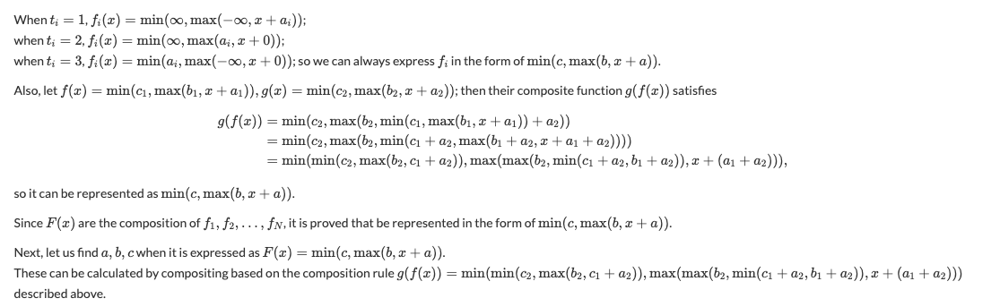
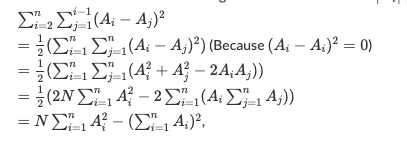

# Maths

## Well Ordering Principle

Every nonempty set of positive integers contains a smallest member.

## Division Algorithm

Let a and b be integers with b > 0. Then there exist unique integers q and r with the property that a = b*q + r, where 0 ≤ r < b.

## GCD

BÉZOUT’S THEOREM:  For any nonzero integers a and b, there exist integers s and t such that `gcd(a, b) = as + bt`. Moreover, gcd(a, b) is the smallest positive integer of the form as + bt.

If a and b are relatively prime, then there exist integers s and t such that as + bt = 1.

Euclid's lemma:
If p is a prime that divides ab, then p divides a or p divides b.

Proof: Suppose p is a prime that divides ab but does not divide a. We must show that p divides b. Since p does not divide a, there are integers s and t such that as + pt = 1. Then abs + pbt = b, and since p divides the left-hand side of this equation, p also divides b.

Some facts:

- gcd(a, b) = gcd(a, b − a)
- gcd(a, 0) = a
- gcd(a, b) is the smallest positive number in {ax + by | x, y ∈ Z}

### Proof gcd(𝑎,𝑏) = gcd(𝑎+𝑏,𝑏)

Let gcd(𝑎,𝑏)=𝑑 with 𝑑 ∈ N. We have 𝑎=𝑑𝑎<sub>1</sub>,𝑏=𝑑𝑏<sub>1</sub> with 𝑎<sub>1</sub>,𝑏<sub>1</sub> ∈ ℕ and gcd(𝑎<sub>1</sub>,𝑏<sub>1</sub>)=1.

We have 𝑎+𝑏=𝑑(𝑎<sub>1</sub>+𝑏<sub>1</sub>) and 𝑏=𝑑𝑏<sub>1</sub>. Since gcd(𝑎<sub>1</sub>,𝑏<sub>1</sub>)=1 then gcd(𝑎<sub>1</sub>+𝑏<sub>1</sub>,𝑏<sub>1</sub>)=1. Therefore gcd(𝑑(𝑎<sub>1</sub>+𝑏<sub>1</sub>),𝑑𝑏<sub>1</sub>)=𝑑 or gcd(𝑎+𝑏,𝑏)=𝑑=gcd(𝑎,𝑏).

REMARK. To prove gcd(𝑎<sub>1</sub>+𝑏<sub>1</sub>,𝑏<sub>1</sub>)=1 with gcd(𝑎<sub>1</sub>,𝑏<sub>1</sub>)=1. You assume that if gcd(𝑎<sub>1</sub>+𝑏<sub>1</sub>,𝑏<sub>1</sub>)=𝑚 > 1. Then 𝑚|𝑏<sub>1</sub> and 𝑚|(𝑎<sub>1</sub>+𝑏<sub>1</sub>)−𝑏<sub>1</sub> or 𝑚|𝑎<sub>1</sub>, a contradiction since gcd(𝑎<sub>1</sub>,𝑏<sub>1</sub>)=1. Thus, gcd(𝑎<sub>1</sub>+𝑏<sub>1</sub>,𝑏1<sub>1</sub>)=1.

## The Euclidean Algorithm

Let a = bq + r, where a, b, q, and r are integers. Then gcd(a, b) = gcd(b, r).

Proof: Suppose that d divides both a and b. Then it follows that d also divides a − bq = r

Likewise, suppose that d divides both b and r. Then d also divides bq + r = a. Hence, any
common divisor of b and r is also a common divisor of a and b.
Consequently, gcd(a, b) = gcd(b, r).

```cpp
int gcd(int a, int b) {
  while(b){int r = a % b; a = b; b = r;}
return a;
}
```

## Fermat's little theorem

FERMAT’S LITTLE THEOREM: If p is prime and a is an integer not divisible by p,
then
a<sup>p−1</sup> ≡ 1 (mod p).

Furthermore, for every integer a we have
a<sup>p</sup> ≡ a (mod p).

The modular multiplicative inverse 𝑥 of 𝑎 modulo 𝑝 is defined as

```math
a . x ≡ 1 (mod p)
```

Here, I will replace 𝑥 with inv(𝑎), so we have

a . inv(a) ≡ 1 (mod 𝑝)

a ⋅ inv(a) ≡ a<sup>p−1</sup> (mod 𝑝)

inv(a) ≡ a<sup>p−2</sup> (mod p).

## Wilson’s theorem 

Wilson's theorem states that a natural number p > 1 is a prime number if and only if

```
    (p - 1) ! ≡  -1   mod p 
OR  (p - 1) ! ≡  (p-1) mod p
```
 


## Important Modulo property

Let r = x mod p

So, x = k*p + r

If k = 0, x mod p remains to be x.

If k ≠ 0, x mod p = r = 2r/2 < (p+r)/2 ≤ (k*p+r)/2 = x/2

We realize every time a change happening on x, x will be reduced by at least a half.

So if a ≥ b then a % b < a/2

## Seive of Eratosthenes

If n is a composite integer, then n has a prime divisor less than or equal to √n

Goldbach’s Conjecture In 1742, Christian Goldbach, in a letter to Leonhard Euler, conjectured that every odd integer n, n > 5, is the sum of three primes. Euler replied that this conjecture
is equivalent to the conjecture that every even integer n, n > 2, is the sum of two primes (see
Exercise 21 in the Supplementary Exercises). The conjecture that every even integer n, n > 2, is
the sum of two primes is now called Goldbach’s conjecture

## Binomial Coefficients

<sup>n</sup>𝐶<sub>𝑘</sub> means how many ways you can choose 𝑘 items from an array of 𝑛 items, also denoted as (<sup>n</sup><sub>k</sub>). This is also known as binomial coefficients. The formula for combination is

<sup>n</sup>𝐶<sub>𝑘</sub> = n!/k!(n-k)!

Sometimes, the denominator 𝑘!(𝑛−𝑘)! is very large, but we can't modulo it since modulo operations can't be done independently on the denominator. 

C(n, 0) = C(n, n) = 1 // base cases.
C(n, k) = C(n − 1, k − 1) + C(n − 1, k) // take or ignore an item, n > k > 0.

## Modular multiplicative inverse

Getting back to the formula for combination, we can rearrange so that

<sup>n</sup>𝐶<sub>𝑘</sub> = 𝑛!⋅ 1/𝑘!⋅ 1/(𝑛−𝑘)!

Here, we can use inv(𝑎) as follows

<sup>n</sup>𝐶<sub>𝑘</sub> ≡ 𝑛! ⋅ inv(𝑘!) ⋅ inv((𝑛−𝑘)!) (mod 𝑝)

## Extended Euclid Algorithm

Standard euclid algorithm proceeds in the following way


The extended Euclidean algorithm proceeds similarly, but adds two other sequences, as follows


The computation stops when r<sub>k+1</sub> = 0, which implies
* r<sub>k</sub> is gcd of a = r<sub>0</sub> and b = r<sub>1</sub>
* Bezout coefficients are s<sub>k</sub> and t<sub>k</sub>, that is gcd(a, b) = r<sub>k</sub> = as<sub>k</sub> + bt<sub>k</sub>

Proof:

As r<sub>i+1</sub> = r<sub>i-1</sub> - r<sub>i</sub>q<sub>i</sub>, the gcd is same for (r<sub>i-1</sub>, r<sub>i</sub>) and (r<sub>i</sub>, r<sub>i+1</sub>).

As a = r<sub>0</sub> and b = r<sub>1</sub>, we have as<sub>i</sub> + bt<sub>i</sub> = r<sub>i</sub> for i = 0 and 1. The relation follows by induction for all i > 1:


Alternate Proof:

Let x and y are results for inputs a and b,

	a.x + b.y = gcd                      ----(1)  
 

And x1 and y1 are results for inputs b%a and a

	(b%a).x1 + a.y1 = gcd

When we put `b%a = (b - (⌊b/a⌋).a)` in above, we get following. Note that ⌊b/a⌋ is floor(b/a)

	(b - (⌊b/a⌋).a).x1 + a.y1  = gcd

Above equation can also be written as below

	b.x1 + a.(y1 - (⌊b/a⌋).x1) = gcd      ---(2)

After comparing coefficients of 'a' and 'b' in (1) and (2), we get following

	x = y1 - ⌊b/a⌋ * x1
	y = x1

The extended Euclidean algorithm is particularly useful when a and b are coprime (or gcd is 1). Since x is the modular multiplicative inverse of “a modulo b”, and y is the modular multiplicative inverse of “b modulo a”.

```cpp
// store x, y, and d as global variables
void extendedEuclid(int a, int b) {
    if (b == 0) { x = 1; y = 0; d = a; return; } // base case
    extendedEuclid(b, a % b); // similar as the original gcd
    int x1 = y;
    int y1 = x - (a / b) * y;
    x = x1;
    y = y1;
}
```

## Modulo inverse for every modulo m

m mod i = m − ⌊m / i⌋ ⋅ i

Taking both sides modulo m yields:

m mod i ≡ − ⌊m / i⌋ ⋅ i (mod m)

Multiply both sides by i<sup>−1</sup>⋅(m mod i)<sup>−1</sup> yields

(m mod i)⋅i<sup>−1</sup>⋅(m mod i)<sup>−1</sup> ≡ −⌊m / i⌋⋅i⋅i<sup>−1</sup>⋅(m mod i)<sup>−1</sup> mod m,

which simplifies to:

i<sup>−1</sup> ≡ −⌊m / i⌋⋅(m mod i)<sup>−1</sup> mod m

We denote by inv[i] the modular inverse of i. Then for i>1 the following equation is valid:

inv[i]=−⌊m / i⌋ ⋅ inv[m mod i] mod m

## Chinese Remainder Theorem

◮ Given a, b, m, n with gcd(m, n) = 1

◮ Find x with x ≡ a (mod m) and x ≡ b (mod n)

◮ Solution:

- Let n<sup>−1</sup> be the inverse of n modulo m
- Let m<sup>−1</sup> be the inverse of m modulo n
- Set x = ann<sup>−1</sup> + bmm<sup>−1</sup>

◮ Extension: solving for more simultaneous equations

## Minimum and Maximum

```math
min{𝛼,max{𝛽,𝛾}} = max{min{𝛼,𝛽},min{𝛼,𝛾}}


Suppose that 𝛼 ≥ max(𝛽,𝛾), so 𝛼≥𝛽 and 𝛼≥𝛾, meaning that

max(min(𝛼,𝛽),min(𝛼,𝛾)) = max(𝛽,𝛾)=min(𝛼,max(𝛽,𝛾))

Otherwise, 𝛼 < max(𝛽,𝛾), so:

max(min(𝛼,𝛽),min(𝛼,𝛾)) = max(𝛼,min(𝛼,min(𝛽,𝛾)))
= max(𝛼,min(𝛼,𝛽,𝛾)) = 𝛼 = min(𝛼,max(𝛽,𝛾))
```




GREATEST-COMMON-DIVISOR
=======================
GCD(A,B):  GCD(A,B) is the largest integer d such that A and B are both
multiples of d.  gcd(A,0)=A.    

Can we compute GCD(A,B) quickly?  Notice that the number of bits in
the input is log(A)+log(B) so we want to have a good dependence on
that.  Classic algorithm over 2000 years old called Euclid's alg.
Based on observation that GCD(A,B) = GCD(B, A mod B).  [Proof: if A
and B are multiples of d, so A = A'*d and B = B'*d, then A-kB = A'd -
kB'd is a multiple of d too.  Similarly, if B is a multiple of d and
"A mod B" is a multiple of d then A has to be a multiple of d.]

So, this is the algorithm:
      GCD(A,B)  // assume A >= B (will be true after 1st iteration anyway)
	if (B==0) return A
	else return GCD (B, A mod B)

  E.g., GCD(51, 9) = GCD(9,6) = GCD(6,3) = GCD(3,0) = 3.

Can anyone see quick argument that the number of iterations is linear
in the number of bits in the input?  One way to see this is that "A
mod B" is guaranteed to have at least one fewer bit than A.  In
particular, if B has fewer bits than A then this is easy, and if A and
B have the same number of bits, then doing A-B gets rid of the leading
1, so again it is true.  So, each iteration reduces the total number
of bits in the inputs by at least 1.

- EXTENDED GCD: also compute integers x and y such that d = Ax + By.
	        For example, A=7, B=9.  d=1.  1=4*7-3*9, so x=4, y=-3.


How to do it: can compute with same algorithm.  Recursively, running
on B and A-kB, we compute x', y',d such that d = Bx' + (A-kB)y'.  This
means that d = Ay' + B(x'-ky').  This seems like a curiosity but it
turns out to be really useful.

More on Modular Arithmetic
==========================
Z_N = {0,1,2,...,N-1}
Z_N^* = {A in Z_N : gcd(A,N) = 1}.  If N is prime, then Z_N^* = {1,2,...,N-1}

Z_N^* is a group under multiplication mod N: if you multiply two numbers
relatively prime to N, you get another number relatively prime to N.
(If N doesn't share any factors with either one, then it doesn't share
any factors with their product).  Z_N is a group under addition mod N.

[At this point we will use "(mod N)" to mean we are doing everything modulo N].

A^{-1} (mod N): the inverse of A modulo N is defined to be an integer B
in Z_N^* such that AB = 1 (mod N).  Each A in Z_N^* has an inverse modulo N.

Question: why do inverses exist, and how can we compute them quickly?
E.g., what is 5^{-1} mod 17?

Here's how: compute extended GCD of N and A.  Get x,y such that Nx+Ay=1.
So, Ay = 1 mod N: y is the inverse of A.

E.g., EGCD(17,5) calls EGCD(5,2) where 2 = 17-3*5.  This returns x'= 1, y'
= -2. So, our answer is x = -2, y = 1 - 3*(-2) = 7.  So, 5^{-1} = 7 mod 17. 

Euler's Theorem, Fermat's little theorem
========================================
Fermat's little theorem: if N is prime and A is in Z_N^*, then
A^{N-1} = 1 mod N.

So, if we pick some A (like A=2) and compute A^{N-1} mod N (which we
now know how to do efficiently), and find the result is not equal to
1, this is a PROOF that N is not prime, even though it gives us no
information about how to factor N. 

Of course it could be that composites also have the same property, but
it turns out that composites actually come in two types.  A rare type, called
Carmichael numbers have the same property as above, but they turn out
to be easy to factor and in any case they are very sparse.  The rest
of the composites N have the property that at least half of the A in
Z_N^* satisfy A^{N-1} != 1 mod N.  So if your number is not
Carmichael, and you pick 100 random A's and
they all give you 1, you can be pretty confident that the number is
prime.   This gives a a fast randomized primality test.  Recently, a
deterministic no-error polynomial-time primality test was devloped too
(but it is slower).  

Let's end by proving Fermat's little theorem, and a generalization
called Euler's theorem.  In the next class we'll extend
this further to get a randomized polynomial-time algorithm for testing
if a number is prime or composite.

DEFN: for A in Z_N^*, order(A) = smallest t such that A^t = 1 (mod N). 
DEFN: Euler phi function:  phi(N) = |Z_N^*|.
      E.g., if N is prime, then phi(N) = N-1.

THEOREM: for all A in Z_N^*, order(A) divides phi(N).

COROLLARY 1: Euler's Theorem: for any A in Z_N^*, A^{phi(N)} = 1 (mod N).
  Proof: if t is the order of A, then phi(N) = B*t for some B, and
  A^{phi(N)} = (A^t)^B = 1 (mod N). 

COROLLARY 2: Fermat's little theorem: If N is prime, then for any A in
Z_N^*, A^{N-1} = 1 mod N.

Proof of THEOREM: 
  Part 1: Note that {1, A, A^2, ..., A^{t-1}} is a subgroup of Z_N^*:
  it's closed under multiplication mod N and inverses.

  Part 2: Now we can use (and prove) a basic fact from group theory
  that THE SIZE OF ANY SUBGROUP DIVIDES THE SIZE OF THE GROUP.  

        Proof: Say H is a subgroup of G and y is not in H. Then the coset
        yH = {yh : h in H} is a set of size |H| (if y*h1 = y*h2 then
        h1 = h2) and is disjoint from H (if y*h1 = h2 then y =
        h2*h1^{-1}, which is in H by H's group closure properties).
        Furthermore, all cosets are disjoint (if z*h1 = y*h2 then z =
        y*h3 for some h3 in H).

So, that's it.

One last thing: the basic group theory fact we proved above is very
powerful for randomized algorithms.  In particular, we'll show that
if N is composite, the set of A's that are *bad* (have A^{N-1}=1 mod
N) form a subgroup.  So, if we have at least one *good* A, this means
at least half of the A's are good.  This doesn't tell us *where* they
are, but it means if we randomly pick them and try, pretty soon we'll
get one where A^{N-1} != 1 mod N.


So, if we pick some A (like A=2) and compute A^{N-1} mod N (which we
now know how to do efficiently), and find the result is not equal to
1, this is a PROOF that N is not prime, even though it gives us no
information about how to factor N.  Today we'll extend this further to
get a randomized polynomial-time algorithm for testing if a number is
prime or composite. 

RECAP
=====

DEFN: Z_N^* = {A in 1..N such that GCD(A,N)=1}

E.g., Z_15^* = {1,2,4,7,8,11,13,14}
Recall, Z_N^* is a group under multiplication mod N.  That means it's
closed under the group operation (e.g., 7*8=11 mod 15), and also every
A in Z_N^* has an inverse B in Z_N^* (AB=1 mod N).  E.g., 2^{-1} = 8
mod 15.

A REALLY IMPORTANT PROPERTY of groups: say G is a group and H
is a subgroup of G (if A,B are in H then A*B is in H; if A is in H
then A^{-1} is in H).  Then THE SIZE OF H DIVIDES THE SIZE OF G.

        E.g., G = Z_15^*, H = {1,2,4,8}. (H is the powers of 2)

(we proved this last time)

THEOREM: for all A in Z_N^*, order(A) divides phi(N).

[Recall, order(A) = smallest t>0 s.t. A^t = 1 (mod N). phi(N) = |Z_N^*|. ]

PROOF: {1, A, A^2, ..., A^{t-1}} is a subgroup of Z_N^*:
  it's closed under multiplication mod N and taking inverses.  So we
  just use our Really Important Property.

COROLLARY 1: Euler's Theorem: for any A in Z_N^*, A^{phi(N)} = 1 (mod N).

COROLLARY 2: Fermat's little theorem: If N is prime, then for any A in
Z_N^*, A^{N-1} = 1 mod N.

DEFN: N is a Carmichael number if N is composite but A^{N-1}=1 for all
A in Z_N^*.


PRIMALITY TESTING
=================
We're now going to give a fast randomized algorithm for testing if a
number is prime, with the following properties:

      if N is prime, then it outputs YES
      if N is composite, then it outputs NO with probability at least
             1 - 1/2^100.

So, if it says YES, you don't have a 100% proof that the number is
prime, but you can be pretty confident.  [Note, it was only very
recently that a *deterministic* poly-time algorithm for this problem
was developed] 


THEOREM: if N is composite but not a Carmichael number, then A^{N-1}!=1 
for *at least half* of the A in Z_N^*.

Proof: Let H = {A in Z_N^* : A^{N-1} = 1 mod N}.  Then H is a subgroup
of Z_N^* because it's closed under multiplication (if A^{N-1} = 1 and
B^{N-1} = 1 then (AB)^{N-1}=1) and inverses (if AB = 1 then
(AB)^{N-1} = 1, so if A^{N-1} = 1 then B^{N-1}=1).  This means that if
there is even a single element of G that is not in H (namely if N is
not Carmichael) then |H| is at most |G|/2.   So, right away we get
that if there is even a single witness to N being composite, there
must be a *lot* of witnesses. (QED

So, if we ignore the Carmichael numbers, then the algorithm we want is
just this:
  - pick 100 random values A between 1 and N.
  - If all have A^{N-1} = 1 mod N then output YES (Probably Prime)
  - Else output NO (Definitely Composite)

[don't even need to test GCD since if GCD is not 1 then for sure
A^{N-1} != 1 mod N]


The trick for Carmichael numbers is it turns out they are easy to
factor.  (They are also pretty rare.  Smallest is 561.)
Combining these two gives us the Miller-Rabin primality test.

More on Carmichael numbers: We're going to be able to factor
Carmichael numbers using the following idea.  Suppose we have some
number x that's not 1 or -1 mod N, such that x^2 = 1 mod N.  E.g.,
11^2 = 1 mod 15.  This means that (x-1)*(x+1) is a multiple of N, even
though neither x-1 nor x+1 is.  So, only some of the factors of N must
go into x-1 and the others into x+1 (like 10,12 for N=15).  This means
GCD(x-1,N) gives us a factor of N (as does GCD(x+1,N)), and recall
that GCD is something WE CAN COMPUTE EFFICIENTLY! 

The way we will find such an x is via the following key lemma:

KEY LEMMA: Suppose N is odd, not a prime power or perfect square, and
let t < N.  If N is composite and there exists x in Z_N^* such that
x^t != 1 (mod N), then at least half of x in Z_N^* have x^t != {-1,+1}
mod N.  Furthermore, if t is ODD, then such an x exists.

Proof of KEY LEMMA: Don't have time to go through details but one step
is you show the set of x such that x^t *is* in {-1,1} is a subgroup,
and then you also use something called the Chinese Remainder Theorem.

Proof of factoring Carmichael given our key lemma: First, we can
trivially handle Ns that are even, prime-powers, or perfect squares,
so we can assume the lemma above holds.  Now, take N-1 and pull out
all powers of 2, so that we have N-1 = B * 2^k, where B is an odd number.
Now, consider exponents t = B, 2B, 4B, 8B, ..., N-1.  The lemma says
that we can put them into two categories:
        (1) all A in Z_N^* have A^t = 1 mod N
        (2) at least half of A have A^t != 1 or -1 (mod N)
The lemma tells us that t=B is in category (2), and the fact that N is
Carmichael tells us that N-1 is in category 1.  So the world
looks something like this: 

        t =     B       2B      4B      8B      ...     N-1
        ---------------------------------------------------
   category:    2       2       1       1       ...     1
                        ^
                        call this point t_critical

Now, pick random A and compute A^B, A^{2B},..., A^{N-1}.  Define
t_critical as largest exponent in category (2).  By definition, 
there is at least 1/2 chance that A^{t_critical} != {1,-1}.  Call this
x.  So, x is not 1 or -1, but x^2 = 1 mod N.  So, we use this to factor!

 little more complexity theory
===============================
Turns out there are a number of interesting complexity classes that
you can define in terms of a polynomial-time algorithm V that takes in
two inputs: an instance I, and an auxiliary string w, where we assume
that the length of w is polynomial in the size of the instance.

NP: A is in NP if there is a polynomial-time algorithm V(I,w) such that:
  If "I" is in YES(A), then there exists w such that V(I,w) = YES.
  If "I" is in NO(A), then for all w, V(I,w) = NO.

Co-NP: other way around from NP: swap YES and NO.

RP (randomized polynomial time): A is in RP if exists poly-time V s.t.:
  If "I" is in YES(A), then for at least half of w, V(I,w) = YES.
  If "I" is in NO(A), then for all w, V(I,w) = NO.

Co-RP: the other way around.

BPP: two-sided error 
  If "I" is in YES(A), then for at least 2/3 of w, V(I,w) = YES.
  If "I" is in NO(A), then for at least 2/3 of w, V(I,w) = NO.

Can boost up the 1/2, 2/3 by repetition.  We showed primality in Co-RP.

RSA PUBLIC-KEY CRYPTOGRAPHY
===========================
RSA is an answer to the question of "how can two people communicate
securely if they have never met to exchange secret keys before?".
Answer is to somehow separate encryption and decryption.  Each person
has a public encryption key that's published in the phone book, and
then their own private decryption key that's kept secret.  To send a
msg to A, you look them up in the phone book and use their public key.
The point about public-key crypto is that just because you can encrypt
a message to A doesn't mean you can decrypt anyone else's msgs sent to A. 

RSA: Person A (Alice) subscribes by
(1) picking two large primes p and q (say 100 decimal digits long) and
        computing N = p*q.  
(2) Picking a small odd number e relatively prime to (p-1)*(q-1). E.g., e=3. 
(3) Computing d = e^{-1} mod phi(N), where phi(N) = (p-1)*(q-1).
(4) Publishing the pair (e,N) as her PUBLIC KEY in a global phone
        book, and keeping the pair (d,N) secret as her SECRET KEY.  
        The primes p and q can now be thrown away.

Person B(Bob) sends msg M to Alice by computing x = M^e mod N, and sending x.

(5) To decrypt, Alice computes x^d mod N, which is M.

[Ignoring various issues like: might want to prepend garbage onto M so
that eavesdropper can't guess-and-check] 

Let's now look at details of how/why all this works:
 STEP 1: a reasonable proportion of random numbers are prime.  So can
   just pick random numbers and test, until we get two primes.

 STEP 3:  just requires computing inverse which we know how to do.

 STEP (5): Why do we get back M?
   Answer is that this comes from Euler's theorem.  
   x^d = M^{de} mod N.  By definition, de = 1 + k*phi(N).  So,
   M^{1 + k*phi(N)} = M*M^{phi(N)^k} = M*1^k = M (mod N).
   Also: use fast exponentiation here since d might be a large number.

======================================================================

Why might we expect RSA to be secure?  Here is one fact: given N and
e, finding the decryption key d is as hard as factoring.  (Though this
doesn't say there might not be some other way of decrypting a message
that people haven't thought of).

## Summations


=======

## Bit operations

XOR any numerical input.  `a + b - ab(1 + a + b - ab)`


XOR binary input.  `a + b - 2ab or (a-b)²`


### Derivation

Basic Logical Operators  `NOT = (1-x),  AND = x*y`

From those operators we can get `OR = (1-(1-a)(1-b)) = a + b - ab`


Note: If a and b are mutually exclusive then their and condition will always be zero - from a Venn diagram perspective, this means there is no overlap. In that case, we could write `OR = a + b`, since `a*b = 0` for all values of a & b.

### 2-Factor XOR

Defining XOR as `(a OR B) AND (NOT (a AND b))` where (a OR B) --> `(a + b - ab)` and (NOT (a AND b)) --> `(1 - ab)` then these conditions together to get `(a + b - ab)(1 - ab) = a + b - ab(1 + a + b - ab)`

### Addition

```math
a + b = ((a AND b) << 1) + (a XOR b)
```
###
Sum-Xor property: ` a + b = a ⊕ b + 2(a & b )`. Extended Version with two equations: `a + b = a | b + a & b` AND `a ⊕ b = a | b − a & b`

## Sum of powers


Pretty useful in many random situations


## Fast Exponentiation

```cpp
double pow(double a, int n) {
  if(n == 0) return 1;
  if(n == 1) return a;
  double t = pow(a, n/2);
  return t * t * pow(a, n%2);
}
```

### Iterative implementation

```cpp
double pow(double a, int n) {
  double ret = 1;
  while(n) {
    if(n%2 == 1) ret *= a;
    a *= a; n /= 2;
  }
  return ret;
}
```

## Linear Algebra

◮ Solve a system of linear equations

◮ Invert a matrix

◮ Find the rank of a matrix

◮ Compute the determinant of a matrix

◮ All of the above can be done with Gaussian elimination
