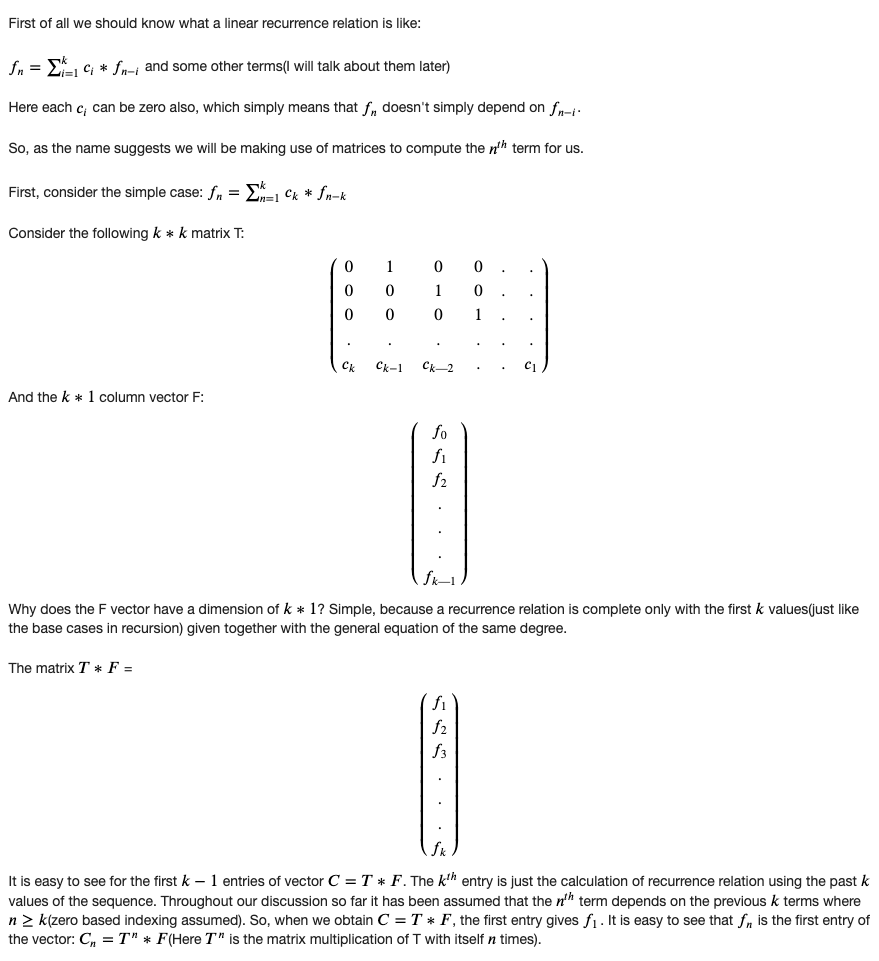
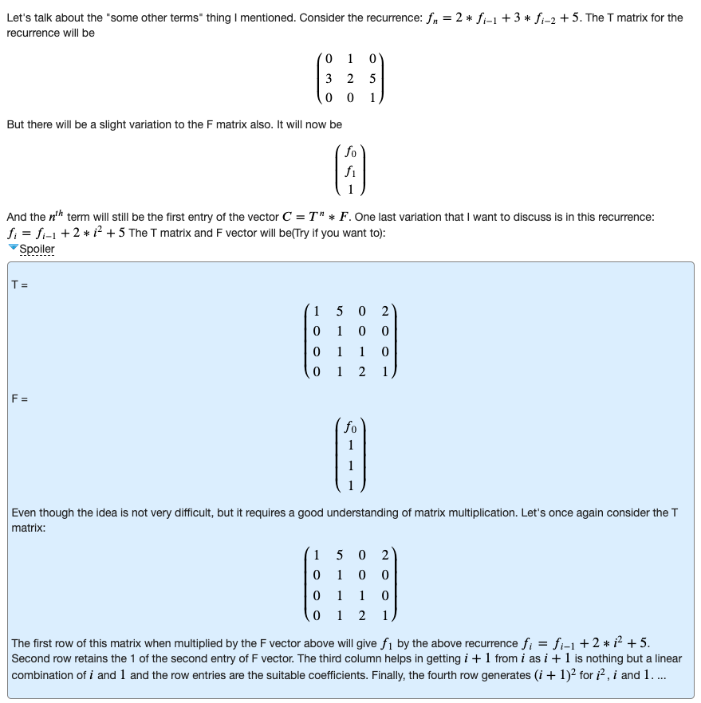
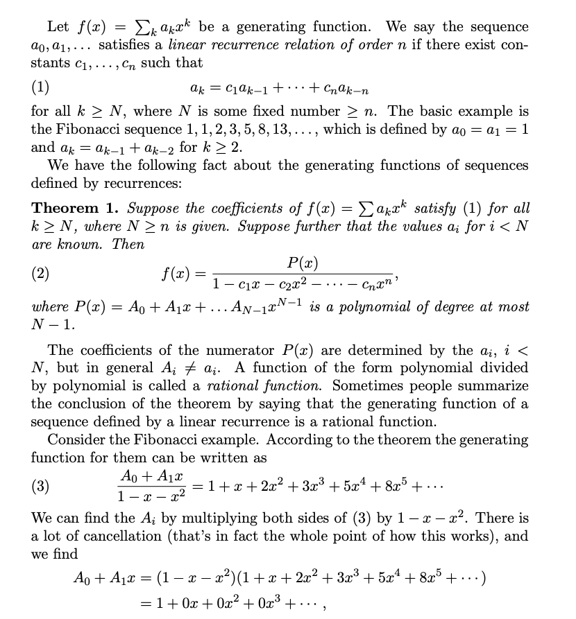

## Introduction:

Don't be confused with the title, this article has nothing to do with "how to calculate an exponent of a given matrix", rather it will discuss on how to use this technique to solve a specific class of problems.

Sometimes we face some problems, where, we can easily derive a recursive relation (mostly suitable for dynamic programming approach), but the given constraints make us about to cry, there comes the matrix exponentiation idea. The situation can be made more clear with the following example:

Let, a problem says: find f(n) : n'th Fibonacci number. When n is sufficiently small, we can solve the problem with a simple recursion, f(n) = f(n-1) + f(n-2), or, we can follow dynamic programming approach to avoid the calculation of same function over and over again. But, what will you do if the problem says, given 0 < n < 1000000000, find f(n) % 999983 ? No doubt dynamic programming will fail!

We'll develop the idea on how and why these types of problems could be solved by matrix exponentiation later, first lets see how matrix exponentiation can help is to represent recurrence relations.

## Prerequisite:

Before continuing, you need to know:

Given two matrices, how to find their product, or given the product matrix of two matrices, and one of them, how to find the other matrix.

Given a matrix of size d x d, how to find its n'th power in O( d3log(n) ).

## Patterns:

What we need first, is a recursive relation, and what we want to do, is to find a matrix M which can lead us to the desired state from a set of already known states. Let, we know k states of a given recurrence relation, and want to find the (k+1)th state. Let M be a k x k matrix, and we build a matrix A:[k x 1] matrix from the known states of the recurrence relation, now we want to get a matrix B:[k x 1] which will represent the set of next states, i.e. M x A = B, as shown below:

        |  f(n)  |   | f(n+1) |
        | f(n-1) |   |  f(n)  |
    M x | f(n-2) | = | f(n-1) |
        | ...... |   | ...... |
        | f(n-k) |   |f(n-k+1)|

So, if we can design M accordingly, job's done!, the matrix will then be used to represent the recurrence relation.

### Type 1:

Lets start by the simplest one, f(n) = f(n-1) + f(n-2).
So, f(n+1) = f(n) + f(n-1)
Let, we know, f(n) and f(n-1); we want to get f(n+1)
From the above situation, matrix A and B can be formed as shown below:

    Matrix A        Matrix B

    |  f(n)  |    | f(n+1) |
    | f(n-1) |    |  f(n)  |

[Note: matrix A will be always designed in such a way that, every state on which f(n+1) depends, will be present]
So, now, we need to design a 2x2 matrix M such that, it satisfies M x A = B as stated above.
The first element of B is f(n+1) which is actually f(n) + f(n-1). To get this, from matrix A, we need, 1 f(n) and 1 f(n-1). So, the 1st row of M will be [1 1].

    | 1   1 | x |  f(n)  | = | f(n+1) |
    | ----- |   | f(n-1) |   | ------ |

[Note: ----- means, we are not concerned about this value]
Similarly, 2nd item of B is f(n) which we can get by simply taking 1 f(n) from A. So, the 2nd row of M is [1 0].

    | ----- | x |  f(n)  | = | ------ |
    | 1   0 |   | f(n-1) |   |  f(n)  |

[I hope you know how a matrix multiplication is done and how the values ar assigned!]
Thus we get the desired 2 x 2 matrix M:

    | 1   1 | x |  f(n)  | = | f(n+1) |
    | 1   0 |   | f(n-1) |   |  f(n)  |

If you are confused about how the above matrix is calculated, you might try doing it this way:

We know, the multiplication of an n x n matrix M with an n x 1 matrix A will generate an n x 1 matrix B, i.e. M x A = B. The k'th element in the product matrix B is the product of k'th row of the n x n matrix M with the n x 1 matrix A in the left side.

In the above example, the 1st element in B is f(n+1) = f(n) + f(n-1). So, it's the product of 1st row of matrix M and matrix B. Let, the first row of M is [x y]. So, according to matrix multiplication,

    x * f(n) + y * f(n-1) = f(n+1) = f(n) + f(n-1)
    ⇒ x = 1, y = 1

Thus we can find the first row of matrix M is [1 1]. Similarly, let, the 2nd row of matrix M is [x y], and according to matrix multiplication:

    x * f(n) + y * f(n-1) = f(n)
    ⇒ x = 1, y = 0

Thus we get the second row of M is [1 0].

### Type 2:

Now, we make it a bit complex: find `f(n) = a * f(n-1) + b * f(n-2)`, where a, b are some constants.
This tells us, `f(n+1) = a * f(n) + b * f(n-1)`.
By this far, this should be clear that the dimension of the matrices will be equal to the number of dependencies, i.e. in this particular example, again 2. So, for A and B, we can build two matrices of size 2 x 1:

    Matrix A        Matrix B

    |  f(n)  |    | f(n+1) |
    | f(n-1) |    |  f(n)  |

Now for `f(n+1) = a * f(n) + b * f(n-1)`, we need [a b] in the first row of objective matrix M instead of [1 1] from the previous example. Because, now we need a of f(n)'s and b of f(n-1)'s.

    | a   b | x |  f(n)  | = | f(n+1) |
    | ----- |   | f(n-1) |   | ------ |

And, for the 2nd item in B i.e. f(n), we already have that in matrix A, so we just take that, which leads, the 2nd row of the matrix M will be [1 0] as the previous one.

    | ----- | x |  f(n)  | = | ------ |
    | 1   0 |   | f(n-1) |   |  f(n)  |

So, this time we get:

    | a   b | x |  f(n)  | = | f(n+1) |
    | 1   0 |   | f(n-1) |   |  f(n)  |

Pretty simple as the previous one...

### Type 3:

We've already grown much older, now lets face a bit complex relation: find `f(n) = a * f(n-1) + c * f(n-3)`.
Ooops! a few minutes ago, all we saw were contiguous states, but here, the state f(n-2) is missing. Now? what to do?

Actually, this is not a problem anymore, we can convert the relation as follows: `f(n) = a * f(n-1) + 0 * f(n-2) + c * f(n-3)`, deducing `f(n+1) = a * f(n) + 0 * f(n-1) + c * f(n-2)`. Now, we see that, this is actually a form described in Type 2. So, here, the objective matrix M will be 3 x 3, and the elements are:

    | a  0  c |   |  f(n)  |   | f(n+1) |
    | 1  0  0 | x | f(n-1) | = |  f(n)  |
    | 0  1  0 |   | f(n-2) |   | f(n-1) |

These are calculated in the same way as Type 2. [Note, if you find it difficult, try on pen and paper!]

### Type 4:

Life is getting complex as hell, and Mr. problem now asks you to find f(n) = f(n-1) + f(n-2) + c where c is any constant.

Now, this is a new one and all we have seen in past, after the multiplication, each state in A transforms to its next state in B.
f(n) = f(n-1) + f(n-2) + c
f(n+1) = f(n) + f(n-1) + c
f(n+2) = f(n+1) + f(n) + c
................................. so on

So, normally we can't get it through the previous fashions. But, how about now we add c as a state?

        |  f(n)  |   | f(n+1) |
    M x | f(n-1) | = |  f(n)  |
        |    c   |   |    c   |

Now, its not much hard to design M according to the previous fashion. Here it is done, but don't forget to verify on yours:

    | 1  1  1 |   |  f(n)  |   | f(n+1) |
    | 1  0  0 | x | f(n-1) | = |  f(n)  |
    | 0  0  1 |   |    c   |   |    c   |

### Type 5:

Lets put it altogether: find matrix suitable for `f(n) = a * f(n-1) + c * f(n-3) + d * f(n-4) + e`.

I would leave it as an exercise to reader. The final matrix is given here, check if it matches with your solution. Also find matrix A and B.

    | a  0  c  d  1 |
    | 1  0  0  0  0 |
    | 0  1  0  0  0 |
    | 0  0  1  0  0 |
    | 0  0  0  0  1 |

[Note: you may take a look back to Type 3 and 4]

### Type 6:

Sometimes, a recurrence is given like this:

    f(n) = if n is odd, f(n-1) else, f(n-2)

In short:

    f(n) = (n&1) * f(n-1) + (!(n&1)) * f(n-2)

Here, we can just split the functions in the basis of odd even and keep 2 different matrix for both of them and calculate separately. Actually, there might appear many different patterns, but these are the basic patterns.

### Type 7:

Sometimes we may need to maintain more than one recurrence, where they are interrelated. For example, let a recurrence relation be: `g(n) = 2g(n-1) + 2g(n-2) + f(n)`, where, `f(n) = 2f(n-1) + 2f(n-2)`. 

Here, recurrence g(n) is dependent upon f(n) and the can be calculated in the same matrix but of increased dimensions. Lets design the matrices A, B then we'll try to find matrix M.

    Matrix A        Matrix B

    |  g(n)  |     | g(n+1) |
    | g(n-1) |     |  g(n)  |
    | f(n+1) |     | f(n+2) |
    |  f(n)  |     | f(n+1) |

Here, `g(n+1) = 2g(n) + 2g(n-1) + f(n+1)` and `f(n+2) = 2f(n+1) + 2f(n)`.
Now, using the above process, we can generate the objective matrix M as follows:

| 2  2  1  0 |
| 1  0  0  0 |
| 0  0  2  2 |
| 0  0  1  0 |

So, these are the basic categories of recurrence relations which are used to be solved by this simple technique.
Analysis:

Now that we have seen how matrix multiplication can be used to maintain recurrence relations, we are back to out first question, how this helps us in solving recurrences on a huge range.

Recall the recurrence f(n) = f(n-1) + f(n-2).
We already know that:

    M x |  f(n)  | = | f(n+1) |
        | f(n-1) |   |  f(n)  |        ............(1)

How about we multiply M multiple times? Like this:

    M x M x |  f(n)  | = | f(n+1) |
            | f(n-1) |   |  f(n)  |

Replacing from (1):

    M x M x |  f(n)  | = M x | f(n+1) | = | f(n+2) |
            | f(n-1) |       |  f(n)  |   | f(n+1) |

So, we finally get:

    M^2 x |  f(n)  | = | f(n+2) |
          | f(n-1) |   | f(n+1) |

Similarly we can show:

    M^3 x |  f(n)  | = | f(n+3) |
          | f(n-1) |   | f(n+2) |

    M^4 x |  f(n)  | = | f(n+4) |
          | f(n-1) |   | f(n+3) |

    ...............................
    ...............................
    ...............................

    M^k x |  f(n)  | = | f(n+k) |
          | f(n-1) |   |f(n+k-1)|

Thus we can get any state f(n) by simply raising the power of objective matrix M to n-1 in O( d3log(n) ), where d is the dimension of square matrix M. So, even if n = 1000000000, still this can be calculated pretty easily as long as d3 is sufficiently small.

## Related problems:

UVa 10229 : Modular Fibonacci
UVa 10870 : Recurrences
UVa 11651 : Krypton Number System
UVa 10754 : Fantastic Sequence
UVa 11551 : Experienced Endeavour
Regards, Zobayer Hasan.

source: <https://zobayer.blogspot.com/2010/11/matrix-exponentiation.html>

## Summary

    [First Matrix] = [Second matrix] * [Third Matrix]
    | F(n)   |     =   Matrix 'C'    *  | F(n-1) |
    | F(n-1) |                          | F(n-2) |
    | F(n-2) |                          | F(n-3) |

source: <https://codeforces.com/blog/entry/67776>

## Generating functions

Given a generating function, by looking at the denominator, we can find the coefficients of the recurrence relation.

For example consider the `G.f.: (3*x^6+x^5+x^4+1)/((1-x^4)*(1-x^3)^2*(1-x^2)^2*(1-x))` from <https://oeis.org/A054473>, the denominator simplifies to `x^{15}-x^{14}-2x^{13}+2x^{11}+4x^{10}-x^9-3x^8-3x^7-x^6+4x^5+2x^4-2x^2-x+1` and the reccurence relation is `𝑓𝑛 = 𝑓𝑛−1 + 2𝑓𝑛−2 − 2𝑓𝑛−4 − 4𝑓𝑛−5 + 𝑓𝑛−6 + 3𝑓𝑛−7 + 3𝑓𝑛−8 + 𝑓𝑛−9 − 4𝑓𝑛−10 − 2𝑓𝑛−11 + 2𝑓𝑛−13 + 𝑓𝑛−14 − 𝑓𝑛−15`
