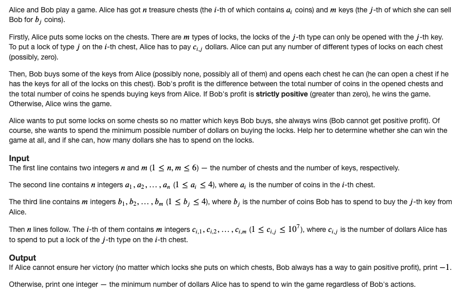

### F. Chests and Keys

source: https://codeforces.com/contest/1519/problem/F

**Solution:**

Clearly, if the sum of the coins in all the chests > cost of buying all the keys, then Bob always gains positive profit and answer is `-1`.

Observation: Note that here `n`, `m`, `aᵢ` and `bⱼ` are small.

Firstly, let's try to find some naive solution for this problem. Let's iterate on the subset of locks Alice puts on the chests. After choosing the subset of locks, how to check whether Bob can gain positive profit? We can iterate on the subset of keys he can buy as well, but in fact, this problem has a polynomial solution.

Brute force solution is to iterate over each pair of (chest, lock) and decide whether we have to put this lock on the chest or not. We have `mn = 36` number of pairs, So `2^36` will time out.

We have to minimise the cost paid by Alice, how about modelling as as flow problem and minimize the cost we have to pay?
