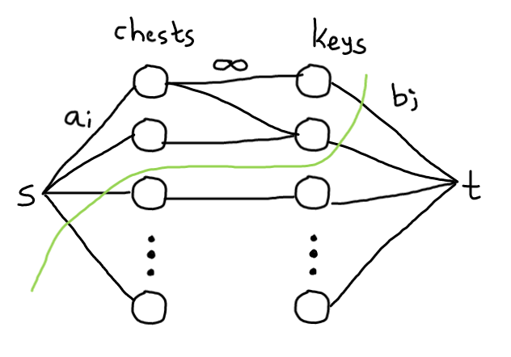

### F. Chests and Keys

source: https://codeforces.com/contest/1519/problem/F

**Solution:**

Clearly, if the sum of the coins in all the chests > cost of buying all the keys, then Bob always gains positive profit and answer is `-1`.

Observation: Note that here `n`, `m`, `aᵢ` and `bⱼ` are small. Bob's profit should be strictly positive `> 0`.

Firstly, let's try to find some naive solution for this problem. Let's iterate on the subset of locks Alice puts on the chests. After choosing the subset of locks, how to check whether Bob can gain positive profit? We can iterate on the subset of keys he can buy as well, but in fact, this problem has a polynomial solution.

Brute force solution is to iterate over each pair of (chest, lock) and decide whether we have to put this lock on the chest or not. We have `mn = 36` number of pairs, So `2^36` will time out.

Constriants are small, can we use dp? We will need to store a lot of information in each state.

We have to minimise the cost paid by Alice, how about modelling as as flow problem and minimize the cost we have to pay? Motivation for this is Project and tools problem. Source: Neal

If we iterate over the subset of locks, we choose to put then,

Consider the flow network as follows:
* Each chest and each key represents a vertex
* `n` arcs from the source to the chests(each having capacity `aᵢ`)
* `m` arcs from the vertices representing the keys to the sink(each with capacity `bⱼ`)
* For each chosen lock, an arc from the respective chest-vertex to the respective key-vertex with infinite capacity.

If we find the minimum cut from the source to the sink, then Bob's profit is `sum(aᵢ) - min_cut`.
* What ever edges from `s` to `chests` in the cut, Bob will not get these coins
* For edges `keys` to `t` which are int he cut, Bob will have to pay for the keys

Unfortunately, even iterating through all subsets of locks is too slow. To improve this solution, we should look at the minimum cut and its usage a bit more in detail. Notice that Bob can always take no keys and open no chests to get a profit of zero, so Alice's goal is to ensure that it is the best Bob's option. If Bob takes no chests and no keys, it means that the cut divides the network into two parts: the source and all other vertices. And, in terms of flows, it means that the maximum flow in this network **should saturate all arcs going from the source** (I highlighted it because it is the key idea of the solution).
