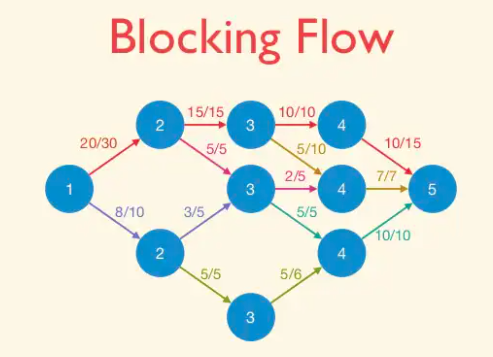

## Maximum flow problem

Formally, an instance of the maximum flow problem is specified as follows:
* a directed graph G, with vertices V and directed edges E;
* a source vertex `s ∈ V`;
* a sink vertex `t ∈ V`;
* a nonnegative and **integral** capacity c(e) for each edge `e ∈ E`;


Since the point is to push flow from s to t, we can assume without loss of generality that `s` has no incoming edges and `t` has no outgoing edges.

Given such an input, a flow is a nonnegative vector f(e) indexed by the edges of G, that satisfies two constraints:
* Capacity constraints: f(e) ≤ c(e) for every edge `e ∈ E`;
* Conservation constraints: for every vertex `v` other than `s` and `t`, ```amount of flow entering v = amount of flow exiting v```. The left-hand side is the sum of f(e) over the edge incoming to v; likewise with the outgoing edges for the right-hand side.

The objective is to compute a maximum flow — a flow with the maximum-possible value, meaning the total amount of flow that leaves `s`. (As we’ll see, this is the same as the total amount of flow that enters t.)

Let's try finding max flow using some greedy algorithm, greedy algorithms do not generally produce the best-possible solution, even though it fails, it’s still worth trying them, because the ways in which greedy algorithms break often yields insights that lead to better algorithms.

The simplest greedy approach to the maximum flow problem is to start with the all-zero flow and greedily produce flows with ever-higher value. The natural way to proceed from one to the next is to send more flow on some path from `s` to `t`.


Note that the path search just needs to determine whether or not there is an s-t path in the subgraph of edges e with fe < ue. This is easily done in linear time using your favorite graph search subroutine, such as breadth-first or depth-first search. There may be many such paths; for now, we allow the algorithm to choose one arbitrarily. The algorithm then pushes as much flow as possible on this path, subject to capacity constraints.


This greedy algorithm is natural enough, but does it work? That is, when it terminates with a flow, need this flow be a maximum flow? Our sole example thus far already provides a negative answer.

### Residual graphs

The second idea is to extend the naive greedy algorithm by allowing “undo” operations. For example, from the point where this algorithm gets stuck in above figure, we’d like to route two more units of flow along the edge (s, w), then backward along the edge (v, w), undoing 2 of the 3 units we routed the previous iteration, and finally along the edge (v, t). This would yield the maximum flow.


We need a way of formally specifying the allowable “undo” operations. This motivates the following simple but important definition, of a residual network. The idea is that, given a graph G and a flow f in it, we form a new flow network G_f that has the same vertex set of G and that has two edges for each edge of G.

An edge `e = (u, v)` of G that carries flow `f(e)` and has capacity `c(e)` spawns a “forward edge” `(u, v)` of G_f with capacity `c(e) − f(e)`
(the room remaining) and a “backward edge” `(v, u)` of G_f with capacity `f(e)` (the amount of previously routed flow that can be undone).

Observe that `s-t` paths with `f(e) < c(e)` for all edges, as searched for by the naive greedy algorithm, correspond to the
special case of `s-t` paths of `G_f` that comprise only forward edges.

#### Ford-Fulkerson Algorithm

Happily, if we just run the natural greedy algorithm in the current residual network, we get a correct algorithm, the Ford-Fulkerson algorithm.


```cpp
    setup directed residual graph with edge capacity = original graph weights
    mf = 0 // this is an iterative algorithm, mf stands for max_flow
    while (there exists an augmenting path p from s to t) {
        // p is a path from s to t that pass through +ve edges in residual graph
        augment/send flow f along the path p (s -> ... -> i -> j -> ... t)
          1. find f, the minimum edge weight along the path p
          2. decrease capacity of forward edges (e.g. i -> j) along path p by f
          3. increase capacity of backward edges (e.g. j -> i) along path p by f
        mf += f // we can send a flow of size f from s to t, increase mf
    }
    output mf // this is the max flow value
```

We claim that the Ford-Fulkerson algorithm eventually terminates with a feasible flow. This follows from two invariants, both proved by induction on the number of iterations.

* Claim: (Optimality Conditions for Maximum Flow) If f is a flow in G such that the residual network Gf has no s-t path, then the f is a maximum flow. 

Corollary: The Ford-Fulkerson algorithm is guaranteed to terminate with a maximum flow. 

We'll prove this claim with Maximum-Flow/Minimum-Cut Theorem.

The Ford-Fulkerson algorithm repeatedly finds an s-t path P in the current residual graph G_f , and augments along p as much as possible subject to the capacity constraints of the residual network.

### (s,t)-Cuts

An `(s, t)-cut` of a graph `G = (V, E)` is a partition of `V` into sets `A`, `B` with `s ∈ A` and `t ∈ B`.

Such a cut buckets the edges of the graph into four categories: those with both endpoints in A, those with both endpoints in B, those sticking out of A (with tail in A and head in B), and those sticking into A (with head in A and tail in B).


The capacity of an (s, t)-cut (A, B) is defined as sum of capacities of edges sticking out of A. Note that edges sticking in to the source-side of an (s, t)-cut to do not contribute to its capacity. A minimum cut is one with the smallest capacity.


### Optimiality Conditions for the Maximum Flow Problem

Let f be a flow in a graph G. The following are equivalent:
* f is a maximum flow of G;
* there is an `(s, t)-cut` `(A, B)` such that the value of `f` equals the capacity of `(A, B)`;
* there is no s-t path (with positive residual capacity) in the residual network G_f.

Corollary: If f is a flow in G such that the residual network Gf has no s-t path, then the f is a maximum flow.

#### Proof

**(2) ⇒ (1)**: We claim that, for every flow f and every (s, t)-cut (A, B), value of f ≤ capacity of (A, B). This claim implies that all flow values are at most all cut values; The claim implies that there no “x” strictly to the right of the “o”.


To see why the claim yields the desired implication, suppose that (2) holds. This corresponds to an “x” and “o” that are co-located in the above figure. By the claim, no “x”s can appear to the right of this point. Thus no flow has larger value than f, as desired.


**(1) ⇒ (3)**: We prove the contrapositive. Suppose `f` is a flow such that `G_f` has an `s-t` path `P` with positive residual capacity. As in the Ford-Fulkerson algorithm, we augment along `P` to produce a new flow `f'` with strictly larger value. This shows that `f` is not a maximum flow.

**(3) ⇒ (2)**: This proof is constructive. The trick is to define `A = { v ∈ V : there is an s ⇝ v path in G_f}`.

Conceptually, start graph search subroutine(BFS or DFS) from `s` untill you get stuck; A is the set of vertices you get stuck at. Note that `(A, V − A)` is an `(s, t)-cut`. Certainly `s ∈ A`, so `s` can reach itself in `G_f` . By assumption, `G_f` has no `s-t` path, so `t ∉ A`. The reason is that if there
were such an edge sticking out of A, then our graph search would not have gotten stuck at A, and A would be a bigger set. 


The above picture is of residual graph which attains maximum flow. Let's see how the edges compare to original network G.
* Every edge sticking out of A in G is saturated (meaning `f_e = c_e`). If `f_e < c_e` then we have a forward edge with positive residual capacity which is a contradiction.
* Every edge sticking into in A in G is zeroed out (f_e = 0). Otherwise `c_e - f_e > 0`, then the residual netowrk G_f would contain a forward edge of e, contradiction.


Corollary: **(Max-Flow/Min-Cut Theorem)** In every network, maximum value of a flow = minimum capacity of an (s, t)-cut.

Corollary: Given a maximum flow, and minimum cut can be computed in linear time. Use BFS or DFS to compute, in linear time, the set A from the third part of the
proof of Theorem. The proof shows that (A, V − A) is a minimum cut.

Running time of Ford-Fulkerson Algorithm is `𝑂(𝐸𝑓)` - applies only when the edge capacities are integers.

The problem is that the algorithm can keep choosing a “bad path” over and over again. (Recall that when the current residual network has multiple s-t paths, the Ford-Fulkerson algorithm chooses arbitrarily.)

Consider the following graph:


With each augmentation the flow increases by exactly 1 as the algorithm changes its mind about whether to use the middle edge; it takes 200 augmentations before the algorithm terminates, even though choosing the high-capacity top and bottom paths at the start could finish in 2.

Since we can do at most `𝑓`  iterations, and each iteration takes  𝑂(𝐸+𝑉)  time, the worst-case run time is `𝑂((𝐸+𝑉)𝑓)` which is `𝑂(𝐸𝑓)`.

We now focus on optimizing the running time.

### The Edmonds-Karp Algorithm: Shortest Augmenting Paths

In Ford-Fulkerson algorithm, we choose s-t paths arbitrarily, This motivates choosing augmenting paths more intelligently.

The Edmonds-Karp algorithm is the same as the Ford-Fulkerson algorithm, except that it always chooses a shortest augmenting path of the residual graph (i.e., with the fewest number of hops). Upon hearing “shortest paths” you may immediately think of Dijkstra’s algorithm, but this is overkill here — breadth-first search already computes (in linear time) a path with the fewest number of hops(we are only worried about hop counts here).

Edmonds-Karp is obviously correct because it is specilization of Ford-Fulkerson algorithm. The Running time of Edmonds karp algorithm is `O(m²n)`.


Intuition: The requirement that edges must go from level `L` to `L+1` prunes backwards and sideways edges. We reach `sink` as soon quickly, Thus reducing the time complexity.

Why study Edmonds-Karp, when we’re just going to learn faster algorithms later? Because it provides a gentle introduction to some fundamental ideas in the analysis of maximum flow algorithms.

#### EK Progress Lemma

Fix a network G. For a flow `f`, let `d(f)` denote the number of hops in a shortest `s-t` path(with positive residual capacity) in `G_f`, or `+∞` if no such path exists
* `d(f)` never decreases during the execution of the Edmonds-Karp algorithm
* `d(f)` increases at least once per `m` iterations.

Since `d(f) ∈ {0, 1, 2, . . . , n − 2, n − 1, +∞}`, once `d(f) ≥ n` we know that `d(f) = +∞` and `s` and `t` are disconnected in `G_f`. Thus, Lemma implies that the Edmonds-Karp algorithm terminates after at most `mn` iterations. Since each iteration just involves a breadth-first search computation, we get the running time of `O(m²n)`.

#### Observations

For the analysis, imagine running breadth-first search (BFS) in `G_f` starting from the source `s`. Recall that BFS discovers vertices in “layers,” with `s` in the `0th` layer, and layer `i + 1` consisting of those vertices not in a previous layer and reachable in one hop from a vertex in the `i-th` layer. We can then classify the edges of `G_f` as forward (meaning going from layer `i` to layer `i + 1`, for some `i`), sideways (meaning both endpoints are in the same layer),
and backwards (traveling from a layer `i` to some layer `j` with `j < i`). By the definition of breadth-first search, no forward edge of `G_f` can shortcut over a layer; every forward edge goes only to the next layer.

We define `L_f` , with the L standing for “layered,” as the subgraph of Gf consisting only of the forward edges.(Vertices in layers after the one containing t are irrelevant, so they can be discarded if desired).


 

Why bother defining `L_f` ? Because it is a succinct encoding of all of the shortest `s-t` paths of `G_f` — the paths on which the Edmonds-Karp algorithm might augment. Formally, every `s-t` in `L_f` comprises only forward edges of the BFS and hence has exactly `d(f)` hops, the minimum possible. Conversely, an `s-t` path that is in `G_f` but not `L_f` must contain at least one detour (a sideways or backward edge) and hence requires at least `d(f) + 1` hops to get to `t`.

Therefore, `s-t` path in `L_f` ⇔ Shortest `s-t` paths of `G_f`

For example, Let's see how `d(f)` changes as we simulate the algorithm for our example graph. Since we begin with the zero flow,
initially the residual graph `G_f` is the original graph `G`. Let dashed edges denote the edges which are either sideways or backward.


The `0-th` layer is s, the first layer has two vertices, and the second layer is t. Thus d(f) = 2 initially. There are two shortest paths. Suppose the Edmonds-Karp algorithm chooses to augment on the upper path, sending two units of flow. The layers remain the same: {s}, {v, w}, and {t}, with d(f) still equal to 2.


#### Proof

Note that the only thing we’re worried about is that an augmentation somehow introduces a new, shortest path that shortcuts over some layers of `L_f`.

Suppose the Edmonds-Karp algorithm augments the current flow `f` by routing flow on the path `P`. Because `P` is a shortest `s-t` path in `G_f`, it is also a path in the layered graph `L_f`. The only new edges created by augmenting on `P` are edges that go in the reverse direction of `P`. These are all backward edges, so any `s-`t of `G_f` that uses such an edge has at least `d(f) + 2` hops. Thus, no new shorter paths are formed in `G_f` after the augmentation.

Now consider a run of `t` iterations of the Edmonds-Karp algorithm in which the value of `d(f) = c` stays constant. We need to show that `t ≤ m`. Before the first of these iterations, we save a copy of the current layered network: let `F` denote the edges of `L_f` at this time, and `V0 = {s}, V1, V2, . . . , Vc` the vertices if the various layers.

Consider the first of these `t` iterations. The only new edges introduced go backward from layer `i` to layer `i-1`(from some `Vi` to `Vi-1`). By assumption, after the augmentation, there is still an `s-t` path in the new residual graph with only `c` hops. Since no edge of such a path can shortcut over one of the layers `V0, V1, . . . , Vc`, it must consist only of edges in `F`. 

Inductively, every one of these `t` iterations augments on a path consisting solely of edges in `F`. Each such iteration zeroes out at least one edge `e = (v, w)` of `F` (the one with minimum residual capacity), at which point edge `e` drops out of the current residual graph. The only way `e` can reappear in the residual graph is if there is an augmentation in the reverse direction (the direction `(w, v)`). But since `(w, v)` goes backward (from some `Vi` to `Vi−1`) and all of the `t` iterations route flow only on edges of `F` (from some `Vi` to to `Vi+1`), this can never happen. Since `F` contains at most `m` edges, there can only be `m` iterations before `d(f)` increases (or the algorithm terminates).

Note: The residual and layered networks change during these iterations, but `F` and `V0, . . . , Vc` always refer to networks before the first of these iterations.

We can improve this algorithm to O(n²m) by reorganizing the computation

### Dinic's Algorithm: Blocking Flows

The basic idea is to compute all the augmenting paths that have a certain number of edges at once, in what is called a blocking flow computation. Each iteration of this process increases the length of the shortest path from `s` to `t` by at least `1`. So the number of iterations is at most `n`.


Dinic’s algorithm can only terminate with a residual network with no s-t path, that is, with a maximum flow.

While in the Edmonds-Karp algorithm we only formed the layered network Lf in the analysis (in the proof of EK Lemma), Dinic’s algorithm explicitly
constructs this network in each iteration.

If we examine what EK does, we see that it generates a sequence of augmenting paths of nondecreasing length. What Dinic’s algorithm does is it finds all the necessary augmenting paths of a given length with one blocking flow computation. It then augments the graph by this blocking flow, and repeats.

A blocking flow is, intuitively, a bunch of shortest augmenting paths that get processed as a batch. Somewhat more formally, blocking flows are precisely the possible outputs of the naive greedy algorithm discussed at the beginning.

**Blocking Flow**: A blocking flow `g` in a network `G` is a feasible flow such that, for every `s-t` path `P` of `G`, some edge `e` is saturated by `g` `(i.e.,. fe = ue)`.

That is, a blocking flow zeroes out an edge of every s-t path.

 
 


 


Example of blocking flow. This is not a maximum flow.


 
 
 
 

**Dinic Progress Lemma**: Fix a network `G`. For a flow `f`, let `d(f)` denote the number of hops in a shortest `s-t` path (with positive residual capacity) in `G_f`,(or `+∞` if no such paths exist). If `h` is obtained from `f` by augmenting a blocking flow `g` in `G_f`, then `d(h)` > `d(f)`.

That is, every iteration of Dinic’s algorithm strictly increases the `s-t` distance in the current residual graph.

In this sense, the maximum flow problem reduces to `n` instances of the blocking flow problem (in layered networks). The running time of Dinic’s algorithm is `O(n ·BF)`, where `BF` denotes the running time required to compute a blocking flow in a layered network.

The Edmonds-Karp algorithm and its proof effectively shows how to compute a blocking flow in `O(m²)` time, by repeatedly sending as much flow as possible on a single path of `L_f` with positive residual capacity. We can compute blocking flow in `O(mn)` using depth first search.


Dinic’s algorithm uses DFS technique to find a shortest path in **layered network**. Only O(n) time is needed as it exploits level numbers of nodes. In contrast, Edmonds-Karp algorithm uses BFS technique to find a shortest path in **residual graph**, which needs O(m) time.


### Ford-Fulkerson Implementation details

We use a struct to denote an edge. An edge is denoted by the `start(from)`, the `finish(to)`, we also store the capacity `cap` and the `flow(f)` currently through this edge.

```cpp
struct TEdge{
    int from, to, cap, f;
}
```

We use a vector to store all the edges,

```cpp
vector<TEdge> edges;

vector<int> adj[VCOUNT];
```

Trick/Hack: To store the residual network, whenever we store an edge at index `i`, we store the reverse edge at index `i^1`. This way original edges are stored at even vertices `2k` and reverse edges are stored at `2k + 1`.

```cpp
void add_edge(int from, int to, int cap){
    adj[from].push_back(edges.size());
    edges.push_back({from,to,cap,0});
    adj[to].push_back(edges.size());
    edges.push_back({to,from,0,0});
}
```

Let's write the main procedure that actually pushes some flow, we will use DFS. This function returns how much value we were able to push.

```cpp
int push(int v, int w){ // starting from v, we can push atmost w units
    if(v == t) return w; // in case we reach the sink
    if(vis[v]) return 0;
    vis[v] = 1;
    for(int ind: adj[v]){
        if(edges[ind].f == edges[ind].c) continue;
        int res == push(edges[ind].to, min(w, edges[ind].cap - edges[ind].f));
        if(res == 0) continue;
        edges[ind].f += res;
        edges[ind^1].f -= res;
        return res; // we were able to push this amount of flow
    }
    return 0;
}
```

Now we want to push as much as flow as long as we have some path

```cpp
while(push(s, inf) > 0){
    vis.clear();
}
```

Inspired from Endagorion https://codeforces.com/contest/512/submission/9684294

### Edmonds-Karp Implementation Details

```pascal
maximum_flow = 0; residual_graph = network_graph
while residual_graph contains an s − t path P do:
     Let P be an s − t path in residual_graph with the minimum number of edges.
     Augment maximum_flow using P.
     Update residual_graph
end while
return maximum_flow
```

```cpp
void augment(int v, int minEdge) { // traverse BFS spanning tree from s to t
    if (v == s) { f = minEdge; return; } // record minEdge in a global variable f
    else if (p[v] != -1) {
        augment(p[v], min(minEdge, res[p[v]][v])); // recursive
        cap[p[v]][v] -= f; cap[v][p[v]] += f;
    } // update
}

int main() {
    scanf("%d %d %d", & V, & s, & t);

    for (int i = 0; i < V; i++) {
        scanf("%d", & k);
        for (int j = 0; j < k; j++) {
            scanf("%d %d", & vertex, & weight);
            cap[i][vertex] = weight;
        }
    }

    mf = 0; // mf stands for max_flow
    while (1) { // O(VE^2) (actually O(V^3E) Edmonds Karp's algorithm
        f = 0;
        // run BFS to find the shortest augmenting path
        vi dist(MAX_V, INF);
        dist[s] = 0;
        queue < int > q;
        q.push(s);
        p.assign(MAX_V, -1); // record the BFS spanning tree, from s to t!
        while (!q.empty()) {
            int u = q.front();
            q.pop();
            if (u == t) break; // immediately stop BFS if we already reach sink t
            for (int v = 0; v < MAX_V; v++) // note: this part is slow
                if (res[u][v] > 0 && dist[v] == INF)
                    dist[v] = dist[u] + 1, q.push(v), p[v] = u;
        }
        augment(t, INF); // find the min edge weight `f' along this path, if any
        if (f == 0) break; // we cannot send any more flow (`f' = 0), terminate
        mf += f; // we can still send a flow, increase the max flow!
    }

    printf("%d\n", mf); // this is the max flow value

    return 0;
}
```

source: Steven halim CP3

We can do somewhat better using adjacency list like https://cp-algorithms.com/graph/edmonds_karp.html

```cpp
int n;
vector<vector<int>> capacity;
vector<vector<int>> adj;

int bfs(int s, int t, vector<int>& parent) {
    fill(parent.begin(), parent.end(), -1);
    parent[s] = -2;
    queue<pair<int, int>> q;
    q.push({s, INF});

    while (!q.empty()) {
        int cur = q.front().first;
        int flow = q.front().second;
        q.pop();

        for (int next : adj[cur]) {
            if (parent[next] == -1 && capacity[cur][next]) {
                parent[next] = cur;
                int new_flow = min(flow, capacity[cur][next]);
                if (next == t)
                    return new_flow;
                q.push({next, new_flow});
            }
        }
    }

    return 0;
}

int maxflow(int s, int t) {
    int flow = 0;
    vector<int> parent(n);
    int new_flow;

    while (new_flow = bfs(s, t, parent)) {
        flow += new_flow;
        int cur = t;
        while (cur != s) {
            int prev = parent[cur];
            capacity[prev][cur] -= new_flow;
            capacity[cur][prev] += new_flow;
            cur = prev;
        }
    }

    return flow;
}
```

### Dinic Implementation Details
`
In order to find the blocking flow on each iteration, we may simply try pushing flow with DFS from `s` to `t in the layered network while it can be pushed. **In order to do it more quickly, we must remove the edges which can't be used to push anymore.** To do this we can keep a pointer in each vertex which points to the next edge which can be used. Each pointer can be moved at most `E` times, so each phase works in `O(VE)`.

```cpp
struct edge {
    int from, to, cap, f;
};

vector<edge> ed; //edges
vector<vector<int>> adj;
vector<int> dist, pt; //dist and ptr
int N, S, T; // src, sink

void init(int n, int s, int t) {
    N = n, S = s, T = t;
    dist = vector<int> (N);
    pt = vector<int> (N);
    adj = vector<vector<int>>(N);
}

void add_edge(int from, int to, int cap) {
    adj[from].push_back(ed.size());
    ed.push_back({from, to, cap, 0});
    adj[to].push_back(ed.size());
    ed.push_back({to, from, 0, 0});
}

bool bfs() {
    fill(dist.begin(), dist.end(), N + 1);
    queue<int> q;
    dist[S] = 0;
    q.push(S);
    while (!q.empty()) {
        int v = q.front(); q.pop();
        if (v == T) break; // reached sink
        for (int id: adj[v]) {
            int to = ed[id].to;
            if (dist[to] > dist[v] + 1 && ed[id].f < ed[id].cap)
                dist[to] = dist[v] + 1, q.push(to);
        }
    }
    // check if there is some augmenting path
    return dist[T] != N + 1; // checking if sink is reachable from source
}

int dfs(int v, int w) {
    if (v == T || w == 0) return w;
    int res = 0;
    // pt[v] stores the next nonzero edge we can take from v
    for (; pt[v] < (int)adj[v].size(); pt[v]++) {
        int id = adj[v][pt[v]];
        int to = ed[id].to;
        int go = ed[id].cap - ed[id].f;
        if (dist[to] != dist[v] + 1) continue;
        int fl = dfs(to, min(w, go));
        w -= fl; res += fl;
        ed[id].f += fl; ed[id ^ 1].f -= fl;
        if (!w) return res;
    }
    return res;
}

ll dinic() {
    ll res = 0;
    while (bfs()) {
        fill(pt.begin(), pt.end(), 0);
        while(int fl = dfs(S, INF)) res += fl;
    }
    return res;
}

int main() {
    int n; scanf("%d", &n);
    init(100, 0, 25);
    for(int i=0; i<n; i++){
        char a, b; int c;
        scanf("%c %c %d", &a, &b, &c);
        add_edge(a - 'A', b - 'A', c);
    }
    printf("%lld\n", dinic());
    return 0;
}
```

Check: https://codeforces.com/contest/1184/submission/56653284 and SPOJ submission https://www.spoj.com/status/MTOTALF,nishanth2066/

### Scaling Algorithm

Check Algorithm Design - Klienberg and Tardos


### Bipartite graph
Note: when running on bi-partite graph, the Dinic’s algorithm
turns into the Hopcroft-Karp algorithm.

## REF:

* CS261 Stanford Time Roughgarden 2016 http://timroughgarden.org/w16/l/l1.pdf
