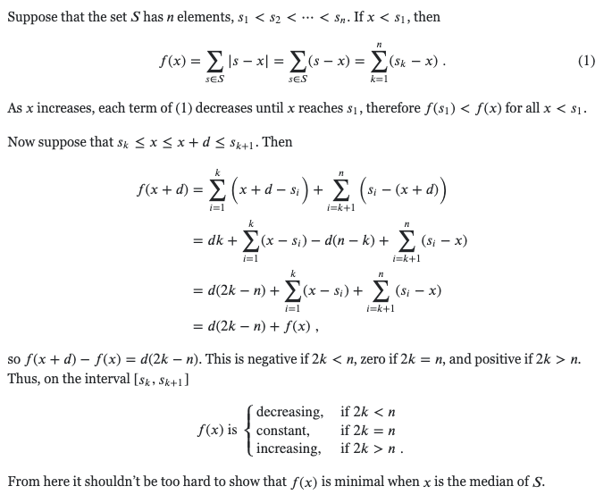
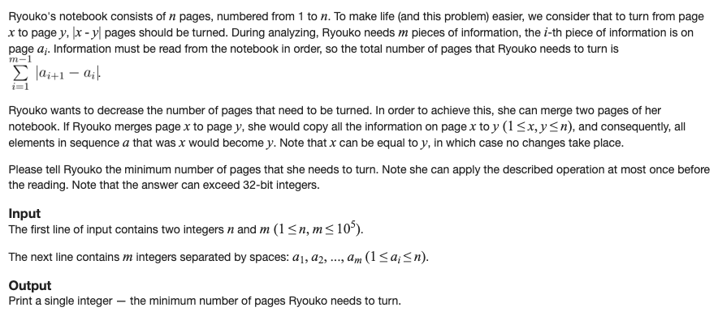
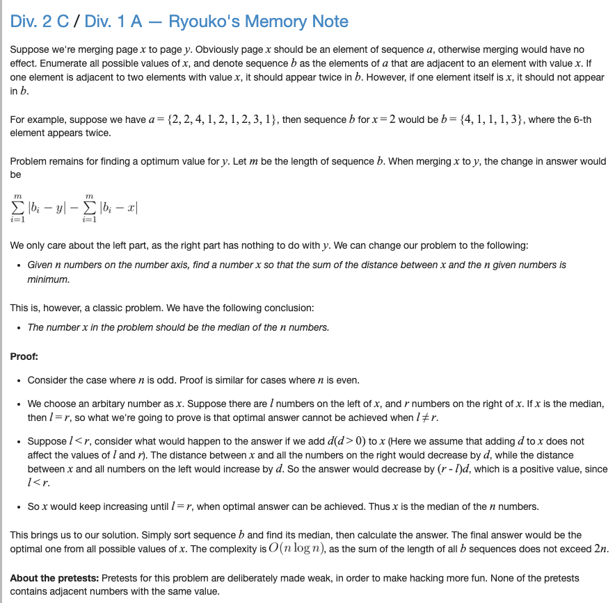

L1 norm: Suppose we have a set 𝑆 of real numbers. Show that `∑ 𝑠 ∈ S | 𝑠 − 𝑥 |` is minimal if `x` is equal to the median.

source: https://math.stackexchange.com/questions/113270/the-median-minimizes-the-sum-of-absolute-deviations-the-ell-1-norm

Applications:

Solution:

