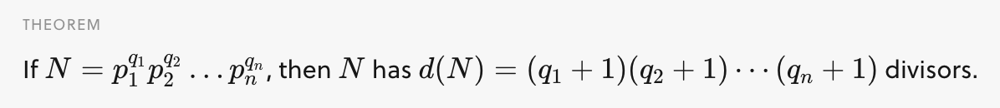

## Number Theory Basics




source: Factors. Brilliant.org. Retrieved 00:56, August 18, 2021, from https://brilliant.org/wiki/factors/

In number theory, Euler's totient function counts the positive integers up to a given integer n that are relatively prime to n. It is written using the Greek letter phi as `φ(n)`, and may also be called Euler's phi function. In other words, it is the number of integers k in the range 1 ≤ k ≤ n for which the greatest common divisor gcd(n, k) is equal to 1


## Mobius Function

An arithmetical function, or number-theoretic function is a complex-valued function defined for all positive integers. It can be viewed as a sequence of complex numbers.

In number theory, a multiplicative function is an arithmetic function `f(n)` of a positive integer `n` with the property that `f(1) = 1` and `f(ab) = f(a)f(b)` whenever `a` and `b` are coprime; `gcd(a, b) = 1`. `f(n) = f(n * 1) = f(n) f(1)` hence we need the condition that `f(1) = 1`.

If both f(x) and g(x) are multiplicative, then `h(x) = f(x)g(x)` is also multiplicative.

`d|n` means that d can divide n (without a remainder).


source: https://crypto.stanford.edu/pbc/notes/numbertheory/mult.html

Let's use the notation: `[P]` refers to the boolean expression, i.e. `[P] = 1` when `P` is true, and `0` otherwise.

The following are multiplicative functions.
* The constant function, defined by I(n) = 1
* The identity function, defined by Id(n) = n 
* Idₖ(n): The power functions, defined by `Idₖ(n) = nᵏ`
* Dirichlet identity, The unit function `[n = 1]`, 1 if n = 1 and 0 otherwise
* Mobius function as defined above


In order to prove that sum-function of mobius function is unit function, we can use the property that mobius function is multiplicative, which implies that the sum function is multiplicative and hence F(n) = F(p1^k1) F(p2^k2) ... F(pi^ki), we know that F(pi^ki) = 1 + (-1) = 0 if ki >= 1 and F(1) = 1.

source: https://codeforces.com/blog/entry/53925

Proof using Subset parity lemma https://mathlesstraveled.com/2016/12/03/the-mobius-function-proof-part-2-the-subset-parity-lemma/

## Dirichlet convolution


In other words, the convolution of f and g at n is the sum of `f(k)g(n/k)` over all positive divisors k of n.


Dirichlet convolutions are
* commutative (f ∗ g = g ∗ f), and
* associative (f ∗ (g ∗ h) = (f ∗ g) ∗ h).


Another proof of Mobius Inversion


That is, Mobius function `μ` is the inverse of constant function `I` with respect to Dirichlet convolution.

https://discuss.codechef.com/t/a-dance-with-mobius-function/11315 and https://codeforces.com/contest/1559/problem/E based on https://codeforces.com/blog/entry/93788?#comment-829004


```cpp
vector<int> smallest_factor;
vector<int8_t> smallest_power;
vector<int8_t> mobius;
vector<bool> prime;
vector<int> primes;
 
// Note: this sieve is O(n).
void sieve(int maximum) {
    maximum = max(maximum, 1);
    smallest_factor.assign(maximum + 1, 0);
    smallest_power.assign(maximum + 1, 0);
    mobius.assign(maximum + 1, 0);
    prime.assign(maximum + 1, true);
    mobius[1] = 1;
    prime[0] = prime[1] = false;
    primes = {};
 
    for (int i = 2; i <= maximum; i++) {
        if (prime[i]) {
            smallest_factor[i] = i;
            smallest_power[i] = 1;
            mobius[i] = -1;
            primes.push_back(i);
        }
 
        for (int p : primes) {
            if (p > smallest_factor[i] || i * p > maximum)
                break;
 
            prime[i * p] = false;
            smallest_factor[i * p] = p;
            smallest_power[i * p] = smallest_factor[i] == p ? int8_t(smallest_power[i] + 1) : 1;
            mobius[i * p] = smallest_factor[i] == p ? 0 : int8_t(-mobius[i]);
        }
    }
}
```

source: neal https://codeforces.com/contest/1559/submission/125955092

```cpp
const int X = 2.1e5;

bitset<X> is_prime;
vector<int> pr;
vector<int> mu(X, 0);

void init() {
    is_prime.flip();
    is_prime[0] = is_prime[1] = false;
    mu[1] = 1;
    for (int i = 2; i < X; i++) {
        if (is_prime[i]) {
            pr.push_back(i);
            mu[i] = -1;
        }
        for (int p: pr) {
            if (i * p >= X) break;
            is_prime[i * p] = false;
            if (i % p == 0) {
                mu[i * p] = 0;
            } else {
                mu[i * p] = -mu[i];
            }
            if (i % p == 0) break;
        }
    }
}
```

source: ksun48 https://codeforces.com/contest/1559/submission/125949764

Also checkout https://codeforces.com/blog/entry/8989?#comment-214114
