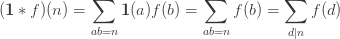
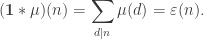

## Number Theory Basics


source: Factors. Brilliant.org. Retrieved 00:56, August 18, 2021, from https://brilliant.org/wiki/factors/

In number theory, Euler's totient function counts the positive integers up to a given integer n that are relatively prime to n. It is written using the Greek letter phi as `φ(n)`, and may also be called Euler's phi function. In other words, it is the number of integers k in the range 1 ≤ k ≤ n for which the greatest common divisor gcd(n, k) is equal to 1


```cpp
int n = 50;
for(int i = 1, la; i <= n; i = la + 1){
    la = n/(n/i);
    printf("i = %d   n/i = %d   la = %d\n", i, n/i, la);
}
 
i = 1    n/i = 50   la = 1
i = 2    n/i = 25   la = 2
i = 3    n/i = 16   la = 3
i = 4    n/i = 12   la = 4
i = 5    n/i = 10   la = 5
i = 6    n/i = 8    la = 6
i = 7    n/i = 7    la = 7   // till sqrt(n)
i = 8    n/i = 6    la = 8
i = 9    n/i = 5    la = 10  // n/j remains n/i for i ≤ j ≤ la
i = 11   n/i = 4    la = 12
i = 13   n/i = 3    la = 16
i = 17   n/i = 2    la = 25
i = 26   n/i = 1    la = 50
```

If for some `x` you have `⌊n/x⌋ = k` then the greatest `x'` such that `⌊n/x'⌋ = k` is `x' = ⌊n/k⌋` because `n/(n/k) = k` and if you divide `n` by any bigger number than `n/k` you get a smaller quotient than `k`.

Checkout Linear Seive https://codeforces.com/blog/entry/54090

## Mobius Function

An arithmetical function, or number-theoretic function is a complex-valued function defined for all positive integers. It can be viewed as a sequence of complex numbers.

In number theory, a multiplicative function is an arithmetic function `f(n)` of a positive integer `n` with the property that `f(1) = 1` and `f(ab) = f(a)f(b)` whenever `a` and `b` are coprime; `gcd(a, b) = 1`. `f(n) = f(n * 1) = f(n) f(1)` hence we need the condition that `f(1) = 1`.

If both f(x) and g(x) are multiplicative, then `h(x) = f(x)g(x)` is also multiplicative.

`d|n` means that d can divide n (without a remainder).


source: https://crypto.stanford.edu/pbc/notes/numbertheory/mult.html

Let's use the notation: `[P]` refers to the boolean expression, i.e. `[P] = 1` when `P` is true, and `0` otherwise.

The following are multiplicative functions.
* The constant function, defined by I(n) = 1
* The identity function, defined by Id(n) = n 
* Idₖ(n): The power functions, defined by `Idₖ(n) = nᵏ`
* Dirichlet identity, The unit function `[n = 1]`, 1 if n = 1 and 0 otherwise
* Mobius function as defined above


In order to prove that sum-function of mobius function is unit function, we can use the property that mobius function is multiplicative, which implies that the sum function is multiplicative and hence F(n) = F(p1^k1) F(p2^k2) ... F(pi^ki), we know that F(pi^ki) = 1 + (-1) = 0 if ki >= 1 and F(1) = 1.


source: https://codeforces.com/blog/entry/53925

Proof using Subset parity lemma https://mathlesstraveled.com/2016/12/03/the-mobius-function-proof-part-2-the-subset-parity-lemma/

## Dirichlet convolution


In other words, the convolution of f and g at n is the sum of `f(k)g(n/k)` over all positive divisors k of n.


Dirichlet convolutions are
* commutative (f ∗ g = g ∗ f), and
* associative (f ∗ (g ∗ h) = (f ∗ g) ∗ h).


Another proof of Mobius Inversion


That is, Mobius function `μ` is the inverse of constant function `I` with respect to Dirichlet convolution. `μ * I = ε` 





```cpp
vector<int> smallest_factor;
vector<int8_t> smallest_power;
vector<int8_t> mobius;
vector<bool> prime;
vector<int> primes;
 
// Note: this sieve is O(n).
void sieve(int maximum) {
    maximum = max(maximum, 1);
    smallest_factor.assign(maximum + 1, 0);
    smallest_power.assign(maximum + 1, 0);
    mobius.assign(maximum + 1, 0);
    prime.assign(maximum + 1, true);
    mobius[1] = 1;
    prime[0] = prime[1] = false;
    primes = {};
 
    for (int i = 2; i <= maximum; i++) {
        if (prime[i]) {
            smallest_factor[i] = i;
            smallest_power[i] = 1;
            mobius[i] = -1;
            primes.push_back(i);
        }
 
        for (int p : primes) {
            if (p > smallest_factor[i] || i * p > maximum)
                break;
 
            prime[i * p] = false;
            smallest_factor[i * p] = p;
            smallest_power[i * p] = smallest_factor[i] == p ? int8_t(smallest_power[i] + 1) : 1;
            mobius[i * p] = smallest_factor[i] == p ? 0 : int8_t(-mobius[i]);
        }
    }
}
```

source: neal https://codeforces.com/contest/1559/submission/125955092

```cpp
const int X = 2.1e5;

bitset<X> is_prime;
vector<int> pr;
vector<int> mu(X, 0);

void init() {
    is_prime.flip();
    is_prime[0] = is_prime[1] = false;
    mu[1] = 1;
    for (int i = 2; i < X; i++) {
        if (is_prime[i]) {
            pr.push_back(i);
            mu[i] = -1;
        }
        for (int p: pr) {
            if (i * p >= X) break;
            is_prime[i * p] = false;
            if (i % p == 0) {
                mu[i * p] = 0;
            } else {
                mu[i * p] = -mu[i];
            }
            if (i % p == 0) break;
        }
    }
}
```

source: ksun48 https://codeforces.com/contest/1559/submission/125949764

## Problems


**Example 5.** Calculate `GCD(1, 1) * GCD(1, 2) * ... * GCD(1, M) * GCD(2, 1) * GCD(2, 2) * ... * GCD(2, M) * ... * GCD(N, 1) * GCD(N, 2) * ... * GCD(N, M)`.

where GCD is defined as the Greatest Common Divisor. 

https://www.hackerrank.com/contests/w3/challenges/gcd-product/problem

**Solution**


```cpp
#include <cstdio>
#include <algorithm>
using namespace std;

#define maxn 15000000 + 5
#define mod 1000000007
#define tm Tm

int n, m, i, j, p[maxn], dp[maxn], sf[maxn], sfn, g, tn, tm, ret, pref[maxn], l, c, p1, p2, r, carry;
long long sfm[maxn], t;

// binomial exponentiation
int pw (int x, long long p) {
    if (!p) return 1;
    if (p == 1) return x;
    int q = pw(x, p >> 1);
    q = (1LL * q * q) % mod;
    if (p & 1) q = (1LL * q * x) % mod;
    return q;
}

int main () {
    scanf("%d %d", &n, &m);
    if (n < m) swap(n, m);
    // smallest prime factor of i = p[i]
    for(i = 2; i <= n; i++) if (p[i] == 0) {
        j = i;
        while (j <= n) {
            if (!p[j]) p[j] = i;
            j += i;
        }
    }
    for(i = 2; i <= n; i++) {
        // mobius function -> dp[i]
        if (i == p[i]) dp[i] = -1; 
        else if (p[(i / p[i])] == p[i]) dp[i] = 0; // if some prime^2 divides i
        else dp[i] = -1 * dp[i / p[i]];
        pref[i] = pref[i - 1] + dp[i];
    }
    
    for(i = 1; i <= n; i++) if (dp[i] != 0) {
        sf[++sfn] = i; // square free number
        sfm[sfn] = dp[i]; // mobius of square free number
    }
    sf[sfn + 1] = m + 1;
    ret = 1;
    carry = 1, t = 1, tn = tm = -1;
    for(g = 2; g <= m; g++) {
        if (n / g != tn || m / g != tm) {
            ret = (ret * 1LL * pw(carry, t)) % mod;
            carry = 1LL;
        } else {
            carry = (carry * 1LL * g) % mod;
            continue;
        }
        tn = n / g;
        tm = m / g;
        t = 1LL * tn * tm;
        if (g <= 600000) {
            l = 1;
            while (l <= tm) {
                ++c;
                r = min(min(tn / (p1 = tn / l), tm / (p2 = tm / l)), tm);
                // till r -> p1 & p2 doesn't change, hence use prefix sums for mobius function
                t += p1 * 1LL * p2 * (pref[r] - pref[l - 1]);
                l = r + 1;
            }
            // there are only 2*sqrt(max(n,m)) different values for p1 and p2
        } else {
            // brute force computation of f(tn, tm)
            for(i = 1; sf[i] <= tm; i++) 
                t += sfm[i] * (tn / sf[i]) * (tm / sf[i]);
        }
        carry = (1LL * carry * g) % mod;
    }
    ret = (ret * 1LL * pw(carry, t)) % mod;
    printf("%d\n", ret);
    return 0;
}
```

Also checkout https://codeforces.com/blog/entry/8989?#comment-214114

TODO: https://discuss.codechef.com/t/a-dance-with-mobius-function/11315 and https://codeforces.com/contest/1559/problem/E based on https://codeforces.com/blog/entry/93788?#comment-829004

**Problem:**


**Solution:**


```cpp
const int nax = 1e5 + 10;

#define MOD 998244353

struct mi {
    int v; explicit operator int() const { return v; } 
    mi() { v = 0; }
    mi(ll _v):v(_v%MOD) { v += (v<0)*MOD; }
};
mi& operator+=(mi& a, mi b) { 
    if ((a.v += b.v) >= MOD) a.v -= MOD; 
    return a; }
mi& operator-=(mi& a, mi b) { 
    if ((a.v -= b.v) < 0) a.v += MOD; 
    return a; }
mi operator+(mi a, mi b) { return a += b; }
mi operator-(mi a, mi b) { return a -= b; }
mi operator*(mi a, mi b) { return mi((ll)a.v*b.v); }
mi& operator*=(mi& a, mi b) { return a = a*b; }
mi pow(mi a, ll p) { assert(p >= 0); // asserts are important! 
    return p==0?1:pow(a*a,p/2)*(p&1?a:1); }
mi inv(mi a) { assert(a.v != 0); return pow(a,MOD-2); }
mi operator/(mi a, mi b) { return a*inv(b); }

int l[nax], r[nax]; // input

const int X = 1e5 + 10;
bitset<X> is_prime;
vector<int> pr;
int mu[nax];

void init() {
    is_prime.flip();
    is_prime[0] = is_prime[1] = false;
    mu[1] = 1;
    for (int i = 2; i < X; i++) {
        if (is_prime[i]) {
            pr.push_back(i);
            mu[i] = -1;
        }
        for (int p: pr) {
            if (i * p >= X) break;
            is_prime[i * p] = false;
            if (i % p == 0) {
                mu[i * p] = 0;
            } else {
                mu[i * p] = -mu[i];
            }
            if (i % p == 0) break;
        }
    }
}

int main() {
    int n, m; scanf("%d %d", &n, &m);
    for(int i=0;i<n;i++) scanf("%d %d", &l[i], &r[i]);

    init();
    mi total = 0;
    for(int d=1; d<=m; d++){
        if(mu[d] == 0) continue;
        // li/d <= ai <= ri/di
        // Use Knapsack DP to find sum(ai) = m/d
        int S = m/d + 1;
        vector<mi> dp(S, 0);
        dp[0] = 1;
        for(int i=0; i<n; i++){
            vector<mi> psum(S+1, 0); // prefix sums
            for(int x=0; x<S; x++) psum[x+1] = psum[x] + dp[x];
            int newl = (l[i] + d - 1)/d; // ceil of l[i]/d
            int newr = r[i]/d; // floor of r[i]/d
            vector<mi> ndp(S, 0);
            if(newl <= newr){
                for(int x = 0; x < S; x++){
                    // number of pairs such that a1 + a2 + ... + ai = x and newl <= ai <= newr
                    // a1 + a2 + ... + a(i-1) in between [x-newr,  x-newl]
                    // sum[x - newl + 1]  - sum[(x - newr + 1) - 1]
                    ndp[x] = psum[max(x - newl + 1, 0)] - psum[max(x - newr, 0)];
                }
            }
            dp = ndp;
        }
        mi ans = 0;
        for(mi v:dp) ans += v;
        total += ans * mu[d];
    }
    printf("%d\n", (int)total);
    return 0;
}
```

REF: https://math.berkeley.edu/~stankova/MathCircle/Multiplicative.pdf
