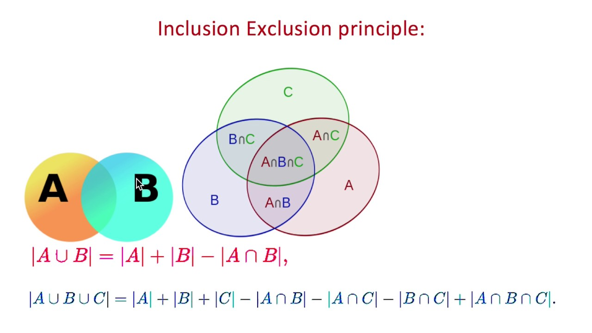
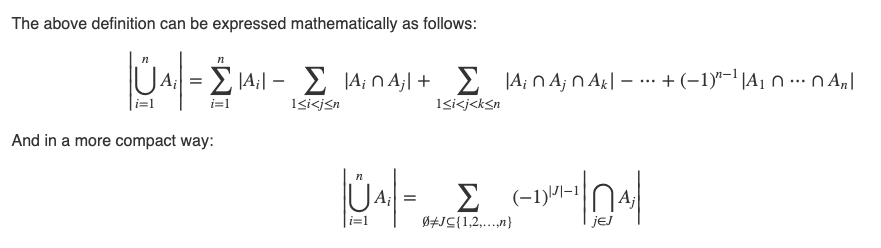

https://atcoder.jp/contests/abc206/tasks/abc206_e

Inclusion exclusion priniciple https://dyingdown.github.io/2019/08/15/Inclusion-Exclusion-Principle/ and http://www.ryanhmckenna.com/2016/04/counting-coprime-pairs-using-inclusion.html

The principle of inclusion exclusion is a very powerful idea that can be used to solve alot of problems that arise in combinatorics.

https://codeforces.com/blog/entry/54090 and https://codeforces.com/blog/entry/53925
