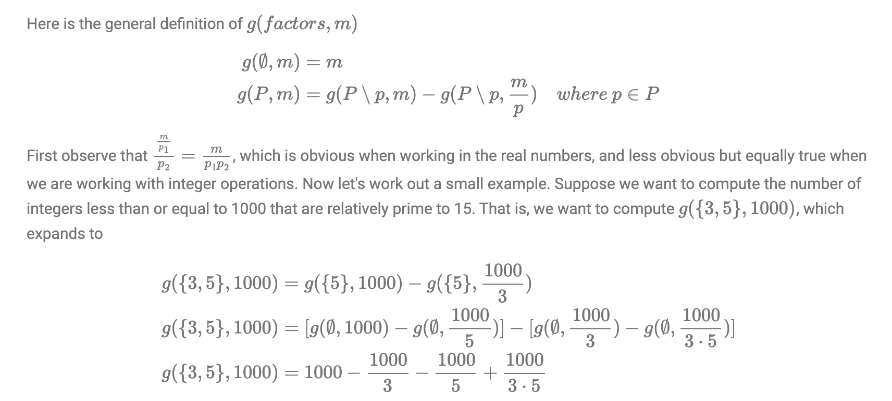

```cpp
bool prime(int n) {
    if (n < 2) return false;
    if (n <= 3) return true;
    if (!(n % 2) || !(n % 3)) return false;
    for (int i = 5; i * i <= n; i += 6)
        if (!(n % i) || !(n % (i + 2))) return false;
    return true;
}
```

Inclusion exclusion priniciple https://dyingdown.github.io/2019/08/15/Inclusion-Exclusion-Principle/ and http://www.ryanhmckenna.com/2016/04/counting-coprime-pairs-using-inclusion.html and http://laurentmazare.github.io/2014/09/14/counting-coprime-pairs

The principle of inclusion exclusion is a very powerful idea that can be used to solve alot of problems that arise in combinatorics and number theory.


Let's say we want to count the number of positive integers `k` that are less than or equal to `r` and relatively prime to `n`. Task: Given two numbers `n` and `r`, count the number of integers in the interval `[1;r]` that are relatively prime to n (their greatest common divisor is 1).

Using set theoretic notation, week seek to find the cardinality of the set  `{p ∣ p ∈ {1,2,…,r}, gcd(n, p) = 1}`  where  gcd  is the greatest common divisor function. 

We will count `f(n, r)` the complement of task(the number of integers which are not relatively prime to `n`) and then exclude them from `r`. For this we will use inclusion exclusion priniciple, let's denote the prime factors of `n` as `pᵢ (1 ≤ i ≤ k)`, If we create sets for numbers divisible by each `pᵢ` then


```cpp
int solve (int n, int r) {
    vector<int> p; // prime divisors of n
    for (int i=2; i*i<=n; ++i)
        if (n % i == 0) {
            p.push_back (i);
            while (n % i == 0)
                n /= i;
        }
    if (n > 1)
        p.push_back (n);

    int sum = 0;
    for (int msk=1; msk<(1<<p.size()); ++msk) {
        int mult = 1, bits = 0;
        for (int i=0; i<(int)p.size(); ++i)
            if (msk & (1<<i)) {
                ++bits;
                mult *= p[i];
            }

        int cur = r / mult; // number of divisors in [1:r]
        if (bits % 2 == 1)
            sum += cur; // inclusion
        else
            sum -= cur; // exclusion
    }

    return r - sum;
}
```

Let's define `g(primeFactors(n), m) =  m - f(n, m)` then 



This expansion is exactly equivalent to the formula from the inclusion exclusion method, although it's much easier to implement. This recursive function works because once the set of prime factors have been exhausted, every combination of primes have been produced, and the associated term in the inclusion exclusion formula has the correct sign for the contribution.

In number theory, Euler's totient function counts the positive integers up to a given integer n that are relatively prime to n. 

### Application of Inclusion exclusion priniciple 
Given integers L and L , R ( L ≤ R ) , find the number of pairs ( x , y ) of integers satisfying all of the conditions below: L ≤ x , y ≤ R Let g be the greatest common divisor of x and y . Then, the following holds

* `L ≤ x,y ≤ R` (1 ≤ L ≤ R ≤ 10⁶)
* Let `g` be the greatest common divisor of `x` and `y`. Then `g ≠ 1, x/g ≠ 1 and y/g ≠ 1`.

https://atcoder.jp/contests/abc206/tasks/abc206_e

Solution:
* `(i, i)` doesn't satifiy the given conditions as `gcd(i, i) = i` and `i/i = 1`. So we will calculate `(x, y)` such that `x < y` and multiply this by `2` to get the final answer.
* If `x < y` then obviously `y/gcd(x,y) ≠ 1` as `gcd(x, y) ≤ x`. So we only need to worry about `g ≠ 1` and `x/g ≠ 1` conditions.
* First consider the case where `g ≠ 1` i.e count the number of integer pairs such that two integers are relatively prime. From this we subtract the case where `x/g = 1`
* To count the number of pairs of coprime integers x, y. We can use inclusion-exclusion prinicple. Specifically, it can be counted as follows.
  * For every integer `k` ( 2 ≤ k ≤ R ) that does not have two or more same prime factors, count the number of multiples of `k`, obtained by `⌊R/k⌋ − ⌊(L − 1)/k⌋`, which we will denote A . 
  * Then, if k has odd number of prime factors, we add combination C(A, 2) to the answer; otherwise we subtract C(A, 2) from the answer. The number of distinct prime factors in k can be precalculated in the same way to the Eratosthenes' sieve.
* To count the pairs that satisfy `x/g == 1` and `g ≠ 1`, we find the multiples of `g = x`

```cpp
#include<bits/stdc++.h>
 
using namespace std;
 
int main(){
  long long l,r;
  cin >> l >> r;
  long long res=0;
  vector<int> cnt(1048576,0);
  for(long long i=2;i<=r;i++){
    if(cnt[i]!=0){continue;}
    for(long long j=i;j<=r;j+=i){cnt[j]++;}
    // exclude numbers having two or more same prime factors
    for(long long j=i*i;j<=r;j+=i*i){cnt[j]=-1000000007;}
  }
  for(long long i=2;i<=r;i++){
    if(cnt[i]<0){continue;} // i has more than one same prime factor
    long long cc=(r/i)-((l-1)/i);
    if(cnt[i]%2){res+=(cc*(cc-1))/2;} // inclusion
    else{res-=(cc*(cc-1))/2;} // exclusion
  }
  // exclude tha pairs where (x=g, y)
  for(long long i=max(2ll,l);i<=r;i++){res-=(r/i-1);}
  cout << 2*res << '\n';
  return 0;
}
```

Another solution: https://atcoder.jp/contests/abc206/submissions/23577424

```cpp
typedef long long ll;
typedef pair<int, int> P;
ll c[1000010];
ll c1[1000010];
int main()
{
	ll l, r;
    cin>>l>>r;
    for(ll d=2; d<=r; d++){
        for(ll x=d; x<=r; x+=d){
            if(x<l) continue;
            c[d]++;
        }
    }
    ll ans=0;
    for(ll d=r; d>=2; d--){
        c1[d]=c[d]*c[d];
        for(ll x=2*d; x<=r; x+=d) c1[d]-=c1[x];
        ans+=c1[d];
        if(d>=l) ans-=2*c[d]-1;
    }
    cout<<ans<<endl;
    return 0;
}
```

https://codeforces.com/blog/entry/54090 and https://codeforces.com/blog/entry/53925

TODO: https://open.kattis.com/problems/coprimeintegers
