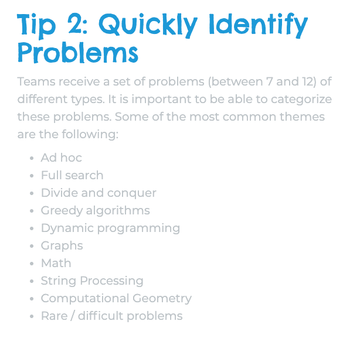
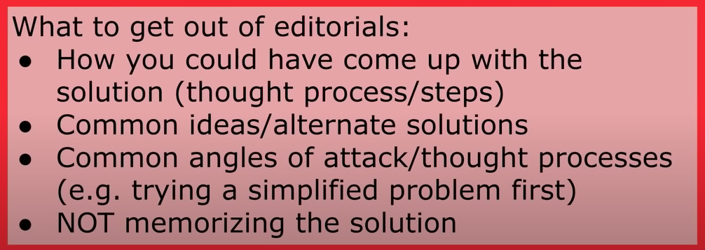

* First, **reread the problem statement**. Did you miss something important? Are you sure you have understood what the problem is asking for? Double-check your understanding on the sample input and output. Break down the problem and make progress by attacking.
* While answering/solving questions, try to keep the problem at the center of your thought process. Using
known patterns or adapting one to the problem is encouraged so long as it doesn’t require force
fitting. If you are unable to find a natural fit, prefer thinking from scratch.
the parts.
* Text given in the bold is very important, make sure that you use all the information and constriants given in the problem statement.
* If we are asked to maximize or minimize a value, think if we can make sure of binary search. Example: https://leetcode.com/problems/split-array-largest-sum/
	<details>
	<summary>Example</summary>
	
	We have an array of `n` non-negative integers which we must split into `m` subarrays in such a way that the largest sum of a subarray among these `m` subarrays is minimized.
	
	This problem satisfies the property that we can guess the answer (the minimum largest sum subarray value) and check if that value was too high or too low, thus narrowing our search space.

	The goal of this problem is to find the minimum largest subarray sum with `m` subarrays. Instead of finding the answer directly, what if we try to guess the answer (say `X`), and check whether this particular value could be the largest subarray sum with `m` subarrays. If this is possible, we can check all values for `X ≥ max_element(arr)`, and the first value that satisfies the condition will be the answer. Thus, by repeatedly solving the following problem, we can find the minimum largest subarray sum needed to split nums into `m` subarrays:

	Given an array of `n` integers and a value `X`, determine the minimum number of subarrays the array needs to be divided into such that no subarray sum is greater than `X`.

	If the minimum number of subarrays required is less than or equal to `m` then the value `X` could be the largest subarray sum.
	</details>

* If N is upto 10^12, then may be we will need to do prime factorization of N, Or use divisors of N and do something.
* If you are asked to count/find something, check if finding the complement of it is easier.
* Whenever you see, there is atleast `⌈N/2⌉` or `⌈N/3⌉` elements in the answer, see if you can use randomization. Say we need to have atleast `⌈N/2⌉` elements in the answer, if we choose a person at random, there is half probability that element is in the answer. So if we repeat this process say 30 times, then the probability of failure reduces to `(1/2)^30`. Hence this works most of the time.
  * Problem: https://codeforces.com/contest/1523/problem/D , Solution: https://codeforces.com/contest/1523/submission/117881477
  
* If you see “rollbacks” in the problem statement - this is 99.9% a reference to persistence problem.
* If you can solve the problem for a chain using a segment tree, then there is a very good chance that you can solve the problem for a tree using HLD. Indeed, if you make segment trees over the heavy edges, then the answer for your path X-Y can be broken up into two paths from X to LCA(X, Y) and from Y to LCA(X, Y). Then, using that you make only logN shifts from one heavy-chain to another, you are actually making only log(N) segment-tree queries.
* All trees are bipartite, If we color them black and white, The min(number of black, number of white) nodes is ≤ ⌈n/2⌉. source: https://codeforces.com/contest/1534/problem/D
* If the given array is of odd length and we reverse prefix of odd length, then parity of number at some index doesn't change. https://codeforces.com/contest/1561/problem/E
* When order of the numbers doesn't matter, it is better to sort the numbers, https://www.codechef.com/problems/THREEDIF
* If the problem is complex, first try to solve simplified version of the problem. For e.g If the problem is of higher dimensions say 2, check what happens in linear case first and then try to generalize etc.
* Whenever something is done with 2 difference, check if you handle even and odd case seperately, https://codeforces.com/contest/1567/problem/C
* When constrains are too small, say ~ 40, think if we can think DP of higher mutil-dimensions or some flow problem. https://codeforces.com/contest/1593/problem/D2
* Strings — if the sum of lengths is `𝑆` then there are at most `√𝑆` distinct lengths.
* Say, you are given two types of operations: 1) Incrementing/Decremening the number. 2) Swapping one index with another index. In other words, the only procedure allowed is:

   - first perform swaps any number of (possible zero) times;
   - then perform increment/decrement any number of (possible zero) times.
This modification does not change the answer. Because, “swapping after incrementing/decrementing” can be replaced with “incrementing/decrementing after swapping.”
* A common technique to minimize/maximize a bitwise function is that, we can optimize for the most significant bit(MSB) first to least significant bit. For minimum bitwise OR, any solution with MSB 0 is better than any solution with MSB 1. REF: https://codeforces.com/contest/1624/problem/G (For this problem: Iterate through the bits in decreasing order and try to check if we solve the problem with edges with bit zero can make a spanning tree. You can use disjoint set union to check if edges with bit zero can make the graph connected).
* If we wanted to store set of characters then we can mask. Storing integer is much more efficient than set or bit vector.
* In problem when we need to convert a number startValue to target, sometimes it is better if we can think in reverse. Example: We need to covert source to target using 1) multiply the number on display by 2, or 2) subtract 1 from the number on display. Instead of making startValue equal to target by `*1` and `-1` We can use `/2` and `+1` operation to reduce target to startValue and count steps. Ref: https://leetcode.com/problems/broken-calculator/

	<details>
	<summary> Explanation </summary>
	
	The motivation for this is that it turns out we always greedily divide by 2:
	* If say target is even, then if we perform 2 additions and one division, we could instead perform one division and one addition for less operations [`(target + 2) / 2` vs `target / 2 + 1`].
	* If say target is odd, then if we perform 3 additions and one division, we could instead perform 1 addition, 1 division, and 1 addition for less operations [`(target + 3) / 2` vs `(target + 1) / 2 + 1`].

	```cpp
	    int brokenCalc(int startValue, int target) {
		if(target <= startValue) return startValue - target;
		if(target & 1) {
		    return 1 + brokenCalc(startValue, target+1);
		}
		return 1 + brokenCalc(startValue, target/2);
	    }
	```
	</details>

* Sometimes, doing it from back might help, Ref: https://leetcode.com/contest/weekly-contest-295/problems/steps-to-make-array-non-decreasing/. You are given a `0`-indexed integer array nums. In one step, remove all elements `nums[i]` where `nums[i - 1] > nums[i]` for all `0 < i < nums.length`. Return the number of steps performed until nums becomes a non-decreasing array.
  <details>
  <summary> Explanation </summary>

	```python
	class Solution:
	    def totalSteps(self, a: List[int]) -> int:
		z = 0
		b = []
		n = len(a)
		l = 0
		for i in a[::-1]:
		    c = 0
		    while len(b) and i > b[-1][0]:
			x, y = b.pop()
			c += 1 + max(y - c - 1, 0)
		    z = max(z, c)
		    b.append((i, c))
		return z
	```
  </details>
				       
```cpp
/* stuff you should look for
	* int overflow, array bounds
	* special cases (n=1?)
	* do smth instead of nothing and stay organized
	* WRITE STUFF DOWN
	* DON'T GET STUCK ON ONE APPROACH
*/

// Do something instead of nothing, stay organised, stay ahead!, WRITE STUFF DOWN

// WA
// 1. overflow
// 2. re-initialize global variables for every test case.
// 3. edge cases like n=1

// Run time error
// 1. division by zero.
// 2. array bounds.
```




### LeetCode Patterns

If input array is sorted then
- Binary search
- Two pointers

If asked for all permutations/subsets then
- Backtracking

If given a tree/graph then
- DFS
- BFS

If given a linked list then
- Two pointers

If recursion is banned then
- Stack

If must solve in-place then
- Swap corresponding values
- Store one or more different values in the same pointer

If asked for maximum/minumum subarray/subset/options then
- Dynamic programming

If asked for top/least K items then
- Heap

If asked for common strings then
- Map
- Trie

Else
- Map/Set for O(1) time & O(n) space
- Sort input for O(nlogn) time and O(1) space

	

