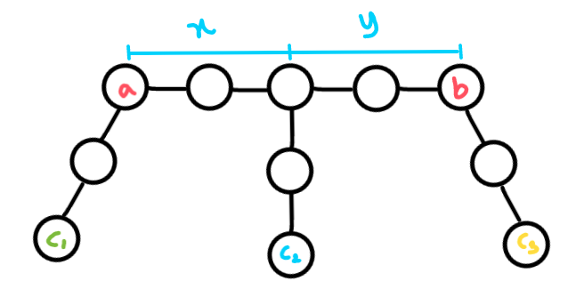

* Given is a trial that succeeds in probability p ( p ≠ 0 ) . Then the expected number of trials until the first success (including the last succeeding one) 
is `1/p` . 

Proof: Let X be the desired expected value. After a trial, we can terminate the trials if it is successful, while we go back to the starting point if unsuccessful; 
therefore we have equation `X = 1 + ( 1 − p ) X` . By transformation we have `p X = 1` , thus `X = 1/p` .

### Tree Array

You are given a tree consisting of n(2≤ n ≤ 200) nodes. You generate an array from the tree by marking nodes one by one.

Initially, when no nodes are marked, a node is equiprobably chosen and marked from the entire tree.

After that, until all nodes are marked, a node is equiprobably chosen and marked from the set of unmarked nodes with at least one edge to a marked node.

The final array 𝑎 is the list of the nodes' labels in order of the time each node was marked. Find the expected number of inversions in the array that is generated by the tree and the aforementioned process.

**Solution:** 

Fix the initial node chosen and root the tree there, what is the contribution of each pair of nodes? Say we have two nodes `a` and `b` and  value at `a < b` now a inversion pair `(a, b)` is counted only if `b` is choosen before `a`. Nothing matters besides the path from node `a` to node `b`, and the initially chosen node `c`.

Fixing a given root `c`, the expected value of the entire process is obviously the sum of the expected values for a fixed root divided by `n`.

Find the contribution of the inversion of two nodes `(a,b)` where `a < b`. The expected contribution for any pair `(a,b)` is equal to the probability that `b` appears before `a` with a given root.

It depends on the probabilty from distance of `lca(a,b)` and `a` and the distance of `lca(a,b)` and `b`. Suppose that `F[x][y]` defines the probability that node  `b` is visited first than node `a`, then `𝐹[𝑥][𝑦] = (𝐹[𝑥−1][𝑦] + 𝐹[𝑥][𝑦−1])/2`. Intuitively, this is because the probability of decreasing `x` or decreasing`y` is always the same, so the probability of transitioning the state we end up transitioning to is always the same, regardless of `p`.



For any node `c₂` which is in between `a` and `b`, `x = dist[a][c₂] - d` where `d = (dist[a][c₂] + dist[b][c₂] - dist[a][b])/2`, `d` is the distance from `c₂` to lca(a, b) when tree is rooted at `c₂`. For any node `c₁` → `x = 0`  and for any node `c₃` → `y = 0`.

```cpp
#include<bits/stdc++.h>

using namespace std;

# define ll long long

int MOD = 1e9 + 7;

struct mi {
 	int v; explicit operator int() const { return v; } 
	mi() { v = 0; }
	mi(ll _v):v(_v%MOD) { v += (v<0)*MOD; }
};
mi& operator+=(mi& a, mi b) { 
	if ((a.v += b.v) >= MOD) a.v -= MOD; 
	return a; }
mi& operator-=(mi& a, mi b) { 
	if ((a.v -= b.v) < 0) a.v += MOD; 
	return a; }
mi operator+(mi a, mi b) { return a += b; }
mi operator-(mi a, mi b) { return a -= b; }
mi operator*(mi a, mi b) { return mi((ll)a.v*b.v); }
mi& operator*=(mi& a, mi b) { return a = a*b; }
mi pow(mi a, ll p) { assert(p >= 0); // asserts are important! 
	return p==0?1:pow(a*a,p/2)*(p&1?a:1); }
mi inv(mi a) { assert(a.v != 0); return pow(a,MOD-2); }
mi operator/(mi a, mi b) { return a*inv(b); }


const int inf = (int)1e8;
const int nax = 205;

mi F[nax][nax];

int main() {
    int n;
    scanf("%d", &n);
    vector<vector<int>> G(n, vector<int>(n, inf));
    for(int i=0;i<n-1;i++){
        int x, y;
        scanf("%d %d", &x, &y);
        x--; y--;
        G[x][y] = 1; G[y][x] = 1;
    }

    // floyd warshall - all pairs shortest path
    for(int k=0;k<n;k++)
        for(int i=0;i<n;i++)
            for(int j=0;j<n;j++)
                G[i][j] = min(G[i][j], G[i][k] + G[k][j]);


    // calculate probabilities based on distance x, y
    F[0][0] = 0;
    for(int i=1;i<n;i++){
        F[0][i] = 0;
        F[i][0] = 1;
    }
    for(int i=1;i<n;i++)
        for(int j=1;j<n;j++)
            F[i][j] = (F[i-1][j] + F[i][j-1])/2;


    mi ans = 0;
    for(int a=0;a<n;a++){
        for(int b=a+1;b<n;b++){
            for(int c=0;c<n;c++){
                int x = G[a][c], y = G[b][c];
                int d = (x + y - G[a][b])/2;
                x -= d; y -= d;
                ans += F[x][y];
            }
        }
    }
    printf("%d\n", (int)(ans/n));
    return 0;
}
```

source: tourist https://codeforces.com/contest/1540/submission/120542169
