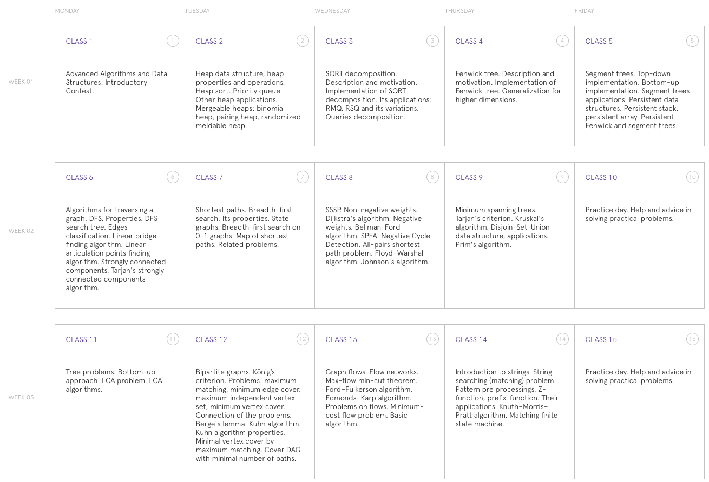

* Thomas Jefferson Senior Computer Team https://activities.tjhsst.edu/sct/otherlectures, https://github.com/tjsct
* IIT BHU Programming Club https://www.copsiitbhu.co.in/resources/cp/potw/
* Stanford https://stanford.edu/class/cs97si/
* Bjarki Ágúst Guðmundsson https://algo.is/
* UBD https://sites.google.com/site/ubcprogrammingteam/educational and https://www.students.cs.ubc.ca/~cs-490/2017W2/
* https://kmyk.github.io/competitive-programming-library/
* http://acm.mipt.ru/twiki/bin/view/Algorithms/WebHome and http://acm.math.spbu.ru/~sk1/
* http://neerc.ifmo.ru/wiki/index.php
* https://upcommons.upc.edu/bitstream/handle/2117/104161/127102.pdf?sequence=1&isAllowed=y
* http://algolist.ru/
* http://www.secmem.org/blog/2019/06/17/%EC%95%8C%EA%B3%A0%EB%A6%AC%EC%A6%98-%EB%AC%B8%EC%A0%9C-%ED%92%80%EC%9D%B43/
* http://noi-ph-training.herokuapp.com/topics
* https://www.fatalerrors.org/a/basic-mo-team-algorithm.html
* https://aryansh.gitbook.io/informatics-notes/binary-lifting/binary-lifting-gold-part-1
* https://github.com/nealwu/competitive-programming
* https://ekzlib.netlify.app/home
* https://mzhang2021.github.io/cp-blog/berlekamp-massey/
* CRT https://forthright48.com/chinese-remainder-theorem-part-2-non-coprime-moduli/
* https://codeforces.com/blog/entry/95106

Topics from Harbour Space Advanced Data Structure Course

Problems
* https://codeforces.com/blog/entry/55274

### Algorithm encyclopedia
* https://noshi91.github.io/algorithm-encyclopedia/#noredirect

