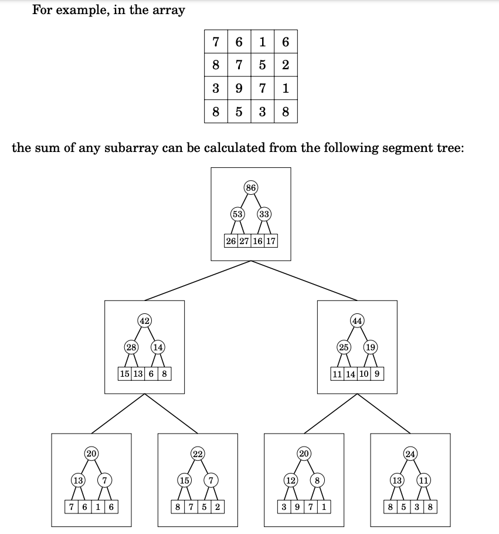
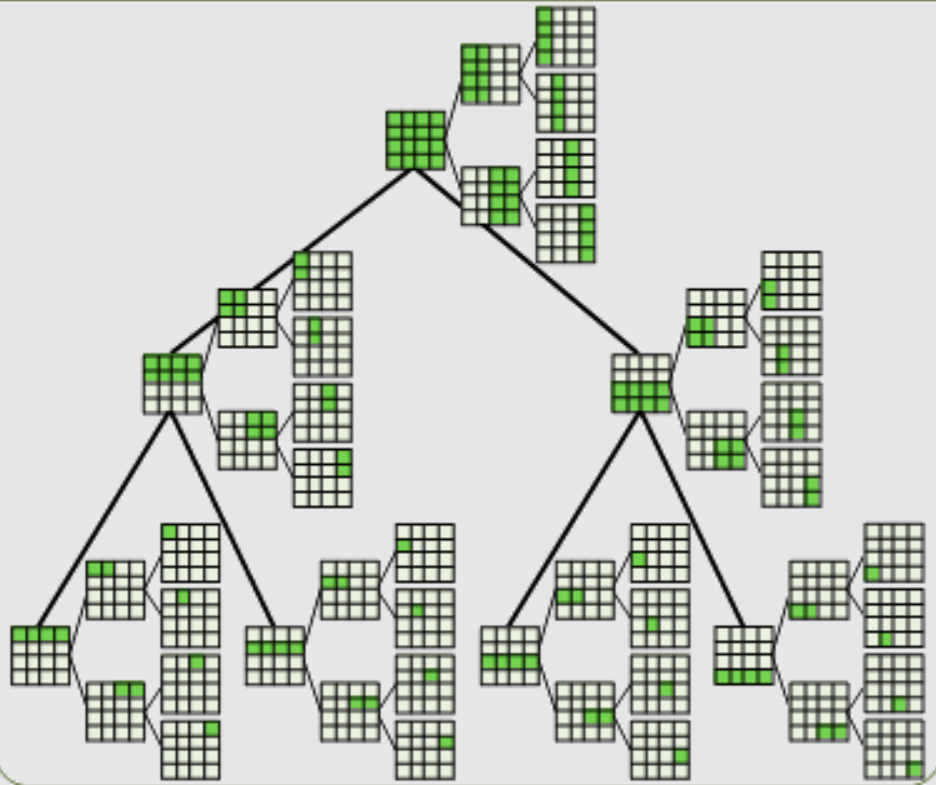
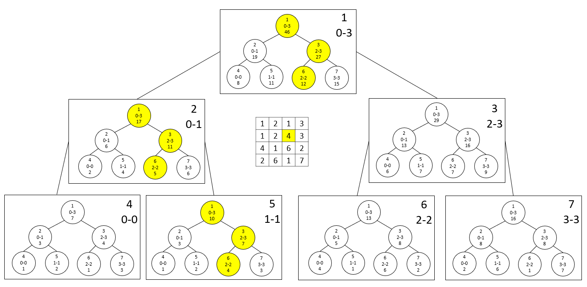
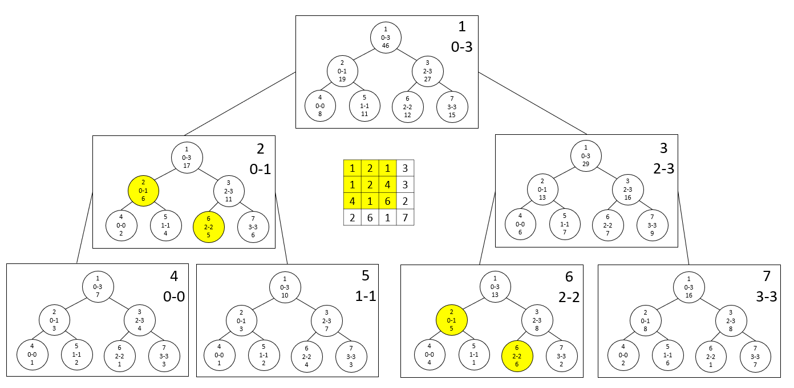

A two-dimensional segment tree supports queries related to rectangular subarrays of a two-dimensional array. Such a tree can be implemented as nested
segment trees: a big tree corresponds to the rows of the array, and each node contains a small tree that corresponds to a column.

The operations of a two-dimensional segment tree take O(log² n) time, because
the big tree and each small tree consist of O(logn) levels. The tree requires O(n²)
memory, because each small tree contains O(n) values.

source: https://usaco.guide/CPH.pdf#page=271

Tree showing nodes and the segments of values it holds. source: https://web.ntnu.edu.tw/~algo/Sequence2.html

To update the node `4` these all trees have to be updated

To query the segment, we need to visit these trees

https://qr.ae/pGPw34
