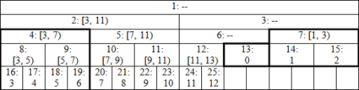

# Efficient and easy segment trees

By Al.Cash, [REF](https://codeforces.com/blog/entry/18051)

## Theory

RMQ stands for Range Minimum (Maximum) Query problem;

RSQ stands for Range Sum Query problem;

Problem is called dynamic if there are Change queries;

Problem is called static if there are no Change queries;

Binary operation ⊕ is called associative if it satisfies the associative law: `(a ⊕ b) ⊕ c = a ⊕ (b ⊕ c)`

Binary operation ⊕ is idempotent if `a ⊕ a = a`;

Identity element for some pair (S, ⊕) is such an element e ∈ S that for every a ∈ S condition `a ⊕ e = e ⊕ a = a` holds;

A semigroup is an algebraic structure consisting of a set S together with some associative binary operation ⊕;

Monoid is a semigroup with an identity element;

## Segment tree with single element modifications

1. modify one element in the array;
2. find the sum of elements on some segment.

### Perfect binary tree


Notation is node_index: corresponding segment (left border included, right excluded). At the bottom row we have our array (0-indexed), the leaves of the tree. For now suppose it's length is a power of 2 (16 in the example), so we get perfect binary tree. When going up the tree we take pairs of nodes with indices (2 * i, 2 * i + 1) and combine their values in their parent with index i. This way when we're asked to find a sum on interval [3, 11), we need to sum up only values in the nodes 19, 5, 12 and 26 (marked with bold), not all 8 values inside the interval.

```cpp
const int N = 1e5;  // limit for array size
int n;  // array size
int t[2 * N];

void build() {  // build the tree
  for (int i = n — 1; i > 0; --i) t[i] = t[i<<1] + t[i<<1|1];
}

void modify(int p, int value) {  // set value at position p
  for (t[p += n] = value; p > 1; p >>= 1) t[p>>1] = t[p] + t[p^1];
}

int query(int l, int r) {  // sum on interval [l, r)
  int res = 0;
  for (l += n, r += n; l < r; l >>= 1, r >>= 1) {
    if (l&1) res += t[l++];
    if (r&1) res += t[--r];
  }
  return res;
}

int main() {
  scanf("%d", &n);
  for (int i = 0; i < n; ++i) scanf("%d", t + n + i);
  build();
  modify(0, 1);
  printf("%d\n", query(3, 11));
  return 0;
}
```

Now let's see why this works, and works very efficient.

1. As you could notice from the picture, leaves are stored in continuous nodes with indices starting with n, element with index i corresponds to a node with index i + n. So we can read initial values directly into the tree where they belong.

2. Before doing any queries we need to build the tree, which is quite straightforward and takes O(n) time. Since parent always has index less than its children, we just process all the internal nodes in decreasing order. In case you're confused by bit operations, the code in build() is equivalent to `t[i] = t[2*i] + t[2*i+1]`.

3. Modifying an element is also quite straightforward and takes time proportional to the height of the tree, which is O(log(n)). We only need to update values in the parents of given node. So we just go up the tree knowing that parent of node p is p / 2 or p>>1, which means the same. `p^1` turns `2 * i` into `2 * i + 1` and vice versa, so it represents the second child of p's parent.

4. Finding the sum also works in O(log(n)) time. To better understand it's logic you can go through example with interval [3, 11) and verify that result is composed exactly of values in nodes 19, 26, 12 and 5 (in that order).

General idea is the following.

* If l, the left interval border, is odd (which is equivalent to `l&1`) then l is the right child of its parent. Then our interval includes node l but doesn't include it's parent. So we add `t[l]` and move to the right of l's parent by setting `l = (l + 1) / 2`. 

* If l is even, it is the left child, and the interval includes its parent as well (unless the right border interferes), so we just move to it by setting `l = l / 2`. Similar argumentation is applied to the right border. We stop once borders meet.

No recursion and no additional computations like finding the middle of the interval are involved, we just go through all the nodes we need, so this is very efficient.

### Arbitrary sized array

The code above works for any size n.

Explanation is much more complex than before, so let's focus first on the advantages it gives us.

1. Segment tree uses exactly `2 * n` memory, not `4 * n` like some other implementations offer.
2. Array elements are stored in continuous manner starting with index n.
3. All operations are very efficient and easy to write.

Here's how the tree for `n = 13`



It's not actually a single tree any more, but a set of perfect binary trees: with root 2 and height 4, root 7 and height 2, root 12 and height 2, root 13 and height 1. Nodes denoted by dashes aren't ever used in query operations, so it doesn't matter what's stored there. Leaves seem to appear on different heights, but that can be fixed by cutting the tree before the node 13 and moving its right part to the left. I believe the resulting structure can be shown to be isomorphic to a part of larger perfect binary tree with respect to operations we perform, and this is why we get correct results.

I won't bother with formal proof here, let's just go through the example with interval [0, 7). We have l = 13, r = 20, `l&1 => add t[13]` and borders change to l = 7, r = 10. Again `l&1 => add t[7]`, borders change to l = 4, r = 5, and suddenly nodes are at the same height. Now we have `r&1 => add t[4 = --r]`, borders change to l = 2, r = 2, so we're finished.

## Modification on interval, single element access

Some people begin to struggle and invent something too complex when the operations are inverted, for example:

1. add a value to all elements in some interval;
2. compute an element at some position.

But all we need to do in this case is to switch the code in methods modify and query as follows:

```cpp
void modify(int l, int r, int value) {
  for (l += n, r += n; l < r; l >>= 1, r >>= 1) {
    if (l&1) t[l++] += value;
    if (r&1) t[--r] += value;
  }
}

int query(int p) {
  int res = 0;
  for (p += n; p > 0; p >>= 1) res += t[p];
  return res;
}
```

If at some point after modifications we need to inspect all the elements in the array, we can push all the modifications to the leaves using the following code. After that we can just traverse elements starting with index n. This way we reduce the complexity from O(nlog(n)) to O(n) similarly to using build instead of n modifications.

```cpp
void push() {
  for (int i = 1; i < n; ++i) {
    t[i<<1] += t[i];
    t[i<<1|1] += t[i];
    t[i] = 0;
  }
}
```

Note, however, that code above works only in case the order of modifications on a single element doesn't affect the result. Assignment, for example, doesn't satisfy this condition. Refer to section about lazy propagation for more information.

## Non-commutative combiner functions

For now we considered only the simplest combiner function — addition. It is commutative, which means the order of operands doesn't matter, we have a + b = b + a. The same applies to min and max, so we can just change all occurrences of + to one of those functions and be fine. But don't forget to initialize query result to infinity instead of 0.

However, there are cases when the combiner isn't commutative, for example, in the problem [380C - Sereja and Brackets](https://codeforces.com/contest/380/problem/C), tutorial available [here](http://codeforces.com/blog/entry/10363). Fortunately, our implementation can easily support that. We define structure S and combine function for it. In method build we just change + to this function. In modify we need to ensure the correct ordering of children, knowing that left child has even index. When answering the query, we note that nodes corresponding to the left border are processed from left to right, while the right border moves from right to left. We can express it in the code in the following way:

<details>
<summary>
Solution
</summary>
We will support the segments tree. At each vertex will be stored:

* a<sub>v</sub> - the maximum length of the bracket subsequence
* b<sub>v</sub> - how many open brackets there are outside of it
* c<sub>v</sub> - how many closed brackets there are outside of it

If we want to combine two vertices with parameters (a<sub>1</sub>, b<sub>1</sub>, c<sub>1</sub>) and (a<sub>2</sub>, b<sub>2</sub>, c<sub>2</sub>), we can use the following rules:

* t = min(b<sub>1</sub>, c<sub>2</sub>)
* a = a<sub>1</sub> + a<sub>2</sub> + t
* b = b<sub>1</sub> + b<sub>2</sub> - t
* c = c<sub>1</sub> + c<sub>2</sub> - t

</details>

```cpp
void modify(int p, const S& value) {
  for (t[p += n] = value; p >>= 1; ) t[p] = combine(t[p<<1], t[p<<1|1]);
}

S query(int l, int r) {
  S resl, resr;
  for (l += n, r += n; l < r; l >>= 1, r >>= 1) {
    if (l&1) resl = combine(resl, t[l++]);
    if (r&1) resr = combine(t[--r], resr);
  }
  return combine(resl, resr);
}
```

## Lazy Propogation

Next we'll describe a technique to perform both range queries and range modifications, which is called lazy propagation. First, we need more variables:

```cpp
int h = sizeof(int) * 8 - __builtin_clz(n);
int d[N];  
```

h is a height of the tree, the highest significant bit in n. `d[i]` is a delayed operation to be propagated to the children of node i when necessary (this should become clearer from the examples). Array size is only `n` because we don't have to store this information for leaves — they don't have any children. This leads us to a total of 3 * n memory use.

Previously we could say that `t[i]` is a value corresponding to it's segment. Now it's not entirely true — first we need to apply all the delayed operations on the route from node i to the root of the tree (parents of node i). We assume that `t[i]` already includes `d[i]`, so that route starts not with i but with its direct parent.


Let's get back to our first example with interval [3, 11), but now we want to modify all the elements inside this interval. In order to do that we modify `t[i]` and `d[i]` at the nodes 19, 5, 12 and 26. Later if we're asked for a value for example in node 22, we need to propagate modification from node 5 down the tree. Note that our modifications could affect t[i] values up the tree as well: node 19 affects nodes 9, 4, 2 and 1, node 5 affects 2 and 1. Next fact is critical for the complexity of our operations:

**Modification on interval [l, r) affects `t[i]` values only in the parents of border leaves: l+n and r+n-1 (except the values that compose the interval itself — the ones accessed in for loop).**

The proof is simple. When processing the left border, the node we modify in our loop is always the right child of its parent. Then all the previous modifications were made in the subtree of the left child of the same parent. Otherwise we would process the parent instead of both its children. This means current direct parent is also a parent of leaf l+n. Similar arguments apply to the right border.

OK, enough words for now, I think it's time to look at concrete examples.

## Increment modifications, queries for maximum

This is probably the simplest case. The code below is far from universal and not the most efficient, but it's a good place to start.

```cpp
void apply(int p, int value) {
  t[p] += value; // maximum is incremented by value
  if (p < n) d[p] += value;
}

void build(int p) { // update all the parents of a given node
  while (p > 1) p >>= 1, t[p] = max(t[p<<1], t[p<<1|1]) + d[p];
}

void push(int p) {
  for (int s = h; s > 0; --s) {
    int i = p >> s;
    if (d[i] != 0) {
      apply(i<<1, d[i]);
      apply(i<<1|1, d[i]);
      d[i] = 0;
    }
  }
}

void inc(int l, int r, int value) {
  l += n, r += n;
  int l0 = l, r0 = r;
  for (; l < r; l >>= 1, r >>= 1) {
    if (l&1) apply(l++, value);
    if (r&1) apply(--r, value);
  }
  build(l0);
  build(r0 - 1);
}

int query(int l, int r) {
  l += n, r += n;
  push(l);
  push(r - 1);
  int res = -2e9;
  for (; l < r; l >>= 1, r >>= 1) {
    if (l&1) res = max(res, t[l++]);
    if (r&1) res = max(t[--r], res);
  }
  return res;
}
```

Let's analyze it one method at a time. The first three are just helper methods user doesn't really need to know about.

1. Now that we have 2 variables for every internal node, it's useful to write a method to apply changes to both of them. *p < n* checks if p is not a leaf. Important property of our operations is that if we increase all the elements in some interval by one value, maximum will increase by the same value.

2. *build* is designed to update all the parents of a given node.

3. *push* propagates changes from all the parents of a given node down the tree starting from the root. This parents are exactly the prefixes of p in binary notation, that's why we use binary shifts to calculate them.

Now we're ready to look at main methods.

1. As explained above, we process increment request using our familiar loop and then updating everything else we need by calling *build*.

2. To answer the query, we use the same loop as earlier, but before that we need to push all the changes to the nodes we'll be using. Similarly to build, it's enough to push changes from the parents of border leaves.

It's easy to see that all operations above take O(log(n)) time.

Again, this is the simplest case because of two reasons:

1. order of modifications doesn't affect the result;
2. when updating a node, we don't need to know the length of interval it represents.


TODO: https://codeforces.com/blog/entry/1256

TODO: https://github.com/bqi343/USACO/blob/master/Implementations/content/data-structures/1D%20Range%20Queries%20(9.2)/LazySeg%20(15.2).h and https://github.com/bqi343/USACO/blob/master/Implementations/content/data-structures/1D%20Range%20Queries%20(9.2)/SegTree%20(9.2).h

### Benq's iterative implementation

* 1D Point Update and Range query
* Point Update: Set value at i to x
* Range query: Query for the comb `[L, R]`
```cpp
/**
 * Description: 1D point update, range query where \texttt{comb} is
 	* any associative operation. If $N=2^p$ then \texttt{seg[1]==query(0,N-1)}.
 * Time: O(\log N)
 * Source: 
	* http://codeforces.com/blog/entry/18051
	* KACTL
 * Verification: SPOJ Fenwick
 */

template<class T> struct Seg { // comb(ID,b) = b
	const T ID = 0; T comb(T a, T b) { return a+b; } 
	int n; V<T> seg;
	void init(int _n) { // upd, query also work if n = _n
		for (n = 1; n < _n; ) n *= 2; 
		seg.assign(2*n,ID); }
	void pull(int p) { seg[p] = comb(seg[2*p],seg[2*p+1]); }
	void upd(int p, T val) { // set val at position p
		seg[p += n] = val; for (p /= 2; p; p /= 2) pull(p); }
	T query(int l, int r) {	// any associative op on interval [l, r]
		T ra = ID, rb = ID;
		for (l += n, r += n+1; l < r; l /= 2, r /= 2) {
			if (l&1) ra = comb(ra,seg[l++]);
			if (r&1) rb = comb(seg[--r],rb);
		}
		return comb(ra,rb);
	}
	int first_at_least(int lo, int val, int ind, int l, int r) { // if seg stores max across range
		if (r < lo || val > seg[ind]) return -1;
		if (l == r) return l;
		int m = (l+r)/2;
		int res = first_at_least(lo,val,2*ind,l,m); if (res != -1) return res;
		return first_at_least(lo,val,2*ind+1,m+1,r);
	}
};
```

source: https://github.com/bqi343/USACO/blob/master/Implementations/content/data-structures/1D%20Range%20Queries%20(9.2)/SegTree%20(9.2).h

### Lazy Segment Tree Benq

* 1D range increment and sum query

```cpp
template<class T, int SZ> struct LazySeg { 
	static_assert((SZ & (SZ-1)) == 0); // SZ must be power of 2
	const T ID = 0; T comb(T a, T b) { return a+b; }
	T seg[2*SZ], lazy[2*SZ]; 
	LazySeg() { for(int i=0; i<2*SZ; i++) seg[i] = lazy[i] = ID; }
	void push(int ind, int L, int R) { // modify values for current node
		seg[ind] += (R-L+1)*lazy[ind]; // dependent on operation
		if (L != R) for(int i=0; i<2;i++) lazy[2*ind+i] += lazy[ind]; // prop to children
		lazy[ind] = 0; 
	} // recalc values for current node
	void pull(int ind) { seg[ind] = comb(seg[2*ind],seg[2*ind+1]); }
	void build() { for(int i=SZ-1; i>=1; i--) pull(i); }
	void upd(int lo,int hi,T inc,int ind=1,int L=0, int R=SZ-1) {
		push(ind,L,R); if (hi < L || R < lo) return;
		if (lo <= L && R <= hi) { 
			lazy[ind] = inc; push(ind,L,R); return; }
		int M = (L+R)/2; upd(lo,hi,inc,2*ind,L,M); 
		upd(lo,hi,inc,2*ind+1,M+1,R); pull(ind);
	}
	T query(int lo, int hi, int ind=1, int L=0, int R=SZ-1) {
		push(ind,L,R); if (lo > R || L > hi) return ID;
		if (lo <= L && R <= hi) return seg[ind];
		int M = (L+R)/2; 
		return comb(query(lo,hi,2*ind,L,M),query(lo,hi,2*ind+1,M+1,R));
	}
};
```

source: https://github.com/bqi343/USACO/blob/master/Implementations/content/data-structures/1D%20Range%20Queries%20(9.2)/LazySeg%20(15.2).h

### KTH - KACTL Notebook

```cpp
/**
 * Author: Lucian Bicsi
 * Date: 2017-10-31
 * License: CC0
 * Source: folklore
 * Description: Zero-indexed max-tree. Bounds are inclusive to the left and exclusive to the right.
                Can be changed by modifying T, f and unit.
 * Time: O(\log N)
 * Status: stress-tested
 */
#pragma once

struct Tree {
  typedef int T;
  static constexpr T unit = INT_MIN; // f(unit, b) must equal b
  T f(T a, T b) { return max(a, b); } // (any associative fn)
  vector<T> s; int n;
  Tree(int n = 0, T def = unit) : s(2*n, def), n(n) {}
  void update(int pos, T val) {
    for (s[pos += n] = val; pos /= 2;)
      s[pos] = f(s[pos * 2], s[pos * 2 + 1]);
  }
  T query(int b, int e) { // query [b, e)
    T ra = unit, rb = unit;
    for (b += n, e += n; b < e; b /= 2, e /= 2) {
      if (b % 2) ra = f(ra, s[b++]);
      if (e % 2) rb = f(s[--e], rb);
    }
    return f(ra, rb);
  }
};
```
