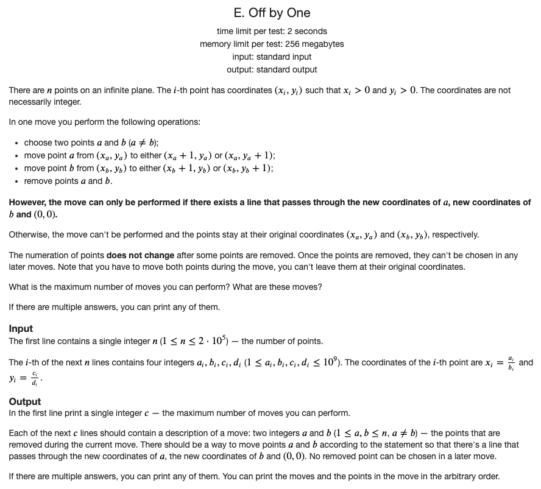
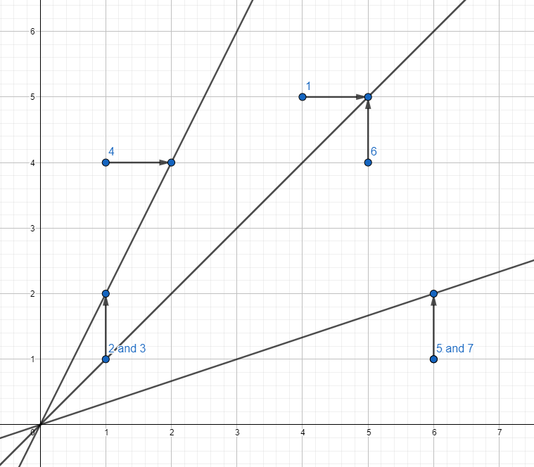
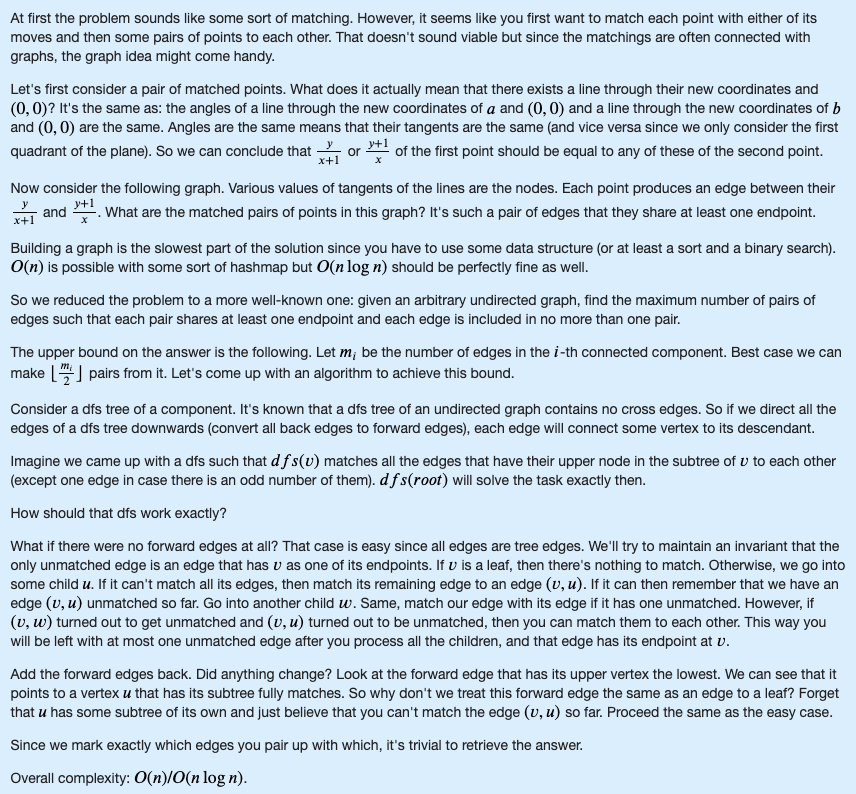

Given an arbitrary undirected graph, find the maximum number of pairs of edges such that each pair shares at least one endpoint and each edge is included in no more than one pair.





source: https://codeforces.com/contest/1519/problem/E



```cpp
#include <iostream>
#include <cstdio>
#include <cstdlib>
#include <algorithm>
#include <cmath>
#include <vector>
#include <set>
#include <map>
#include <unordered_set>
#include <unordered_map>
#include <queue>
#include <ctime>
#include <cassert>
#include <complex>
#include <string>
#include <cstring>
#include <chrono>
#include <random>
#include <bitset>
using namespace std;

#ifdef LOCAL
	#define eprintf(...) fprintf(stderr, __VA_ARGS__);fflush(stderr);
#else
	#define eprintf(...) 42
#endif

using ll = long long;
using ld = long double;
using uint = unsigned int;
using ull = unsigned long long;
template<typename T>
using pair2 = pair<T, T>;
using pii = pair<int, int>;
using pli = pair<ll, int>;
using pll = pair<ll, ll>;
mt19937_64 rng(chrono::steady_clock::now().time_since_epoch().count());
ll myRand(ll B) {
	return (ull)rng() % B;
}

#define pb push_back
#define mp make_pair
#define all(x) (x).begin(),(x).end()
#define fi first
#define se second

clock_t startTime;
double getCurrentTime() {
	return (double)(clock() - startTime) / CLOCKS_PER_SEC;
}

ll gcd(ll x, ll y) {
	return y == 0 ? x : gcd(y, x % y);
}

map<pll, int> toId;
int n, m;
int getId(pll p) {
	if (toId.count(p) == 0) {
		toId[p] = n++;
	}
	return toId[p];
}

pll getFrac(ll x, ll y) {
	ll g = gcd(x, y);
	return mp(x / g, y / g);
}

const int N = 400200;
vector<int> g[N];
int ed[N][2];
bool used[N];
bool usedEd[N];
vector<pii> ans;

int getOther(int id, int v) {
	return ed[id][0] ^ ed[id][1] ^ v;
}

bool dfs(int v, int par) {
	used[v] = 1;
	int lst = -1;
	for (int id : g[v]) {
		if (id == par) continue;
		if (usedEd[id]) continue;
		int u = getOther(id, v);
		if (!used[u]) {
			if (dfs(u, id)) continue;
		}
		usedEd[id] = true;
		if (lst == -1) {
			lst = id;
		} else {
			ans.push_back(mp(lst, id));
			lst = -1;
		}
	}
	if (lst != -1 && par != -1) {
		usedEd[par] = true;
		ans.push_back(mp(lst, par));
		return true;
	} else {
		return false;
	}
}

int main()
{
	startTime = clock();
//	freopen("input.txt", "r", stdin);
//	freopen("output.txt", "w", stdout);

	scanf("%d", &m);
	for (int i = 0; i < m; i++) {
		ll a, b, c, d;
		scanf("%lld%lld%lld%lld", &a, &b, &c, &d);
		int v = getId(getFrac(c * b, d * (a + b)));
		int u = getId(getFrac((c + d) * b, d * a));
		ed[i][0] = v;
		ed[i][1] = u;
		g[v].push_back(i);
		g[u].push_back(i);
	}
	for (int v = 0; v < n; v++) {
		if (used[v]) continue;
		dfs(v, -1);
	}
	printf("%d\n", (int)ans.size());
	for (pii t : ans)
		printf("%d %d\n", t.first + 1, t.second + 1);

	return 0;
}
```

source: Um_nik https://codeforces.com/contest/1519/submission/114583294

Editorial Solution

```cpp
#include <bits/stdc++.h>

#define forn(i, n) for (int i = 0; i < int(n); i++)
#define x first
#define y second

using namespace std;

struct point{
    int a, b, c, d;
};

typedef pair<long long, long long> frac;
typedef pair<int, int> pt;

int n;
vector<point> a;
map<frac, int> sv;

frac norm(long long x, long long y){
    long long g = __gcd(x, y);
    return {x / g, y / g};
}

vector<vector<pt>> g;
vector<int> used;
vector<pt> ans;

int dfs(int v){
    used[v] = 1;
    int cur = -1;
    for (auto it : g[v]){
        int u = it.x;
        int i = it.y;
        if (used[u] == 1) continue;
        int nw = i;
        if (!used[u]){
            int tmp = dfs(u);
            if (tmp != -1){
                ans.push_back({nw, tmp});
                nw = -1;
            }
        }
        if (nw != -1){
            if (cur != -1){
                ans.push_back({cur, nw});
                cur = -1;
            }
            else{
                cur = nw;
            }
        }
    }
    used[v] = 2;
    return cur;
}

int main() {
    scanf("%d", &n);
    a.resize(n);
    forn(i, n) scanf("%d%d%d%d", &a[i].a, &a[i].b, &a[i].c, &a[i].d);
    g.resize(2 * n);
    forn(i, n){
        frac f1 = norm((a[i].a + a[i].b) * 1ll * a[i].d, a[i].b * 1ll * a[i].c);
        frac f2 = norm(a[i].a * 1ll * a[i].d, a[i].b * 1ll * (a[i].c + a[i].d));
        if (!sv.count(f1)){
            int k = sv.size();
            sv[f1] = k;
        }
        if (!sv.count(f2)){
            int k = sv.size();
            sv[f2] = k;
        }
        g[sv[f1]].push_back({sv[f2], i});
        g[sv[f2]].push_back({sv[f1], i});
    }
    used.resize(sv.size());
    forn(i, sv.size()) if (!used[i])
        dfs(i);
    printf("%d\n", int(ans.size()));
    for (auto it : ans) printf("%d %d\n", it.x + 1, it.y + 1);
}
```

source: https://codeforces.com/blog/entry/90212
