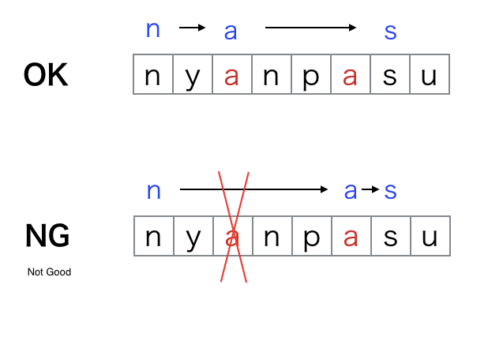

### Problem: 

Given is a sequence `A` of length `N` (1 ≤ N ≤ 2×10⁵). You can do this operation any number of times: when the length of the sequence is at least `2`, choose two adjacent values, delete them, and insert their sum where they were. 

How many sequences can result from zero or more operations? Find the count modulo `998244353`.


Example:

```
3
1 -1 1
```

The following four sequences can result from zero or more operations.

```
1,−1,1
1,0
0,1
1
```

### Solution Idea:

We consider the correspondence between a resulting integer sequence with a sequence of operations. 

In order to make a non-empty sequence, we may take the following greedy approach: repeat adding the 1st and the 2nd leftmost values until the 1st value of the desired sequence is obtained, then repeat adding the 2nd and the 3rd leftmost values until the 2nd value of the desired sequence is obtained, ... , and so on. 

A suffix of A that does not correspond to any element of the desired sequence may remain, but in that case, the desired sequence can be obtained if and only if the sum of elements in the suffix is 0. 

Since the sequence of operations in this greedy method and the resulting array correspond one-by-one, so it is sufficient to find the number of possible sequences of operations.

### Dynamic Programming solution:

We use DP (Dynamic Programming). Let `DP[i]` be the number of suffixes of sequences of operations of the greedy algorithm such that the first `i` elements of `A` correspond to the elements of desired sequence. 

Then, for the maximum `j(<i)` such that `A[j] + A[j+1] + ⋯ + A[i] = 0`, it holds that `DP[i] = DP[j] + DP[j+1] + ⋯ + DP[i−1]`. To find `j` we can use `prefix_sum[j-1] = prefix_sum[i]`.

For each `k(<j)`, the sum of elements from `A[k]` through `A[j−1]` is equal to that of `A[k]` through `A[i]`(that is `A[k] + ... + A[j-1] = A[k] + ... + A[i]`), and in the greedy algorithm the former correspond to an element, so there is no transition from `DP[i]` to `DP[k]`.

In order to find `j`, compute the cumulative sums of `A` from the left, and for each cumulative sum manage the largest index less than `i` with a data structure like a map. Also, compute the cumulative sums of DP from the left so as to find `DP[i]` in an `O(1)` time each.


From the editorial, then `DP[i] = DP[j] + DP[j+1] + ⋯ + DP[i−1]`, then using prefix sums `preDP` we get `DP[i] = preDP[i-1] - preDP[j-1]`, then `preDP[i] = preDP[i-1] + DP[i]` which is nothing but `preDP[i] = 2*preDP[i-1] - preDP[j-1]`

```python
from itertools import accumulate
from collections import defaultdict


def main():
    N = int(input())
    A = [int(i) for i in input().split()]
    prefix_sum = list(accumulate(A))
    prefix_ans = [1]*N

    # prefix sum to index map
    mp = dict()
    md = 998244353

    for i in range(N - 1):
        if prefix_sum[i] in mp:
            j = mp[prefix_sum[i]]
            prefix_ans[i] = (2 * prefix_ans[i-1] - prefix_ans[j-1]) % md
        else:
            prefix_ans[i] = 2 * prefix_ans[i-1] % md
        mp[prefix_sum[i]] = i

    print(prefix_ans[N-2] % md)


if __name__ == "__main__":
    main()
```

The above code can be simplified to


```python
from collections import defaultdict


def main():
    N = int(input())
    A = [int(i) for i in input().split()]

    # prefix sum to index map
    mp = defaultdict(int)
    total_seq = 1
    prefix_sum = 0
    md = 998244353

    for i in range(N-1):
        prefix_sum += A[i]
        tmp = total_seq
        total_seq = (2*total_seq - mp[prefix_sum]) % md
        mp[prefix_sum] = tmp  # store the previous count

    print(total_seq % md)
```

Check Japanese Editorial: https://atcoder.jp/contests/abc230/editorial/3082 and https://qiita.com/drken/items/a207e5ae3ea2cf17f4bd

### Another interpretation

Since each element of the sequence created after the operation is the interval sum of the original sequence, the problem can be read as follows.

"Put some partitions in the middle of the sequence. Take the sum in each section between the partitions to make a new sequence. How many types can you make?"

For example: Seqence `A = (1, 2, 3, −1, 1, 0)`, then if we place partitions like `(1, 2, 3 |  −1, 1 | 0) = (6, 0, 0)`

Now say we have the number of sequences till `A[:i]`, and say that we are adding `A[i+1]`:
* Either we can include `A[i+1]` in the last partition of the sequence
* Or create a new partition for `A[i+1]`

Suppose A = (1, 2, 4), then either A = (1 | 2 ) + 4 or A = (1, 2) + 4, so in total we get (1 | 2 | 4), (1 | 2, 4) = (1 | 6) and (3 | 4) or (3 + 4) = (7).

Looks like `DP[i+1] = 2*DP[i]`, but there would be a problem if sum of a partition is zero, consider (1 ,0 ,4 ) then (1 , 0 | 4) and (1 | 0, 4) would give the same sequence.

Similarly, when A = (1, 2, −2, 3, −3), we get same sequence for (1, 2, −2 | 3, −3) and (1 | 2, −2, 3, −3)

We can observe that `DP[i + 1] = 2*DP[i] − DP[f(i)]`, where `f(i)` is the `prefix_sum[:i]`

```python
from collections import defaultdict

N = int(input())
A = [0]+list(map(int,input().split()))
f = [0]*(N+1)
 
# Precalculation of f
# When f(i) does not exist, f(i) = 0 can be set (because DP[0] = 0).
s = 0
d = defaultdict(int)
for i in range(N+1):
  s += A[i]  # prefix_sum
  f[i] = d[s]
  d[s] = i
 
DP = [0]*(N+1)
DP[1] = 1
# Calculate DP
for i in range(1,N):
  DP[i+1] = (DP[i]*2 - DP[f[i]]) % 998244353
 
print(DP[N])
```

Also https://atcoder.jp/contests/abc230/editorial/3034

Given A, Let's denote the cumulative sum of `A` as `A'` that is `A'[i] = sum(A[0..i])`.

Let the final sequence formed after these operations `B`, let the cumulative sum of `B` be `B'`. Now `B'` is a subsequence of `B'`. We have a one-to-one mapping between `B'` and `B`. All we need to find is the number of subsequences of `A'`.

Known problem: DP that finds subsequences of a string without duplication, REF: https://qiita.com/drken/items/a207e5ae3ea2cf17f4bd

Say we are given `s = "nyanpasu"`, then we should be counting `"nas"` only once even though `"nas"` occurs at (1, 3, 7), (1, 6, 7) and (4, 6, 7) characters.

How do we make sure that we count this subsequence only once? Idea: Out of the dictionary order of the sequences, choose the first one, there for out of (1, 3, 7), (1, 6, 7) and (4, 6, 7) we count only (1, 3, 7).

Say we are given `s = "nyanpasu"`, then we should be counting `"nas"` only once even though `"nas"` occurs at (1, 3, 7), (1, 3, 7) and (4, 6, 7) characters.



Example:

* S = "abcde" there are 32 sub-sequences of string possible (all characters are different 2^5 = 32)
* S = "aaaaa" there are 6 strings possible ("", "a", "aa", "aaa", "aaaa", "aaaaa")
* S = "aba" there are 7 strings possible ("", "a", "b", "aa", "ab", "ba", "aba")


Let us define `dp[i]` as the number of strings possible such that we take few characters from `s[0..(i-1)]` and always include the `i`-th character.

That is for `s = "nyanpasu"`, `dp[0] = 1`, the empty string, `dp[1] = 1` "n", and `dp[2] = 2`, "y" and "ny". The answer would be `sum(dp[i])` for all i.

Calculating our transitions, for each `dp[i]`, we want to choose the next character possible.

* DP Transitions ⇒ For each character c, if `next[i][c] < n`, then `dp[next[i][c] + 1]  += dp[i]`

* DP initial conditions ⇒ dp[0] = 1
    
* Required value ⇒ ∑n dp[i]

```cpp
#include <iostream>
#include <string>
#include <vector>
using namespace std;

const int MOD = 1000000007;

// res[i][c] := index of occurence of character `c` starting from `i`
vector<vector<int> > calcNext(const string &S) {
    int n = (int)S.size();
    vector<vector<int> > res(n+1, vector<int>(26, n));
    for (int i = n-1; i >= 0; --i) {
        for (int j = 0; j < 26; ++j) res[i][j] = res[i+1][j];
        res[i][S[i]-'a'] = i;
    }
    return res;
}

// mod 1000000007, a += b mod MOD
void add(long long &a, long long b) {
    a += b;
    if (a >= MOD) a -= MOD;
}

int main() {
    string S; cin >> S;
    int n = (int)S.size();

    // Preprocessing
    vector<vector<int> > next = calcNext(S);

    // DP
    vector<long long> dp(n+1, 0);
    dp[0] = 1; // empty string
    for (int i = 0; i < n; ++i) {
        for (int j = 0; j < 26; ++j) {
            if (next[i][j] >= n) continue; // next character is not present
            add(dp[next[i][j] + 1], dp[i]);
        }
    }

    long long res = 0;
    for (int i = 0; i <= n; ++i) add(res, dp[i]);

    cout << res << endl;
}
```

Say we are only interested in Palindromic subsequences then, REF: https://onlinejudge.u-aizu.ac.jp/beta/room.html#ACPC2018Day3/problems/G

In the above problem, we have used the first sequence dictionary order to ensure uniqueness. In this problem, we do in similar way, Of the selection methods to generate the same palindromic substring, move them to both ends as much as possible.

Here, for the sake of simplicity, it is a problem to take `T` as the inverted character string of `S`, look at `S` and `T` from the left, and extract the parts that have the same character. As usual `S` Inverted string `T`, think that it is a problem to look at each from the left and extract the parts that have the same characters.

`dp[i][j]`: = Using S from the 0-th character to the i-1 character and T from the 0th character to the j-1 character. Number of palindromes that can be made (S i-1 st character and T j-1st character must be used).

For each alphabet `c` we get `dp[ns[i][c]+1][nt[j][c]+1] += dp[i][j]`

Finally, we need to add odd length palindromes to our answer.

```cpp
#include <iostream>
#include <string>
#include <vector>
#include <algorithm>
#include <set>
using namespace std;

const int MOD = 1000000007;


vector<vector<int> > calcNext(const string &S) {
    int n = (int)S.size();
    vector<vector<int> > res(n + 1, vector<int>(26, n));
    for (int i = n - 1; i >= 0; --i) {
        for (int j = 0; j < 26; ++j) res[i][j] = res[i + 1][j];
        res[i][S[i] - 'a'] = i;
    }
    return res;
}

void add(long long &a, long long b) {
    a += b;
    if (a >= MOD) a -= MOD;
}

int main() {
    string S; cin >> S;
    int n = (int)S.size();
    string T = S;
    reverse(T.begin(), T.end());

    auto ns = calcNext(S);
    auto nt = calcNext(T);
    vector<vector<long long> > dp(n + 1, vector<long long>(n + 1, 0));
    dp[0][0] = 1;
    for (int i = 0; i < n; ++i) {
        for (int j = 0; j < n; ++j) {
            for (int k = 0; k < 26; ++k) {
                int ni = ns[i][k];
                int nj = nt[j][k];
                if (ni + nj + 2 > n) continue;
                add(dp[ni + 1][nj + 1], dp[i][j]);
            }
        }
    }
    long long res = 0;
    for (int i = 0; i <= n; ++i) {
        for (int j = 0; i + j <= n; ++j) {
            int num = 1;
            for (int k = 0; k < 26; ++k) if (ns[i][k] + 1 + j <= n) ++num;
            res = (res + dp[i][j] * num % MOD) % MOD;
        }
    }
    cout << res - 1 << endl;
}
```

TODO: More problems from the above blog, ARC 081 E -- Don't Be a Subsequence
TODO: https://codeforces.com/contest/1183/problem/H


## Simple Operations on a Sequence 

ABC 232F https://atcoder.jp/contests/abc232/editorial/3153 Dynamic Programming
