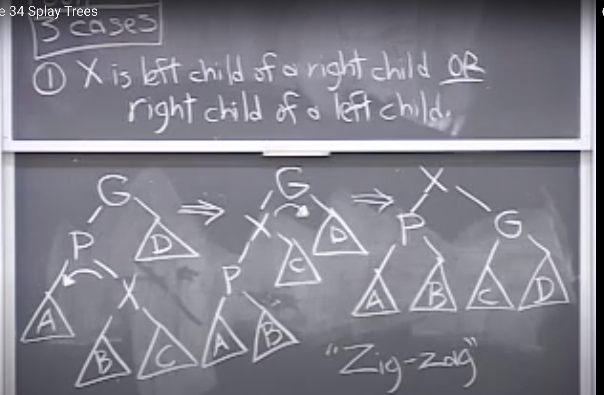
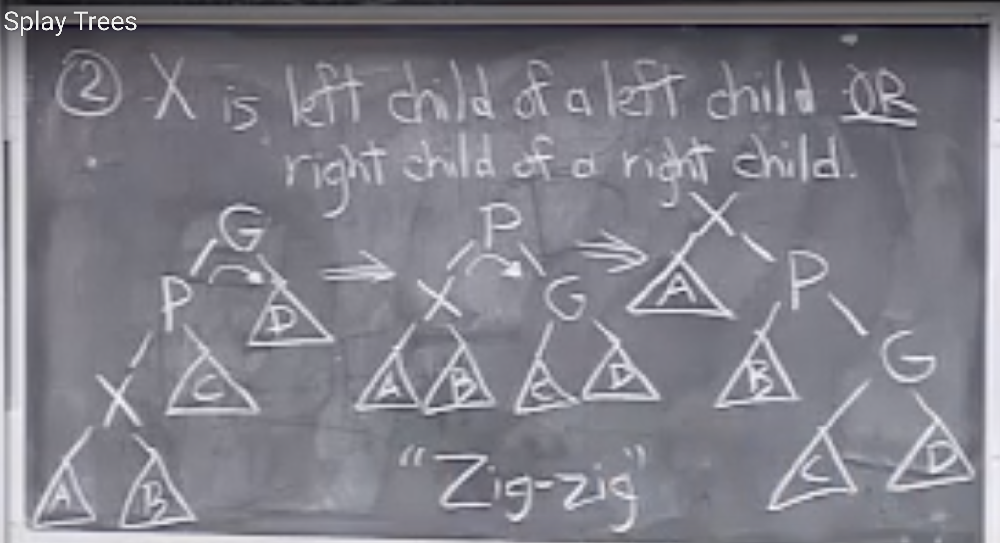
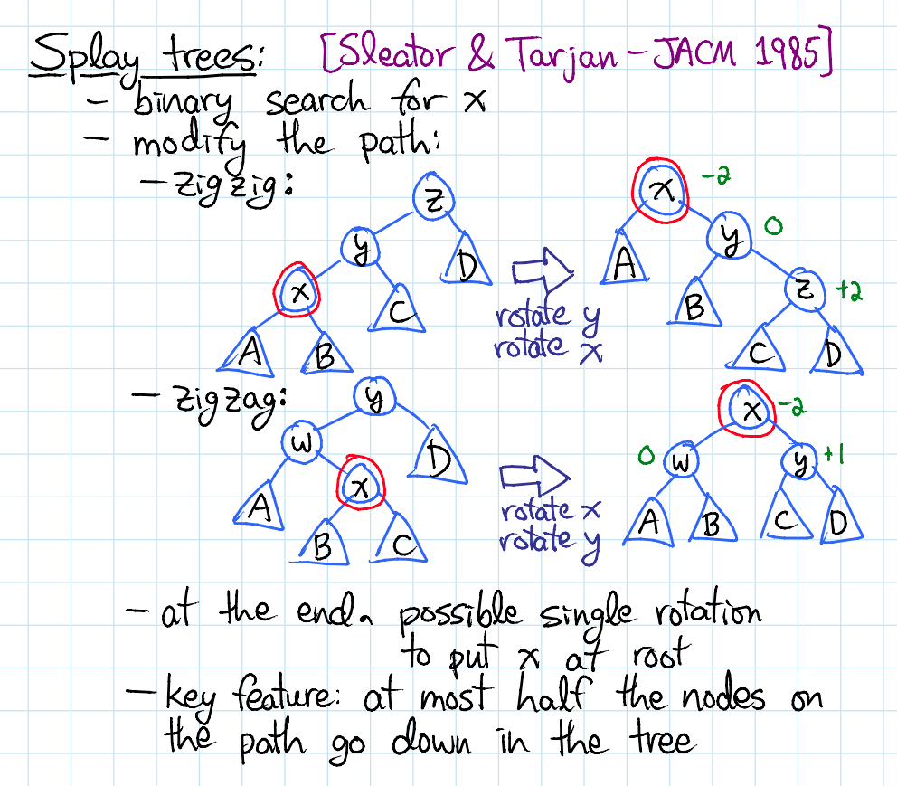
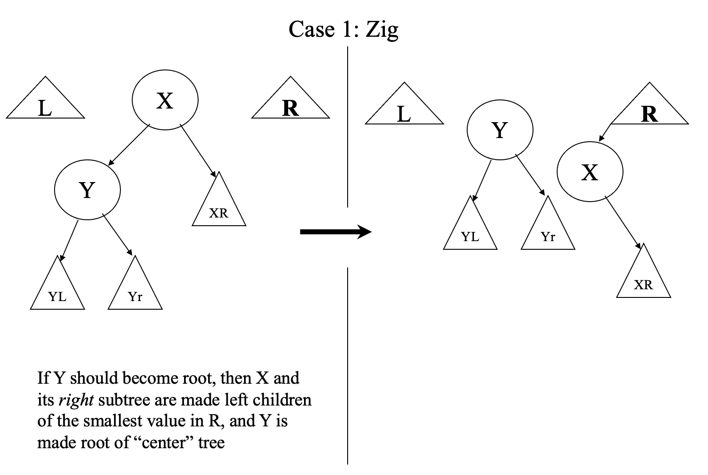
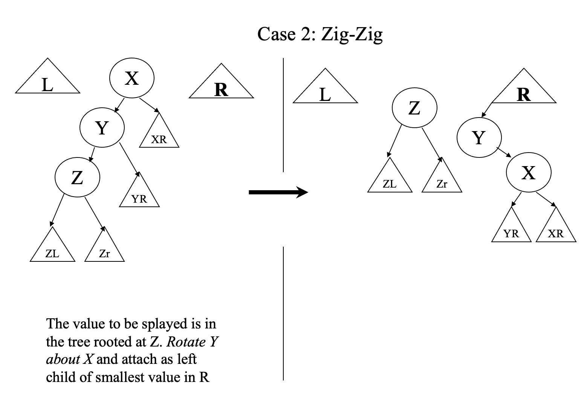
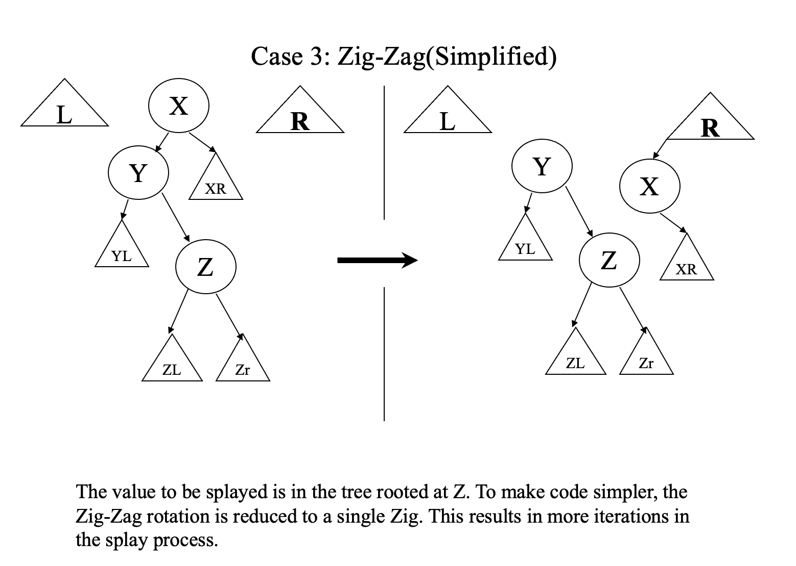
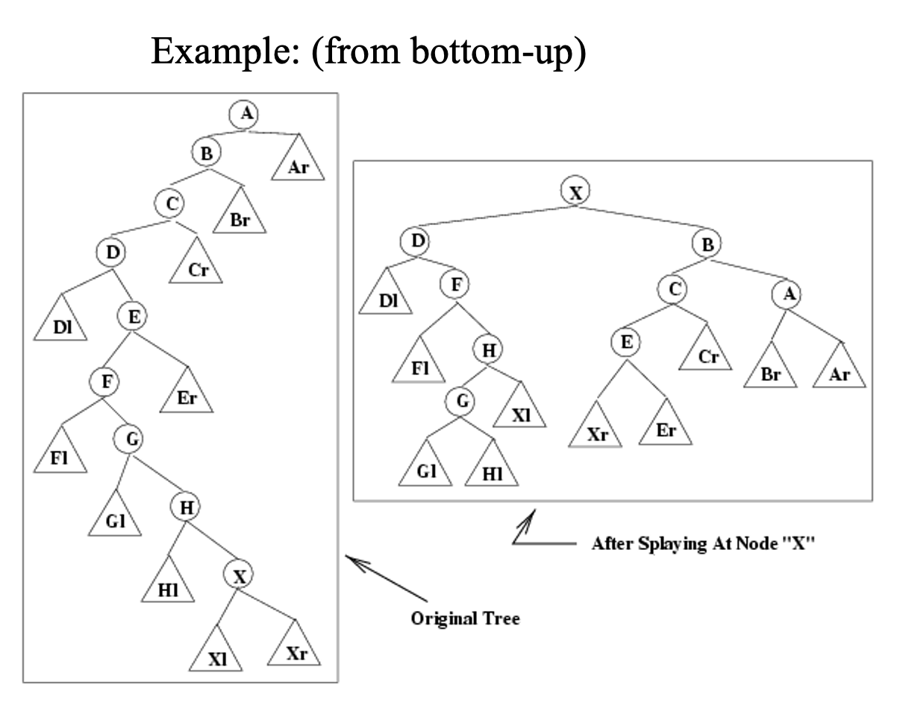
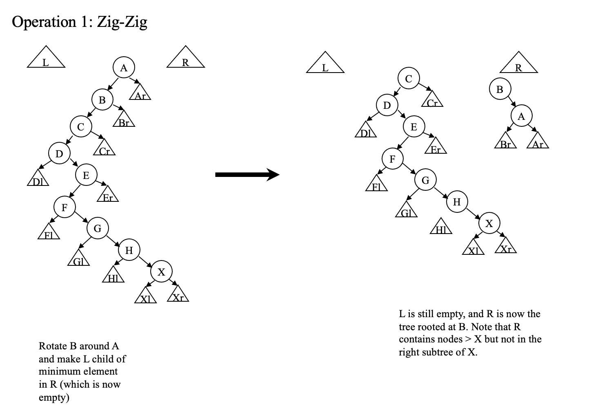
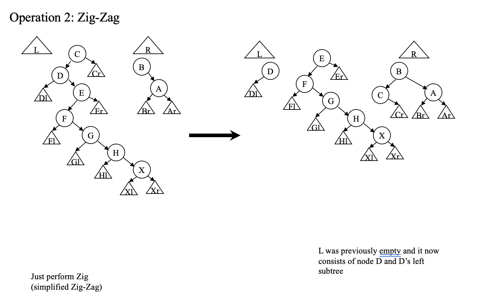
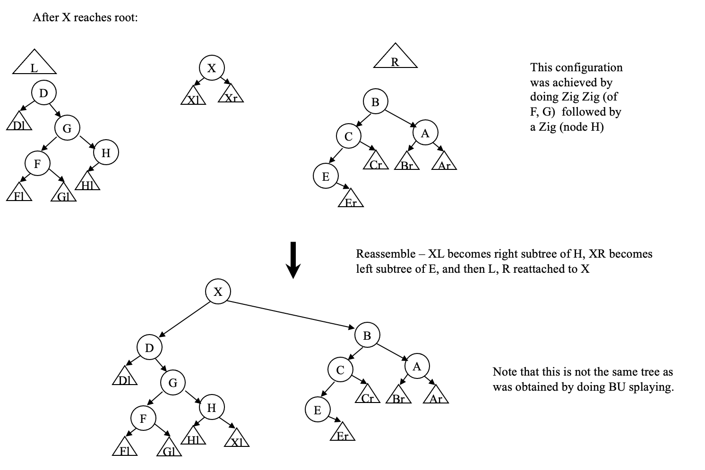

                              CS61B: Lecture 36
                          Wednesday, April 23, 2014

Today's reading:  Goodrich & Tamassia, Section 10.3.

SPLAY TREES
===========
A splay tree is a type of balanced binary search tree.  Structurally, it is
identical to an ordinary binary search tree; the only difference is in the
algorithms for finding, inserting, and deleting entries.

All splay tree operations run in O(log n) time _on_average_, where n is the
number of entries in the tree.  Any single operation can take Theta(n) time in
the worst case.  But any sequence of k splay tree operations, with the tree
initially empty and never exceeding n items, takes O(k log n) worst-case time.

Although 2-3-4 trees make a stronger guarantee (_every_ operation on a 2-3-4
tree takes O(log n) time), splay trees have several advantages.  Splay trees
are simpler and easier to program.  Because of their simplicity, splay tree
insertions and deletions are typically faster in practice (sometimes by a
constant factor, sometimes asymptotically).  Find operations can be faster or
slower, depending on circumstances.

Splay trees are designed to give especially fast access to entries that have
been accessed recently, so they really excel in applications where a small
fraction of the entries are the targets of most of the find operations.

Splay trees have become the most widely used basic data structure invented in
the last 30 years, because they're the fastest type of balanced search tree for
many applications.

* Balanced binary search tree with the additional property that recently accessed elements are quick to access again.
* All operations: O(log n) time on average(Note: there is not randomization involved)
* Single operation: θ(n) worst-case time, where n is # of items in tree
* Any sequence of k ops, starting from empty tree, never > n items in tree, all operations takes O(k log n) worst-case time. Few operations might be slow but many operations are faster and hence they balance out.
* Fast access to entries accessed recently.

Tree Rotations
--------------
Like many types of balanced search trees, splay trees are kept balanced with the help of structural changes called _rotations_.  There are two   
types--a left rotation and a right rotation--and each is the other's reverse.  Suppose that X and Y are binary tree nodes, and A, B, and C are subtrees.  A rotation transforms either of the configurations illustrated above to the other.  Observe that the binary search tree invariant is preserved:  keys in A are less than or equal to X; keys in C are greater than or equal to Y; and keys in B are >= X and <= Y.

```
        Y                             X     
       / \        rotate left        / \    
      X   ^      <------------      ^   Y   
     / \ /C\                       /A\ / \  
    ^  ^         ------------>         ^  ^ 
   /A\/B\         rotate right        /B\/C\
```

Rotations are also used in AVL trees and red-black trees, which are discussed by Goodrich and Tamassia.

Unlike 2-3-4 trees, splay trees are not kept perfectly balanced, but they tend
to stay reasonably well-balanced most of the time, thereby averaging O(log n)
time per operation in the worst case (and sometimes achieving O(1) average
running time in special cases).

* Splay trees are not kept perfectly balanced. One reason why they have O(n) worst case time for some operations.

Splay Tree Operations
---------------------
[1]  Entry find(Object k);

The find() operation in a splay tree begins just like the find() operation in
an ordinary binary search tree:  we walk down the tree until we find the entry
with key k, or reach a dead end (a node from which the next logical step leads
to a null pointer).

However, a splay tree isn't finished its job.  Let X be the node where the
search ended, whether it contains the key k or not.  We _splay_ X up the tree
through a sequence of rotations, so that X becomes the root of the tree.  Why?
One reason is so that recently accessed entries are near the root of the tree,
and if we access the same few entries repeatedly, accesses will be very fast.
Another reason is because if X lies deeply down an unbalanced branch of the
tree, the splay operation will improve the balance along that branch.

When we splay a node to the root of the tree, there are three cases that
determine the rotations we use.

**Case 1: Zig-Zag**  X is the right child of a left child (or the left child of a right child):  let P be the parent of X, and let G be the grandparent of X.  We first rotate X and P left, and then rotate X and G right, as illustrated at right.    
                                      
The mirror image of this case-- where X is a left child and P is a right child--uses the same rotations in mirror image:  rotate X and P right, then X and G left.  Both the case illustrated below and its mirror image are called the "zig-zag" case.

```
      G               G               X     
     / \             / \             / \    
    P   ^           X   ^           P   G   
   / \ /D\  ==>    / \ /D\  ==>    / \ / \  
  ^  X            P  ^            ^  ^ ^  ^ 
 /A\/ \          / \/C\          /A\/BVC\/D\
    ^  ^        ^  ^                        
   /B\/C\      /A\/B\     Zig-Zag
```



```

       z               [x]               y
      / \              / \              / \
     y   D            /   \            A   z       (A < y < B < x < z < D)
    / \         ->   y     z    <-        / \
   A  [x]           / \   / \           [x]  D
      / \          A   B C   D          / \
     B   C                             B   C
```

**Case 2: Zig-Zig** X is the left child of a left child (or the right child of a right child):  the ORDER of the rotations is REVERSED from case 1.  We start with the grandparent, and rotate G and P right.Then, we rotate P and X right.(Note: In case 1, we rotated X and P first) 

The mirror image of this case-- where X and P are both right children--uses the same rotations in mirror image:
rotate G and P left, then P and X left.  Both the case illustrated above and its mirror image are called the "zig-zig" case.

```
          G               P               X       
         / \             / \             / \      
        P   ^           X   G           ^   P     
       / \ /D\  ==>    / \ / \    ==>  /A\ / \    
      X  ^            ^  ^ ^  ^            ^  G   
     / \/C\          /A\/BVC\/D\          /B\/ \  
    ^  ^                                     ^  ^ 
   /A\/B\                       Zig-Zig     /C\/D\

```


```
      z             x
     / \           / \
    y   D         A   y
   / \      <->      / \                (A < x < B < y < C < z < D)
 [x]  C             B  [z]
 / \                   / \
A   B                 C   D
```

We repeatedly apply zig-zag and zig-zig rotations to X; each pair of rotations raises X two levels higher in the tree. Eventually, either X will reach the
root (and we're done), or X will become the child of the root. One more case handles the latter circumstance, this happens when our node is odd number of levels down from root.

**Case 3 Zig:** Node X has no grand parent. X's parent P is the root:  we rotate X and P so that X becomes the root.  This is called the "zig" case.

```
      P             X     
     / \           / \    
    X   ^         ^   P   
   / \ /C\  ==>  /A\ / \  
  ^  ^               ^  ^ 
 /A\/B\     Zig     /B\/C\
```


```
    y             x
   / \           / \   
 [x]  C   <->   A  [y]
 / \               / \
A   B             B   C
```

Here's an example of "find(7)".  Note how the tree's balance improves.

```
    11                     11                      11                  [7]     
   /  \                   /  \                    /  \                 / \     
  1    12                1    12                [7]   12              1   11   
 / \                    / \                     / \                  /\   / \  
0   9                  0   9                   1   9                0 5   9  12
   / \                    / \                 / \ / \                / \ / \   
  3   10  =zig-zig=>    [7]  10  =zig-zag=>  0  5 8  10   =zig=>    3  6 8  10 
 / \                    / \                    / \                 / \         
2   5                  5   8                  3   6               2   4        
   / \                / \                    / \                 
  4  [7]             3   6                  2   4                
     / \            / \                                                      
    6   8          2   4
```

By inspecting each of the three cases (zig-zig, zig-zag, and zig), you can observe a few interesting facts.  First, in none of these three cases does the depth of a subtree increase by more than two.  Second, every time X takes two steps toward the root (zig-zig or zig-zag), every node in the subtree rooted at X moves at least one step closer to the root.  As more and more nodes enter X's subtree, more of them get pulled closer to the root.
                                           
```
                    9                           1       
                   / \                         / \      
                  8   10                      0   8     
                 /                               / \    
                7            =========>         6   9   
               /              find(1)          / \   \  
              6                               4   7  10 
             /                               / \        
            5                               2   5       
           /                                 \          
          4                                   3         
         /                               
        3                                
       /                                 
      2                                  
     /                                   
    1                                    
   /                                     
  0                                      

```

A node that initially lies at depth d on the access path from the root to X moves to a final depth no greater than 3 + d/2.  In other words, all the nodes deep down the search path have their depths roughly halved.  This tendency of nodes on the access path to move toward the root prevents a splay tree from staying unbalanced for long (as the example at right illustrates).

Note: Let's see Why we rotate through Grandparent first during zig-zig step?

Say what happens when we insert 1 to 8 inorder in the splay tree? When we insert value 2, 2 becomes right child of 1 but when after splaying at 2, 2 becomes root. So splay tree becomes very unbalanced. But while building this tree, we just used only constant time per insert.

If in zig-zig step, if we didn't rotate first at the Grandparent, then our tree would've looked like

```
                    9                                      1    
                   / \                                    / \
                  8   10                                 0   10
                 /                                          /
                7                                          9
               /                                          /
              6                                          8
             /                                          /
            5                                          7
           /                 ========>                / 
          4                   find(1)                6  
         /                                          /   
        3                                          5    
       /                                          /     
      2                                          4  
     /                                          /   
    1                                          3    
   /                                          /     
  0                                          2
```

[2]  Entry min();                        
     Entry max();

These methods begin by finding the entry with minimum or maximum key, just like
in an ordinary binary search tree.  Then, they splay the node containing the
minimum or maximum key to the root.

[3]  Entry insert(Object k, Object v);

insert() begins by inserting the new entry (k, v), just like in an ordinary
binary search tree.  Then, it splays the new node to the root.

[4]  Entry remove(Object k);

An entry having key k is removed from the tree, just as with ordinary binary
search trees.  Recall that the node containing k is removed if it has zero or
one children.  If it has two children, the node with the next higher key is
removed instead.  In either case, let X be the node removed from the tree.
After X is removed, splay X's parent to the root.  Here's a sequence
illustrating the operation remove(2).

```
                      2             4               5
                     / \           / \             / \
                    1   7         1   7           4   7
                       / \   ==>     / \   ==>   /     \
                      5   8         5   8       1       8
                     /
                    4
```

In this example, the key 4 moves up to replace the key 2 at the root.  After the node containing 4 is removed(Note that node 2 is not removed, 
value of 2's node is replaced with value 4, not the node), its parent (containing 5) splays to the root.

If the key k is not in the tree, splay the node where the search ended to the root, just like in a find() operation.

Note that it is important to splay the tree after delete, because say we want to delete node 9, and we want to find min in left tree, which is 0, now say we want to delete node 0, If we don't splay we might need to travel down to 1 again. So it might be linear again. Hence we need to splay for delete operation.

```
                   9   
                  / \  
                 8   10
                /      
               7       
              /        
             6         
            /          
           5           
          /            
         4             
        /              
       3               
      /                
     2                 
    /                  
   1                   
  /                    
 0                     
```

Running time:
```
                                                                             .
                                                                            .
When do operations occur that take more than O(log n) time?                /
Consider inserting a long sequence of numbers in order:  1, 2, 3,         4   
etc.  The splay tree will become a long chain of left children (as       /    
illustrated at right).  Now, find(1) will take Theta(n) time.           3     
However, each of the n insert() operations before the find took O(1)   /      
time, so the average for this example is O(1) time per operation.     2       
                                                                     /
                                                                    1
```

Why Splaying Works



* Claim: After doing a splay at x, the average depth of any nodes on the access path to x is halved.
* Intuitively, splaying x benefits nodes near x, not just x itself.
* Each rotation done only slightly penalizes each other part of the tree (say, adding +1 or +2 depth).
* Each splay rapidly cuts down the height of each node on the access path.
* Slow growth in height, combined with rapid drop in height, is a hallmark of amortized efficiency.

The fastest implementations of splay trees don't use the bottom-up splaying
strategy discussed here.  Splay trees, like 2-3-4 trees, come in bottom-up and
top-down versions.  Instead of doing one pass down the tree and another pass
up, top-down splay trees do just one pass down.  This saves a constant factor
in the running time.

There is an interesting conjecture about splay trees called the _dynamic_
_optimality_conjecture_:  that splay trees are as asymptotically fast on _any_
sequence of operations as _any_ other type of search tree with rotations.
What does this mean?  Any sequence of splay tree operations takes amortized
O(log n) time per operation, but sometimes there are sequences of operations
that can be processed faster by a sufficiently smart data structure.  One
example is accessing the same ten keys over and over again (which a splay tree
can do in amortized O(1) time per access).  The dynamic optimality conjecture
guesses that if _any_ search tree can exploit the structure of a sequence of
accesses to achieve asymptotically faster running time, so can splay trees.

The conjecture has never been proven, but it's not clear whether it's been
disproven, either.

One special case that has been proven is that if you perform the find operation
on each key in a splay tree in order from the smallest key to the largest key,
the total time for all n operations is O(n), and not O(n log n) as you might
expect.


Splay trees provide make it extremely easy to perform the following operations:
* lookup
* insert
* delete
* predecessor / successor
* join
* split

**Lookups:** To do a lookup in a splay tree:
* Search for that item as usual BST.
* If it's found, splay it up to the root.
* Otherwise, splay the last-visited node to the root.

**Insertions:** To insert a node into a splay tree:
* Insert the node as usual.
* Splay it up to the root.

**Join:** To join two trees T₁ and T₂, where all keys in T₁ are less than the keys in T₂:
* Splay the max element of T₁ to the root.
* Make T₂ a right child of T₁.

**Split:** To split T at a key k:
* Splay the successor of k up to the root.
* Cut the link from the root to its left child.

**Delete:** To delete a key k from the tree:
* Splay k to the root.
* Delete k.
* Join the two resulting subtrees.

Contrast this with red/black trees:
* No need to store any kind of balance information.
* Only three rules to memorize.

### TOP – DOWN Splay Trees

* Bottom-up splaying requires traversal from root to the node that is to be splayed, and then rotating back to the root – in other words, we make 2 tree traversals. We would like to eliminate one of these traversals.
* It’s very easy to do this: each time we follow a left link (from let us say, node X), then X and its right subtree are all > the node which will eventually become the root. So, we save X and its right subtree in a separate tree, which we will call R. The symmetric case (following a  right link) identifies subtrees which will become part of the new root’s left subtree, which we will call L.
* The 3 reorganization cases for Bottom-Up Splay Trees were Zig, Zig-Zig, and Zig-Zag. Top-Down Splay Trees use only 2 cases: Zig and Zig-Zig. Zig-Zag is reduced to a Zig, and either a second Zig, or a Zig-Zig.
* Note that we are able to make the correct choice about the final locations of  vertices as we descend the tree, thus saving about ½ of the time a BU splay tree would require
* Space for Top-Down splay tree is O(1) for pointers to L and R, and also, to make things more efficient, we maintain pointers to the insertion points for new nodes in L and R. Those insertion points are  the right child of the maximum element in L, and  the left child of the minimum element in R. 
* By maintaining these pointers, we avoid the need to traverse L or R. (an immediate consequence of this: after a vertex and subtree are added to L or R, they do not change their positions in L or R).











### Link Cut Trees

<details>
  <summary>MiFaFaOvO Splay tree & Link Cut Tree implementation </summary>
  
```cpp
#include <bits/stdc++.h>
using namespace std;
#define rep(i,a,n) for (int i=a;i<n;i++)
#define per(i,a,n) for (int i=n-1;i>=a;i--)
#define pb push_back
#define mp make_pair
#define all(x) (x).begin(),(x).end()
#define fi first
#define se second
#define SZ(x) ((int)(x).size())
typedef vector<int> VI;
typedef long long ll;
typedef pair<int,int> PII;
mt19937 mrand(random_device{}()); 
const ll mod=1000000007;
int rnd(int x) { return mrand() % x;}
ll powmod(ll a,ll b) {ll res=1;a%=mod; assert(b>=0); for(;b;b>>=1){if(b&1)res=res*a%mod;a=a*a%mod;}return res;}
ll gcd(ll a,ll b) { return b?gcd(b,a%b):a;}
// head

const int N=210000;
struct node {
	node *s[2],*f;
	bool rev;
	bool isr() { return !f||(f->s[0]!=this && f->s[1]!=this);}
	bool dir() { return f->s[1]==this;}
	void setc(node *c,int d) { s[d]=c;if (c) c->f=this;}
	void upd() {

	}
	void push() {
		if (rev) { swap(s[0],s[1]); rep(i,0,2) if (s[i]) s[i]->rev^=1;} rev=0;
	}
}nd[N],*cur;
stack<node*> sta;
void rot(node *x) {
	node *p=x->f;bool d=x->dir();
	if (!p->isr()) p->f->setc(x,p->dir()); else x->f=p->f;
	p->setc(x->s[!d],d);x->setc(p,!d);
	p->upd();
}
void splay(node *x) {
	node *q=x;
	while (1) { sta.push(q);if (q->isr()) break; q=q->f; }
	while (!sta.empty()) sta.top()->push(),sta.pop();
	while (!x->isr()) {
		if (x->f->isr()) rot(x);
		else if (x->dir()==x->f->dir()) rot(x->f),rot(x);
		else rot(x),rot(x);
	}
	x->upd();
}
node *expose(node *x) {
	node *q=NULL;
	for (;x;x=x->f) splay(x),x->s[1]=q,(q=x)->upd();
	return q;
}
node *findr(node *x) {
	node *q=expose(x);
	while (q->s[0]) q=q->s[0];
	splay(q);
	return q;
}

void evert(node *x) { expose(x); splay(x); x->rev^=1; x->push();}
void expose(node *x,node *y) { evert(x); expose(y); splay(x);}
void link(node *x,node *y) {
//	printf("link %d %d\n",x-nd,y-nd);
	evert(x); evert(y); x->setc(y,1);}
void cut(node *x,node *y) {
//	printf("cut %d %d\n",x-nd,y-nd);
	expose(x,y); x->s[1]=y->f=NULL;}

namespace segt {
struct node {
	int fg;
	PII s;
}nd[4*N];
PII operator + (const PII &a, const PII &b) {
	PII c(0,0); c.fi=min(a.fi,b.fi);
	if (a.fi==c.fi) c.se+=a.se;
	if (b.fi==c.fi) c.se+=b.se;
	return c;
}
void upd(int p) {
	nd[p].s=nd[p+p].s+nd[p+p+1].s;
}
void setf(int p,int v) {
	nd[p].fg+=v;
	nd[p].s.fi+=v;
}
void push(int p) {
	if (nd[p].fg) {
		setf(p+p,nd[p].fg);
		setf(p+p+1,nd[p].fg);
		nd[p].fg=0;
	}
}
void build(int p,int l,int r) {
	nd[p].fg=0;
	if (l==r) {
		nd[p].s=mp(0,1);
	} else {
		int md=(l+r)>>1;
		build(p+p,l,md);
		build(p+p+1,md+1,r);
		upd(p);
	}
}
PII query(int p,int l,int r,int tl,int tr) {
	if (tl==l&&tr==r) return nd[p].s;
	else {
		push(p);
		int md=(l+r)>>1;
		if (tr<=md) return query(p+p,l,md,tl,tr);
		else if (tl>md) return query(p+p+1,md+1,r,tl,tr);
		else return query(p+p,l,md,tl,md)+query(p+p+1,md+1,r,md+1,tr);
	}
}
void modify(int p,int l,int r,int tl,int tr,int v) {
	if (tl>tr) return;
	if (tl==l&&tr==r) return setf(p,v);
	else {
		push(p);
		int md=(l+r)>>1;
		if (tr<=md) modify(p+p,l,md,tl,tr,v);
		else if (tl>md) modify(p+p+1,md+1,r,tl,tr,v);
		else modify(p+p,l,md,tl,md,v),modify(p+p+1,md+1,r,md+1,tr,v);
		upd(p);
	}
}
}

const int M=1010;
int dx[]={0,1,0,-1},dy[]={1,0,-1,0};
int r,c,f[M][M],n;
PII pos[N];
VI eg[N];

int main() {
	scanf("%d%d",&r,&c);
	n=r*c;
	ll ans=0;
	rep(i,1,r+1) rep(j,1,c+1) {
		scanf("%d",&f[i][j]);
		pos[f[i][j]]=mp(i,j);
	}
	int pr=0;
	segt::build(1,1,n);
	rep(i,1,r*c+1) {
		if (pr<i) {
			pr=i;
			segt::modify(1,1,n,i,n,1);
		}
		while (pr<n) {
			int z=pr+1;
			int x=pos[z].fi,y=pos[z].se;
			VI ta;
			vector<node*> cc;
			rep(k,0,4) {
				int nx=x+dx[k],ny=y+dy[k];
				if (nx>=1&&nx<=r&&ny>=1&&ny<=c&&f[nx][ny]>=i&&f[nx][ny]<z) {
					ta.pb(f[nx][ny]);
					cc.pb(findr(nd+f[nx][ny]));
				}
			}
			bool succ=1;
			rep(k,0,SZ(cc)) rep(j,k+1,SZ(cc)) if (cc[k]==cc[j]) {
				succ=0;
				break;
			}
			if (succ) {
				++pr;
				segt::modify(1,1,n,pr,n,1);
				rep(k,0,SZ(ta)) {
					link(nd+pr,nd+ta[k]);
					eg[ta[k]].pb(pr);
					segt::modify(1,1,n,pr,n,-1);
				}
			} else break;
		}
		PII cc=segt::query(1,1,n,i,pr);
//		printf("gg %d %d\n",i,pr);
//		printf("cc %d %d\n",cc.fi,cc.se);
		if (cc.fi==1) ans+=cc.se;
		segt::modify(1,1,n,i,n,-1);
		for (auto v:eg[i]) {
			segt::modify(1,1,n,v,n,1);
			cut(nd+i,nd+v);
		}
	}
	printf("%lld\n",ans);
}
```

source: https://codeforces.com/contest/1109/submission/50024623
  
</details>  


<details>
  <summary>Splay tree & Link Cut Tree implementation </summary>
  
```cpp
struct SplayTree {
  struct Node {
    int ch[2] = {0, 0}, p = 0;
    long long self = 0, path = 0;        // Path aggregates
    long long sub = 0, vir = 0;          // Subtree aggregates
    bool flip = 0;                       // Lazy tags
  };
  vector<Node> T;
 
  SplayTree(int n) : T(n + 1) {}
  
  void push(int x) {
    if (!x || !T[x].flip) return;
    int l = T[x].ch[0], r = T[x].ch[1];
 
    T[l].flip ^= 1, T[r].flip ^= 1;
    swap(T[x].ch[0], T[x].ch[1]);
    T[x].flip = 0;
  }
  
  void pull(int x) {
    int l = T[x].ch[0], r = T[x].ch[1]; push(l); push(r); 
 
    T[x].path = T[l].path + T[x].self + T[r].path;
    T[x].sub = T[x].vir + T[l].sub + T[r].sub + T[x].self;
  }
  
  void set(int x, int d, int y) {
    T[x].ch[d] = y; T[y].p = x; pull(x); 
  }
 
  void splay(int x) { 
    auto dir = [&](int x) {
      int p = T[x].p; if (!p) return -1;
      return T[p].ch[0] == x ? 0 : T[p].ch[1] == x ? 1 : -1;
    };
    auto rotate = [&](int x) {
      int y = T[x].p, z = T[y].p, dx = dir(x), dy = dir(y);
      set(y, dx, T[x].ch[!dx]); 
      set(x, !dx, y);
      if (~dy) set(z, dy, x); 
      T[x].p = z;
    };
    for (push(x); ~dir(x); ) {
      int y = T[x].p, z = T[y].p;
      push(z); push(y); push(x);
      int dx = dir(x), dy = dir(y);
      if (~dy) rotate(dx != dy ? x : y);
      rotate(x);
    }
  }
};
 
struct LinkCut : SplayTree {
  LinkCut(int n) : SplayTree(n) {}
 
  int access(int x) {
    int u = x, v = 0;
    for (; u; v = u, u = T[u].p) {
      splay(u); 
      int& ov = T[u].ch[1];
      T[u].vir += T[ov].sub;
      T[u].vir -= T[v].sub;
      ov = v; pull(u);
    }
    return splay(x), v;
  }
 
  void reroot(int x) { 
    access(x); T[x].flip ^= 1; push(x); 
  }
  
  void Link(int u, int v) { 
    reroot(u); access(v); 
    T[v].vir += T[u].sub;
    T[u].p = v; pull(v);
  }
  
  void Cut(int u, int v) {
    reroot(u); access(v);
    T[v].ch[0] = T[u].p = 0; pull(v);
  }
  
  // Rooted tree LCA. Returns 0 if u and v arent connected.
  int LCA(int u, int v) { 
    if (u == v) return u;
    access(u); int ret = access(v); 
    return T[u].p ? ret : 0;
  }
  
  // Query subtree of u where v is outside the subtree.
  long long Subtree(int u, int v) {
    reroot(v); access(u); return T[u].vir + T[u].self;
  }
  
  // Query path [u..v]
  long long Path(int u, int v) {
    reroot(u); access(v); return T[v].path;
  }
  
  // Update vertex u with value v
  void Update(int u, long long v) {
    access(u); T[u].self = v; pull(u);
  }
};
```
https://codeforces.com/blog/entry/75885

https://pastebin.com/raw/BhdfucH6
</details>


TODO: https://codeforces.com/contest/899/submission/44463457, https://codeforces.com/blog/entry/60499

REF: 
* https://people.eecs.berkeley.edu/~jrs/61b/lec/36
* https://www.link.cs.cmu.edu/splay/
