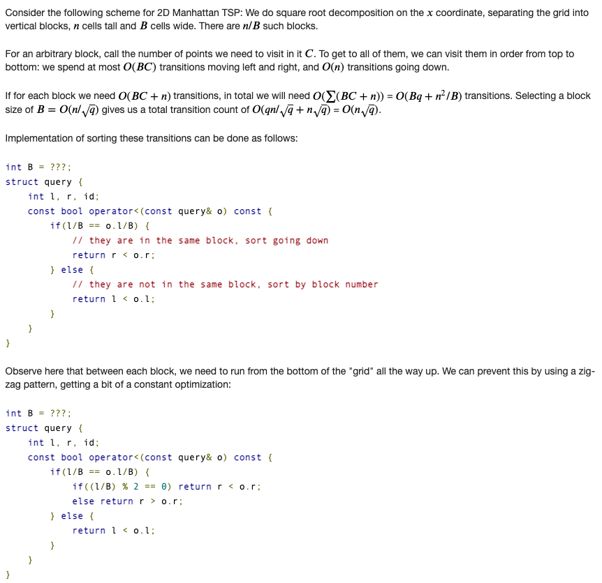

### Usecase: Answering queries on a static array, offline (Mo's algorithm)

### TODO
https://ei1333.hateblo.jp/entry/2017/09/11/211011

## Anudeep's blog

source: https://blog.anudeep2011.com/mos-algorithm/

### State a problem

Given an array of size N. All elements of array `<= N`. You need to answer M queries. Each query is of the form `L, R`. You need to answer the count of values in range `[L, R]` which are repeated at least 3 times.

Example: Let the array be `{1, 2, 3, 1, 1, 2, 1, 2, 3, 1}` (zero indexed)

* Query: `L = 0, R = 4`. Answer = 1. Values in the range `[L, R] = {1, 2, 3, 1, 1}` only 1 is repeated at least 3 times.
* Query: `L = 1, R = 8`. Answer = 2. Values in the range `[L, R] = {2, 3, 1, 1, 2, 1, 2, 3}` 1 is repeated 3 times and 2 is repeated 3 times. Number of elements repeated at least 3 times = Answer = 2.

### Explain a simple solution which takes O(N^2)

For each query, loop from L to R, count the frequency of elements and report the answer. Considering M = N, following runs in O(N^2) in worst case.

```cpp
for each query:
  answer = 0
  count[] = 0
  for i in {l..r}:
    count[array[i]]++
    if count[array[i]] == 3:
      answer++
```

### Slight modification to above algorithm. It still runs in O(N^2)

```python
def add(position):
  count[array[position]]++
  if count[array[position]] == 3:
    answer++

def remove(position):
  count[array[position]]--
  if count[array[position]] == 2:
    answer--

currentL = 0
currentR = 0
answer = 0
count[] = 0
for L,R in query:
  # currentL should go to L, currentR should go to R
  while currentL < L:
    remove(currentL)
    currentL += 1
  while currentL > L:
    add(currentL)
    currentL -= 1
  while currentR < R:
    add(currentR)
    currentR += 1
  while currentR > R:
    remove(currentR)
    currentR -= 1
  print(answer) # Number of elements whose frequency > 3
```

Initially we always looped from `L` to `R`, but now we are changing the positions from previous query to adjust to current query.

If previous query was `L=3, R=10`, then we will have `currentL=3` and `currentR=10` by the end of that query. Now if the next query is `L=5, R=7`, then we move the `currentL` to `5` and `currentR` to `7`.

* `add` function means we are adding the element at position to our current set. And updating answer accordingly.
* `remove` function means we are deleting the element at position from our current set. And updating answer accordingly.

Although not a bug but I would like to mention to the readers that the code snippet given in the blog suffers from a logical counter intuitiveness that remove operation of an element can happen before add operation on it. For example n = 8, and we have 2 queries (0,7) ans (1,4) then after ordering the queries appear in (1,4) followed by (0,7) and the code snippet removes 0th element while increasing the left pointer while it was not added previously. Now this may cause serious problem because in some problems where this assumption is necessary to ensure certain quantity does not become negative.

### Explain an algorithm to solve above problem and state its correctness

MO’s algorithm is just an order in which we process the queries. We were given `M` queries, we will re-order the queries in a particular order and then process them. Clearly, this is an offline algorithm. Each query has `L` and `R`, we will call them opening and closing. Let us divide the given input array into `Sqrt(N)` blocks. Each block will be `N / Sqrt(N) = Sqrt(N)` size. Each opening has to fall in one of these blocks. Each closing has to fall in one of these blocks.

A query belongs to P’th block if the opening of that query fall in P’th block. In this algorithm we will process the queries of 1st block. Then we process the queries of 2nd block and so on.. finally `Sqrt(N)`’th block. We already have an ordering, queries are ordered in the ascending order of its block. There can be many queries that belong to the same block.

From now, I will ignore about all the blocks and only focus on how we query and answer block 1. We will similarly do for all blocks. All of these queries have their opening in block 1, but their closing can be in any block including block 1. Now let us reorder these queries in ascending order of their R value. We do this for all the blocks.

How does the final order look like?
All the queries are first ordered in ascending order of their block number (block number is the block in which its opening falls). Ties are ordered in ascending order of their R value.
For example consider following queries and assume we have 3 blocks each of size 3. `{0, 3} {1, 7} {2, 8} {7, 8} {4, 8} {4, 4} {1, 2}`
* Let us re-order them based on their `block number`. `{0, 3} {1, 7} {2, 8} {1, 2} {4, 8} {4, 4} {7, 8}`
* Now let us re-order ties based on their `R` value. `{1, 2} {0, 3} {1, 7} {2, 8} {4, 4} {4, 8} {7, 8}`

Now we use the same code stated in previous section and solve the problem. Above algorithm is correct as we did not do any changes but just reordered the queries.

### Proof for complexity of above algorithm – O(Sqrt(N) * N)

We are done with MO’s algorithm, it is just an ordering. Awesome part is its runtime analysis. It turns out that the `O(N^2)` code we wrote works in `O(Sqrt(N) * N)` time if we follow the order specified above. Thats awesome right, with just reordering the queries we reduced the complexity from `O(N^2)` to `O(Sqrt(N) * N)`, and that too with out any further modification to code. Hurray! we will get AC with `O(Sqrt(N) * N)`.

Have a look at our code above, the complexity over all queries is determined by the 4 while loops. First 2 while loops can be stated as “Amount moved by left pointer in total”, second 2 while loops can be stated as “Amount moved by right pointer”. Sum of these two will be the over all complexity.

Most important. Let us talk about the right pointer first. For each block, the queries are sorted in increasing order, so clearly the right pointer (currentR) moves in increasing order. During the start of next block the pointer possibly at extreme end will move to least R in next block. That means for a given block, the amount moved by right pointer is `O(N)`. We have `O(Sqrt(N)) blocks`, so the total is `O(N * Sqrt(N))`. Great!

Let us see how the left pointer moves. For each block, the left pointer of all the queries fall in the same block, as we move from query to query the left pointer might move but as previous L and current L fall in the same block, the moment is `O(Sqrt(N))` (Size of the block). In each block the amount left pointer movies is `O(Q * Sqrt(N))` where Q is number of queries falling in that block. Total complexity is `O(M * Sqrt(N))` for all blocks.

There you go, total complexity is `O( (N + M) * Sqrt(N)) = O( N * Sqrt(N))`

### Explain where and when we can use above algorithm

As mentioned, this algorithm is offline, that means we cannot use it when we are forced to stick to given order of queries. That also means we cannot use this when there are update operations. Not just that, there is one important possible limitation: We should be able to write the functions add and remove. There will be many cases where add is trivial but remove is not. One such example is where we want maximum in a range. As we add elements, we can keep track of maximum. But when we remove elements it is not trivial. Anyways in that case we can use a set to add elements, remove elements and report minimum. In that case the add and delete operations are O(log N) (Resulting in O(N * Sqrt(N) * log N) algorithm).

There are many cases where we can use this algorithm. In few cases we can also use other Data Structures like segment trees, but for few problems using MO’s algorithm is a must. Lets discuss few problems in the next section.

### TODO Problems

* Powerful array – CF Div1 D: This is an example where MO’s algorithm is a must. I cannot think of any other solution. CF Div1 D means it is a hard problem. See how easy it is using MO’s algorithm in this case. You only need to modify add(), remove() functions in above code.
* GERALD07 – Codechef
* GERALD3 – Codechef
* Tree and Queries – CF Div1 D
* Jeff and Removing Periods – CF Div1 D
* Sherlock and Inversions – Codechef

## MO's Algorithm

Usecase: Answering queries on a static array, offline (Mo's algorithm)

You are given array Arr of length N and Q queries. Each query is represented by two numbers L and R, and it asks you to compute some function Func `F` with subarray `Arr[L..R]` as its argument.

Mo’s algorithm provides a way to answer all queries in `O((N + Q) * sqrt(N) * F)` time with at least `O(Q)` additional memory. Meaning of `F` is explained below.

The algorithm is applicable if all following conditions are met:

* Arr is not changed by queries;
* All queries are known beforehand (techniques requiring this property are often called “offline algorithms”);
* If we know `Func([L, R])`, then we can compute `Func([L + 1, R])`, `Func([L - 1, R])`, `Func([L, R + 1])` and `Func([L, R - 1])`, each in `O(F)` time.

#### Algorithm
* Consider a problem where we are asked to find the answer for certain intervals `[l, r]`. We can't quickly compute the answer for an arbitrary interval, but we know how to transition to `[l, r±1]` and `[l±1, r]` fast given some information remaining from `[l, r]` answer calculation. The number of transitions we need to do to get from `[l1, r1]` to `[l2, r2]` is `|l1-l2|+|r1-r2|`.
* If there are only two intervals we need to answer such transitioning would help us. However, if there are many intervals, choosing a good transitioning route will drastically reduce the total time needed. Finding the best transition route quick is allegedly NP-hard, so we will focus on estimating a "good enough" route.
* Just by reordering our queries we can answer our queries faster, but since we reorder our queries, it is offline.

Proof why this works:




First always make sure that you `add_element` then `remove_element`, otherwise your code might not work becaue of `--cnt[A[x]]==0`, if we don't add first then count might become negative.
```cpp
// Author: Tanuj Khattar
// Accepted Solution for https://www.spoj.com/problems/DQUERY/
// using MO's with Updates, as discussed in https://unacademy.com/educator/class/square-root-decomposition/BURZLN1E
#include <bits/stdc++.h>

using namespace std;

const int N = 3e4 + 10;
const int Q = 2e5 + 10;
int A[N], rev[N], cnt[N];
struct Query {
  int idx, l, r, lb, rb;
} q[Q];
int compressed_val;
int ans[Q], curr_ans;
void add_element(int x) {
  if (++cnt[A[x]] == 1) {
    curr_ans += 1;
  }
}
void remove_element(int x) {
  if (--cnt[A[x]] == 0) {
    curr_ans -= 1;
  }
}
bool cmp(Query a, Query b) {
  return (a.lb < b.lb) || (a.lb == b.lb && a.r < b.r);
}
int main() {
  // Read Input.
  int n;
  scanf("%d", &n);
  int block = max(1, int(pow(n, 1.0 / 2.0)));
  map<int, int> mp;
  for (int i = 1; i <= n; i++) {
    scanf("%d", A + i);
    mp[A[i]];
  }
  int m;
  scanf("%d", &m);
  for (int i = 1; i <= m; i++) {
    int x, y;
    scanf("%d %d", &x, &y);
    q[i] = {i, x, y, x / block, y / block};
  }
  // Coordinate compression.
  // 1 <= A[i] <= 1e9 --> 1 <= A[i] <= N?
  // 2, 5, 10 --> 1, 2, 3 
  // 2 --> 1, 5 --> 2, 10 --> 3.
  for (auto &it : mp) {
    it.second = ++compressed_val;
    rev[compressed_val] = it.first;
  }
  for (int i = 1; i <= n; i++) {
    A[i] = mp[A[i]];
  }
  // Assume: 1 <= A[i] <= 1e5
  // Sort the queries.
  sort(q + 1, q + m + 1, cmp);
  // Answer the queries.
  for (int i = 1, L = 1, R = 0; i <= m; i++) {
    // Total cost of all 4 loops : |L2 - L1| + |R2 - R1|
    // First add_element and then remove_element
    while (R < q[i].r) add_element(++R);
    while (L > q[i].l) add_element(--L);
    while (R > q[i].r) remove_element(R--);
    while (L < q[i].l) remove_element(L++);
    ans[q[i].idx] = curr_ans;
  }
  for (int i = 1; i <= m; i++) {
    printf("%d\n", ans[i]);
  }
}
```

MO's with Updates
```cpp
// Author: Tanuj Khattar
// Accepted Solution for https://www.spoj.com/problems/XXXXXXXX/ using MO's with Updates,
// as discussed in https://unacademy.com/educator/class/square-root-decomposition/BURZLN1E
#include <bits/stdc++.h>

using namespace std;

const int N = 5e4 + 10;
const int Q = 1e5 + 10;
int A[N], last[N], rev[N + Q], cnt[N + Q];
bool use[N];
struct Query {
  int idx, l, r, t, lb, rb;
} q[Q];
struct Update {
  int x, new_y, prv_y;
} u[Q];
int nq, nu, compressed_val;
int64_t ans[Q], curr_ans;
void add_element(int x) {
  use[x] = true;
  if (++cnt[A[x]] == 1) {
    curr_ans += rev[A[x]];
  }
}
void remove_element(int x) {
  use[x] = false;
  if (--cnt[A[x]] == 0) {
    curr_ans -= rev[A[x]];
  }
}
void reflect_update(int x, int y) {
  // Set A[x] = y;
  if (!use[x]) {
    A[x] = y;
    return;
  }
  remove_element(x);
  A[x] = y;
  add_element(x);
}
void do_update(int i) { reflect_update(u[i].x, u[i].new_y); }
void undo_update(int i) { reflect_update(u[i].x, u[i].prv_y); }

bool cmp(Query a, Query b) {
  return (a.lb < b.lb) || (a.lb == b.lb && a.rb < b.rb) ||
         (a.lb == b.lb && a.rb == b.rb && a.t < b.t);
}
int main() {
  // Read Input.
  int n;
  scanf("%d", &n);
  int block = pow(n, 2.0 / 3.0);
  map<int, int> mp;
  for (int i = 1; i <= n; i++) {
    scanf("%d", A + i);
    last[i] = A[i];
    mp[A[i]];
  }
  int m;
  scanf("%d", &m);
  for (int i = 1; i <= m; i++) {
    char s[2];
    int x, y;
    scanf("%s %d %d", s, &x, &y);
    if (s[0] == 'Q') {
      nq++;
      q[nq] = {nq, x, y, nu, x / block, y / block};
    } else {
      u[++nu] = {x, y, last[x]};
      last[x] = y;
      mp[y];
    }
  }
  // Coordinate compression.
  for (auto &it : mp) {
    it.second = ++compressed_val;
    rev[compressed_val] = it.first;
  }
  for (int i = 1; i <= n; i++) {
    A[i] = mp[A[i]];
  }
  for (int i = 1; i <= nu; i++) {
    u[i].new_y = mp[u[i].new_y];
    u[i].prv_y = mp[u[i].prv_y];
  }
  // Sort the queries.
  sort(q + 1, q + nq + 1, cmp);
  // Answer the queries.
  for (int i = 1, T = 0, L = 1, R = 0; i <= nq; i++) {
    while (T < q[i].t) do_update(++T);
    while (T > q[i].t) undo_update(T--);
    while (R < q[i].r) add_element(++R);
    while (L > q[i].l) add_element(--L);
    while (R > q[i].r) remove_element(R--);
    while (L < q[i].l) remove_element(L++);
    ans[q[i].idx] = curr_ans;
  }
  for (int i = 1; i <= nq; i++) {
    printf("%lld\n", ans[i]);
  }
}
```

### Implementation trick

Comparator within struct

```cpp
// mo stuff
int BL[nax]; // block of l
int ans[nax];
int cnt[nax];

struct query {
    int id, l, r, k;
    const bool operator<(const query &other) const{
        return BL[l] == BL[other.l] ? r < other.r : BL[l] < BL[other.l];
    }
};
```

Nice implementation by ffao https://codeforces.com/contest/375/submission/18814449

## Mo's Algorithm on Trees

### Handling Subtree Queries

Consider the following problem. You will be given a rooted Tree T of N nodes where each node is associated with a value A[node]. You need to handle Q queries, each comprising one integer u. In each query you must report the number of distinct values in the subtree rooted at u. In other words, if you store all the values in the subtree rooted at u in a set, what would be the size of this set? `1 ≤ N, Q ≤ 10^5` and `1 ≤ A[node] ≤ 10^9`

**Solution:**  One easy way to solve this is to flatten the tree into an array by doing a Preorder traversal(Euler tour tree) and then implement Mo's Algorithm. Once we flatten the tree, subtree queries becomes range queries. Maintain a lookup table which maintains the frequency of each value in the current window. By maintaining this, the answer can be updated easily. Complexity of solution would be `O(Q √N)`.

Note that we can also solve this in `O(N log^2N)` by maintaining a set in each node and using Small to Large merging(or DSU Sack on tree).

### Handling Path Queries

In the above problem, instead of subtree of `u`, we are asked to compute the number of distinct values in the path from `u` to `v`.

**Issue:** While handling subtree queries, because of Euler tour tree, it was possible to represent any subtree as a contiguous range in an array. Thus the problem was reduced to "finding number of distinct values in a subarray `[L, R]` of `A[]`.  Note that it is not possible to do so for path queries, as nodes which are `O(N)` distance apart in the tree might be `O(1)` distance apart in the flattened tree (represented by Array `A[]`). So doing a normal dfs-order would not work out.

**Observations:** Let a node `u` have `k` children. Let us number them as `v1, v2, ..., vk`. Let `S(u)` denote the subtree rooted at `u`. Let us assume that `dfs()` will visit u's children in the order `v1, v2, ..., vk`. Let `x` be any node in `S(vi)` and `y` be any node in `S(vj)` and let `i < j`. Notice that `dfs(y)` will be called only after `dfs(x)` has been completed and S(x) has been explored. Thus, before we call `dfs(y)`, we would have entered and exited `S(x)`. We will exploit this seemingly obvious property of dfs() to modify our existing algorithm and try to represent each query as a contiguous range in a flattened array. Each vertex which is not on the path will appear twice in Euler Tour tree between `start[u] and start[v]` if we insert vertices at `start` and `finish` of vertex.

**Algorithm:**

Let a query be (u, v). We will try to map each query to a range in the flattened array. Let ST(u) ≤ ST(v) where ST(u) denotes visit time of node u in T. Let P = LCA(u, v) denote the lowest common ancestor of nodes u and v. There are 2 possible cases:

* lca(u, v) = u. 
  In this case, our query range would be [ST(u), ST(v)]. Why will this work?

  Consider any node x that does not lie in the (u, v) path. Notice that x occurs twice or zero times in our specified query range. Therefore, the nodes which occur exactly once in this range are precisely those that are on the (u, v) path! (Try to convince yourself of why this is true : It's all because of dfs() properties.)
  
  This forms the crux of our algorithm. While implementing Mo's, our add/remove function needs to check the number of times a particular node appears in a range. If it occurs twice (or zero times), then we don't take it's value into account! This can be easily implemented while moving the left and right pointers.
  
* lca(u, v) != u
  In this case, our query range would be [EN(u), ST(v)] + [ST(P), ST(P)].
  
  Same logic from previous case applies here. The only difference is that we need to consider the value of P i.e the LCA separately, as it would not be counted in the query range.
  
#### SPOJ COT2 - Count on a tree II

You are given a tree with N nodes. The tree nodes are numbered from 1 to N. Each node has an integer weight.

We will ask you to perform the following operation:

u v : ask for how many different integers that represent the weight of nodes there are on the path from u to v. (N <= 40000, Queries M <= 100000)

Solution: 

```cpp
#include<bits/stdc++.h>

using namespace std;

const int nax = 1e5 + 10;
const int LG = 19;

int color[nax];
vector<int> adj[nax];

// euler tour tree
int timer;
int st[nax], en[nax];
int node[nax]; // node at time[i]
int depth[nax];
int par[nax][LG];

// insert every node twice in ETT
void dfs(int u, int p){
    st[u] = timer++; node[st[u]] = u;
    for(int v: adj[u]){
        if(v==p) continue;
        depth[v] = depth[u] + 1;
        par[v][0] = u;
        for(int i=1; par[v][i-1]; i++){
            par[v][i] = par[par[v][i-1]][i-1];
        }
        dfs(v, u);
    }
    en[u] = timer++; node[en[u]] = u;
}

int jump(int u, int k){
    for(int i=LG-1;i>=0;i--){
        if(k >= (1<<i)){
            u = par[u][i];
            k -= 1<<i;
        }
    }
    return u;
}

int lca(int u, int v){
    if(depth[u] > depth[v]) swap(u, v);
    v = jump(v, depth[v] - depth[u]);
    if(u == v) return u;
    for(int i=LG-1;i>=0;i--){
        if(par[u][i] != par[v][i]){
            u = par[u][i];
            v = par[v][i];
        }
    }
    return par[u][0];
}

// mo stuff
int BL[nax]; // block of l
int ans[nax];
int cnt[nax];
int curAns; // global answer
int vis[nax]; // to check whether node is visited

struct query {
    int id, l, r, u, v, z; // z is lca(u, v)
    bool operator<(const query &other) const{
        return BL[l] == BL[other.l] ? r < other.r : BL[l] < BL[other.l];
    }
};

vector<query> Q;

void add(int u){
    // if (u) occurs twice, then don't consider it's value
    if(vis[u] && --cnt[color[u]] == 0) curAns--;
    else if(!vis[u]  && cnt[color[u]]++ == 0) curAns++;
    vis[u] ^= 1;
}

void compute(){
    int curL = Q[0].l, curR = Q[0].l - 1;
    for(int i=0; i<Q.size(); i++){
        query q = Q[i];
        while(curL > q.l) add(node[--curL]);
        while(curR < q.r) add(node[++curR]);
        while(curL < q.l) add(node[curL++]);
        while(curR > q.r) add(node[curR--]);

        // if lca(u, v) != u then include lca in the answer
        if(q.z != q.u) add(q.z);
        ans[q.id] = curAns;
        if(q.z != q.u) add(q.z);

    }
}

int main() {
    int n, m; scanf("%d %d", &n, &m);
    for(int i=1;i<=n;i++) scanf("%d", &color[i]);
    // coordinate compress on colors
    map<int, int> M;
    int tt = 1;
    for(int i=1;i<=n;i++){
        // no need to sort colors first
        if(M[color[i]] == 0) M[color[i]] = ++tt;
        color[i] = M[color[i]];
    }

    for(int i=1;i<n;i++){
        int a, b; scanf("%d %d", &a, &b);
        adj[a].push_back(b);
        adj[b].push_back(a);
    }

    dfs(1, 0);

    for(int i=0;i<nax;i++) BL[i] = i/320;

    for(int i=0;i<m;i++){
        int u, v; scanf("%d %d", &u, &v);
        if(st[u] > st[v]) swap(u, v);
        query q;
        q.id = i; q.u = u; q.v = v; q.z = lca(u, v);
        if(q.z == u){ // lca is u, then query from st[u] to st[v]
            q.l = st[u]; q.r = st[v];
        }else{ // query from en[u] to en[v], also include lca
            q.l = en[u]; q.r = st[v];
        }
        Q.push_back(q);
    }
    sort(Q.begin(), Q.end());
    compute();
    for(int i=0;i<m;i++) printf("%d\n", ans[i]);
    return 0;
}
```

source: https://ideone.com/6NVoPD

### Template

One more small optimization done here is that when `L` is in the same block, for even sqrt-block, we go from left to right, for odd, we go from right to left. This way our constant in complexity is smaller.

```cpp
struct Mo {
  int n;
  vector< pair< int, int > > lr;

  explicit Mo(int n) : n(n) {}

  void add(int l, int r) { /* [l, r) */
    lr.emplace_back(l, r);
  }

  template< typename AL, typename AR, typename EL, typename ER, typename O >
  void build(const AL &add_left, const AR &add_right, const EL &erase_left, const ER &erase_right, const O &out) {
    int q = (int) lr.size();
    int bs = n / min< int >(n, sqrt(q));
    vector< int > ord(q);
    iota(begin(ord), end(ord), 0);
    sort(begin(ord), end(ord), [&](int a, int b) {
      int ablock = lr[a].first / bs, bblock = lr[b].first / bs;
      if(ablock != bblock) return ablock < bblock;
      return (ablock & 1) ? lr[a].second > lr[b].second : lr[a].second < lr[b].second;
    });
    int l = 0, r = 0;
    for(auto idx : ord) {
      while(l > lr[idx].first) add_left(--l);
      while(r < lr[idx].second) add_right(r++);
      while(l < lr[idx].first) erase_left(l++);
      while(r > lr[idx].second) erase_right(--r);
      out(idx);
    }
  }

  template< typename A, typename E, typename O >
  void build(const A &add, const E &erase, const O &out) {
    build(add, add, erase, erase, out);
  }
};
```

Usage: SPOJ DQUERY - Finding distinct elements in a range

```cpp
int main() {
  int N;
  cin >> N;
  vector< int > A(N);
  for(auto &a: A) cin >> a;
  int Q;
  cin >> Q;
  Mo mo(N);
  for(int i = 0; i < Q; i++) {
    int a, b;
    cin >> a >> b;
    mo.add(a - 1, b);
  }
  vector< int > cnt(1000001), ans(Q);
  int sum = 0;
  auto add = [&](int i) {
    if(cnt[A[i]]++ == 0) ++sum;
  };
  auto erase = [&](int i) {
    if(--cnt[A[i]] == 0) --sum;
  };
  auto out = [&](int q) {
    ans[q] = sum;
  };
  mo.build(add, erase, out);
  for(auto &p: ans) cout << p << "\n";
}
```

Ref: https://ei1333.hateblo.jp/entry/2017/09/11/211011

<details>
  <summary> My submission for CSES: Distinct Values Queries </summary>

```cpp
struct Mo {
    int n;
    vector< pair< int, int > > lr;

    explicit Mo(int n) : n(n) {}

    void add(int l, int r) { /* [l, r) */
        lr.emplace_back(l, r);
    }

    template< typename AL, typename AR, typename EL, typename ER, typename O >
    void build(const AL &add_left, const AR &add_right, const EL &erase_left, const ER &erase_right, const O &out) {
        int q = (int) lr.size();
        int bs = n / min< int >(n, sqrt(q));
        vector< int > ord(q);
        iota(begin(ord), end(ord), 0);
        sort(begin(ord), end(ord), [&](int a, int b) {
            int ablock = lr[a].first / bs, bblock = lr[b].first / bs;
            if(ablock != bblock) return ablock < bblock;
            return (ablock & 1) ? lr[a].second > lr[b].second : lr[a].second < lr[b].second;
        });
        int l = 0, r = 0;
        for(auto idx : ord) {
            while(l > lr[idx].first) add_left(--l);
            while(r < lr[idx].second) add_right(r++);
            while(l < lr[idx].first) erase_left(l++);
            while(r > lr[idx].second) erase_right(--r);
            out(idx);
        }
    }

    template< typename A, typename E, typename O >
    void build(const A &add, const E &erase, const O &out) {
        build(add, add, erase, erase, out);
    }
};

int main() {
    int N, Q; scanf("%d %d", &N, &Q);

    vector< int > A(N); // 0-based indexing
    for(auto &a: A) scanf("%d", &a);

    // coordinate compression
    map<int, int> M;
    int element = 1;
    for(auto &a: A){
        if(M.find(a) == M.end()){
            M[a] = element;
            a = element++;
        } else {
            a = M[a];
        }
    }

    Mo mo(N);
    for(int i = 0; i < Q; i++) {
        int a, b; scanf("%d %d", &a, &b);
        mo.add(a - 1, b);
    }

    vector<int> cnt(200001), ans(Q);
    int sum = 0;
  
    auto add = [&](int i) {
        if(cnt[A[i]]++ == 0) ++sum;
    };

    auto erase = [&](int i) {
        if(--cnt[A[i]] == 0) --sum;
    };

    auto out = [&](int q) {
        ans[q] = sum;
    };

    mo.build(add, erase, out);
    for(auto &p: ans) cout << p << "\n";
    return 0;
}  
```
  
</details>  

<details>
  <summary> Without using Mo's algorithm - using BIT/Fenwick tree </summary>
  
```cpp
// Binary indexed tree supporting binary search.
struct BIT {
    int n;
    vector<int> bit;
    // BIT can be thought of as having entries f[1], ..., f[n]
    // with f[1]=0,...,f[n]=0 initially
    BIT(int n):n(n), bit(n+1) {}
    // returns f[1] + ... + f[idx-1]
    // precondition idx <= n+1
    int read(int idx) {
        idx--;
        int res = 0;
        while (idx > 0) {
            res += bit[idx];
            idx -= idx & -idx;
        }
        return res;
    }
    // returns f[idx1] + ... + f[idx2-1]
    // precondition idx1 <= idx2 <= n+1
    int read2(int idx1, int idx2) {
        return read(idx2) - read(idx1);
    }
    // adds val to f[idx]
    // precondition 1 <= idx <= n (there is no element 0!)
    void update(int idx, int val) {
        while (idx <= n) {
            bit[idx] += val;
            idx += idx & -idx;
        }
    }
};

int main() {
    int N, Q; scanf("%d %d", &N, &Q);
    vector< int > A(N); // 0-based indexing
    for(auto &a: A) scanf("%d", &a);

    // coordinate compression
    map<int, int> M;
    int element = 1;
    for(auto &a: A){
        if(M.find(a) == M.end()){
            M[a] = element;
            a = element++;
        } else {
            a = M[a];
        }
    }

    // store all the queries together based on the left boundary
    vector<vector< pair<int, int> >> Queries(N+1);
    for(int i = 0; i < Q; i++) {
        int a, b; scanf("%d %d", &a, &b);
        Queries[a-1].push_back({b, i});
    }

    BIT bit(N + 10);
    vector<int> ans(Q);
    // store the running smallest_index of distinct elements
    map<int, int> last_index; 

    // process from the last index
    for(int i=N-1;i>=0;i--){
        if(last_index.find(A[i]) != last_index.end()){
            bit.update(last_index[A[i]], -1);
        }
        last_index[A[i]] = i + 1;
        bit.update(last_index[A[i]], 1);
        
        // answer all the queries whose left index is i
        for(pair<int, int> query: Queries[i]){
            ans[query.second] = bit.read2(i+1, query.first+1);
        }
    }
    for(auto &p: ans) printf("%d\n", p);
    return 0;
}  
``` 
  
</details>  
  
### Make it faster for upto `10^6` queries

#### Given an array of distinct integers, for each query `l, r`  you need to minimum difference between any two integers in the range `a[l] a[l+1] ... a[r]`
  
Witn normal sets, it will give TLE. To pass time limit, you need super fast set for integers and super fast IO.  
  
The following solution uses `godgod_suc_pred`,
* It supports all `std::set` operations in `O(1)` on random queries / dense arrays, `O(log_64(N))` in worst case (sparce array).
  
Ref: https://codeforces.com/problemset/problem/765/F and https://codeforces.com/problemset/problem/1793/F
  
In the following solution, instead of delete/remove, we've used rollback and snapshot as mentioned in https://codeforces.com/blog/entry/7383?#comment-161520


  
```cpp
#pragma GCC optimize("Ofast")
// #pragma GCC target("avx,avx2,fma")

#include "bits/stdc++.h"

//#define NDEBUG
#define F first
#define S second
#define vec vector
#define pb push_back
#define pll pair<ll, ll>
#define pdd pair<ld, ld>
#define pii pair<int, int>
#define all(m) m.begin(), m.end()
#define rall(m) m.rbegin(), m.rend()
#define uid uniform_int_distribution
#define timeStamp() std::chrono::steady_clock::now()
#define unify(m) sort(all(m)); m.erase(unique(all(m)), m.end());
#define duration_micro(a) chrono::duration_cast<chrono::microseconds>(a).count()
#define duration_milli(a) chrono::duration_cast<chrono::milliseconds>(a).count()
#define fast cin.tie(0); cout.tie(0); cin.sync_with_stdio(0); cout.sync_with_stdio(0);
using namespace std;
using str = string;
using ll = long long;
using ld = long double;
using uint = unsigned int;
using ull = unsigned long long;
mt19937 rnd(timeStamp().time_since_epoch().count());
mt19937_64 rndll(timeStamp().time_since_epoch().count());
template<typename T> constexpr inline int sign(T x) {return x < 0 ? -1 : x > 0 ? 1 : 0;}
template<typename T, typename U> bool chmin(T& a, const U& b) {return (T)b < a ? a = b, 1 : 0;}
template<typename T, typename U> bool chmax(T& a, const U& b) {return (T)b > a ? a = b, 1 : 0;}
constexpr inline uint leq_pow2(const uint x) {return 1u << __lg(x);}
constexpr inline ull leq_pow2ll(const ull x) {return 1ull << __lg(x);}
constexpr inline uint geq_pow2(const uint x) {return x & (x - 1) ? 2u << __lg(x) : x;}
constexpr inline ull geq_pow2ll(const ull x) {return x & (x - 1) ? 2ull << __lg(x) : x;}
constexpr inline ll sqd(const pll p1, const pll p2) {return (p1.F - p2.F) * (p1.F - p2.F) + (p1.S - p2.S) * (p1.S - p2.S);}
constexpr inline ll sqd(const ll x1, const ll y1, const ll x2, const ll y2) {return (x1 - x2) * (x1 - x2) + (y1 - y2) * (y1 - y2);}
struct custom_hash {static uint64_t xs(uint64_t x) {x += 0x9e3779b97f4a7c15; x = (x ^ (x >> 30)) * 0xbf58476d1ce4e5b9; x = (x ^ (x >> 27)) * 0x94d049bb133111eb; return x ^ (x >> 31);} template<typename T> size_t operator()(T x) const {static const uint64_t C = timeStamp().time_since_epoch().count(); return xs(hash<T> {}(x) + C);}};
template<typename K> using uset = unordered_set<K, custom_hash>;
template<typename K, typename V> using umap = unordered_map<K, V, custom_hash>;
template<typename T1, typename T2> ostream& operator<<(ostream& out, const pair<T1, T2>& x) {return out << x.F << ' ' << x.S;}
template<typename T1, typename T2> istream& operator>>(istream& in, pair<T1, T2>& x) {return in >> x.F >> x.S;}
template<typename T, size_t N> istream& operator>>(istream& in, array<T, N>& a) {for (auto &x : a) in >> x; return in;};
template<typename T, size_t N> ostream& operator<<(ostream& out, const array<T, N>& a) {for (int q = 0; q < a.size(); ++q) {out << a[q]; if (q + 1 < a.size()) out << ' ';} return out;};
template<typename T> istream& operator>>(istream& in, vector<T>& a) {for (auto &x : a) in >> x; return in;};
template<typename T> ostream& operator<<(ostream& out, const vector<T>& a) {for (int q = 0; q < a.size(); ++q) {out << a[q]; if (q + 1 < a.size()) out << ' ';} return out;};

static const auto IOSetup = [] {
    std::cin.tie(nullptr)->sync_with_stdio(false);
    // std::cout << std::setprecision(6) << std::fixed;
    return nullptr;}();
struct IOPre {static constexpr int TEN = 10, SZ = TEN * TEN * TEN * TEN;std::array<char, 4 * SZ> num;constexpr IOPre() : num{} {for (int i = 0; i < SZ; i++) {int n = i;for (int j = 3; j >= 0; j--) {num[i * 4 + j] = static_cast<char>(n % TEN + '0');n /= TEN;}}}};
struct IO {
#if !HAVE_DECL_FREAD_UNLOCKED
#define fread_unlocked fread
#endif
#if !HAVE_DECL_FWRITE_UNLOCKED
#define fwrite_unlocked fwrite
#endif
    static constexpr int SZ = 1 << 17, LEN = 32, TEN = 10, HUNDRED = TEN * TEN,THOUSAND = HUNDRED * TEN, TENTHOUSAND = THOUSAND * TEN,MAGIC_MULTIPLY = 205, MAGIC_SHIFT = 11, MASK = 15,TWELVE = 12, SIXTEEN = 16;static constexpr IOPre io_pre = {};std::array<char, SZ> input_buffer, output_buffer;int input_ptr_left, input_ptr_right, output_ptr_right;
    IO(): input_buffer{},output_buffer{},input_ptr_left{},input_ptr_right{},output_ptr_right{} {}
    IO(const IO&) = delete;IO(IO&&) = delete;IO& operator=(const IO&) = delete;IO& operator=(IO&&) = delete;
    ~IO() { flush(); }
    template <class T>struct is_char {static constexpr bool value = std::is_same_v<T, char>;};
    template <class T>struct is_bool {static constexpr bool value = std::is_same_v<T, bool>;};
    template <class T>struct is_string {static constexpr bool value =std::is_same_v<T, std::string> || std::is_same_v<T, const char*> ||std::is_same_v<T, char*> || std::is_same_v<std::decay_t<T>, char*>;;};
    template <class T, class D = void>struct is_custom {static constexpr bool value = false;};
    template <class T>struct is_custom<T, std::void_t<typename T::internal_value_type>> {static constexpr bool value = true;};
    template <class T>struct is_default {static constexpr bool value = is_char<T>::value || is_bool<T>::value ||is_string<T>::value ||std::is_integral_v<T>;};
    template <class T, class D = void>struct is_iterable {static constexpr bool value = false;};
    template <class T>struct is_iterable <T, typename std::void_t<decltype(std::begin(std::declval<T>())) >> {static constexpr bool value = true;};
    template <class T, class D = void, class E = void>struct is_applyable {static constexpr bool value = false;};
    template <class T>struct is_applyable<T, std::void_t<typename std::tuple_size<T>::type>,std::void_t<decltype(std::get<0>(std::declval<T>()))>> {static constexpr bool value = true;};
    template <class T>static constexpr bool needs_newline = (is_iterable<T>::value || is_applyable<T>::value) && (!is_default<T>::value);
    template <typename T, typename U> struct any_needs_newline {static constexpr bool value = false;}; template <typename T>
    struct any_needs_newline<T, std::index_sequence<>> {static constexpr bool value = false;};
    template <typename T, std::size_t I, std::size_t... Is>struct any_needs_newline<T, std::index_sequence<I, Is...>> {static constexpr bool value = needs_newline<decltype(std::get<I>(std::declval<T>()))> || any_needs_newline<T, std::index_sequence<Is...>>::value;};
    inline void load() {memmove(std::begin(input_buffer), std::begin(input_buffer) + input_ptr_left, input_ptr_right - input_ptr_left); input_ptr_right = input_ptr_right - input_ptr_left + static_cast<int>(fread_unlocked(std::begin(input_buffer) + input_ptr_right - input_ptr_left, 1, SZ - input_ptr_right + input_ptr_left, stdin)); input_ptr_left = 0;}
    inline void read_char(char& c) {if (input_ptr_left + LEN > input_ptr_right) load(); c = input_buffer[input_ptr_left++];}
    inline void read_string(std::string& x) {char c; while (read_char(c), c < '!') continue; x = c; while (read_char(c), c >= '!') x += c;}
    template <class T> inline std::enable_if_t<std::is_integral_v<T>, void> read_int(T& x) {if (input_ptr_left + LEN > input_ptr_right) load(); char c = 0; do c = input_buffer[input_ptr_left++]; while (c < '-'); [[maybe_unused]] bool minus = false; if constexpr (std::is_signed<T>::value == true)if (c == '-') minus = true, c = input_buffer[input_ptr_left++]; x = 0; while (c >= '0')x = x * TEN + (c & MASK), c = input_buffer[input_ptr_left++]; if constexpr (std::is_signed<T>::value == true)if (minus) x = -x;}
    inline void skip_space() {if (input_ptr_left + LEN > input_ptr_right) load(); while (input_buffer[input_ptr_left] <= ' ') input_ptr_left++;}
    inline void flush() {fwrite_unlocked(std::begin(output_buffer), 1, output_ptr_right, stdout); output_ptr_right = 0;}
    inline void write_char(char c) {if (output_ptr_right > SZ - LEN) flush(); output_buffer[output_ptr_right++] = c;}
    inline void write_bool(bool b) {if (output_ptr_right > SZ - LEN) flush(); output_buffer[output_ptr_right++] = b ? '1' : '0';}
    inline void write_string(const std::string& s) {for (auto x : s) write_char(x);}
    inline void write_string(const char* s) {while (*s) write_char(*s++);}
    inline void write_string(char* s) {while (*s) write_char(*s++);}
    template <typename T>inline std::enable_if_t<std::is_integral_v<T>, void> write_int(T x) {if (output_ptr_right > SZ - LEN) flush(); if (!x) {output_buffer[output_ptr_right++] = '0'; return;} if constexpr (std::is_signed<T>::value == true)if (x < 0) output_buffer[output_ptr_right++] = '-', x = -x; int i = TWELVE; std::array<char, SIXTEEN> buf{}; while (x >= TENTHOUSAND) {memcpy(std::begin(buf) + i, std::begin(io_pre.num) + (x % TENTHOUSAND) * 4, 4); x /= TENTHOUSAND; i -= 4;} if (x < HUNDRED) {if (x < TEN) {output_buffer[output_ptr_right++] = static_cast<char>('0' + x);} else {std::uint32_t q = (static_cast<std::uint32_t>(x) * MAGIC_MULTIPLY) >> MAGIC_SHIFT; std::uint32_t r = static_cast<std::uint32_t>(x) - q * TEN; output_buffer[output_ptr_right] = static_cast<char>('0' + q); output_buffer[output_ptr_right + 1] = static_cast<char>('0' + r); output_ptr_right += 2;}} else {if (x < THOUSAND) {memcpy(std::begin(output_buffer) + output_ptr_right, std::begin(io_pre.num) + (x << 2) + 1, 3), output_ptr_right += 3;} else {memcpy(std::begin(output_buffer) + output_ptr_right, std::begin(io_pre.num) + (x << 2), 4), output_ptr_right += 4;}} memcpy(std::begin(output_buffer) + output_ptr_right, std::begin(buf) + i + 4, TWELVE - i); output_ptr_right += TWELVE - i;}
    template <typename T_>IO& operator<<(T_&& x) {using T = typename std::remove_cv < typename std::remove_reference<T_>::type >::type; static_assert(is_custom<T>::value or is_default<T>::value or is_iterable<T>::value or is_applyable<T>::value); if constexpr (is_custom<T>::value) {write_int(x.get());} else if constexpr (is_default<T>::value) {if constexpr (is_bool<T>::value) {write_bool(x);} else if constexpr (is_string<T>::value) {write_string(x);} else if constexpr (is_char<T>::value) {write_char(x);} else if constexpr (std::is_integral_v<T>) {write_int(x);}} else if constexpr (is_iterable<T>::value) {using E = decltype(*std::begin(x)); constexpr char sep = needs_newline<E> ? '\n' : ' '; int i = 0; for (const auto& y : x) {if (i++) write_char(sep); operator<<(y);}} else if constexpr (is_applyable<T>::value) {constexpr char sep = (any_needs_newline < T, std::make_index_sequence<std::tuple_size_v<T> >>::value) ? '\n' : ' '; int i = 0; std::apply([this, &sep, &i](auto const & ... y) {(((i++ ? write_char(sep) : void()), this->operator<<(y)), ...);}, x);} return *this;}
    template <typename T>IO& operator>>(T& x) {static_assert(is_custom<T>::value or is_default<T>::value or is_iterable<T>::value or is_applyable<T>::value); static_assert(!is_bool<T>::value); if constexpr (is_custom<T>::value) {typename T::internal_value_type y; read_int(y); x = y;} else if constexpr (is_default<T>::value) {if constexpr (is_string<T>::value) {read_string(x);} else if constexpr (is_char<T>::value) {read_char(x);} else if constexpr (std::is_integral_v<T>) {read_int(x);}} else if constexpr (is_iterable<T>::value) {for (auto& y : x) operator>>(y);} else if constexpr (is_applyable<T>::value) {std::apply([this](auto & ... y) { ((this->operator>>(y)), ...); }, x);} return *this;}
    IO* tie(std::nullptr_t) { return this; }
    void sync_with_stdio(bool) {}
} io;
#define cin io
#define cout io

constexpr ull lowest_bitsll[] = {0ull, 1ull, 3ull, 7ull, 15ull, 31ull, 63ull, 127ull, 255ull, 511ull, 1023ull, 2047ull, 4095ull, 8191ull, 16383ull, 32767ull, 65535ull, 131071ull, 262143ull, 524287ull, 1048575ull, 2097151ull, 4194303ull, 8388607ull, 16777215ull, 33554431ull, 67108863ull, 134217727ull, 268435455ull, 536870911ull, 1073741823ull, 2147483647ull, 4294967295ull, 8589934591ull, 17179869183ull, 34359738367ull, 68719476735ull, 137438953471ull, 274877906943ull, 549755813887ull, 1099511627775ull, 2199023255551ull, 4398046511103ull, 8796093022207ull, 17592186044415ull, 35184372088831ull, 70368744177663ull, 140737488355327ull, 281474976710655ull, 562949953421311ull, 1125899906842623ull, 2251799813685247ull, 4503599627370495ull, 9007199254740991ull, 18014398509481983ull, 36028797018963967ull, 72057594037927935ull, 144115188075855871ull, 288230376151711743ull, 576460752303423487ull, 1152921504606846975ull, 2305843009213693951ull, 4611686018427387903ull, 9223372036854775807ull, 18446744073709551615ull};
const uint NO = 1 << 20; //This value will be returned in lower_bound functions, if no answer exists. Change, if need.
template<uint MAXN>           //Can correctly work with numbers in range [0; MAXN]
class godgod_suc_pred {
    static const uint PREF = (MAXN <= 64 ? 0 :
                              MAXN <= 4096 ? 1 :
                              MAXN <= 262144 ? 1 + 64 :
                              MAXN <= 16777216 ? 1 + 64 + 4096 :
                              MAXN <= 1073741824 ? 1 + 64 + 4096 + 262144 : 227) + 1;
    static const uint SZ = PREF + (MAXN + 63) / 64 + 1;
    ull m[SZ] = {0};

    inline uint left(uint v) const {return (v - 62) * 64;}
    inline uint parent(uint v) const {return v / 64 + 62;}
    inline void setbit(uint v) {m[v >> 6] |= 1ull << (v & 63);}
    inline void resetbit(uint v) {m[v >> 6] &= ~(1ull << (v & 63));}
    inline uint getbit(uint v) const {return m[v >> 6] >> (v & 63) & 1;}
    inline ull childs_value(uint v) const {return m[left(v) >> 6];}

    inline uint left_go(uint x, const uint c) const {
        const ull rem = x & 63;
        uint bt = PREF * 64 + x;
        ull num = m[bt >> 6] & lowest_bitsll[rem + c];
        if (num) return (x ^ rem) | __lg(num);
        for (bt = parent(bt); bt > 62; bt = parent(bt)) {
            const ull rem = bt & 63;
            num = m[bt >> 6] & lowest_bitsll[rem];
            if (num) {bt = (bt ^ rem) | __lg(num); break;}
        }
        if (bt == 62) return NO;
        while (bt < PREF * 64) bt = left(bt) | __lg(m[bt - 62]);
        return bt - PREF * 64;
    }

    inline uint right_go(uint x, const uint c) const {
        const ull rem = x & 63;
        uint bt = PREF * 64 + x;
        ull num = m[bt >> 6] & ~lowest_bitsll[rem + c];
        if (num) return (x ^ rem) | __builtin_ctzll(num);
        for (bt = parent(bt); bt > 62; bt = parent(bt)) {
            const ull rem = bt & 63;
            num = m[bt >> 6] & ~lowest_bitsll[rem + 1];
            if (num) {bt = (bt ^ rem) | __builtin_ctzll(num); break;}
        }
        if (bt == 62) return NO;
        while (bt < PREF * 64) bt = left(bt) | __builtin_ctzll(m[bt - 62]);
        return bt - PREF * 64;
    }

public:
    godgod_suc_pred() {
        assert(PREF != 228);
        setbit(62);
    }

    bool empty() const {return getbit(63);}

    void clear() {fill(m, m + SZ, 0); setbit(62);}

    bool count(uint x) const {return m[PREF + (x >> 6)] >> (x & 63) & 1;}

    void insert(uint x) {
        for (uint v = PREF * 64 + x; !getbit(v); v = parent(v)) {
            setbit(v);
        }
    }

    void erase(uint x) {
        if (!getbit(PREF * 64 + x)) return;
        resetbit(PREF * 64 + x);
        for (uint v = parent(PREF * 64 + x); v > 62 && !childs_value(v); v = parent(v)) {
            resetbit(v);
        }
    }

    uint lower_bound(uint x) const {return right_go(x, 0);}
    uint upper_bound(uint x) const {return right_go(x, 1);}
    uint inverse_lower_bound(uint x) const {return left_go(x, 1);}
    uint inverse_upper_bound(uint x) const {return left_go(x, 0);}
};
// Supports all std::set operations in O(1) on random queries / dense arrays, O(log_64(N)) in worst case (sparce array).
// Count operation works in O(1) always.

const int MAXN = 300000;
const int MAXQ = 1000000;
int a, z;
int m[MAXN];

namespace MO {

    //edit, if need
    const int BLOCK_SIZE = (int)sqrt(MAXN);

    struct query {
        int l, r, n;
        //add needed params
    };

    query qarr[MAXQ];
    int qsz = 0;
    int ans[MAXQ];
    godgod_suc_pred<MAXN> kek;

    inline void add_query(int l, int r) {
        qarr[qsz]  = {l, r, qsz};
        ++qsz;
    }

    inline void add(int ps, int& mn) {
        kek.insert(m[ps]);
        int ln = kek.inverse_upper_bound(m[ps]);
        int rn = kek.upper_bound(m[ps]);
        if (ln != NO) mn = min(mn, m[ps] - ln);
        mn = min(mn, rn - m[ps]);
    }

    inline void rem(int ps) {
        kek.erase(m[ps]);
    }

    void go() {
        sort(qarr, qarr + qsz, [](const query & q1, const query & q2) {
            int bl1 = q1.l / BLOCK_SIZE;
            int bl2 = q2.l / BLOCK_SIZE;
            if (bl1 != bl2) return bl1 < bl2;
            //return (bool)((q1.r < q2.r) ^ (bl1 & 1));
            return q1.r < q2.r;
        });
        for (int q = 0; q < qsz;) {
            int rg = q; // rg is the right most query whose left border is same as qarr[q].l
            for (; rg + 1 < qsz && qarr[rg + 1].l / BLOCK_SIZE == qarr[q].l / BLOCK_SIZE;) ++rg;

            int bn = qarr[q].l / BLOCK_SIZE;
            int br = (bn + 1) * BLOCK_SIZE - 1;
            // initialize, mnc = 1e9 in for loop
            kek.clear();
            for (int rr = br, mnc = 1e9; q <= rg; ++q) {
                const auto &que = qarr[q];
                if (que.r <= br) {
                    // lighter queries, within same block
                    int mn = 1e9;
                    for (int i = que.l; i <= que.r; ++i) {
                        kek.insert(m[i]);
                        int ln = kek.inverse_upper_bound(m[i]);
                        int rn = kek.upper_bound(m[i]);
                        if (ln != NO) mn = min(mn, m[i] - ln);
                        mn = min(mn, rn - m[i]);
                    }
                    ans[que.n] = mn;
                    for (int i = que.l; i <= que.r; ++i) {
                        kek.erase(m[i]);
                    }
                } else {
                    // insert till the right border
                    for (; rr < que.r; ) add(++rr, mnc);
                    int was = mnc; // snapshot
                    // if left border is moved, insert till there, O(block size)
                    for (int i = br; i >= que.l;) add(i--, mnc);
                    ans[que.n] = mnc;
                    // rollback
                    mnc = was;
                    for (int i = que.l; i <= br; ) rem(i++);
                }
            }
        }
    }
};

int main() {
    fast;
    cin >> a >> z;
    for (int q = 0; q < a; ++q) {
        cin >> m[q];
    }
    for (int q = 0; q < z; ++q) {
        int l, r; cin >> l >> r; --l, --r;
        MO::add_query(l, r);
    }
    MO::go();
    for (int q = 0; q < z; ++q) {
        cout << MO::ans[q] << '\n';
    }
}
```
                              

## TODO: 

Basics https://blog.anudeep2011.com/mos-algorithm/ and https://codeforces.com/blog/entry/83248 and https://codeforces.com/blog/entry/81716

With Update: https://codeforces.com/blog/entry/72690

MO's Algorithm on Trees https://codeforces.com/blog/entry/43230 and https://codeforces.com/blog/entry/68271

Checkout: https://discuss.codechef.com/t/mos-algorithm-uses/18482

Query Sqrt decomposition: https://codeforces.com/gym/100589/problem/A

Hilbert curve sorting - https://codeforces.com/blog/entry/61203

https://www.hackerearth.com/practice/notes/mos-algorithm/

https://h0rnet.hatenablog.com/entry/2016/03/03/CFR_Educational_2_E__Lomsat_gelral_(_Smaller_to_Larger_or_Time_stamp_+_Mo's_Algorithm_)

TODO: https://www.geeksforgeeks.org/sqrt-square-root-decomposition-set-2-lca-tree-osqrth-time/


Checkout: TODO: https://www.cnblogs.com/bibibi/p/8525527.html, also look at other pages on https://www.cnblogs.com/bibibi/p/?page=3

https://codeforces.com/blog/entry/92568
