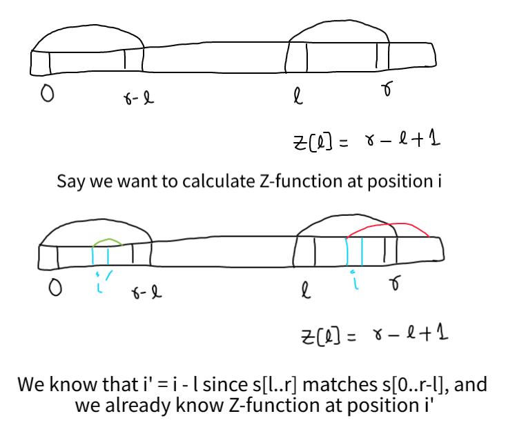

TODO: https://codeforces.com/contest/1535/problem/F & https://codeforces.com/blog/entry/91481

Read from https://usaco.guide/PAPS.pdf#page=243

Strings - sequence of characters

## String Algorithms

Pattern Searching - Given pattern(s) and text(s), we want to find all the occurences of patterns in the given text.

In C++, `std::strstr()` is a predefined function, which takes two strings `s1` and `s2` as an argument and finds the first occurrence of the sub-string `s2` in the string `s1`.

```cpp
    char str[] = "Use your brain and heart";
    char target[] = "brain";
    char *p = strstr(str, target);
```

`size_t find (const string& str, size_t pos = 0);`

Function parameters:

* `str` : The sub-string to be searched.
* `s` : The sub-string to be searched, given as C style string.
* `pos` : The initial position from where the string search is to begin.

Generally, the above mentioned algorithms use naive way of finding substrings which is `O(nm)`.

### Preprocessing

Two different ways - Preprocess what you are searching for, or what you are searching in

Preprocess patterns
* **1 pattern & 1 text** setup --> Z function, Prefix algorithm(KMP algorithm), Hashing
* **1 pattern & many texts**  --> KMP automaton, process pattern and search in texts in real time( 1 char of text will take 1 unit of time to process, unlike amortized complexity). KMP can be generalized to 
* **multiple pattern & multiple texts** --> Aho Corasick automaton
* (multiple pattern & 1 text) --> Simple case of above setup

In the following we first preprocess text
* **1 text & multiple pattern** --> Process texts before, allows us to search in time proportional to pattern not text, only text pre-processing takes time. Suffix structure -> Suffix arrays, suffix tree and suffix automaton. Can be generalized 
* **Multiple patterns & multiple texts** --> Which you preprocess is important


### Z-function

The Z-function for a string(of length n) is an array of length n where the i-th element is equal to the greatest number of characters starting from the position `i` that coincide with the first characters of `s`.

Function `Z : {1,…,n-1} -> {0,…,n-1}` such that `Z[i] = max{ j: s[0..j-1] = s[i..i+j-1] }`

In other words, `Z[i]` is equal to length of longest common prefix of `s` and `s[i..n-1]`. We can take `Z[0] = 0`. In some problems, it might be better if we use `n` instead of `0`.

E.g: `s = abacabc`, gray strings(`a`, `aba`, `abacaba` ...) . Let's calculate Z function `Z[0] = 0` (by def.), `Z[1] = 0`, `Z[2] = 1`. It's better if we check our string algorithm on such gray strings. If `s = aaaaa` then `Z = [0, 4, 3, 2, 1]`. When `s = ababab` then `Z = [0, 0, 4, 0, 2, 0]`.

#### Applications:
* For pattern matching, say we are given pattern `p` and text `t`, then we can compute Z-function of `p#t` to find all the substrings that match with `p`.

#### Algorithm:

```cpp
for (int i = 1; i < n; ++i) 
	while (i + z[i] < n && s[z[i]] == s[i + z[i]]) ++z[i];
```  
	
The above works but is too slow `O(n^2)`.



Consider a Z-block say `L` to `R`, which consists of current index `i`, then we can see that `Z[i]` can be `R - i + 1` or `Z[i-L]`

```cpp
L = R = 0
for (int i = 1; i < n; ++i) 
	if (i <= R) 
		z[i] = min (R - i + 1, z[i - L]); // Initialization
	while (i + z[i] < n && s[z[i]] == s[i + z[i]]) 
		++z[i]; 
	if (i + z[i] - 1 > R) L = i, R = i + z[i] - 1;
```

Initialization step `Z[i] = min()`, `Z > R-i+1` is impossible to start, by definition of `Z`.

We can see that whenever the above while executes, `R` value increased and it can increase to at most `n`

Now we can use this like this `pat$text`, and this requires `O(m+n)` time, where `m = |pat|` and `n = |text|` and `O(m)` space and we no need to store `z[i]` for text, if we just want to find substring matching.
