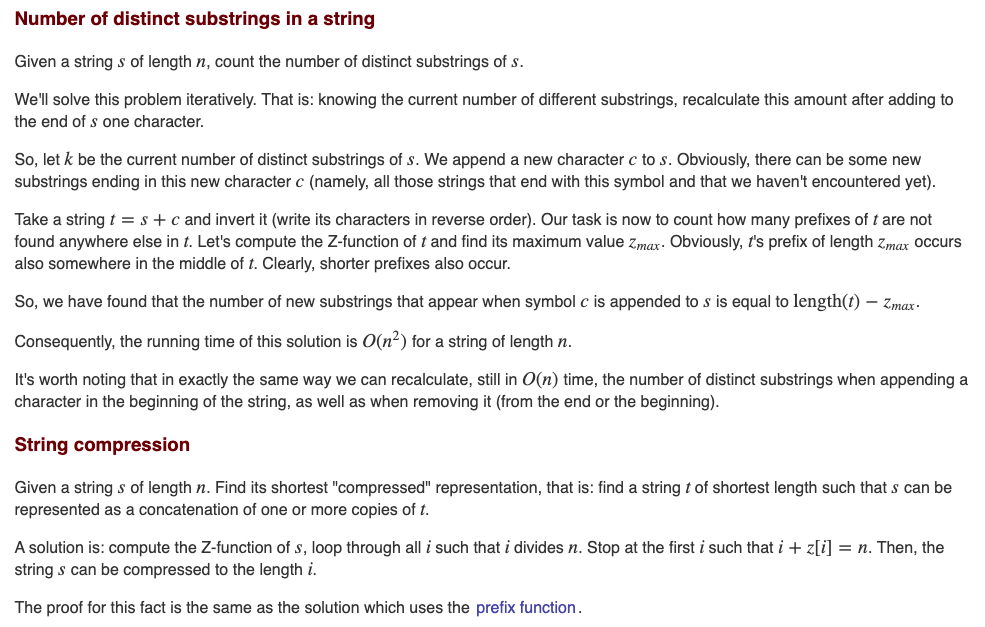

TODO: https://codeforces.com/contest/1535/problem/F & https://codeforces.com/blog/entry/91481

Read from https://usaco.guide/PAPS.pdf#page=243

Strings - sequence of characters

## String Algorithms

Pattern Searching - Given pattern(s) and text(s), we want to find all the occurences of patterns in the given text.

In C++, `std::strstr()` is a predefined function, which takes two strings `s1` and `s2` as an argument and finds the first occurrence of the sub-string `s2` in the string `s1`.

```cpp
    char str[] = "Use your brain and heart";
    char target[] = "brain";
    char *p = strstr(str, target);
```

`size_t find (const string& str, size_t pos = 0);`

Function parameters:

* `str` : The sub-string to be searched.
* `s` : The sub-string to be searched, given as C style string.
* `pos` : The initial position from where the string search is to begin.

Generally, the above mentioned algorithms use naive way of finding substrings which is `O(nm)`.

### Preprocessing

Two different ways - Preprocess what you are searching for, or what you are searching in

Preprocess patterns
* **1 pattern & 1 text** setup --> Z function, Prefix algorithm(KMP algorithm), Hashing
* **1 pattern & many texts**  --> KMP automaton, process pattern and search in texts in real time( 1 char of text will take 1 unit of time to process, unlike amortized complexity). KMP can be generalized to 
* **multiple pattern & multiple texts** --> Aho Corasick automaton
* (multiple pattern & 1 text) --> Simple case of above setup

In the following we first preprocess text
* **1 text & multiple pattern** --> Process texts before, allows us to search in time proportional to pattern not text, only text pre-processing takes time. Suffix structure -> Suffix arrays, suffix tree and suffix automaton. Can be generalized 
* **Multiple patterns & multiple texts** --> Which you preprocess is important


### Z-function

The Z-function for a string(of length n) is an array of length n where the i-th element is equal to the greatest number of characters starting from the position `i` that coincide with the first characters of `s`.

Function `Z : {1,…,n-1} -> {0,…,n-1}` such that `Z[i] = max{ j: s[0..j-1] = s[i..i+j-1] }`

In other words, `Z[i]` is equal to length of longest common prefix of `s` and `s[i..n-1]`. We can take `Z[0] = 0`. In some problems, it might be better if we use `n` instead of `0`.

E.g: `s = abacabc`, gray strings(`a`, `aba`, `abacaba` ...) . Let's calculate Z function `Z[0] = 0` (by def.), `Z[1] = 0`, `Z[2] = 1`. It's better if we check our string algorithm on such gray strings. If `s = aaaaa` then `Z = [0, 4, 3, 2, 1]`. When `s = ababab` then `Z = [0, 0, 4, 0, 2, 0]`.

#### Applications:
* For pattern matching, say we are given pattern `p` and text `t`, then we can compute Z-function of `p#t` to find all the substrings that match with `p`.

#### Algorithm:

```cpp
for (int i = 1; i < n; ++i) 
    while (i + z[i] < n && s[z[i]] == s[i + z[i]]) ++z[i];
```  
	
The above works but is too slow `O(n^2)`.


Consider a Z-block say `L` to `R`, which consists of current index `i`, then we can see that `Z[i]` can be `R - i + 1` or `Z[i-L]`

```cpp
L = R = 0
for (int i = 1; i < n; ++i){
    if (i <= R) 
        z[i] = min (R - i + 1, z[i - L]); // Initialization
    while (i + z[i] < n && s[z[i]] == s[i + z[i]]) 
        ++z[i]; 
    if (i + z[i] - 1 > R) L = i, R = i + z[i] - 1;
}
```

Initialization step `Z[i] = min()`, `Z > R-i+1` is impossible to start, by definition of `Z`.

We can see that whenever the above while executes, `R` value increased and it can increase to at most `n`

#### Applications

* Now we can use this like this `pat$text`, and this requires `O(m+n)` time, where `m = |pat|` and `n = |text|` and `O(m)` space and we no need to store `z[i]` for text, if we just want to find substring matching.
* If we want to count number of different substrings of `s`, say `s = abacaba`, there are `3` substrings of length `1` - `a`, `b`, `c`; `4` substrings of length `2` - `ab`, `ba`, `ac`, `ca`; `4` substrings of length 3 - `aba`, `bac`, `aca`, `cab` and so on, there are total `17` different substrings.
  * There are about `O(n^2)` substrings and comparing two substrings can take upto `O(n)` time, so naive algorithm can take upto `O(n^3)` time.
  * We can use Z-function to solve this problem in `O(n^2)` time.
  * Let's start with empty string and add one by one character and calculate the answer, for emtpy string `""` - the answer is 0, Let's add first character `a` - the answer is `1`, let's add `b`, then our string is `ab` - we get 3 = `1`(`a`) + 2 more (`b` and `ab`); For `abc` the answer is `6`, `3` from `ab` and `c`, `bc` and `abc`. Let's consider `aba` then the answer is `3+2 = 5`. Whenever we add a letter to end, all the suffixes might increment the answer. For `abac` - answer increments by `4` from `aba` because all the suffixes are unique. For a given string, we want to find the longest suffix which has already appeared, all other suffixes will be the ones which we didn't see earlier. We can use Z-function to claclulate the longest suffix by first reversing the string and finding maximum `Z[i]`.



* We can also find the total length of all different substrings.
* Search with atmost `1` mistake, we have to pattern matching such that pattern differs in atmost `1` position. For example `t = abcabdababc` and pattern = `abaa`, the answer is `Yes`. We have to find `p#t`, if `Z[i] = len(p)` then answer is `Yes`, If not, we can use reverse of string and find Z-function `rev(p)#rev(t)` and now use them to find the answer.

### Prefix function (KMP algorithm)

Def:

Two observations: https://cp-algorithms.com/string/prefix-function.html

```cpp
vector<int> prefix_function(string s) {
    int n = (int)s.length();
    vector<int> pi(n);
    for (int i = 1; i < n; i++) {
        int j = pi[i-1];
        while (j > 0 && s[i] != s[j])
            j = pi[j-1];
        if (s[i] == s[j])
            j++;
        pi[i] = j;
    }
    return pi;
}
```

### Length of the longest substring of s consisting of only one repeating character 

Given a string `s`, we need to perform queries of the form:

The i-th query updates the character in `s` at index `queryIndices[i]` to the character `queryCharacters[i]`.

Return an array lengths of length `k` where `lengths[i]` is the length of the **longest substring** of s consisting of **only one repeating character** after the ith query is performed.

https://leetcode.com/contest/weekly-contest-285/problems/longest-substring-of-one-repeating-character/

**Idea:** We can store the string as segments of repeating characters. This way we can do queries efficiently. If we use segment trees(storing left and right sum for each character, we will get TLE).

```cpp
vector < int > longestRepeating(string s, string queryCharacters, vector < int > & queryIndices) {
    int n = s.size(), k = queryCharacters.size();
    multiset < int > ms; // to store length of repeating subarray
    set < pair < int, int >> sp; // store segments [a, b]
    for (int i = 0, j = 0; i < s.size(); i = j) {
        while (j < s.size() and s[i] == s[j]) j += 1;
        sp.emplace(i, j - 1);
        ms.insert(j - i);
    }
    vector < int > res(k);
    for (int i = 0; i < k; i += 1) {
        int p = queryIndices[i];
        char c = queryCharacters[i];
        if (c != s[p]) {
            auto pr = * prev(sp.upper_bound(make_pair(p, n)));
            ms.erase(ms.find(pr.second - pr.first + 1));
            sp.erase(pr);
            if (pr.first < p) {
                sp.emplace(pr.first, p - 1);
                ms.insert(p - pr.first);
            }
            if (pr.second > p) {
                sp.emplace(p + 1, pr.second);
                ms.insert(pr.second - p);
            }
            s[p] = c;
            int L = p, R = p;
            if (p + 1 < n and s[p + 1] == c) {
                auto it = sp.upper_bound(make_pair(p, n));
                R = it -> second;
                ms.erase(ms.find(it -> second - it -> first + 1));
                sp.erase(it);
            }
            if (p and s[p - 1] == c) {
                auto it = prev(sp.upper_bound(make_pair(p, n)));
                L = it -> first;
                ms.erase(ms.find(it -> second - it -> first + 1));
                sp.erase(it);
            }
            sp.emplace(L, R);
            ms.insert(R - L + 1);
        }
        res[i] = * ms.rbegin();
    }
    return res;
}
```
