A Cartesian tree or deramid (Treap) is a data structure that combines a **binary search tree** and a **binary heap**. Hence its second name: treap (tree + heap) and deramid (tree + pyramid).

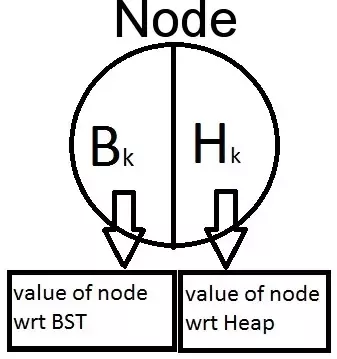

More strictly, this is a binary tree whose nodes contain two values, a key and a priority. It is also a binary search tree by key and a heap by priority. Assuming that all keys and all priorities are different, we find that if a tree item contains (x₀, y₀), then all elements (x, y) in the left subtree are such that x < x₀, all the elements in the right subtree are such that x > x₀, as well as the left and right subtree have: y < y₀. For example

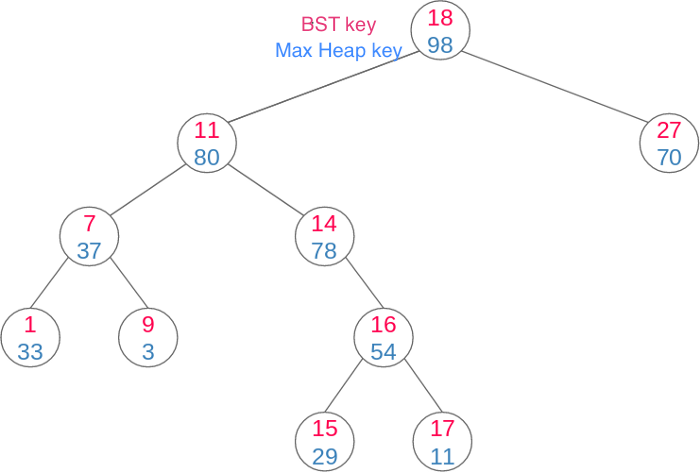

* **Cartesian Tree** : A Cartesian Tree is just a binary tree on a sequence of pairs that is heap-ordered on one of the elements of each pair , and BST-ordered on the other element.
* **Treap** : In a Cartesian Tree, if we assign random values to each heap-ordered element, then the expected height of the resulting tree is  𝑂(𝑙𝑜𝑔𝑁).

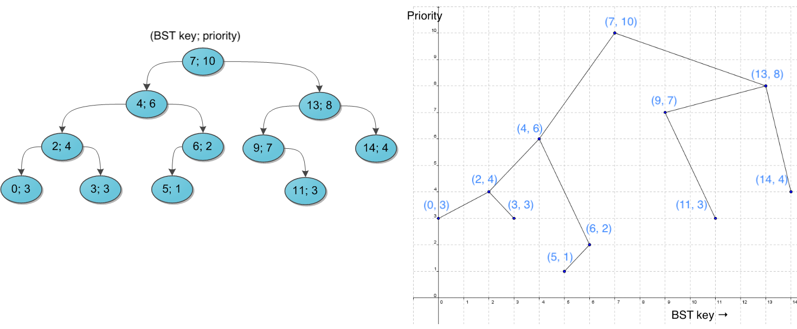

**Theorem-1:** Given a set of nodes i.e  `(Bᵢ, Hᵢ)`  pairs (with distinct Hᵢ's), only a unique cartesian tree would exist for these nodes irrespective of their order of insertion.

Proof: For a given set of nodes , the node with maximum priority would form the root of the cartesian tree. All the nodes with key less than(equal to) the B𝑟𝑜𝑜𝑡  would lie in the left subtree of root and all the nodes with key greater than  B𝑟𝑜𝑜𝑡  will lie in the right subtree. Now inductively the left and right subtrees can be built.

**Theorem-2:** Random assignment of Hᵢ values in a Cartesian Tree helps maintain the height of the tree to be approximately O(𝑙𝑜𝑔 n).

Intuition: In a simple BST , the height of the BST depends upon the choice of the root . The closer the root lies to the median of the given data, the better would be the height . Say we insert (a₁, a₂, ..., aₙ), any element can become the root `aᵢ` if it has maximum priority, since the elements ≤ aᵢ go to left subtree and remaining go to right subtree, we can think of it like quick sort algorithm. Therefore the height will be O(𝑙𝑜𝑔 n).

### Motivation

* If we build a binary search tree with totally random values, the resulting tree is (with high probability) within a constant factor of balanced. Approximately `4.3 ln n`.
* Moreover, the average depth of a given node is often very low. Approximately `2 ln n`.
* If we structure the BST as if it were a random tree, we get (with high probability) a very good data structure!
* In a Cartesian Tree, if we assign random values to each heap-ordered element , then the expected height of the resulting tree is  `𝑂(𝑙𝑜𝑔 n)` . This is the entire idea behind Treaps.

### Comaprision with other BSTs
* Compared with AVL and red-black trees, it is simpler to implement and easy to understand. In Treap, the height is not deterministic like other balanced BST's like AVL, red-black trees.
* Compared with the Splay tree, it is usually used for the ordered set, BST performance is far better than Splay. Splay trees are useful for link cut trees.
* Maybe some people want to say SBT(size balanced tree) replaces treaps, I haven't implemented SBT, it is said to be faster. SBT rebalanced by examining the sizes of each node's subtrees, this makes it very convenient to implement the select-by-rank and get-rank operations that implement an order statistic tree. [PEG](http://wcipeg.com/wiki/Size_Balanced_Tree)
* However, Binary search trees such as SBT, Splay trees, and the rotating version of Treap, cannot easily implement 'persistent operations'.

## Rotating version of Treaps

In a BST there are two simple operations that allows us to modify the tree and keep the BST property, the right and left rotations.

.

### Insertion

Inserting an element based on rotations. Say we want to insert an element (9, 41). The first step is to ignore the priorities and insert like a BST, We can search the position where it has to be inserted based on the key. Even though BST property is being preserved, the heap property is not. We will use rotations to fix the heap property.

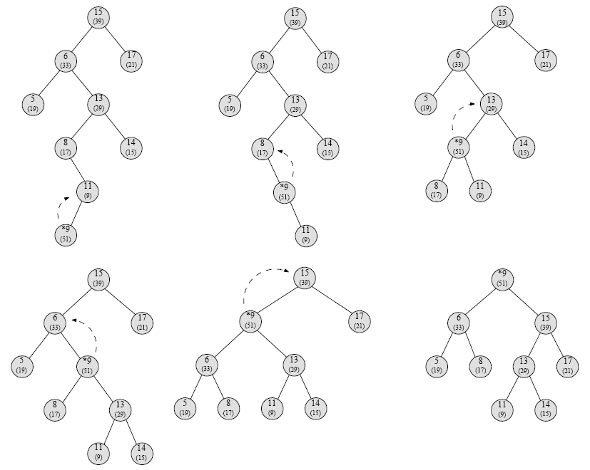

* Insertion into a treap is a combination of normal BST insertion and heap insertion.
* First, insert the node doing a normal BST insertion. This places the value into the right place.
* Next, bubble the node upward in the tree by rotating it with its parent until its value is smaller than its parent.

### Deletion

* In general, removing a node from a BST is quite difficult because we have to make sure not to lose any nodes. Deleting internal nodes split the tree.
* However, removing leaves is very easy, since they have no children.
* It would seem that, since a treap has extra structure on top of that of a BST, that removing from a treap would be extremely hard.
* However, it's actually quite simple:
  * To maintain the heap property, it’s easy to see that we have to rotate the tree from the children with higher priority.
  * Once the node is a leaf, delete it.

## Split and Merge

Treap supports two basic and unique operations: split and merge , both in O(H) where H is height of treap i.e O(logN).

Split

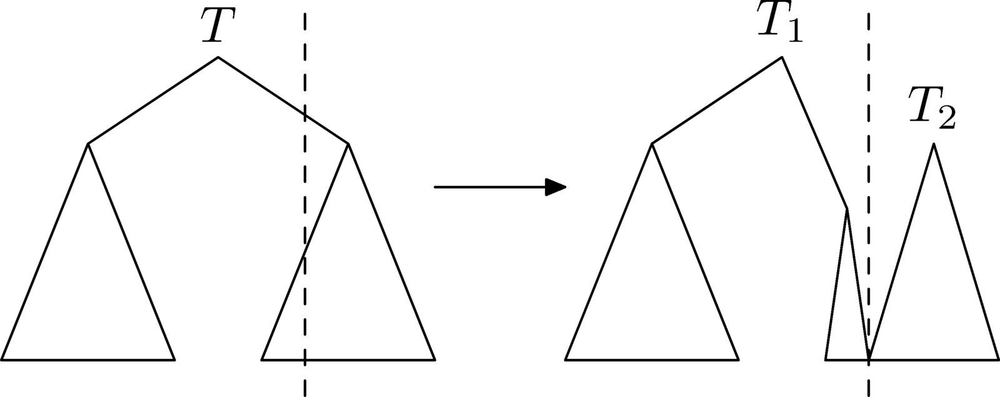

Merge

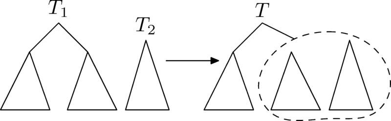

### Split

* split(T,X):  It splits a given treap T into two different treaps L and R such that L contains all the nodes with Bᵢ ≤ X and R contains all the nodes with Bᵢ > X. The original treap T is destroyed/doesn’t exist anymore after the split operation.

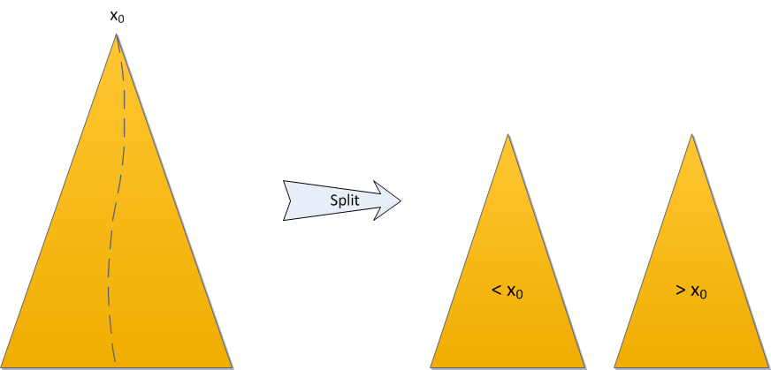


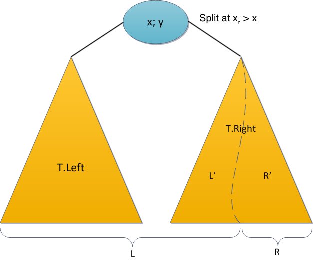

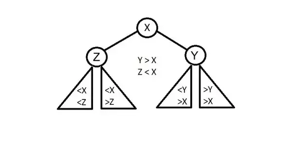

If the key we want to split is greater than root X then

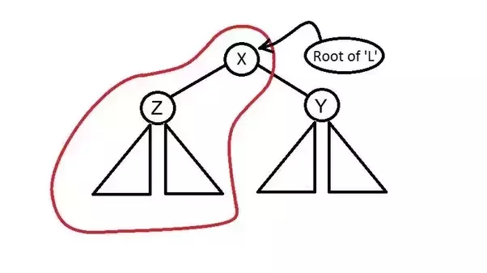

If the key we want to split is less than root X then 

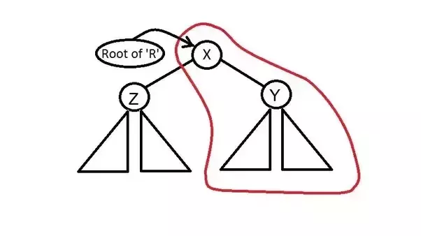

```python
def split(t: Treap, k: int) -> ⟨Treap, Treap⟩:
  if t == None
    return ⟨None, None⟩     
  else if k > t.x 
    ⟨t1, t2⟩ = split(t.right, k)
    t.right = t1
    return ⟨t, t2⟩
  else 
    ⟨t1, t2⟩ = split(t.left, k)
    t.left = t2
    return ⟨t1, t⟩
```

### Merge

* merge(L,R): The merge operation merges two given treaps L and R into a single treap T and L and R are destroyed after the operation. A very important assumption of the merge operation is that the largest value of L is less than the smallest value of R (where value refers to the Bᵢ values of the particular node). Hence we observe that two treaps obtained after a split operation can always be merged to give back the original treap.

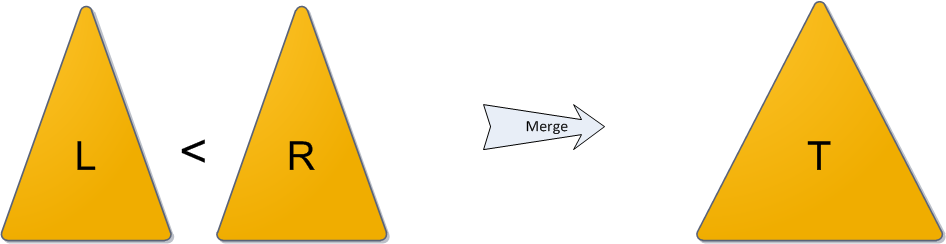

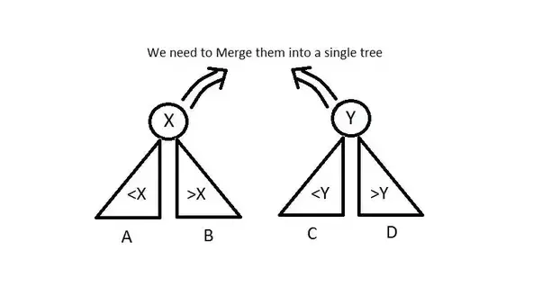

If priority of X > priority of Y

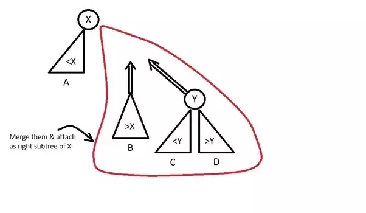

If priority of X < priority of Y

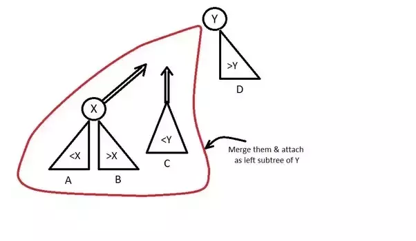

```python
def merge(t1: Treap, t2: Treap) -> Treap:
  if t2 == None
    return t1
  if t1 == None
    return t2
  else if t1.y > t2.y
    t1.right = merge(t1.right, t2)
    return t1
  else 
    t2.left = merge(t1, t2.left)
    return t2
```

### Operations on Treap using Split and Merge

#### Insert

* Insert(X): To insert a value X into our BST, we first chose a Y = rand(), such that (X,Y) represents the new node to be inserted in the treap. Then, keep on going down the tree like a simple BST searching for the correct pos where X should be inserted unless either the correct position is found OR we encounter the first node E s.t. priority(E) < Y . Here, call split(E,X) and attach L and R as left and right subtrees of node (X,Y).

Split once, and Merge twice.

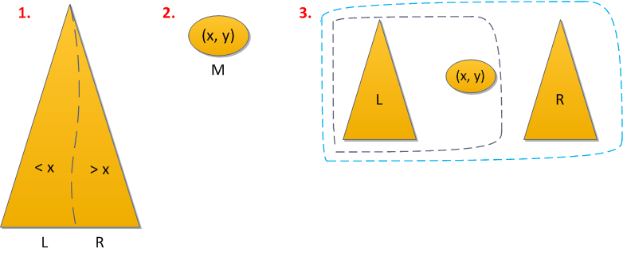

insert(T,k) - where k.x is the key and k.y is the priority

* Implementation #1
  1)  Let's split our tree according to the key that we want to add, that is split(T, k.x) → <T₁, T₂>
  2)  We merge the first tree with a new element, that is merge(T₁, K) → T₁
  3)  We merge the resulting tree with the second, that is merge(T₁, T₂) → T


* Implementation #2
  1)  First, we go down the tree (as in the usual binary search tree by k.x), but we stop at the first element in which the priority value turned out to be less that k.y
  2)  Now we split(T, k.x) → <T₁, T₂>, the found element(from the element along with its entire subtree).
  3)  Update T₁ and T₂ as the left and write elements of the added element.
  4)  We put the resulting tree(node with T₁ and T₂ as children) in place of the element found in step 1.

Implementation #1 uses two merge operations, In second implementation merge is not used at all.

#### Delete/Remove

* Delete(X) : Go down the tree like a BST unless node to be deleted is found. If the node is found, call merge function for it's left and right subtrees and attach the resulting tree to the parent of the node to be deleted.

Split twice and Merge once.

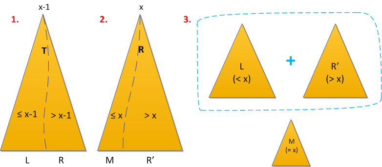

remove(T, x) removes node with key x from the tree T

* Implementation #1
  1)  Let's split our tree according to the key that we want to delete, that is split(T, k.x) → <T₁, T₂>
  2)  Now we seperate the element from the left tree, the right most child of the tree T₁
  3)  We merge the resulting tree with the second, that is merge(T₁, T₂) → T

* Implementation #2
  1) We go down the tree (as in the usual binary search tree by x), and look for the item to remove. 
  2) Having found the element, we can merge on it's left and right sons
  3) The result of the procedure merge is put in the place of the deleted element.

The first implementation uses split operatioin, and in the second implementation, split is not used at all.

### C++ implementation

```cpp
struct item {
    int key, prior;
    item * l, * r;
    item() { }
    item (int key, int prior) : key(key), prior(prior), l(NULL), r(NULL) { }
};
typedef item * pitem;

void split (pitem t, int key, pitem & l, pitem & r) {
    if (!t)
        l = r = NULL;
    else if (key < t->key) // key is in left node, split left
        split (t->l, key, l, t->l),  r = t;
    else
        split (t->r, key, t->r, r),  l = t;
}

void merge (pitem & t, pitem l, pitem r) {
    if (!l || !r)
        t = l ? l : r;
    else if (l->prior > r->prior)
        merge (l->r, l->r, r),  t = l;
    else
        merge (r->l, l, r->l),  t = r;
}

void insert (pitem & t, pitem it) {
    if (!t)
        t = it;
    else if (it->prior > t->prior)
        split (t, it->key, it->l, it->r),  t = it;
    else
        insert (it->key < t->key ? t->l : t->r, it);
}

void erase (pitem & t, int key) {
    if (t->key == key) {
        pitem th = t;
        merge (t, t->l, t->r);
        delete th;
    }
    else
        erase (key < t->key ? t->l : t->r, key);
}

pitem unite (pitem l, pitem r) {
    if (!l || !r)  return l ? l : r;
    if (l->prior < r->prior)  swap (l, r);
    pitem lt, rt;
    split (r, l->key, lt, rt);
    l->l = unite (l->l, lt);
    l->r = unite (l->r, rt);
    return l;
}
```

We can maintain additional properties in the node like `count` - number of nodes in subtre. When a tree changes (nodes are added or removed etc.), `cnt` of some nodes should be updated accordingly. We'll create two functions: `cnt()` will return the current value of `cnt` or `0` if the node does not exist, and `upd_cnt()` will update the value of `cnt` for this node assuming that for its children `L` and `R` the values of `cnt` have already been updated. Evidently it's sufficient to add calls of `upd_cnt()` to the end of `insert`, `erase`, `split` and `merge` to keep `cnt` values up-to-date.

```cpp
struct item {
    int key, prior, cnt;
    item * l, * r;
    item() { }
    item (int key, int prior) : key(key), prior(prior), l(NULL), r(NULL) { }
};

int cnt (pitem t) {
    return t ? t->cnt : 0;
}

void upd_cnt (pitem t) {
    if (t)
        t->cnt = 1 + cnt(t->l) + cnt (t->r);
}

void split (pitem t, int key, pitem & l, pitem & r) {
    if (!t)
        l = r = NULL;
    else if (key < t->key) // key is in left node, split left
        split (t->l, key, l, t->l),  r = t;
    else
        split (t->r, key, t->r, r),  l = t;
    upd_cnt(t);
}

void insert (pitem & t, pitem it) {
    if (!t)
        t = it;
    else if (it->prior > t->prior)
        split (t, it->key, it->l, it->r),  t = it;
    else
        insert (it->key < t->key ? t->l : t->r, it);
    upd_cnt(t);
}
```

## Applications
* A variant of treaps called Implicit Treaps can be used to perform all the operations which interval trees like segment tree and fenwick tree can (including lazy propagation).
* Idea of sparse segment tree and sparse fenwick tree to handle very large ranges and limited queries can also be extended to treaps resulting in a variant called sparse implicit treaps.
* Treaps also make a good persistent BST mainly because of their simplicity to code and a constant average number of operations upon insert/delete.
* Treaps can also be extended to multiple dimensions in the form of quadtreaps which are a balanced variant of a quadtree data structure.

## Reference:
* https://threadsiiithyderabad.quora.com/Treaps-One-Tree-to-Rule-em-all-Part-1
* https://habr.com/ru/post/101818/
* https://medium.com/carpanese/a-visual-introduction-to-treap-data-structure-part-1-6196d6cc12ee
* http://memphis.is-programmer.com/posts/46317.html
* https://cp-algorithms.com/data_structures/treap.html

https://codeforces.com/blog/entry/3767 and https://ankitsultana.com/2021/03/29/persistent-treaps.html and https://codeforces.com/contest/899/submission/44463469


https://codeforces.com/blog/entry/84017

http://memphis.is-programmer.com/posts/46317.html

https://habr.com/en/post/102006/, https://habr.com/en/post/102364/
