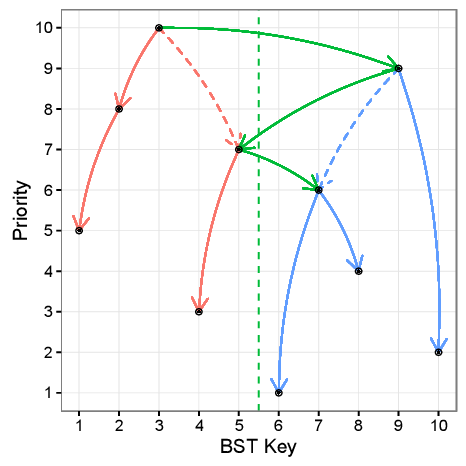
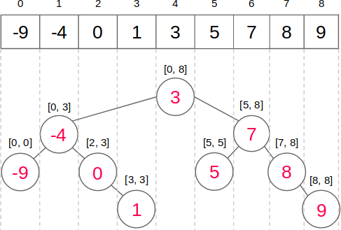
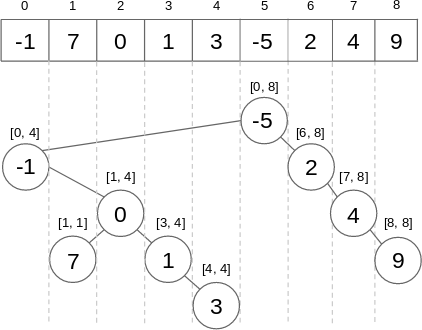
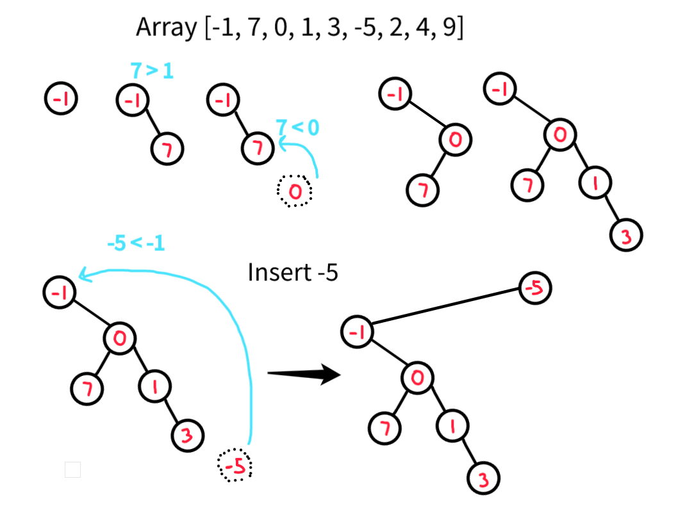
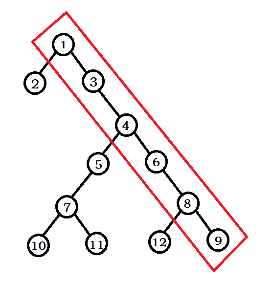
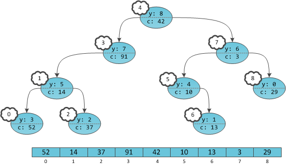
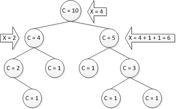

A Cartesian tree or deramid (Treap) is a data structure that combines a **binary search tree** and a **binary heap**. Hence its second name: treap (tree + heap) and deramid (tree + pyramid).


More strictly, this is a binary tree whose nodes contain two values, a key and a priority. It is also a binary search tree by key and a heap by priority. Assuming that all keys and all priorities are different, we find that if a tree item contains (x₀, y₀), then all elements (x, y) in the left subtree are such that x < x₀, all the elements in the right subtree are such that x > x₀, as well as the left and right subtree have: y < y₀. For example


* **Cartesian Tree** : A Cartesian Tree is just a binary tree on a sequence of pairs that is heap-ordered on one of the elements of each pair , and BST-ordered on the other element.
* **Treap** : In a Cartesian Tree, if we assign random values to each heap-ordered element, then the expected height of the resulting tree is  𝑂(𝑙𝑜𝑔𝑁).


**Theorem-1:** Given a set of nodes i.e  `(Bᵢ, Hᵢ)`  pairs (with distinct Hᵢ's), only a unique cartesian tree would exist for these nodes irrespective of their order of insertion.

Proof: For a given set of nodes , the node with maximum priority would form the root of the cartesian tree. All the nodes with key less than(equal to) the B𝑟𝑜𝑜𝑡  would lie in the left subtree of root and all the nodes with key greater than  B𝑟𝑜𝑜𝑡  will lie in the right subtree. Now inductively the left and right subtrees can be built.

**Theorem-2:** Random assignment of Hᵢ values in a Cartesian Tree helps maintain the height of the tree to be approximately O(𝑙𝑜𝑔 n).

Intuition: In a simple BST , the height of the BST depends upon the choice of the root . The closer the root lies to the median of the given data, the better would be the height . Say we insert (a₁, a₂, ..., aₙ), any element can become the root `aᵢ` if it has maximum priority, since the elements ≤ aᵢ go to left subtree and remaining go to right subtree, we can think of it like quick sort algorithm. Therefore the height will be O(𝑙𝑜𝑔 n).

### Motivation

* If we build a binary search tree with totally random values, the resulting tree is (with high probability) within a constant factor of balanced. Approximately `4.3 ln n`.
* Moreover, the average depth of a given node is often very low. Approximately `2 ln n`.
* If we structure the BST as if it were a random tree, we get (with high probability) a very good data structure!
* In a Cartesian Tree, if we assign random values to each heap-ordered element , then the expected height of the resulting tree is  `𝑂(𝑙𝑜𝑔 n)` . This is the entire idea behind Treaps.

### Comaprision with other BSTs
* Compared with AVL and red-black trees, it is simpler to implement and easy to understand. In Treap, the height is not deterministic like other balanced BST's like AVL, red-black trees.
* Compared with the Splay tree, it is usually used for the ordered set, BST performance is far better than Splay. Splay trees are useful for link cut trees. Splay will break in case you need persistence.
* Maybe some people want to say SBT(size balanced tree) replaces treaps, I haven't implemented SBT, it is said to be faster. SBT rebalanced by examining the sizes of each node's subtrees, this makes it very convenient to implement the select-by-rank and get-rank operations that implement an order statistic tree. [PEG](http://wcipeg.com/wiki/Size_Balanced_Tree)
* However, Binary search trees such as SBT, Splay trees, and the rotating version of Treap, cannot easily implement 'persistent operations'.  Let's take a look at the rotating Treap. Now we should know why it can't be persisted, right? If it is rotated, the original parent-child relationship will be destroyed, the original path and tree form will be destroyed, which is unacceptable for persistence. If Treap becomes non-rotating, then we can find that as long as it can be persisted, Merge and Split can be made persistent.

## Rotating version of Treaps

In a BST there are two simple operations that allows us to modify the tree and keep the BST property, the right and left rotations.

.

### Insertion

Inserting an element based on rotations. Say we want to insert an element (9, 41). The first step is to ignore the priorities and insert like a BST, We can search the position where it has to be inserted based on the key. Even though BST property is being preserved, the heap property is not. We will use rotations to fix the heap property.


* Insertion into a treap is a combination of normal BST insertion and heap insertion.
* First, insert the node doing a normal BST insertion. This places the value into the right place.
* Next, bubble the node upward in the tree by rotating it with its parent until its value is smaller than its parent.

### Deletion

* In general, removing a node from a BST is quite difficult because we have to make sure not to lose any nodes. Deleting internal nodes split the tree.
* However, removing leaves is very easy, since they have no children.
* It would seem that, since a treap has extra structure on top of that of a BST, that removing from a treap would be extremely hard.
* However, it's actually quite simple:
  * To maintain the heap property, it’s easy to see that we have to rotate the tree from the children with higher priority.
  * Once the node is a leaf, delete it.

## Split and Merge

Treap supports two basic and unique operations: split and merge , both in O(H) where H is height of treap i.e O(logN).



Split


Merge


### Split

* split(T,X):  It splits a given treap T into two different treaps L and R such that L contains all the nodes with Bᵢ ≤ X and R contains all the nodes with Bᵢ > X. The original treap T is destroyed/doesn’t exist anymore after the split operation.


If the key we want to split is greater than root X then


If the key we want to split is less than root X then 


```python
def split(t: Treap, k: int) -> ⟨Treap, Treap⟩:
  if t == None
    return ⟨None, None⟩     
  else if k > t.x 
    ⟨t1, t2⟩ = split(t.right, k)
    t.right = t1
    return ⟨t, t2⟩
  else 
    ⟨t1, t2⟩ = split(t.left, k)
    t.left = t2
    return ⟨t1, t⟩
```

### Merge

* merge(L,R): The merge operation merges two given treaps L and R into a single treap T and L and R are destroyed after the operation. A very important assumption of the merge operation is that the largest value of L is less than the smallest value of R (where value refers to the Bᵢ values of the particular node). Hence we observe that two treaps obtained after a split operation can always be merged to give back the original treap.


If priority of X > priority of Y


If priority of X < priority of Y


```python
def merge(t1: Treap, t2: Treap) -> Treap:
  if t2 == None
    return t1
  if t1 == None
    return t2
  else if t1.y > t2.y
    t1.right = merge(t1.right, t2)
    return t1
  else 
    t2.left = merge(t1, t2.left)
    return t2
```

### Operations on Treap using Split and Merge(Non-rotating version)

#### Insert

* Insert(X): To insert a value X into our BST, we first chose a Y = rand(), such that (X,Y) represents the new node to be inserted in the treap. Then, keep on going down the tree like a simple BST searching for the correct pos where X should be inserted unless either the correct position is found OR we encounter the first node E s.t. priority(E) < Y . Here, call split(E,X) and attach L and R as left and right subtrees of node (X,Y).

Split once, and Merge twice.


insert(T,k) - where k.x is the key and k.y is the priority

* Implementation #1
  1)  Let's split our tree according to the key that we want to add, that is split(T, k.x) → <T₁, T₂>
  2)  We merge the first tree with a new element, that is merge(T₁, K) → T₁
  3)  We merge the resulting tree with the second, that is merge(T₁, T₂) → T


* Implementation #2
  1)  First, we go down the tree (as in the usual binary search tree by k.x), but we stop at the first element in which the priority value turned out to be less that k.y
  2)  Now we split(T, k.x) → <T₁, T₂>, the found element(from the element along with its entire subtree).
  3)  Update T₁ and T₂ as the left and write elements of the added element.
  4)  We put the resulting tree(node with T₁ and T₂ as children) in place of the element found in step 1.

Implementation #1 uses two merge operations, In second implementation merge is not used at all.

#### Delete/Remove

* Delete(X) : Go down the tree like a BST unless node to be deleted is found. If the node is found, call merge function for it's left and right subtrees and attach the resulting tree to the parent of the node to be deleted.

Split twice and Merge once.


remove(T, x) removes node with key x from the tree T

* Implementation #1
  1)  Let's split our tree according to the key that we want to delete, that is split(T, k.x) → <T₁, T₂>
  2)  Now we seperate the element from the left tree, the right most child of the tree T₁
  3)  We merge the resulting tree with the second, that is merge(T₁, T₂) → T

* Implementation #2
  1) We go down the tree (as in the usual binary search tree by x), and look for the item to remove. 
  2) Having found the element, we can merge on it's left and right sons
  3) The result of the procedure merge is put in the place of the deleted element.

The first implementation uses split operatioin, and in the second implementation, split is not used at all.

### C++ implementation

```cpp
struct item {
    int key, prior;
    item * l, * r;
    item() { }
    item (int key, int prior) : key(key), prior(prior), l(NULL), r(NULL) { }
};
typedef item * pitem;

void split (pitem t, int key, pitem & l, pitem & r) {
    if (!t)
        l = r = NULL;
    else if (key < t->key) // key is in left node, split left
        split (t->l, key, l, t->l),  r = t;
    else
        split (t->r, key, t->r, r),  l = t;
}

void merge (pitem & t, pitem l, pitem r) {
    if (!l || !r)
        t = l ? l : r;
    else if (l->prior > r->prior)
        merge (l->r, l->r, r),  t = l;
    else
        merge (r->l, l, r->l),  t = r;
}

void insert (pitem & t, pitem it) {
    if (!t)
        t = it;
    else if (it->prior > t->prior)
        split (t, it->key, it->l, it->r),  t = it;
    else
        insert (it->key < t->key ? t->l : t->r, it);
}

void erase (pitem & t, int key) {
    if (t->key == key) {
        pitem th = t;
        merge (t, t->l, t->r);
        delete th;
    }
    else
        erase (key < t->key ? t->l : t->r, key);
}

pitem unite (pitem l, pitem r) {
    if (!l || !r)  return l ? l : r;
    if (l->prior < r->prior)  swap (l, r);
    pitem lt, rt;
    split (r, l->key, lt, rt);
    l->l = unite (l->l, lt);
    l->r = unite (l->r, rt);
    return l;
}
```

We can maintain additional properties in the node like `count` - number of nodes in subtre. When a tree changes (nodes are added or removed etc.), `cnt` of some nodes should be updated accordingly. We'll create two functions: `cnt()` will return the current value of `cnt` or `0` if the node does not exist, and `upd_cnt()` will update the value of `cnt` for this node assuming that for its children `L` and `R` the values of `cnt` have already been updated. Evidently it's sufficient to add calls of `upd_cnt()` to the end of `insert`, `erase`, `split` and `merge` to keep `cnt` values up-to-date.

```cpp
struct item {
    int key, prior, cnt;
    item * l, * r;
    item() { }
    item (int key, int prior) : key(key), prior(prior), l(NULL), r(NULL) { }
};

int cnt (pitem t) {
    return t ? t->cnt : 0;
}

void upd_cnt (pitem t) {
    if (t)
        t->cnt = 1 + cnt(t->l) + cnt (t->r);
}

void split (pitem t, int key, pitem & l, pitem & r) {
    if (!t)
        l = r = NULL;
    else if (key < t->key) // key is in left node, split left
        split (t->l, key, l, t->l),  r = t;
    else
        split (t->r, key, t->r, r),  l = t;
    upd_cnt(t);
}

void insert (pitem & t, pitem it) {
    if (!t)
        t = it;
    else if (it->prior > t->prior)
        split (t, it->key, it->l, it->r),  t = it;
    else
        insert (it->key < t->key ? t->l : t->r, it);
    upd_cnt(t);
}
```

Using `cnt` we can support finding `k-th` element in the treap. We can also store other metadata like sum of nodes in the subtree etc. We can even add values to all nodes > some_value using lazy tag at the corresponding node.

## Applications
* A variant of treaps called Implicit Treaps can be used to perform all the operations which interval trees like segment tree and fenwick tree can (including lazy propagation).
* Idea of sparse segment tree and sparse fenwick tree to handle very large ranges and limited queries can also be extended to treaps resulting in a variant called sparse implicit treaps.
* Treaps also make a good persistent BST mainly because of their simplicity to code and a constant average number of operations upon insert/delete. In general, they are used to represent an ordered set (store and check if an element exists in the set) in O(log n) time. However, by augmenting the nodes, we can
use BBSTs for a much larger variety of problems, such as range min/max and sum queries.
* Treaps can also be extended to multiple dimensions in the form of quadtreaps which are a balanced variant of a quadtree data structure.

## Offline Building 

#### Algorithm 1 O(n log n)

Say we are given `x₁ < x₂ < .. < xₙ`, we can randomly assign priorities `y₁, y₂, .., yₙ`, now we have pairs `(xᵢ,yᵢ)`. Let's sort the elements according to priorities. Choose the first element and make it the root, all the elements less that root.x will go to left subtree and all other elements go to right child. We can do this recursively. Since the priorities are assigned randomly, the height of the tree is expected O(log n) and hence the algorithms works in O(n log n).

#### Algorithm 2 O(n log n)

let's sort the pairs in descending order and put them in the queue, We pick first two elements from the queue and merge them into a tree and put them at the end of the queue, then we do the same with next two etc.(Sorting is required because merge needs one tree's elements to be less than the other tree.) Thus, we will merge first the size 1 trees, then size 2 trees and so on. After each round the queue size is reduced by half. So the total running time will be O(n logn).

#### Algorithm 3 O(n)

Say we are given `n` nodes in sorted order then we can build the treap in O(n) time instead of O(n log n) time. The idea is to split the array into two parts, from `0` tom `mid - 1` and `mid + 1` to `n - 1` where `n` is the size of the array and `mid = n/2`. If we select the median element as our root then the left and right subtrees have roughly the same size.



We don't have to worry about priorities, if we want to have priorities then we can assign random priroity to all nodes and heapify the tree priorities(not the array values) to satisfy the heap property.

```cpp
void heapify (pitem t) {
    if (!t) return;
    pitem max = t;
    if (t->l != NULL && t->l->prior > max->prior)
        max = t->l;
    if (t->r != NULL && t->r->prior > max->prior)
        max = t->r;
    if (max != t) {
        swap (t->prior, max->prior);
        heapify (max);
    }
}

pitem build (int * a, int n) {
    // Construct a treap on values {a[0], a[1], ..., a[n - 1]}
    if (n == 0) return NULL;
    int mid = n / 2;
    pitem t = new item (a[mid], rand ());
    t->l = build (a, mid);
    t->r = build (a + mid + 1, n - mid - 1);
    heapify (t);
    upd_cnt(t)
    return t;
}
```

Note: calling `upd_cnt(t)` is only necessary if you need the subtree sizes.

## Cartesian Tree of an array

Given a sequence of numbers (or any totally ordered objects), there exists a binary min-heap whose inorder traversal is that sequence. This is known as the Cartesian tree for that sequence.

We’ll select the minimum value of the array to become the root of the tree, let’s say it is found at position `i`. The left child will be the minimum value in the interval `[0, i-1]` and the right child will be the minimum value in the interval `[i+1, n-1]`. We continue this process recursively.



* Relationship with Treap: If we choose the key as index of element and priority as the value of the element, the indicies follow BST property and priorities follow heap property. It’s not totally right to say that a cartesian tree is a treap because treaps have random values for y. Randomization of priorities are used to get logarithmic height(with high probability).
* A range minimum query on a sequence is equivalent to a lowest common ancestor query on the sequence's Cartesian tree. Hence, RMQ may be reduced to LCA using the sequence's Cartesian tree.
* The suffix tree of a string may be constructed from the suffix array and the longest common prefix array. The first step is to compute the Cartesian tree of the longest common prefix array.

How to construct cartesian tree?



* We can insert one element after another from left to right. We just need to keep a pointer to the right most element and use parent pointers to traverse till the root to find the element < current element and insert it there.
* We can also do this without storing parent pointers, we just maintain a stack of the all right child from the root, pop until we find the element < current element. For each new sequence value x, the stack is popped until it is empty or its top element is smaller than x, and then x is pushed onto the stack. The following figure shows the stack after inserting element 9.



```cpp
int n,h[MAXN];
int st[MAXN],t;
int fa[MAXN],ls[MAXN],rs[MAXN],root;

int main()
{
    for(int i=1; i<=n; i++)
    {
        while(t && h[st[t-1]] > h[i]) ls[i] = st[--t];
        if(t) rs[st[t-1]] = i;
        st[t++] = i; // push the current element onto stack
    }
    for(int i=1; i<=n; i++) fa[ls[i]] = fa[rs[i]] = i;
    for(int i=1; i<=n; i++) if(!fa[i]) root = i;
}
```

## Implicit Treap

Let's take a dynamic array data structure. In its standard implementation(example: `std::vector<int>`), we can add an element to the end of a vector, find out the value of an element at a certain position, change an element by number and delete the last element. Suppose we need a data structure with the above properties, as well as operations: add an element anywhere (with a corresponding change in the numbering of elements) and delete any element (also with a corresponding change in the numbering). Such a structure can be implemented on the basis of a Treap, the result is often called a Treap with implicit key.

Implicit treap is a simple modification of the regular treap which is a very powerful data structure. In fact, implicit treap can be considered as an array with the following procedures implemented (all in O(logN) in the online mode):

* Inserting an element in the array in any position
* Removal of an arbitrary element
* Finding sum, minimum / maximum element etc. on an arbitrary interval. Maintain any objective function and query over an arbitrary interval. (All the operations supported by a segment tree including range updates using lazy propagation).
* Addition, painting on an arbitrary interval
* Reversing elements on an arbitrary interval
* Cut an array `A[1..n]` at any position `i` such that it is divided into two different arrays `B[1..i]` , `C[i+1...n]`.
* Merge two different arrays `P[1..n₁]` , `Q[1..n₂]` into a single array `R[1..n₁,n₁+1,...n₁₊₂]`.

Implicit Treap provides the user with an array-like interface, but with Treap inside. The key idea to use build a treap with array indices as keys instead of element values.



Since we are using array index as key of BST, if we insert or delete an element indices of other elements will have to change for about O(n) nodes. This would be very slow. 

To avoid this, we will not explicitly sotre the index `i` as the key but we will calculate on the fly. For this we need to store auxiliary quantity `c` - subtree size - number of vertices in the subtree of our vertex. Index value is number of elements in our structure that are to the left of our element. In other words, we will consider the ordinal number of our element in the tree, reduced by one, as a key. 



How to calculate this? While going along the path from the root to a certain vertex, we sum up all such values in the left subtrees that we did not go to, increased by one. Hence the `key for a node t = sz(t->l) + sz(p->l)` for all parents of `t` such that `t` occurs in the right subtree of `p`.

Since we don't store the index explicitly and calculate it on the fly, this is named as Implicit Treap.

Split operation

```python
def update(Treap t):
  t.size = 1 + t.left.size + t.right.size
  
def split(Treap t, int k) ->  ⟨Treap, Treap⟩:
  if t == None
    return ⟨None, None⟩  
  int l = t.left.size
  if l >= k
    ⟨t1, t2⟩ = split(t.left, k)
    t.left = t2
    update(t) # update count - subtree size
    return ⟨t1, t⟩
  else
    ⟨t1, t2⟩ = split(t.right, k - l - 1)
    t.right = t1
    update(t)
    return ⟨t, t2⟩
```

### C++ implementation of split and merge

Note that the key of a node is the number of nodes less than it (such nodes can be present not only in its left subtree but also in left subtrees of its ancestors). More specifically, the implicit key for some node T is the number of vertices `cnt(T→L)` in the left subtree of this node plus similar values `cnt(P→L)+1` for each ancestor P of the node T, if T is in the right subtree of P.

Now it's clear how to calculate the implicit key of current node quickly. Since in all operations we arrive to any node by descending in the tree, we can just accumulate this sum and pass it to the function. If we go to the left subtree, the accumulated sum does not change, if we go to the right subtree it increases by `cnt(T→L)+1`.

```cpp
void merge (pitem & t, pitem l, pitem r) {
    if (!l || !r)
        t = l ? l : r;
    else if (l->prior > r->prior)
        merge (l->r, l->r, r),  t = l;
    else
        merge (r->l, l, r->l),  t = r;
    upd_cnt (t);
}

void split (pitem t, pitem & l, pitem & r, int key, int add = 0) {
    if (!t)
        return void( l = r = 0 );
    int cur_key = add + cnt(t->l); // implicit key
    if (key <= cur_key)
        split (t->l, l, t->l, key, add),  r = t;
    else
        split (t->r, t->r, r, key, add + 1 + cnt(t->l)),  l = t;
    upd_cnt (t);
}
```

Now let's consider the implementation of various operations on implicit treaps:

* **Insert element:**
Suppose we need to insert an element at position `pos`. We divide the treap into two parts, which correspond to arrays `[0..pos-1]` and `[pos..sz]`; to do this we call `split(T, T1, T2, pos)`. Then we can combine tree T1 with the new vertex by calling `merge(T1, T1, new_item)` (it is easy to see that all preconditions are met). Finally, we combine trees `T1` and `T2` back into `T` by calling `merge(T, T1, T2)`.

* **Delete element:**
This operation is even easier: find the element to be deleted `T`, perform merge of its children `L` and `R`, and replace the element `T` with the result of merge. In fact, element deletion in the implicit treap is exactly the same as in the regular treap.

* **Find sum / minimum, etc. on the interval:**
First, create an additional field `F` in the item structure to store the value of the target function for this node's subtree. This field is easy to maintain similarly to maintaining sizes of subtrees: create a function which calculates this value for a node based on values for its children and add calls of this function in the end of all functions which modify the tree.
Second, we need to know how to process a query for an arbitrary interval `[A; B]`.
To get a part of tree which corresponds to the interval `[A; B]`, we need to call `split(T, T1, T2, A)`, and then `split(T2, T2, T3, B - A + 1)`: after this `T2` will consist of all the elements in the interval `[A; B]`, and only of them. Therefore, the response to the query will be stored in the field `F` of the root of `T2`. After the query is answered, the tree has to be restored by calling `merge(T, T1, T2)` and `merge(T, T, T3)`.

* **Addition / painting on the interval:**
We act similarly to the previous paragraph, but instead of the field `F` we will store a field add which will contain the added value for the subtree (or the value to which the subtree is painted). Before performing any operation we have to "push" this value correctly - i.e. change `T→L→add` and `T→R→add`, and to clean up add in the parent node. This way after any changes to the tree the information will not be lost.

* **Reverse on the interval:**
This is again similar to the previous operation: we have to add boolean flag `rev` and set it to true when the subtree of the current node has to be reversed. "Pushing" this value is a bit complicated - we swap children of this node and set this flag to true for them.

Here is an example implementation of the implicit treap with reverse on the interval. For each node we store field called value which is the actual value of the array element at current position. We also provide implementation of the function output(), which outputs an array that corresponds to the current state of the implicit treap.

```cpp
typedef struct item * pitem;
struct item {
    int prior, value, cnt;
    bool rev;
    pitem l, r;
};

int cnt (pitem it) {
    return it ? it->cnt : 0;
}

void upd_cnt (pitem it) {
    if (it)
        it->cnt = cnt(it->l) + cnt(it->r) + 1;
}

void push (pitem it) {
    if (it && it->rev) {
        it->rev = false;
        swap (it->l, it->r);
        if (it->l)  it->l->rev ^= true;
        if (it->r)  it->r->rev ^= true;
    }
}

void merge (pitem & t, pitem l, pitem r) {
    push (l);
    push (r);
    if (!l || !r)
        t = l ? l : r;
    else if (l->prior > r->prior)
        merge (l->r, l->r, r),  t = l;
    else
        merge (r->l, l, r->l),  t = r;
    upd_cnt (t);
}

void split (pitem t, pitem & l, pitem & r, int key, int add = 0) {
    if (!t)
        return void( l = r = 0 );
    push (t);
    int cur_key = add + cnt(t->l);
    if (key <= cur_key)
        split (t->l, l, t->l, key, add),  r = t;
    else
        split (t->r, t->r, r, key, add + 1 + cnt(t->l)),  l = t;
    upd_cnt (t);
}

void reverse (pitem t, int l, int r) {
    pitem t1, t2, t3;
    split (t, t1, t2, l);
    split (t2, t2, t3, r-l+1);
    t2->rev ^= true;
    merge (t, t1, t2);
    merge (t, t, t3);
}

void output (pitem t) {
    if (!t)  return;
    push (t);
    output (t->l);
    printf ("%d ", t->value);
    output (t->r);
}
```

Using the ideas of a Cartesian tree by implicit key, it is possible to implement a data structure such as Rope.

<details>
 <summary> Implementation of treap as interval tree </summary>
 
```cpp
typedef struct node{
    int prior,size; 
    int val; // value stored in the array 
    int sum; // whatever info you want to maintain in segtree for each node 
    int lazy; // whatever lazy update you want to do 
    struct node *l,*r; 
}node;
typedef node* pnode;
int sz(pnode t){
    return t?t->size:0;
}
void upd_sz(pnode t){
    if(t)t->size=sz(t->l)+1+sz(t->r);
}
void lazy(pnode t){
    if(!t || !t->lazy) return;
    t->val += t->lazy; // operation of lazy
    t->sum += t->lazy*sz(t);
    if(t->l) t->l->lazy += t->lazy; // propagate lazy
    if(t->r) t->r->lazy += t->lazy;
    t->lazy=0;
}
void reset(pnode t){
    if(t) t->sum = t->val; // lazy already propagated
}
void combine(pnode& t,pnode l,pnode r){ // combine segtree ranges
    if(!l || !r) return void(t = l?l:r);
    t->sum = l->sum + r->sum;
}
void operation(pnode t){ // operation of segtree
    if(!t )return;
    reset(t); // node represents single element of array
    lazy(t->l);lazy(t->r); // imp: propagate lazy before combining l,r
    combine(t,t->l,t);combine(t,t,t->r);
}
void split(pnode t,pnode &l,pnode &r,int pos,int add=0){
    if(!t) return void(l=r=NULL);
    lazy(t);
    int curr_pos = add + sz(t->l);
    if(curr_pos <= pos) // element at pos goes to "l"
        split(t->r,t->r,r,pos,curr_pos+1), l=t;
    else
        split(t->l,l,t->l,pos,add), r=t;
    upd_sz(t);
    operation(t);
}
void merge(pnode &t,pnode l,pnode r){ // result/left/right array
    lazy(l);lazy(r);
    if(!l || !r) t = l?l:r;
    else if(l->prior>r->prior) merge(l->r,l->r,r),t=l;
    else merge(r->l,l,r->l),t=r;
    upd_sz(t);
    operation(t);
}
pnode init(int val){
    pnode ret = (pnode)malloc(sizeof(node));
    ret->prior=rand();ret->size=1;
    ret->val=val;ret->sum=val;ret->lazy=0;
    return ret;
}
int range_query(pnode t,int l,int r){ // [l,r]
    pnode L,mid,R;
    split(t,L,mid,l-1);split(mid,t,R,r-l); // note: r-l !!
    int ans = t->sum;
    merge(mid,L,t);
    merge(t,mid,R);
    return ans;
}
void range_update(pnode t,int l,int r,int val){//[l,r]
    pnode L,mid,R;
    split(t,L,mid,l-1);split(mid,t,R,r-l);//note: r-l!!
    t->lazy+=val; //lazy_update
    merge(mid,L,t); 
    merge(t,mid,R); 
}     
``` 

source: Quora Tanuj Khattar
</details>

<details>
    <summary> Xuzijian implementation for RMQ & RAQ </summary>
 
```cpp
// for RMQ & RAQ 
constexpr  int INF = __INT_MAX__;

class ImplicitTreap {
    xorshift rnd;
    struct Node {
         int value, min, lazy;
         int priority, cnt;
         bool rev;
        Node * l, * r;
        Node ( int value, int priority): value (value), min (INF), lazy ( 0 ), priority (priority), cnt ( 1 ), rev ( false ), l ( nullptr ), r ( nullptr ) {}
    } * root = nullptr ;
     using Tree = Node *;

    int cnt (Tree t) {
         return t? t-> cnt: 0 ;
    }

    int get_min (Tree t) {
         return t? t-> min: INF;
    }

    void update_cnt (Tree t) {
         if (t) {
            t-> cnt = 1 + cnt (t-> l) + cnt (t-> r);
        }
    }

    void update_min (Tree t) {
         if (t) {
            t-> min = min (t-> value, min (get_min (t-> l), get_min (t-> r)));
        }
    }

    void pushup (Tree t) {
        update_cnt (t), update_min (t);
    }

    void pushdown (Tree t) {
         if (t && t-> rev) {
            t-> rev = false ;
            swap (t-> l, t-> r);
            if (t-> l) t-> l-> rev ^ = 1 ;
             if (t-> r) t-> r-> rev ^ = 1 ;
        }
        if (t && t-> lazy) {
             if (t-> l) {
                t-> l-> lazy + = t-> lazy;
                t-> l-> min + = t-> lazy;
            }
            if (t-> r) {
                t-> r-> lazy + = t-> lazy;
                t-> r-> min + = t-> lazy;
            }
            t-> value + = t-> lazy;
            t-> lazy = 0 ;
        }
        pushup (t);
    }
    
    void split (Tree t, int key, Tree & l, Tree & r) {
         if (! t) {
            l = r = nullptr ;
             return ;
        }
        pushdown (t);
        int implicit_key = cnt (t-> l) + 1 ;
         if (key <implicit_key) {
            split (t-> l, key, l, t-> l), r = t;
        } else {
            split (t-> r, key --implicit_key, t-> r, r), l = t;
        }
        pushup (t);
    }
    
    void insert (Tree & t, int key, Tree item) {
        Tree t1, t2;
        split (t, key, t1, t2);
        merge (t1, t1, item);
        merge (t, t1, t2);
    }

    void merge (Tree & t, Tree l, Tree r) {
        pushdown (l);
        pushdown (r);
        if (! l ||! r) {
            t = l? l: r;
        } else  if (l-> priority> r-> priority) {
            merge (l-> r, l-> r, r), t = l;
        } else {
            merge (r-> l, l, r-> l), t = r;
        }
        pushup (t);
    }
    
    void erase (Tree & t, int key) {
        Tree t1, t2, t3;
        split (t, key + 1 , t1, t2);
        split (t1, key, t1, t3);
        merge (t, t1, t2);
    }

    void add (Tree t, int l, int r, int x) {
        Tree t1, t2, t3;
        split (t, l, t1, t2);
        split (t2, r --l, t2, t3);
        t2-> lazy + = x;
        t2-> min + = x;
        merge (t2, t2, t3);
        merge (t, t1, t2);
    }

    int findmin (Tree t, int l, int r) {
        Tree t1, t2, t3;
        split (t, l, t1, t2);
        split (t2, r --l, t2, t3);
        int ret = t2-> min;
        merge (t2, t2, t3);
        merge (t, t1, t2);
        return ret;
    }

    void reverse (Tree t, int l, int r) {
         if (l> r) return ;
        Tree t1, t2, t3;
        split (t, l, t1, t2);
        split (t2, r --l, t2, t3);
        t2-> rev ^ = 1 ;
        merge (t2, t2, t3);
        merge (t, t1, t2);
    }

    // Shift left so that the beginning of [l, r) is m. Same specifications as std :: rotate 
    void rotate (Tree t, int l, int m, int r) {
        reverse (t, l, r);
        reverse (t, l, l + r --m);
        reverse (t, l + r --m, r);
    }

    void dump (Tree t) {
         if (! t) return ;
        pushdown (t);
        dump (t-> l);
        cout << t-> value << "" ;
        dump (t-> r);
    }
    
public :
     void insert ( int pos, int x) {
        insert (root, pos, new Node (x, rnd.random ()));
    }

    void add ( int l, int r, int x) {
        add (root, l, r, x);
    }

    int findmin ( int l, int r) {
         return findmin (root, l, r);
    }

    void erase ( int pos) {
        erase (root, pos);
    }

    void reverse ( int l, int r) {
        reverse (root, l, r);
    }

    void rotate ( int l, int m, int r) {
        rotate (root, l, m, r);
    }

    void dump () {
        dump (root);
        cout << endl;
    }
};
```

https://xuzijian629.hatenablog.com/entry/2018/12/08/000452

Monoid code is also present in the above blog.
</details>

TODO: Evolved Implicit Treap: Priority sum and pair query.

## Problems

1. How can we augment the BBST to effectively function as a min, max, and sum segment tree? In what cases can we do it the other way around?
2. SPOJ KPMATRIX: Given a NxM matrix of integers (1 ≤ N, M ≤ 250), and two integers A and B (−10⁹ ≤ A, B ≤ 10⁹), find the number of submatrices with sum between A and B.
3. SPOJ GSS6: Given an integer array of length N, apply Q operations which can be any of inserting an element, deleting an element, and finding the maximal contiguous non-empty sum in a given interval (1 ≤ N, Q ≤ 10⁵). All values in the array, as well as insertions, are between −10⁴ and 10⁴.

## TODO: https://codeforces.com/contest/702/submission/57815496

https://github.com/xuzijian629/library2/blob/master/tmp.cpp

https://codeforces.com/blog/entry/10355

## Reference:
* https://threadsiiithyderabad.quora.com/Treaps-One-Tree-to-Rule-em-all-Part-1
* https://habr.com/ru/post/101818/
* https://medium.com/carpanese/a-visual-introduction-to-treap-data-structure-part-1-6196d6cc12ee
* http://memphis.is-programmer.com/posts/46317.html
* https://cp-algorithms.com/data_structures/treap.html

https://codeforces.com/blog/entry/3767 and https://ankitsultana.com/2021/03/29/persistent-treaps.html and https://codeforces.com/contest/899/submission/44463469


https://codeforces.com/blog/entry/84017

http://memphis.is-programmer.com/posts/46317.html

https://habr.com/en/post/102006/, https://habr.com/en/post/102364/

Checkout https://ekzlib.netlify.app/home
