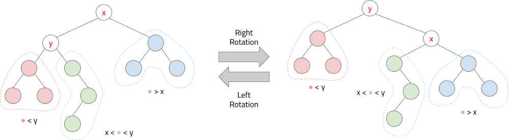

A Cartesian tree or deramid (Treap) is a data structure that combines a **binary search tree** and a **binary heap**. Hence its second name: treap (tree + heap) and deramid (tree + pyramid).

More strictly, this is a binary tree whose nodes contain two values, a key and a priority. It is also a binary search tree by key and a heap by priority. Assuming that all keys and all priorities are different, we find that if a tree item contains (x₀, y₀), then all elements (x, y) in the left subtree are such that x < x₀, all the elements in the right subtree are such that x > x₀, as well as the left and right subtree have: y < y₀. For example

* **Cartesian Tree** : A Cartesian Tree is just a binary tree on a sequence of pairs that is heap-ordered on one of the elements of each pair , and BST-ordered on the other element.
* **Treap** : In a Cartesian Tree, if we assign random values to each heap-ordered element, then the expected height of the resulting tree is  𝑂(𝑙𝑜𝑔𝑁).

**Theorem-1:** Given a set of nodes i.e  `(Bᵢ, Hᵢ)`  pairs (with distinct Hᵢ's), only a unique cartesian tree would exist for these nodes irrespective of their order of insertion.

Proof: For a given set of nodes , the node with maximum priority would form the root of the cartesian tree. All the nodes with key less than(equal to) the B𝑟𝑜𝑜𝑡  would lie in the left subtree of root and all the nodes with key greater than  B𝑟𝑜𝑜𝑡  will lie in the right subtree. Now inductively the left and right subtrees can be built.

**Theorem-2:** Random assignment of Hᵢ values in a Cartesian Tree helps maintain the height of the tree to be approximately O(𝑙𝑜𝑔 n).

Intuition: In a simple BST , the height of the BST depends upon the choice of the root . The closer the root lies to the median of the given data, the better would be the height . Say we insert (a₁, a₂, ..., aₙ), any element can become the root `aᵢ` if it has maximum priority, since the elements ≤ aᵢ go to left subtree and remaining go to right subtree, we can think of it like quick sort algorithm. Therefore the height will be O(𝑙𝑜𝑔 n).

### Motivation

* If we build a binary search tree with totally random values, the resulting tree is (with high probability) within a constant factor of balanced. Approximately `4.3 ln n`.
* Moreover, the average depth of a given node is often very low. Approximately `2 ln n`.
* If we structure the BST as if it were a random tree, we get (with high probability) a very good data structure!
* In a Cartesian Tree, if we assign random values to each heap-ordered element , then the expected height of the resulting tree is  `𝑂(𝑙𝑜𝑔 n)` . This is the entire idea behind Treaps.

### Comaprision with other BSTs
* Compared with AVL and red-black trees, it is simpler to implement and easy to understand. In Treap, the height is not deterministic like other balanced BST's like AVL, red-black trees.
* Compared with the Splay tree, it is usually used for the ordered set, BST performance is far better than Splay. Splay trees are useful for link cut trees.
* Maybe some people want to say SBT(size balanced tree) replaces treaps, I haven't implemented SBT, it is said to be faster. SBT rebalanced by examining the sizes of each node's subtrees, this makes it very convenient to implement the select-by-rank and get-rank operations that implement an order statistic tree. [PEG](http://wcipeg.com/wiki/Size_Balanced_Tree)
* However, Binary search trees such as SBT, Splay trees, and the rotating version of Treap, cannot easily implement 'persistent operations'.

## Rotating version of Treaps

In a BST there are two simple operations that allows us to modify the tree and keep the BST property, the right and left rotations.

.

### Insertion

Inserting an element based on rotations. Say we want to insert an element (9, 41). The first step is to ignore the priorities and insert like a BST, We can search the position where it has to be inserted based on the key. Even though BST property is being preserved, the heap property is not. We will use rotations to fix the heap property.

* Insertion into a treap is a combination of normal BST insertion and heap insertion.
* First, insert the node doing a normal BST insertion. This places the value into the right place.
* Next, bubble the node upward in the tree by rotating it with its parent until its value is smaller than its parent.

### Deletion

* In general, removing a node from a BST is quite difficult because we have to make sure not to lose any nodes. Deleting internal nodes split the tree.
* However, removing leaves is very easy, since they have no children.
* It would seem that, since a treap has extra structure on top of that of a BST, that removing from a treap would be extremely hard.
* However, it's actually quite simple:
  * To maintain the heap property, it’s easy to see that we have to rotate the tree from the children with higher priority.
  * Once the node is a leaf, delete it.

## Split and Merge

Treap supports two basic and unique operations: split and merge , both in O(H) where H is height of treap i.e O(logN).

### Split

* split(T,X):  It splits a given treap T into two different treaps L and R such that L contains all the nodes with Bᵢ ≤ X and R contains all the nodes with Bᵢ > X. The original treap T is destroyed/doesn’t exist anymore after the split operation.

If the key we want to split is greater than root X then

If the key we want to split is less than root X then 

* merge(L,R): The merge operation merges two given treaps L and R into a single treap T and L and R are destroyed after the operation. A very important assumption of the merge operation is that the largest value of L is less than the smallest value of R (where value refers to the Bᵢ values of the particular node). Hence we observe that two treaps obtained after a split operation can always be merged to give back the original treap.

TODO: https://medium.com/carpanese/a-visual-introduction-to-treap-data-structure-part-1-6196d6cc12ee and https://codeforces.com/blog/entry/3767 and https://ankitsultana.com/2021/03/29/persistent-treaps.html and https://codeforces.com/contest/899/submission/44463469

https://www.cs.cornell.edu/courses/cs312/2003sp/lectures/lec26.html

https://codeforces.com/blog/entry/84017

https://habr.com/ru/post/101818/

http://memphis.is-programmer.com/posts/46317.html
