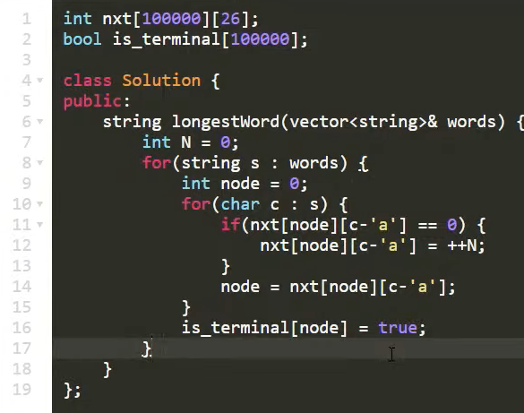
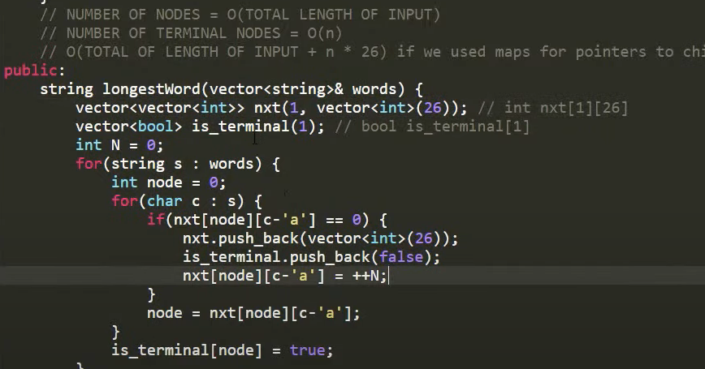

source: Errichto Trie youtube

Using vectors instead of static arrays

Max XOR of Two Numbers using Trie

TODO: https://threadsiiithyderabad.quora.com/Tutorial-on-Trie-and-example-problems

TODO: https://leetcode.com/problems/word-search-ii/ and https://leetcode.com/problems/word-search-ii/discuss/59790/Python-dfs-solution-(directly-use-Trie-implemented).
